<!--
---
title: "CIS06-ACCESS-COMP-Anonymous-DCs-v1.0"
description: "Group Policy Object configuring anonymous access controls for Domain Controllers, setting Named Pipes that can be accessed anonymously to essential domain services only (LSARPC, NETLOGON, SAMR) to balance DC functionality with security hardening for Windows Server 2025 infrastructure"
author: "VintageDon - https://github.com/vintagedon"
ai_contributor: "Anthropic Claude 4 Sonnet (claude-4-sonnet-20250514)"
date: "2025-07-28"
version: "1.0"
status: "Published"
tags:
- type: implementation-guide
- domain: security
- domain: group-policy
- tech: windows-server-2025
- tech: domain-controllers
- tech: anonymous-access
- compliance: cis-control-6
- compliance: cis-benchmark
- phase: phase-2
related_documents:
- "[CIS06 Access Control Directory](README.md)"
- "[CIS Control 6 Policy Template](../policies-and-procedures/cis-security-policy-templates/cisv81-06-access-control-management-policy-template.md)"
- "[Anonymous Access All Domain Configuration](CIS06-ACCESS-COMP-Anonymous-AllDomain-v1.0.md)"
- "[Anonymous Access Member Servers Configuration](CIS06-ACCESS-COMP-Anonymous-Servers-v1.0.md)"
- "[Domain Controllers Security Policy](../policies-and-procedures/domain-controllers-security-policy.md)"
---
-->

# **CIS06-ACCESS-COMP-Anonymous-DCs-v1.0**

## **Group Policy Object Implementation Guide**

**Document Version:** 1.0  
**Created:** July 28, 2025  
**GPO ID:** `afe86526-d162-4d12-9be2-49384275acd0`  
**Target Systems:** Domain Controllers  
**CIS Control Alignment:** CIS v8 Control 6 (Access Control Management)

---

# 📋 **1. Executive Summary**

This document provides comprehensive implementation guidance for the CIS06-ACCESS-COMP-Anonymous-DCs-v1.0 Group Policy Object (GPO), which configures anonymous access controls specifically for Domain Controllers in the radioastronomy.io enterprise environment. This GPO implements CIS Microsoft Windows Server 2025 Benchmark recommendation 2.3.10.6, establishing secure default configurations for named pipes that can be accessed anonymously on Domain Controllers.

The policy addresses critical security requirements by maintaining necessary Domain Controller functionality while restricting anonymous access to only essential domain services. This implementation supports the enterprise's CIS Controls v8 baseline and enhances domain security posture through systematic anonymous access restriction balanced with operational requirements for Active Directory domain services.

# 🔗 **2. Dependencies & Relationships**

This section maps how the Anonymous DCs policy GPO integrates with Proxmox Astronomy Lab domain infrastructure and enterprise anonymous access control components.

## **2.1 Related Services**

This subsection identifies Proxmox Astronomy Lab services that interact with or depend on Domain Controller anonymous access controls for comprehensive domain security and operational functionality.

Domain Controller anonymous access controls provide foundational security that supports enterprise domain operations while enabling systematic protection against information disclosure across Active Directory infrastructure:

| **Service** | **Relationship Type** | **Integration Points** | **Documentation** |
|-------------|----------------------|------------------------|-------------------|
| Active Directory Domain Services | **Secures** | Essential domain services (LSARPC, NETLOGON, SAMR), authentication protocols, domain trust relationships | [Infrastructure Overview](../../infrastructure/README.md) |
| Domain Controller Infrastructure | **Protects** | DC-specific anonymous access restrictions, domain service hardening, information disclosure prevention | [Domain Controllers](../../infrastructure/domain-controllers/README.md) |
| Anonymous Access All Domain | **Coordinates** | Domain-wide anonymous restrictions with DC-specific service requirements | [Anonymous AllDomain Configuration](CIS06-ACCESS-COMP-Anonymous-AllDomain-v1.0.md) |
| Anonymous Access Member Servers | **Coordinates** | Server-specific anonymous policies with DC operational requirements | [Anonymous Servers Configuration](CIS06-ACCESS-COMP-Anonymous-Servers-v1.0.md) |
| Authentication Infrastructure | **Enables** | Domain authentication services, Kerberos operations, LDAP functionality | [Authentication](../../infrastructure/authentication/README.md) |
| Security Monitoring Infrastructure | **Validates** | Anonymous access attempt monitoring, DC security event logging, policy compliance tracking | [Security Monitoring](../../monitoring/README.md) |

These service relationships ensure that Domain Controller anonymous access restrictions provide systematic security while supporting essential domain operations and compliance validation across Active Directory infrastructure components.

## **2.2 Policy Implementation**

This subsection connects Anonymous DCs policy GPO configuration to Proxmox Astronomy Lab governance frameworks and enterprise Domain Controller security policy requirements.

Domain Controller anonymous access restrictions implement enterprise domain security governance through systematic Group Policy management and security framework alignment:

- **[CIS Control 6 Policy Template](../policies-and-procedures/cis-security-policy-templates/cisv81-06-access-control-management-policy-template.md)** - Primary policy framework for access control management security baseline establishment
- **[Domain Controllers Security Policy](../policies-and-procedures/domain-controllers-security-policy.md)** - Enterprise DC protection requirements and anonymous access restriction standards
- **[Information Security Policy](../policies-and-procedures/information-security-policy.md)** - Comprehensive information protection and unauthorized disclosure prevention requirements
- **[Network Access Control Policy](../policies-and-procedures/network-access-control-policy.md)** - Network-level access restrictions and session management security standards

## **2.3 Responsibility Matrix**

This subsection defines clear accountability for Anonymous DCs policy configuration management and Domain Controller security maintenance activities.

| **Activity** | **Helpdesk** | **Operations** | **Engineering** | **Security** |
|--------------|--------------|----------------|-----------------|--------------|
| DC Anonymous Access Policy Implementation | I | A | R | C |
| Domain Controller Security Configuration | I | C | R | A |
| Essential Domain Service Management | I | R | A | C |
| Anonymous Access Monitoring | I | C | R | A |
| DC Security Assessment | I | C | R | A |
| Domain Service Incident Response | C | R | A | A |

*R: Responsible, A: Accountable, C: Consulted, I: Informed*

# ⚙️ **3. Technical Documentation**

This section provides technical foundation for understanding, implementing, and maintaining Anonymous DCs policy configuration within Windows Server 2025 Domain Controller infrastructure.

## **3.1 Architecture & Design**

This subsection explains the Domain Controller anonymous access restriction architecture, domain security mechanisms, and access control design patterns for systematic information protection across Active Directory infrastructure.

The Anonymous DCs GPO implements specialized security protection through Domain Controller-specific Group Policy enforcement that balances essential domain services with anonymous access restriction. The design follows Microsoft security best practices with enhanced protection against unauthorized information disclosure while maintaining critical domain functionality.

```mermaid
graph TD
    A[Anonymous DCs Restrictions] --> B[Named Pipes Control]
    A --> C[Essential Domain Services]
    A --> D[Anonymous Access Prevention]
    A --> E[DC Functionality Balance]
    
    B --> F[LSARPC Pipe Access]
    B --> G[NETLOGON Pipe Access]
    B --> H[SAMR Pipe Access]
    B --> I[Other Pipes Blocked]
    
    C --> J[Domain Authentication]
    C --> K[Trust Relationships]
    C --> L[LDAP Operations]
    C --> M[Kerberos Services]
    
    D --> N[Unauthorized Enumeration Prevention]
    D --> O[Information Disclosure Blocking]
    D --> P[Attack Vector Elimination]
    D --> Q[Security Hardening]
    
    E --> R[Operational Requirements]
    E --> S[Security Objectives]
    E --> T[Service Availability]
    
    style A fill:#e1f5fe
    style B fill:#f3e5f5
    style C fill:#f3e5f5
    style D fill:#f3e5f5
    style E fill:#f3e5f5
    style F fill:#e8f5e8
    style G fill:#e8f5e8
    style H fill:#e8f5e8
    style I fill:#ffebee
```

The architecture enables systematic Domain Controller security through balanced anonymous access restriction with essential domain service preservation and information protection.

## **3.2 Configuration Specifications**

This subsection provides detailed technical configuration specifications for Anonymous DCs policy implementation and CIS Control 6 compliance requirements.

The Anonymous DCs policy configuration implements CIS Controls v8 baseline requirements through specialized Group Policy settings that establish enterprise-grade anonymous access restrictions specifically for Domain Controller systems:

### **Domain Controller Anonymous Access Configuration Table**

| **CIS Ref** | **Setting Description** | **Registry Path** | **Value Name** | **Recommended Value** |
|-------------|------------------------|-------------------|----------------|----------------------|
| **2.3.10.6** | Configure Named Pipes that can be accessed anonymously | `HKLM\System\CurrentControlSet\Services\LanManServer\Parameters` | `NullSessionPipes` | `LSARPC,NETLOGON,SAMR` |

### **Essential Domain Services Analysis**

| **Named Pipe** | **Domain Service** | **Security Justification** | **Operational Requirement** |
|----------------|-------------------|---------------------------|----------------------------|
| **LSARPC** | Local Security Authority Remote Procedure Call | Required for domain trust relationships and cross-domain authentication | ⭐⭐⭐⭐⭐ Critical for domain operations |
| **NETLOGON** | Network Logon Service | Essential for domain authentication and computer account management | ⭐⭐⭐⭐⭐ Critical for domain operations |
| **SAMR** | Security Account Manager Remote | Required for password changes and account management operations | ⭐⭐⭐⭐ High operational importance |

### **Security Configuration Analysis**

| **Configuration Area** | **Security Benefit** | **Operational Balance** |
|------------------------|----------------------|------------------------|
| **Named Pipe Restriction** | Limits anonymous access to essential domain services only | Maintains critical DC functionality while preventing unauthorized enumeration |
| **Service-Specific Access** | Allows only necessary domain operations through anonymous connections | Preserves domain trust relationships and authentication capabilities |
| **Information Disclosure Prevention** | Blocks unauthorized access to non-essential domain information | Reduces attack surface while supporting legitimate domain operations |

### **Domain Controller Security Matrix**

| **Security Control** | **Protection Level** | **Domain Service Impact** | **Anonymous Access Prevention** | **CIS Compliance** |
|---------------------|---------------------|---------------------------|--------------------------------|-------------------|
| **Named Pipe Control** | ⭐⭐⭐⭐ High | ✅ Preserved Essential Services | 🚫 Non-Essential Access | ✅ CIS Compliant |
| **LSARPC Access** | ⭐⭐⭐ Controlled | ✅ Domain Trust Operations | ⚖️ Balanced Security | ✅ CIS Compliant |
| **NETLOGON Access** | ⭐⭐⭐ Controlled | ✅ Authentication Services | ⚖️ Balanced Security | ✅ CIS Compliant |
| **SAMR Access** | ⭐⭐⭐ Controlled | ✅ Account Management | ⚖️ Balanced Security | ✅ CIS Compliant |

### **Technical Implementation Details**

| **Registry Setting** | **Technical Function** | **Security Impact** |
|---------------------|------------------------|---------------------|
| **NullSessionPipes = LSARPC,NETLOGON,SAMR** | Allows anonymous access only to essential domain service named pipes | Balances DC functionality with security hardening by restricting anonymous access to critical services only |

## **3.3 Implementation Standards**

This subsection establishes technical standards for Anonymous DCs policy deployment and enterprise Domain Controller security management.

Anonymous DCs policy implementation follows systematic deployment standards and operational procedures:

- **Deployment Method**: Group Policy Management Console (GPMC) with Domain Controllers Organizational Unit targeting
- **Target Scope**: All Domain Controller systems requiring anonymous access restrictions
- **Testing Protocol**: Controlled implementation through test domain infrastructure with domain service validation
- **Monitoring Integration**: Domain Controller security event logging with anonymous access correlation
- **Documentation Standard**: Complete configuration mapping with CIS control references and domain service impact assessment

# 🛠️ **4. Implementation & Usage**

This section provides systematic guidance for implementing Anonymous DCs policy configuration and establishing Domain Controller security across Active Directory infrastructure.

## **4.1 Prerequisites**

This subsection identifies requirements for successful Anonymous DCs policy implementation within Active Directory Domain Controller infrastructure.

Anonymous DCs policy implementation requires enterprise Active Directory infrastructure with appropriate administrative access and comprehensive Domain Controller security management capabilities:

- **Domain Controller Infrastructure**: Windows Server 2025 Domain Controllers with Group Policy application capability
- **Administrative Access**: Domain Admin or equivalent Group Policy management permissions for DC-specific policy configuration
- **Domain Security Infrastructure**: Established domain protection protocols and security monitoring capabilities
- **Testing Environment**: Isolated domain infrastructure for controlled policy testing and domain service validation
- **Monitoring Infrastructure**: Security event monitoring capabilities for Domain Controller security tracking and policy compliance validation

## **4.2 Monitoring**

This subsection establishes monitoring requirements for Anonymous DCs policy effectiveness and Domain Controller security validation across Active Directory infrastructure.

Anonymous DCs monitoring leverages the centralized monitoring stack on proj-mon01 (Prometheus, Loki, Grafana, AlertManager, Grafana Alloy) for systematic Domain Controller security tracking and anonymous access restriction analysis. The monitoring philosophy of "if it can be collected, we do" applies to DC anonymous access attempts, policy enforcement status, and domain service availability through centralized security monitoring infrastructure.

Monitoring includes Domain Controller anonymous access correlation, policy compliance tracking, and domain service validation through comprehensive Active Directory security monitoring and automated alerting for anonymous access violations or domain service disruptions.

# 🔐 **5. Security & Compliance**

This section establishes security framework alignment and compliance requirements for Anonymous DCs policy configuration within enterprise Domain Controller security architecture.

## **5.1 Security Framework Alignment**

This subsection maps Anonymous DCs policy configuration to enterprise security frameworks and compliance requirements for systematic Domain Controller security.

**Security Disclaimer**: The Anonymous DCs policy configuration documented in this guide represents a Domain Controller security baseline establishment for Windows Server 2025 Active Directory infrastructure. These configurations should be thoroughly tested in non-production environments before deployment. While these templates follow CIS Controls v8 access control framework guidelines, organizations should validate policy compatibility with their specific domain operational requirements and legacy application needs. The security research computing team maintains these configurations as implementation guidance rather than production security recommendations, and encourages consultation with dedicated security professionals for enterprise deployment validation.

### **Framework Mapping**

| **Framework** | **Control Mapping** | **Implementation Evidence** |
|---------------|--------------------|-----------------------------|
| **CIS Controls v8** | Control 6: Access Control Management | Anonymous DCs policy implementing systematic Domain Controller anonymous access restriction across Active Directory infrastructure |
| **NIST AI RMF** | GOVERN-1.1: AI governance processes established | Domain Controller security supports AI workload information protection and unauthorized access prevention |
| **NIST CSF 2.0** | PR.AC-4: Access permissions and authorizations are managed | Systematic Domain Controller anonymous access control and information disclosure prevention |
| **NIST SP 800-171** | 3.1.1: Limit information system access to authorized users | Comprehensive Domain Controller anonymous access restriction and unauthorized user prevention |

### **Security Controls Implementation**

| **CIS Control** | **Anonymous DCs Implementation** | **Security Objective** |
|-----------------|----------------------------------|------------------------|
| **6.1** | Systematic DC Anonymous Access Restriction | Eliminate unauthorized information disclosure through Domain Controller anonymous access vectors |
| **6.2** | Essential Domain Service Preservation | Maintain critical domain functionality while preventing unauthorized enumeration |
| **6.3** | Named Pipe Access Control | Control anonymous access to Domain Controller services through systematic pipe restriction |
| **6.4** | Information Disclosure Prevention | Prevent unauthorized Domain Controller information gathering while supporting domain operations |

## **5.2 Compliance Requirements**

This subsection establishes compliance validation requirements and evidence collection standards for Anonymous DCs policy implementation.

Anonymous DCs policy configuration enables systematic compliance evidence collection through Group Policy Resultant Set of Policy (RSoP) reporting and Domain Controller security validation. Compliance validation requires regular policy application assessment and Domain Controller anonymous access monitoring to maintain baseline domain security posture across Active Directory infrastructure components.

# 📋 **6. Backup & Recovery**

This section establishes protection and recovery procedures for Anonymous DCs policy configuration and Domain Controller security baseline preservation.

## **6.1 Protection Strategy**

This subsection defines systematic protection requirements for Anonymous DCs policy configuration and Domain Controller security baseline preservation.

Anonymous DCs policy configuration requires multi-tier protection strategy encompassing Group Policy backup, version control, and policy baseline preservation to ensure rapid Domain Controller security recovery and systematic policy restoration capabilities.

### **Protection Tiers**

| **Tier** | **Scope** | **Method** | **Frequency** |
|----------|-----------|------------|---------------|
| **Tier 1** | GPO Backup | Group Policy Management Console backup | Daily automatic |
| **Tier 2** | Configuration Export | PowerShell GPO export and documentation | Weekly |
| **Tier 3** | Version Control | Git repository with configuration tracking | Every change |
| **Tier 4** | Baseline Archive | Complete Anonymous DCs policy snapshot | Monthly |

*Note: Iperius backup software is configured for systematic Windows infrastructure backup including Group Policy objects.*

## **6.2 Recovery Procedures**

This subsection establishes systematic recovery procedures for Anonymous DCs policy restoration and Domain Controller security baseline re-establishment.

Recovery procedures enable rapid Domain Controller security baseline restoration through Group Policy import capabilities and systematic policy re-establishment. The recovery approach follows tiered restoration priorities focusing on critical domain service preservation first, followed by comprehensive security baseline re-implementation to minimize domain operation disruption during recovery operations.

# 📚 **7. References & Related Resources**

This section provides comprehensive links to related documentation and supporting resources for Anonymous DCs policy implementation and Domain Controller security management.

## **7.1 Internal References**

| **Document Type** | **Document Title** | **Relationship** | **Link** |
|-------------------|-------------------|------------------|----------|
| **Policy Template** | CIS Control 6 Access Control Management Policy | Primary policy framework for Domain Controller security baseline establishment | [../policies-and-procedures/cis-security-policy-templates/cisv81-06-access-control-management-policy-template.md](../policies-and-procedures/cis-security-policy-templates/cisv81-06-access-control-management-policy-template.md) |
| **Implementation** | CIS Server 2025 GPOs Implementation Log | Complete implementation evidence and deployment validation | [cis-server2025-gpos-l1-dc-and-members-IMPLEMENTATION-LOG.md](cis-server2025-gpos-l1-dc-and-members-IMPLEMENTATION-LOG.md) |
| **Configuration** | CIS Server 2025 GPOs Configuration Reference | Technical configuration specifications and CIS control mapping | [cis-server2025-gpos-l1-dc-and-members.md](cis-server2025-gpos-l1-dc-and-members.md) |
| **Anonymous AllDomain** | Anonymous Access All Domain Configuration | Domain-wide anonymous access policies and baseline restrictions | [CIS06-ACCESS-COMP-Anonymous-AllDomain-v1.0.md](CIS06-ACCESS-COMP-Anonymous-AllDomain-v1.0.md) |
| **Anonymous Servers** | Anonymous Access Member Servers Configuration | Server-specific anonymous access policies and enhanced restrictions | [CIS06-ACCESS-COMP-Anonymous-Servers-v1.0.md](CIS06-ACCESS-COMP-Anonymous-Servers-v1.0.md) |
| **Domain Controllers** | Domain Controllers Security Management Policy | Enterprise Domain Controller protection requirements and security standards | [../policies-and-procedures/domain-controllers-security-policy.md](../policies-and-procedures/domain-controllers-security-policy.md) |

## **7.2 External Standards**

- **[CIS Controls v8](https://www.cisecurity.org/controls/)** - Cybersecurity framework providing systematic Domain Controller security implementation guidance
- **[CIS Microsoft Windows Server 2025 Benchmark](https://www.cisecurity.org/benchmark/microsoft_windows_server)** - Comprehensive Anonymous DCs policy configuration guidance for Windows Server 2025
- **[NIST SP 800-53](https://csrc.nist.gov/publications/detail/sp/800-53/rev-5/final)** - Security and privacy controls for federal information systems and organizations
- **[Microsoft Domain Controller Security](https://docs.microsoft.com/en-us/windows-server/identity/ad-ds/plan/security-best-practices/)** - Official Windows Domain Controller anonymous access restriction and domain security guidance
- **[Microsoft Named Pipes Security](https://docs.microsoft.com/en-us/windows/win32/ipc/named-pipes)** - Comprehensive named pipe security and anonymous access control strategies

# ✅ **8. Approval & Review**

This section documents the formal review and approval process for Anonymous DCs policy configuration documentation and Domain Controller security baseline implementation.

## **8.1 Review Process**

Anonymous DCs policy configuration documentation review follows systematic validation of technical accuracy, domain service compatibility, and compliance alignment to ensure comprehensive Domain Controller security implementation and systematic Group Policy management capability for Windows Server 2025 Active Directory infrastructure requirements.

## **8.2 Approval Matrix**

| **Reviewer** | **Role/Expertise** | **Review Date** | **Approval Status** | **Comments** |
|-------------|-------------------|----------------|-------------------|--------------|
| **Engineering Team** | Technical implementation and Domain Controller infrastructure | 2025-07-28 | **Approved** | Anonymous DCs policy configuration provides balanced security with essential domain service preservation |
| **Security Team** | Security framework alignment and CIS Controls v8 compliance | 2025-07-28 | **Approved** | Policy implementation follows Domain Controller security best practices and provides systematic information protection |
| **Operations Team** | Operational impact assessment and domain service management | 2025-07-28 | **Approved** | Configuration enables effective Domain Controller security without operational disruption |

# 📜 **9. Documentation Metadata**

This section provides comprehensive information about document creation, revision history, and authorship.

## **9.1 Change Log**

| **Version** | **Date** | **Changes** | **Author** | **Review Status** |
|------------|---------|-------------|------------|------------------|
| 1.0 | 2025-07-28 | Initial Anonymous DCs policy documentation with comprehensive technical specifications and Domain Controller security framework alignment | VintageDon | Approved |

## **9.2 Authorization & Review**

Anonymous DCs policy configuration documentation has been systematically reviewed and approved by qualified technical, security, and operational subject matter experts to ensure accuracy, compliance, and implementation feasibility within Windows Server 2025 Active Directory Domain Controller infrastructure environments.

## **9.3 Authorship Details**

**Human Author:** VintageDon (<https://github.com/vintagedon>)  
**AI Contributor:** Anthropic Claude 4 Sonnet (claude-4-sonnet-20250514)  
**Collaboration Method:** Request-Analyze-Verify-Generate-Validate (RAVGV)  
**Human Oversight:** Technical review and validation of Anonymous DCs policy configuration specifications and Domain Controller security implementation requirements

## **9.4 AI Collaboration Disclosure**

This document was collaboratively developed using the Request-Analyze-Verify-Generate-Validate (RAVGV) methodology. Anonymous DCs policy configuration details were extracted from validated CIS benchmark implementation reports with comprehensive human oversight throughout development. All technical specifications have been thoroughly reviewed, validated, and approved by qualified human subject matter experts in Windows security and Group Policy management. The human author retains complete responsibility for accuracy, compliance, and technical correctness.

*Generated: 2025-07-28 | Human Author: VintageDon | AI Assistant: Claude 4 Sonnet | Review Status: Approved | Document Version: 1.0*
