<!--
---
title: "CIS06-ACCESS-COMP-Anonymous-Servers-v1.0"
description: "Group Policy Object implementing enhanced anonymous access restrictions for Member Servers, disallowing anonymous enumeration of SAM accounts and shares while blocking all named pipe access to strengthen server security beyond domain-wide baseline for Windows Server 2025 infrastructure"
author: "VintageDon - https://github.com/vintagedon"
ai_contributor: "Anthropic Claude 4 Sonnet (claude-4-sonnet-20250514)"
date: "2025-07-28"
version: "1.0"
status: "Published"
tags:
- type: implementation-guide
- domain: security
- domain: group-policy
- tech: windows-server-2025
- tech: member-servers
- tech: anonymous-access
- compliance: cis-control-6
- compliance: cis-benchmark
- phase: phase-2
related_documents:
- "[CIS06 Access Control Directory](README.md)"
- "[CIS Control 6 Policy Template](../policies-and-procedures/cis-security-policy-templates/cisv81-06-access-control-management-policy-template.md)"
- "[Anonymous Access All Domain Configuration](CIS06-ACCESS-COMP-Anonymous-AllDomain-v1.0.md)"
- "[Anonymous Access Domain Controllers Configuration](CIS06-ACCESS-COMP-Anonymous-DCs-v1.0.md)"
- "[Member Servers Security Policy](../policies-and-procedures/member-servers-security-policy.md)"
---
-->

# **CIS06-ACCESS-COMP-Anonymous-Servers-v1.0**

## **Group Policy Object Implementation Guide**

**Document Version:** 1.0  
**Created:** July 28, 2025  
**GPO ID:** `be09b246-4036-478f-b053-76934ef34c30`  
**Target Systems:** Member Servers  
**CIS Control Alignment:** CIS v8 Control 6 (Access Control Management)

---

# 📋 **1. Executive Summary**

This document provides comprehensive implementation guidance for the CIS06-ACCESS-COMP-Anonymous-Servers-v1.0 Group Policy Object (GPO), which configures enhanced anonymous access restrictions specifically for Member Servers in the radioastronomy.io enterprise environment. This GPO implements CIS Microsoft Windows Server 2025 Benchmark recommendation 2.3.10.3, establishing advanced security configurations that disallow anonymous enumeration of SAM accounts and shares on Member Servers.

The policy addresses critical security requirements by implementing stricter anonymous access controls on Member Servers compared to domain-wide baseline restrictions. This implementation supports the enterprise's CIS Controls v8 baseline and enhances server security posture through systematic anonymous access elimination and information disclosure prevention across Member Server infrastructure.

# 🔗 **2. Dependencies & Relationships**

This section maps how the Anonymous Servers policy GPO integrates with Proxmox Astronomy Lab server infrastructure and enterprise anonymous access control components.

## **2.1 Related Services**

This subsection identifies Proxmox Astronomy Lab services that interact with or depend on Member Server anonymous access controls for comprehensive server security and operational functionality.

Member Server anonymous access controls provide enhanced security that supports enterprise server operations while enabling systematic protection against information disclosure across server infrastructure:

| **Service** | **Relationship Type** | **Integration Points** | **Documentation** |
|-------------|----------------------|------------------------|-------------------|
| Member Server Infrastructure | **Secures** | Enhanced server hardening, anonymous access prevention, SAM enumeration blocking | [Infrastructure Overview](../../infrastructure/README.md) |
| Database Servers | **Protects** | PostgreSQL servers (proj-pg01, proj-pgsql02), database security hardening, unauthorized access prevention | [Database Infrastructure](../../infrastructure/databases/README.md) |
| Application Servers | **Protects** | Web servers, application hosting, service security hardening | [Application Infrastructure](../../infrastructure/applications/README.md) |
| Anonymous Access All Domain | **Enhances** | Domain-wide baseline with server-specific enhanced restrictions | [Anonymous AllDomain Configuration](CIS06-ACCESS-COMP-Anonymous-AllDomain-v1.0.md) |
| Anonymous Access Domain Controllers | **Coordinates** | DC operational requirements with server security hardening | [Anonymous DCs Configuration](CIS06-ACCESS-COMP-Anonymous-DCs-v1.0.md) |
| Security Monitoring Infrastructure | **Validates** | Server anonymous access monitoring, policy compliance tracking, security event correlation | [Security Monitoring](../../monitoring/README.md) |

These service relationships ensure that Member Server anonymous access restrictions provide systematic security enhancement while supporting enterprise-grade server operations and compliance validation across infrastructure components.

## **2.2 Policy Implementation**

This subsection connects Anonymous Servers policy GPO configuration to Proxmox Astronomy Lab governance frameworks and enterprise Member Server security policy requirements.

Member Server anonymous access restrictions implement enterprise server security governance through systematic Group Policy management and security framework alignment:

- **[CIS Control 6 Policy Template](../policies-and-procedures/cis-security-policy-templates/cisv81-06-access-control-management-policy-template.md)** - Primary policy framework for access control management security baseline establishment
- **[Member Servers Security Policy](../policies-and-procedures/member-servers-security-policy.md)** - Enterprise server protection requirements and anonymous access restriction standards
- **[Information Security Policy](../policies-and-procedures/information-security-policy.md)** - Comprehensive information protection and unauthorized disclosure prevention requirements
- **[Server Hardening Policy](../policies-and-procedures/server-hardening-policy.md)** - Advanced server security configuration and attack surface reduction standards

## **2.3 Responsibility Matrix**

This subsection defines clear accountability for Anonymous Servers policy configuration management and Member Server security maintenance activities.

| **Activity** | **Helpdesk** | **Operations** | **Engineering** | **Security** |
|--------------|--------------|----------------|-----------------|--------------|
| Server Anonymous Access Policy Implementation | I | A | R | C |
| Member Server Security Configuration | I | C | R | A |
| Server Hardening Assessment | I | C | R | A |
| Anonymous Access Monitoring | I | C | R | A |
| Server Security Assessment | I | C | R | A |
| Server Security Incident Response | C | R | A | A |

*R: Responsible, A: Accountable, C: Consulted, I: Informed*

# ⚙️ **3. Technical Documentation**

This section provides technical foundation for understanding, implementing, and maintaining Anonymous Servers policy configuration within Windows Server 2025 Member Server infrastructure.

## **3.1 Architecture & Design**

This subsection explains the Member Server anonymous access restriction architecture, server security mechanisms, and access control design patterns for systematic information protection across server infrastructure.

The Anonymous Servers GPO implements enhanced security protection through Member Server-specific Group Policy enforcement that eliminates anonymous access vectors and prevents unauthorized information disclosure. The design follows Microsoft security best practices with advanced protection against account enumeration and share discovery attacks specifically tailored for server environments.

```mermaid
graph TD
    A[Anonymous Servers Restrictions] --> B[SAM Enumeration Prevention]
    A --> C[Anonymous Share Blocking]
    A --> D[Named Pipe Elimination]
    A --> E[Enhanced Server Hardening]
    
    B --> F[RestrictAnonymous Control]
    B --> G[RestrictAnonymousSAM Control]
    B --> H[Account Discovery Prevention]
    B --> I[User Enumeration Blocking]
    
    C --> J[Share Enumeration Prevention]
    C --> K[File System Protection]
    C --> L[Resource Access Control]
    C --> M[Network Share Security]
    
    D --> N[Complete Named Pipe Blocking]
    D --> O[Communication Vector Elimination]
    D --> P[Information Disclosure Prevention]
    D --> Q[Attack Surface Reduction]
    
    E --> R[Advanced Security Posture]
    E --> S[Information Protection]
    E --> T[Unauthorized Access Prevention]
    
    style A fill:#e1f5fe
    style B fill:#f3e5f5
    style C fill:#f3e5f5
    style D fill:#f3e5f5
    style E fill:#f3e5f5
    style F fill:#e8f5e8
    style G fill:#e8f5e8
    style H fill:#e8f5e8
    style I fill:#e8f5e8
    style N fill:#ffebee
```

The architecture enables systematic Member Server security through comprehensive anonymous access elimination with enhanced information protection and attack vector reduction.

## **3.2 Configuration Specifications**

This subsection provides detailed technical configuration specifications for Anonymous Servers policy implementation and CIS Control 6 compliance requirements.

The Anonymous Servers policy configuration implements CIS Controls v8 baseline requirements through specialized Group Policy settings that establish enterprise-grade enhanced anonymous access restrictions specifically for Member Server systems:

### **Member Server Anonymous Access Configuration Table**

| **CIS Ref** | **Setting Description** | **Registry Path** | **Value Name** | **Recommended Value** |
|-------------|------------------------|-------------------|----------------|----------------------|
| **2.3.10.3** | Disallow anonymous enumeration of SAM accounts | `HKLM\System\CurrentControlSet\Control\Lsa` | `RestrictAnonymous` | `1` (Enabled) |
| **2.3.10.3** | Disallow anonymous enumeration of SAM accounts and shares | `HKLM\System\CurrentControlSet\Control\Lsa` | `RestrictAnonymousSAM` | `1` (Enabled) |
| **2.3.10.5** | Block all anonymous named pipe access | `HKLM\System\CurrentControlSet\Services\LanManServer\Parameters` | `NullSessionPipes` | `(Empty)` |

### **Enhanced Security Configuration Analysis**

| **Configuration Area** | **Security Benefit** | **Attack Vector Elimination** |
|------------------------|----------------------|-------------------------------|
| **SAM Account Enumeration Prevention** | Blocks anonymous discovery of user accounts and security information | Eliminates account enumeration through anonymous SAM queries |
| **Share Enumeration Prevention** | Prevents anonymous discovery of network shares and file system resources | Removes file system reconnaissance through anonymous connections |
| **Complete Named Pipe Blocking** | Eliminates all anonymous access to server communication channels | Removes information disclosure through anonymous pipe connections |

### **Server Security Enhancement Matrix**

| **Security Control** | **Protection Level** | **Information Disclosure Prevention** | **Attack Vector Blocking** | **CIS Compliance** |
|---------------------|---------------------|---------------------------------------|----------------------------|-------------------|
| **Anonymous SAM Restriction** | ⭐⭐⭐⭐⭐ Maximum | 🚫 Complete Account Protection | ✅ SAM Enumeration | ✅ CIS Compliant |
| **Share Access Prevention** | ⭐⭐⭐⭐⭐ Maximum | 🚫 File System Protection | ✅ Share Discovery | ✅ CIS Compliant |
| **Named Pipe Elimination** | ⭐⭐⭐⭐⭐ Maximum | 🚫 Communication Channel Protection | ✅ Anonymous Connections | ✅ CIS Compliant |

### **Technical Implementation Details**

| **Registry Setting** | **Technical Function** | **Security Impact** |
|---------------------|------------------------|---------------------|
| **RestrictAnonymous = 1** | Disables anonymous enumeration of SAM accounts and shares | Prevents attackers from discovering user accounts and network resources through anonymous queries |
| **RestrictAnonymousSAM = 1** | Enforces additional SAM database access restrictions | Provides enhanced protection against SAM enumeration attacks and account discovery |
| **NullSessionPipes = (Empty)** | Removes all named pipes accessible through anonymous connections | Eliminates information disclosure vectors through anonymous pipe communication |

### **Server Hardening Enhancement**

| **Enhancement Area** | **Security Improvement** | **Operational Impact** |
|---------------------|--------------------------|------------------------|
| **Beyond Domain Baseline** | Enhanced restrictions compared to domain-wide anonymous access policies | Provides server-specific hardening while maintaining operational functionality |
| **Information Protection** | Comprehensive elimination of anonymous information disclosure vectors | Reduces attack surface significantly while preserving legitimate server operations |
| **Attack Surface Reduction** | Complete removal of anonymous access channels on Member Servers | Minimizes reconnaissance capabilities for potential attackers |

## **3.3 Implementation Standards**

This subsection establishes technical standards for Anonymous Servers policy deployment and enterprise Member Server security management.

Anonymous Servers policy implementation follows systematic deployment standards and operational procedures:

- **Deployment Method**: Group Policy Management Console (GPMC) with Member Servers Organizational Unit targeting
- **Target Scope**: All Member Server systems requiring enhanced anonymous access restrictions
- **Testing Protocol**: Controlled implementation through test server infrastructure with service validation
- **Monitoring Integration**: Member Server security event logging with anonymous access correlation
- **Documentation Standard**: Complete configuration mapping with CIS control references and server impact assessment

# 🛠️ **4. Implementation & Usage**

This section provides systematic guidance for implementing Anonymous Servers policy configuration and establishing Member Server security across server infrastructure.

## **4.1 Prerequisites**

This subsection identifies requirements for successful Anonymous Servers policy implementation within Member Server infrastructure.

Anonymous Servers policy implementation requires enterprise server infrastructure with appropriate administrative access and comprehensive Member Server security management capabilities:

- **Member Server Infrastructure**: Windows Server 2025 Member Servers with Group Policy application capability
- **Administrative Access**: Domain Admin or equivalent Group Policy management permissions for server-specific policy configuration
- **Server Security Infrastructure**: Established server protection protocols and security monitoring capabilities
- **Testing Environment**: Isolated server infrastructure for controlled policy testing and service validation
- **Monitoring Infrastructure**: Security event monitoring capabilities for Member Server security tracking and policy compliance validation

## **4.2 Monitoring**

This subsection establishes monitoring requirements for Anonymous Servers policy effectiveness and Member Server security validation across server infrastructure.

Anonymous Servers monitoring leverages the centralized monitoring stack on proj-mon01 (Prometheus, Loki, Grafana, AlertManager, Grafana Alloy) for systematic Member Server security tracking and anonymous access restriction analysis. The monitoring philosophy of "if it can be collected, we do" applies to server anonymous access attempts, policy enforcement status, and service availability through centralized security monitoring infrastructure.

Monitoring includes Member Server anonymous access correlation, policy compliance tracking, and service validation through comprehensive server security monitoring and automated alerting for anonymous access violations or service disruptions.

# 🔐 **5. Security & Compliance**

This section establishes security framework alignment and compliance requirements for Anonymous Servers policy configuration within enterprise Member Server security architecture.

## **5.1 Security Framework Alignment**

This subsection maps Anonymous Servers policy configuration to enterprise security frameworks and compliance requirements for systematic Member Server security.

**Security Disclaimer**: The Anonymous Servers policy configuration documented in this guide represents an enhanced Member Server security baseline establishment for Windows Server 2025 server infrastructure. These configurations should be thoroughly tested in non-production environments before deployment. While these templates follow CIS Controls v8 access control framework guidelines, organizations should validate policy compatibility with their specific server operational requirements and application needs. The security research computing team maintains these configurations as implementation guidance rather than production security recommendations, and encourages consultation with dedicated security professionals for enterprise deployment validation.

### **Framework Mapping**

| **Framework** | **Control Mapping** | **Implementation Evidence** |
|---------------|--------------------|-----------------------------|
| **CIS Controls v8** | Control 6: Access Control Management | Anonymous Servers policy implementing systematic Member Server anonymous access restriction across server infrastructure |
| **NIST AI RMF** | GOVERN-1.1: AI governance processes established | Member Server security supports AI workload information protection and unauthorized access prevention |
| **NIST CSF 2.0** | PR.AC-4: Access permissions and authorizations are managed | Systematic Member Server anonymous access control and information disclosure prevention |
| **NIST SP 800-171** | 3.1.1: Limit information system access to authorized users | Comprehensive Member Server anonymous access restriction and unauthorized user prevention |

### **Security Controls Implementation**

| **CIS Control** | **Anonymous Servers Implementation** | **Security Objective** |
|-----------------|--------------------------------------|------------------------|
| **6.1** | Systematic Server Anonymous Access Restriction | Eliminate unauthorized information disclosure through Member Server anonymous access vectors |
| **6.2** | Enhanced SAM Enumeration Prevention | Prevent account discovery and security information gathering through anonymous methods |
| **6.3** | Complete Named Pipe Blocking | Eliminate anonymous communication channels and information disclosure vectors |
| **6.4** | Advanced Share Access Control | Prevent unauthorized file system access and resource enumeration |

## **5.2 Compliance Requirements**

This subsection establishes compliance validation requirements and evidence collection standards for Anonymous Servers policy implementation.

Anonymous Servers policy configuration enables systematic compliance evidence collection through Group Policy Resultant Set of Policy (RSoP) reporting and Member Server security validation. Compliance validation requires regular policy application assessment and Member Server anonymous access monitoring to maintain enhanced security posture across server infrastructure components.

# 📋 **6. Backup & Recovery**

This section establishes protection and recovery procedures for Anonymous Servers policy configuration and Member Server security baseline preservation.

## **6.1 Protection Strategy**

This subsection defines systematic protection requirements for Anonymous Servers policy configuration and Member Server security baseline preservation.

Anonymous Servers policy configuration requires multi-tier protection strategy encompassing Group Policy backup, version control, and policy baseline preservation to ensure rapid Member Server security recovery and systematic policy restoration capabilities.

### **Protection Tiers**

| **Tier** | **Scope** | **Method** | **Frequency** |
|----------|-----------|------------|---------------|
| **Tier 1** | GPO Backup | Group Policy Management Console backup | Daily automatic |
| **Tier 2** | Configuration Export | PowerShell GPO export and documentation | Weekly |
| **Tier 3** | Version Control | Git repository with configuration tracking | Every change |
| **Tier 4** | Baseline Archive | Complete Anonymous Servers policy snapshot | Monthly |

*Note: Iperius backup software is configured for systematic Windows infrastructure backup including Group Policy objects.*

## **6.2 Recovery Procedures**

This subsection establishes systematic recovery procedures for Anonymous Servers policy restoration and Member Server security baseline re-establishment.

Recovery procedures enable rapid Member Server security baseline restoration through Group Policy import capabilities and systematic policy re-establishment. The recovery approach follows tiered restoration priorities focusing on critical server security hardening first, followed by comprehensive baseline re-implementation to minimize information disclosure exposure during recovery operations.

# 📚 **7. References & Related Resources**

This section provides comprehensive links to related documentation and supporting resources for Anonymous Servers policy implementation and Member Server security management.

## **7.1 Internal References**

| **Document Type** | **Document Title** | **Relationship** | **Link** |
|-------------------|-------------------|------------------|----------|
| **Policy Template** | CIS Control 6 Access Control Management Policy | Primary policy framework for Member Server security baseline establishment | [../policies-and-procedures/cis-security-policy-templates/cisv81-06-access-control-management-policy-template.md](../policies-and-procedures/cis-security-policy-templates/cisv81-06-access-control-management-policy-template.md) |
| **Implementation** | CIS Server 2025 GPOs Implementation Log | Complete implementation evidence and deployment validation | [cis-server2025-gpos-l1-dc-and-members-IMPLEMENTATION-LOG.md](cis-server2025-gpos-l1-dc-and-members-IMPLEMENTATION-LOG.md) |
| **Configuration** | CIS Server 2025 GPOs Configuration Reference | Technical configuration specifications and CIS control mapping | [cis-server2025-gpos-l1-dc-and-members.md](cis-server2025-gpos-l1-dc-and-members.md) |
| **Anonymous AllDomain** | Anonymous Access All Domain Configuration | Domain-wide anonymous access policies and baseline restrictions | [CIS06-ACCESS-COMP-Anonymous-AllDomain-v1.0.md](CIS06-ACCESS-COMP-Anonymous-AllDomain-v1.0.md) |
| **Anonymous DCs** | Anonymous Access Domain Controllers Configuration | DC-specific anonymous access policies and domain service requirements | [CIS06-ACCESS-COMP-Anonymous-DCs-v1.0.md](CIS06-ACCESS-COMP-Anonymous-DCs-v1.0.md) |
| **Member Servers** | Member Servers Security Management Policy | Enterprise Member Server protection requirements and security standards | [../policies-and-procedures/member-servers-security-policy.md](../policies-and-procedures/member-servers-security-policy.md) |

## **7.2 External Standards**

- **[CIS Controls v8](https://www.cisecurity.org/controls/)** - Cybersecurity framework providing systematic Member Server security implementation guidance
- **[CIS Microsoft Windows Server 2025 Benchmark](https://www.cisecurity.org/benchmark/microsoft_windows_server)** - Comprehensive Anonymous Servers policy configuration guidance for Windows Server 2025
- **[NIST SP 800-53](https://csrc.nist.gov/publications/detail/sp/800-53/rev-5/final)** - Security and privacy controls for federal information systems and organizations
- **[Microsoft Server Security](https://docs.microsoft.com/en-us/windows-server/security/)** - Official Windows Member Server anonymous access restriction and server security guidance
- **[Microsoft Anonymous Access Security](https://docs.microsoft.com/en-us/windows/security/threat-protection/security-policy-settings/)** - Comprehensive anonymous access control and server hardening strategies

# ✅ **8. Approval & Review**

This section documents the formal review and approval process for Anonymous Servers policy configuration documentation and Member Server security baseline implementation.

## **8.1 Review Process**

Anonymous Servers policy configuration documentation review follows systematic validation of technical accuracy, server service compatibility, and compliance alignment to ensure comprehensive Member Server security implementation and systematic Group Policy management capability for Windows Server 2025 server infrastructure requirements.

## **8.2 Approval Matrix**

| **Reviewer** | **Role/Expertise** | **Review Date** | **Approval Status** | **Comments** |
|-------------|-------------------|----------------|-------------------|--------------|
| **Engineering Team** | Technical implementation and Member Server infrastructure | 2025-07-28 | **Approved** | Anonymous Servers policy configuration provides enhanced security with comprehensive anonymous access elimination |
| **Security Team** | Security framework alignment and CIS Controls v8 compliance | 2025-07-28 | **Approved** | Policy implementation follows Member Server security best practices and provides systematic information protection |
| **Operations Team** | Operational impact assessment and server service management | 2025-07-28 | **Approved** | Configuration enables effective Member Server security without operational disruption |

# 📜 **9. Documentation Metadata**

This section provides comprehensive information about document creation, revision history, and authorship.

## **9.1 Change Log**

| **Version** | **Date** | **Changes** | **Author** | **Review Status** |
|------------|---------|-------------|------------|------------------|
| 1.0 | 2025-07-28 | Initial Anonymous Servers policy documentation with comprehensive technical specifications and Member Server security framework alignment | VintageDon | Approved |

## **9.2 Authorization & Review**

Anonymous Servers policy configuration documentation has been systematically reviewed and approved by qualified technical, security, and operational subject matter experts to ensure accuracy, compliance, and implementation feasibility within Windows Server 2025 Member Server infrastructure environments.

## **9.3 Authorship Details**

**Human Author:** VintageDon (<https://github.com/vintagedon>)  
**AI Contributor:** Anthropic Claude 4 Sonnet (claude-4-sonnet-20250514)  
**Collaboration Method:** Request-Analyze-Verify-Generate-Validate (RAVGV)  
**Human Oversight:** Technical review and validation of Anonymous Servers policy configuration specifications and Member Server security implementation requirements

## **9.4 AI Collaboration Disclosure**

This document was collaboratively developed using the Request-Analyze-Verify-Generate-Validate (RAVGV) methodology. Anonymous Servers policy configuration details were extracted from validated CIS benchmark implementation reports with comprehensive human oversight throughout development. All technical specifications have been thoroughly reviewed, validated, and approved by qualified human subject matter experts in Windows security and Group Policy management. The human author retains complete responsibility for accuracy, compliance, and technical correctness.

*Generated: 2025-07-28 | Human Author: VintageDon | AI Assistant: Claude 4 Sonnet | Review Status: Approved | Document Version: 1.0*
