<!--
---
title: "CIS06-ACCESS-COMP-CredDelegation-AllDomain-v1.0"
description: "Group Policy Object implementing credential delegation security controls for all domain-joined computers, configuring Encryption Oracle Remediation to force updated clients and enabling protected credential delegation to prevent credential theft and man-in-the-middle attacks across Windows Server 2025 infrastructure"
author: "VintageDon - https://github.com/vintagedon"
ai_contributor: "Anthropic Claude 4 Sonnet (claude-4-sonnet-20250514)"
date: "2025-07-28"
version: "1.0"
status: "Published"
tags:
- type: implementation-guide
- domain: security
- domain: group-policy
- tech: windows-server-2025
- tech: credential-delegation
- tech: encryption-oracle
- compliance: cis-control-6
- compliance: cis-benchmark
- phase: phase-2
related_documents:
- "[CIS06 Access Control Directory](README.md)"
- "[CIS Control 6 Policy Template](../policies-and-procedures/cis-security-policy-templates/cisv81-06-access-control-management-policy-template.md)"
- "[Anonymous Access All Domain Configuration](CIS06-ACCESS-COMP-Anonymous-AllDomain-v1.0.md)"
- "[User Rights All Domain Configuration](CIS06-ACCESS-COMP-UserRights-AllDomain-v1.0.md)"
- "[Credential Delegation Security Policy](../policies-and-procedures/credential-delegation-security-policy.md)"
---
-->

# **CIS06-ACCESS-COMP-CredDelegation-AllDomain-v1.0**

## **Group Policy Object Implementation Guide**

**Document Version:** 1.0  
**Created:** July 28, 2025  
**GPO ID:** `3f1b6e51-32b4-4512-ae59-c71c03c99e5b`  
**Target Systems:** All Domain-Joined Computers  
**CIS Control Alignment:** CIS v8 Control 6 (Access Control Management)

---

# 📋 **1. Executive Summary**

This document provides comprehensive implementation guidance for the CIS06-ACCESS-COMP-CredDelegation-AllDomain-v1.0 Group Policy Object (GPO), which configures credential delegation security controls for all domain-joined computers in the radioastronomy.io enterprise environment. This GPO implements CIS Microsoft Windows Server 2025 Benchmark recommendation 18.9.4.1, establishing secure default configurations for credential delegation and encryption oracle remediation across the domain infrastructure.

The policy addresses critical security requirements by preventing credential theft through man-in-the-middle attacks and enforcing updated client requirements for credential delegation operations. This implementation supports the enterprise's CIS Controls v8 baseline and enhances domain security posture through systematic credential protection and encryption vulnerability mitigation across all domain-joined systems.

# 🔗 **2. Dependencies & Relationships**

This section maps how the Credential Delegation policy GPO integrates with Proxmox Astronomy Lab domain infrastructure and enterprise credential security components.

## **2.1 Related Services**

This subsection identifies Proxmox Astronomy Lab services that interact with or depend on credential delegation security controls for comprehensive credential protection and secure authentication operations.

Credential delegation security controls provide foundational protection that supports enterprise authentication operations while enabling systematic defense against credential theft and man-in-the-middle attacks across domain infrastructure:

| **Service** | **Relationship Type** | **Integration Points** | **Documentation** |
|-------------|----------------------|------------------------|-------------------|
| Active Directory Domain Services | **Secures** | Domain authentication, credential delegation protection, trust relationship security | [Infrastructure Overview](../../infrastructure/README.md) |
| Remote Desktop Services | **Protects** | RDP connections, credential delegation prevention, session security hardening | [Remote Access](../../infrastructure/remote-access/README.md) |
| Azure AD OIDC Integration | **Coordinates** | Identity federation, credential protection, authentication security | [Authentication](../../infrastructure/authentication/README.md) |
| PowerShell Remoting | **Secures** | Administrative sessions, credential delegation control, remote management security | [Management Tools](../../infrastructure/management/README.md) |
| Cloudflare ZTNA | **Enhances** | Zero Trust access, credential protection, secure session management | [Network Security](../../infrastructure/network/README.md) |
| Security Monitoring Infrastructure | **Validates** | Credential delegation monitoring, encryption oracle detection, policy compliance tracking | [Security Monitoring](../../monitoring/README.md) |

These service relationships ensure that credential delegation security controls provide systematic protection while supporting enterprise-grade authentication operations and compliance validation across domain infrastructure components.

## **2.2 Policy Implementation**

This subsection connects Credential Delegation policy GPO configuration to Proxmox Astronomy Lab governance frameworks and enterprise credential security policy requirements.

Credential delegation security controls implement enterprise authentication security governance through systematic Group Policy management and security framework alignment:

- **[CIS Control 6 Policy Template](../policies-and-procedures/cis-security-policy-templates/cisv81-06-access-control-management-policy-template.md)** - Primary policy framework for access control management security baseline establishment
- **[Credential Delegation Security Policy](../policies-and-procedures/credential-delegation-security-policy.md)** - Enterprise credential protection requirements and delegation security standards
- **[Information Security Policy](../policies-and-procedures/information-security-policy.md)** - Comprehensive information protection and credential security requirements
- **[Authentication Security Policy](../policies-and-procedures/authentication-security-policy.md)** - Authentication infrastructure security and credential protection standards

## **2.3 Responsibility Matrix**

This subsection defines clear accountability for Credential Delegation policy configuration management and domain credential security maintenance activities.

| **Activity** | **Helpdesk** | **Operations** | **Engineering** | **Security** |
|--------------|--------------|----------------|-----------------|--------------|
| Credential Delegation Policy Implementation | I | A | R | C |
| Encryption Oracle Remediation Configuration | I | C | R | A |
| Credential Protection Assessment | I | C | R | A |
| Delegation Security Monitoring | I | C | R | A |
| Credential Security Assessment | I | C | R | A |
| Credential Theft Incident Response | C | R | A | A |

*R: Responsible, A: Accountable, C: Consulted, I: Informed*

# ⚙️ **3. Technical Documentation**

This section provides technical foundation for understanding, implementing, and maintaining Credential Delegation policy configuration within Windows Server 2025 domain infrastructure.

## **3.1 Architecture & Design**

This subsection explains the credential delegation security architecture, encryption oracle protection mechanisms, and credential protection design patterns for systematic credential security across domain infrastructure.

The Credential Delegation GPO implements comprehensive credential protection through domain-wide Group Policy enforcement that prevents credential theft and mitigates encryption vulnerabilities. The design follows Microsoft security best practices with enhanced protection against credential delegation attacks and man-in-the-middle vulnerabilities.

```mermaid
graph TD
    A[Credential Delegation Security] --> B[Encryption Oracle Remediation]
    A --> C[Protected Credential Delegation]
    A --> D[Credential Theft Prevention]
    A --> E[Authentication Security Enhancement]
    
    B --> F[Force Updated Clients]
    B --> G[Vulnerability Mitigation]
    B --> H[Legacy Client Blocking]
    B --> I[Encryption Protocol Security]
    
    C --> J[Secure Delegation Control]
    C --> K[Credential Protection]
    C --> L[Session Security]
    C --> M[Authentication Hardening]
    
    D --> N[Man-in-the-Middle Prevention]
    D --> O[Credential Hijacking Protection]
    D --> P[Session Interception Blocking]
    D --> Q[Attack Vector Elimination]
    
    E --> R[Domain Authentication Security]
    E --> S[Trust Relationship Protection]
    E --> T[Identity Infrastructure Hardening]
    
    style A fill:#e1f5fe
    style B fill:#f3e5f5
    style C fill:#f3e5f5
    style D fill:#f3e5f5
    style E fill:#f3e5f5
    style F fill:#e8f5e8
    style G fill:#e8f5e8
    style H fill:#ffebee
    style I fill:#e8f5e8
```

The architecture enables systematic credential security through comprehensive delegation protection with encryption vulnerability mitigation and authentication hardening.

## **3.2 Configuration Specifications**

This subsection provides detailed technical configuration specifications for Credential Delegation policy implementation and CIS Control 6 compliance requirements.

The Credential Delegation policy configuration implements CIS Controls v8 baseline requirements through specialized Group Policy settings that establish enterprise-grade credential delegation security controls for all domain-joined systems:

### **Credential Delegation Security Configuration Table**

| **CIS Ref** | **Setting Description** | **Registry Path** | **Value Name** | **Recommended Value** |
|-------------|------------------------|-------------------|----------------|----------------------|
| **18.9.4.1** | Set Encryption Oracle Remediation to Force Updated Clients | `HKLM\Software\Microsoft\Windows\CurrentVersion\Policies\System\CredSSP\Parameters` | `AllowEncryptionOracle` | `0` (Force Updated Clients) |
| **18.9.4.1** | Enable Protected Credential Delegation | `HKLM\Software\Policies\Microsoft\Windows\CredentialsDelegation` | `AllowProtectedCreds` | `1` (Enabled) |

### **Encryption Oracle Remediation Analysis**

| **Configuration Value** | **Security Level** | **Client Compatibility** | **Vulnerability Protection** |
|------------------------|-------------------|--------------------------|------------------------------|
| **0 - Force Updated Clients** | ⭐⭐⭐⭐⭐ Maximum | Modern clients only | Complete protection against CVE-2018-0886 |
| **1 - Mitigated** | ⭐⭐⭐⭐ High | Legacy + Modern clients | Partial protection with compatibility |
| **2 - Vulnerable** | ⭐ Minimal | All clients including legacy | No protection - not recommended |

### **Security Configuration Analysis**

| **Configuration Area** | **Security Benefit** | **Attack Vector Elimination** |
|------------------------|----------------------|-------------------------------|
| **Encryption Oracle Remediation** | Prevents credential theft through encryption oracle attacks | Eliminates CVE-2018-0886 exploitation vectors |
| **Protected Credential Delegation** | Enhances credential delegation security with additional protections | Reduces credential exposure during delegation operations |
| **Legacy Client Blocking** | Forces use of updated, secure authentication protocols | Removes vulnerable authentication methods |

### **Credential Security Matrix**

| **Security Control** | **Protection Level** | **Credential Theft Prevention** | **Vulnerability Mitigation** | **CIS Compliance** |
|---------------------|---------------------|--------------------------------|------------------------------|-------------------|
| **Encryption Oracle Remediation** | ⭐⭐⭐⭐⭐ Maximum | 🚫 Complete Protection | ✅ CVE-2018-0886 | ✅ CIS Compliant |
| **Protected Credential Delegation** | ⭐⭐⭐⭐ High | 🛡️ Enhanced Security | ✅ Delegation Hardening | ✅ CIS Compliant |
| **Updated Client Enforcement** | ⭐⭐⭐⭐⭐ Maximum | 🚫 Legacy Vulnerability | ✅ Protocol Security | ✅ CIS Compliant |

### **Technical Implementation Details**

| **Registry Setting** | **Technical Function** | **Security Impact** |
|---------------------|------------------------|---------------------|
| **AllowEncryptionOracle = 0** | Forces all CredSSP clients to use updated, secure protocols | Prevents credential theft through encryption oracle vulnerabilities (CVE-2018-0886) |
| **AllowProtectedCreds = 1** | Enables enhanced credential delegation protections | Provides additional security layers for credential delegation operations |

### **Encryption Oracle Vulnerability Context**

| **Vulnerability** | **CVE Reference** | **Attack Vector** | **Mitigation** |
|------------------|------------------|-------------------|----------------|
| **Encryption Oracle** | CVE-2018-0886 | Man-in-the-middle credential theft through CredSSP protocol weakness | Force updated clients that implement secure authentication protocols |
| **Legacy Protocol Weakness** | Various | Credential exposure through outdated authentication methods | Block legacy clients and enforce modern authentication standards |

## **3.3 Implementation Standards**

This subsection establishes technical standards for Credential Delegation policy deployment and enterprise credential security management.

Credential Delegation policy implementation follows systematic deployment standards and operational procedures:

- **Deployment Method**: Group Policy Management Console (GPMC) with All Domain systems targeting
- **Target Scope**: All domain-joined computers requiring credential delegation security controls
- **Testing Protocol**: Controlled implementation through test infrastructure with authentication validation
- **Monitoring Integration**: Credential delegation security event logging with encryption oracle detection
- **Documentation Standard**: Complete configuration mapping with CIS control references and vulnerability mitigation validation

# 🛠️ **4. Implementation & Usage**

This section provides systematic guidance for implementing Credential Delegation policy configuration and establishing credential security across domain infrastructure.

## **4.1 Prerequisites**

This subsection identifies requirements for successful Credential Delegation policy implementation within domain infrastructure.

Credential Delegation policy implementation requires enterprise domain infrastructure with appropriate administrative access and comprehensive credential security management capabilities:

- **Domain Infrastructure**: Windows Server 2025 domain-joined systems with Group Policy application capability
- **Administrative Access**: Domain Admin or equivalent Group Policy management permissions for credential security policy configuration
- **Authentication Infrastructure**: Established authentication protocols and credential management capabilities
- **Testing Environment**: Isolated domain infrastructure for controlled policy testing and authentication validation
- **Monitoring Infrastructure**: Security event monitoring capabilities for credential delegation tracking and policy compliance validation

## **4.2 Monitoring**

This subsection establishes monitoring requirements for Credential Delegation policy effectiveness and credential security validation across domain infrastructure.

Credential Delegation monitoring leverages the centralized monitoring stack on proj-mon01 (Prometheus, Loki, Grafana, AlertManager, Grafana Alloy) for systematic credential security tracking and encryption oracle attack detection. The monitoring philosophy of "if it can be collected, we do" applies to credential delegation attempts, encryption oracle events, and authentication security through centralized security monitoring infrastructure.

Monitoring includes credential delegation correlation, encryption oracle detection, and authentication security validation through comprehensive domain security monitoring and automated alerting for credential theft attempts or encryption vulnerabilities.

# 🔐 **5. Security & Compliance**

This section establishes security framework alignment and compliance requirements for Credential Delegation policy configuration within enterprise credential security architecture.

## **5.1 Security Framework Alignment**

This subsection maps Credential Delegation policy configuration to enterprise security frameworks and compliance requirements for systematic credential security.

**Security Disclaimer**: The Credential Delegation policy configuration documented in this guide represents a credential security baseline establishment for Windows Server 2025 domain infrastructure. These configurations should be thoroughly tested in non-production environments before deployment. While these templates follow CIS Controls v8 access control framework guidelines, organizations should validate policy compatibility with their specific authentication requirements and legacy application needs. The security research computing team maintains these configurations as implementation guidance rather than production security recommendations, and encourages consultation with dedicated security professionals for enterprise deployment validation.

### **Framework Mapping**

| **Framework** | **Control Mapping** | **Implementation Evidence** |
|---------------|--------------------|-----------------------------|
| **CIS Controls v8** | Control 6: Access Control Management | Credential Delegation policy implementing systematic credential security across domain infrastructure |
| **NIST AI RMF** | GOVERN-1.1: AI governance processes established | Credential security supports AI workload authentication protection and credential theft prevention |
| **NIST CSF 2.0** | PR.AC-2: Physical and logical access to systems and assets is managed | Systematic credential delegation control and authentication security management |
| **NIST SP 800-171** | 3.1.3: Control the flow of CUI in accordance with approved authorizations | Comprehensive credential delegation security and unauthorized access prevention |

### **Security Controls Implementation**

| **CIS Control** | **Credential Delegation Implementation** | **Security Objective** |
|-----------------|------------------------------------------|------------------------|
| **6.1** | Systematic Credential Delegation Security | Eliminate credential theft through delegation vulnerabilities |
| **6.2** | Encryption Oracle Remediation | Prevent credential exposure through encryption oracle attacks |
| **6.3** | Protected Credential Controls | Enhance credential delegation security with additional protections |
| **6.4** | Legacy Client Mitigation | Force secure authentication protocols and eliminate vulnerable methods |

## **5.2 Compliance Requirements**

This subsection establishes compliance validation requirements and evidence collection standards for Credential Delegation policy implementation.

Credential Delegation policy configuration enables systematic compliance evidence collection through Group Policy Resultant Set of Policy (RSoP) reporting and credential security validation. Compliance validation requires regular policy application assessment and credential delegation monitoring to maintain baseline authentication security posture across domain infrastructure components.

# 📋 **6. Backup & Recovery**

This section establishes protection and recovery procedures for Credential Delegation policy configuration and credential security baseline preservation.

## **6.1 Protection Strategy**

This subsection defines systematic protection requirements for Credential Delegation policy configuration and credential security baseline preservation.

Credential Delegation policy configuration requires multi-tier protection strategy encompassing Group Policy backup, version control, and policy baseline preservation to ensure rapid credential security recovery and systematic policy restoration capabilities.

### **Protection Tiers**

| **Tier** | **Scope** | **Method** | **Frequency** |
|----------|-----------|------------|---------------|
| **Tier 1** | GPO Backup | Group Policy Management Console backup | Daily automatic |
| **Tier 2** | Configuration Export | PowerShell GPO export and documentation | Weekly |
| **Tier 3** | Version Control | Git repository with configuration tracking | Every change |
| **Tier 4** | Baseline Archive | Complete Credential Delegation policy snapshot | Monthly |

*Note: Iperius backup software is configured for systematic Windows infrastructure backup including Group Policy objects.*

## **6.2 Recovery Procedures**

This subsection establishes systematic recovery procedures for Credential Delegation policy restoration and credential security baseline re-establishment.

Recovery procedures enable rapid credential security baseline restoration through Group Policy import capabilities and systematic policy re-establishment. The recovery approach follows tiered restoration priorities focusing on critical credential protection first, followed by comprehensive security baseline re-implementation to minimize credential exposure during recovery operations.

# 📚 **7. References & Related Resources**

This section provides comprehensive links to related documentation and supporting resources for Credential Delegation policy implementation and credential security management.

## **7.1 Internal References**

| **Document Type** | **Document Title** | **Relationship** | **Link** |
|-------------------|-------------------|------------------|----------|
| **Policy Template** | CIS Control 6 Access Control Management Policy | Primary policy framework for credential security baseline establishment | [../policies-and-procedures/cis-security-policy-templates/cisv81-06-access-control-management-policy-template.md](../policies-and-procedures/cis-security-policy-templates/cisv81-06-access-control-management-policy-template.md) |
| **Implementation** | CIS Server 2025 GPOs Implementation Log | Complete implementation evidence and deployment validation | [cis-server2025-gpos-l1-dc-and-members-IMPLEMENTATION-LOG.md](cis-server2025-gpos-l1-dc-and-members-IMPLEMENTATION-LOG.md) |
| **Configuration** | CIS Server 2025 GPOs Configuration Reference | Technical configuration specifications and CIS control mapping | [cis-server2025-gpos-l1-dc-and-members.md](cis-server2025-gpos-l1-dc-and-members.md) |
| **Anonymous AllDomain** | Anonymous Access All Domain Configuration | Domain-wide anonymous access policies and security baseline | [CIS06-ACCESS-COMP-Anonymous-AllDomain-v1.0.md](CIS06-ACCESS-COMP-Anonymous-AllDomain-v1.0.md) |
| **User Rights AllDomain** | User Rights All Domain Configuration | Domain-wide user rights assignments and privilege management | [CIS06-ACCESS-COMP-UserRights-AllDomain-v1.0.md](CIS06-ACCESS-COMP-UserRights-AllDomain-v1.0.md) |
| **Credential Security** | Credential Delegation Security Management Policy | Enterprise credential protection requirements and security standards | [../policies-and-procedures/credential-delegation-security-policy.md](../policies-and-procedures/credential-delegation-security-policy.md) |

## **7.2 External Standards**

- **[CIS Controls v8](https://www.cisecurity.org/controls/)** - Cybersecurity framework providing systematic credential security implementation guidance
- **[CIS Microsoft Windows Server 2025 Benchmark](https://www.cisecurity.org/benchmark/microsoft_windows_server)** - Comprehensive Credential Delegation policy configuration guidance for Windows Server 2025
- **[NIST SP 800-53](https://csrc.nist.gov/publications/detail/sp/800-53/rev-5/final)** - Security and privacy controls for federal information systems and organizations
- **[Microsoft CredSSP Security](https://docs.microsoft.com/en-us/windows/security/threat-protection/security-policy-settings/system-cryptography-use-fips-compliant)** - Official Windows credential delegation security and encryption oracle remediation guidance
- **[CVE-2018-0886 Advisory](https://nvd.nist.gov/vuln/detail/CVE-2018-0886)** - Comprehensive encryption oracle vulnerability information and mitigation strategies

# ✅ **8. Approval & Review**

This section documents the formal review and approval process for Credential Delegation policy configuration documentation and credential security baseline implementation.

## **8.1 Review Process**

Credential Delegation policy configuration documentation review follows systematic validation of technical accuracy, authentication compatibility, and compliance alignment to ensure comprehensive credential security implementation and systematic Group Policy management capability for Windows Server 2025 domain infrastructure requirements.

## **8.2 Approval Matrix**

| **Reviewer** | **Role/Expertise** | **Review Date** | **Approval Status** | **Comments** |
|-------------|-------------------|----------------|-------------------|--------------|
| **Engineering Team** | Technical implementation and domain infrastructure | 2025-07-28 | **Approved** | Credential Delegation policy configuration provides comprehensive credential protection with encryption vulnerability mitigation |
| **Security Team** | Security framework alignment and CIS Controls v8 compliance | 2025-07-28 | **Approved** | Policy implementation follows credential security best practices and provides systematic authentication protection |
| **Operations Team** | Operational impact assessment and authentication service management | 2025-07-28 | **Approved** | Configuration enables effective credential security without authentication disruption |

# 📜 **9. Documentation Metadata**

This section provides comprehensive information about document creation, revision history, and authorship.

## **9.1 Change Log**

| **Version** | **Date** | **Changes** | **Author** | **Review Status** |
|------------|---------|-------------|------------|------------------|
| 1.0 | 2025-07-28 | Initial Credential Delegation policy documentation with comprehensive technical specifications and credential security framework alignment | VintageDon | Approved |

## **9.2 Authorization & Review**

Credential Delegation policy configuration documentation has been systematically reviewed and approved by qualified technical, security, and operational subject matter experts to ensure accuracy, compliance, and implementation feasibility within Windows Server 2025 domain infrastructure environments.

## **9.3 Authorship Details**

**Human Author:** VintageDon (<https://github.com/vintagedon>)  
**AI Contributor:** Anthropic Claude 4 Sonnet (claude-4-sonnet-20250514)  
**Collaboration Method:** Request-Analyze-Verify-Generate-Validate (RAVGV)  
**Human Oversight:** Technical review and validation of Credential Delegation policy configuration specifications and credential security implementation requirements

## **9.4 AI Collaboration Disclosure**

This document was collaboratively developed using the Request-Analyze-Verify-Generate-Validate (RAVGV) methodology. Credential Delegation policy configuration details were extracted from validated CIS benchmark implementation reports with comprehensive human oversight throughout development. All technical specifications have been thoroughly reviewed, validated, and approved by qualified human subject matter experts in Windows security and Group Policy management. The human author retains complete responsibility for accuracy, compliance, and technical correctness.

*Generated: 2025-07-28 | Human Author: VintageDon | AI Assistant: Claude 4 Sonnet | Review Status: Approved | Document Version: 1.0*
