<!--
---
title: "CIS06-ACCESS-COMP-LocalAcct-AllDomain-v1.0"
description: "Group Policy Object configuring sharing and security model for local accounts across all domain-joined computers, setting ForceGuest to Classic model to ensure proper local account authentication and prevent forced Guest access security vulnerabilities in Windows Server 2025 infrastructure"
author: "VintageDon - https://github.com/vintagedon"
ai_contributor: "Anthropic Claude 4 Sonnet (claude-4-sonnet-20250514)"
date: "2025-07-28"
version: "1.0"
status: "Published"
tags:
- type: implementation-guide
- domain: security
- domain: group-policy
- tech: windows-server-2025
- tech: local-accounts
- tech: sharing-security-model
- compliance: cis-control-6
- compliance: cis-benchmark
- phase: phase-2
related_documents:
- "[CIS06 Access Control Directory](README.md)"
- "[CIS Control 6 Policy Template](../policies-and-procedures/cis-security-policy-templates/cisv81-06-access-control-management-policy-template.md)"
- "[Anonymous Access All Domain Configuration](CIS06-ACCESS-COMP-Anonymous-AllDomain-v1.0.md)"
- "[User Rights All Domain Configuration](CIS06-ACCESS-COMP-UserRights-AllDomain-v1.0.md)"
- "[Local Account Security Policy](../policies-and-procedures/local-account-security-policy.md)"
---
-->

# **CIS06-ACCESS-COMP-LocalAcct-AllDomain-v1.0**

## **Group Policy Object Implementation Guide**

**Document Version:** 1.0  
**Created:** July 28, 2025  
**GPO ID:** `3edf9d32-021d-40bd-8455-9d72d7dcab19`  
**Target Systems:** All Domain-Joined Computers  
**CIS Control Alignment:** CIS v8 Control 6 (Access Control Management)

---

# 📋 **1. Executive Summary**

This document provides comprehensive implementation guidance for the CIS06-ACCESS-COMP-LocalAcct-AllDomain-v1.0 Group Policy Object (GPO), which configures the sharing and security model for local accounts across all domain-joined computers in the radioastronomy.io enterprise environment. This GPO implements CIS Microsoft Windows Server 2025 Benchmark recommendation 2.3.10.13, establishing secure default configurations for local account authentication and access control mechanisms.

The policy addresses critical security requirements by ensuring proper local account authentication and preventing forced Guest access vulnerabilities that could bypass security controls. This implementation supports the enterprise's CIS Controls v8 baseline and enhances domain security posture through systematic local account security management and authentication integrity across all domain-joined systems.

# 🔗 **2. Dependencies & Relationships**

This section maps how the Local Account policy GPO integrates with Proxmox Astronomy Lab domain infrastructure and enterprise local account security components.

## **2.1 Related Services**

This subsection identifies Proxmox Astronomy Lab services that interact with or depend on local account security controls for comprehensive authentication protection and proper access control mechanisms.

Local account security controls provide foundational protection that supports enterprise authentication operations while enabling systematic defense against unauthorized access and authentication bypass attempts across domain infrastructure:

| **Service** | **Relationship Type** | **Integration Points** | **Documentation** |
|-------------|----------------------|------------------------|-------------------|
| Active Directory Domain Services | **Coordinates** | Domain authentication, local account integration, hybrid authentication security | [Infrastructure Overview](../../infrastructure/README.md) |
| Local Administrator Accounts | **Secures** | Built-in Administrator security, local account access control, privilege management | [Local Administration](../../infrastructure/local-admin/README.md) |
| Break-Glass Access | **Protects** | Emergency access accounts (bitcadmin8192), local account security, fallback authentication | [Emergency Access](../../infrastructure/emergency-access/README.md) |
| Remote Desktop Services | **Enhances** | Local account authentication, RDP access control, session security | [Remote Access](../../infrastructure/remote-access/README.md) |
| Service Account Management | **Coordinates** | Local service accounts, privilege separation, account isolation | [Service Accounts](../../infrastructure/service-accounts/README.md) |
| Security Monitoring Infrastructure | **Validates** | Local account authentication monitoring, access control tracking, policy compliance validation | [Security Monitoring](../../monitoring/README.md) |

These service relationships ensure that local account security controls provide systematic authentication protection while supporting enterprise-grade access control operations and compliance validation across domain infrastructure components.

## **2.2 Policy Implementation**

This subsection connects Local Account policy GPO configuration to Proxmox Astronomy Lab governance frameworks and enterprise local account security policy requirements.

Local account security controls implement enterprise authentication security governance through systematic Group Policy management and security framework alignment:

- **[CIS Control 6 Policy Template](../policies-and-procedures/cis-security-policy-templates/cisv81-06-access-control-management-policy-template.md)** - Primary policy framework for access control management security baseline establishment
- **[Local Account Security Policy](../policies-and-procedures/local-account-security-policy.md)** - Enterprise local account protection requirements and authentication security standards
- **[Information Security Policy](../policies-and-procedures/information-security-policy.md)** - Comprehensive information protection and access control requirements
- **[Authentication Security Policy](../policies-and-procedures/authentication-security-policy.md)** - Authentication infrastructure security and account management standards

## **2.3 Responsibility Matrix**

This subsection defines clear accountability for Local Account policy configuration management and domain local account security maintenance activities.

| **Activity** | **Helpdesk** | **Operations** | **Engineering** | **Security** |
|--------------|--------------|----------------|-----------------|--------------|
| Local Account Policy Implementation | I | A | R | C |
| Sharing Security Model Configuration | I | C | R | A |
| Local Authentication Assessment | I | C | R | A |
| Account Security Monitoring | I | C | R | A |
| Local Account Security Assessment | I | C | R | A |
| Authentication Bypass Incident Response | C | R | A | A |

*R: Responsible, A: Accountable, C: Consulted, I: Informed*

# ⚙️ **3. Technical Documentation**

This section provides technical foundation for understanding, implementing, and maintaining Local Account policy configuration within Windows Server 2025 domain infrastructure.

## **3.1 Architecture & Design**

This subsection explains the local account security architecture, sharing and security model mechanisms, and authentication control design patterns for systematic local account security across domain infrastructure.

The Local Account GPO implements comprehensive authentication security through domain-wide Group Policy enforcement that ensures proper local account authentication and prevents forced Guest access vulnerabilities. The design follows Microsoft security best practices with enhanced protection against authentication bypass attacks and unauthorized access through local account manipulation.

```mermaid
graph TD
    A[Local Account Security] --> B[Sharing Security Model]
    A --> C[Authentication Control]
    A --> D[Guest Access Prevention]
    A --> E[Account Integrity Protection]
    
    B --> F[Classic Model Enforcement]
    B --> G[Proper Authentication]
    B --> H[Access Control Validation]
    B --> I[Security Context Preservation]
    
    C --> J[Local Account Validation]
    C --> K[Authentication Bypass Prevention]
    C --> L[Credential Verification]
    C --> M[Access Token Security]
    
    D --> N[Forced Guest Blocking]
    D --> O[Authentication Integrity]
    D --> P[Privilege Escalation Prevention]
    D --> Q[Unauthorized Access Control]
    
    E --> R[Account Security Framework]
    E --> S[Authentication Reliability]
    E --> T[Access Control Consistency]
    
    style A fill:#e1f5fe
    style B fill:#f3e5f5
    style C fill:#f3e5f5
    style D fill:#f3e5f5
    style E fill:#f3e5f5
    style F fill:#e8f5e8
    style G fill:#e8f5e8
    style H fill:#e8f5e8
    style I fill:#e8f5e8
    style N fill:#ffebee
```

The architecture enables systematic local account security through comprehensive authentication control with sharing model integrity and access control consistency.

## **3.2 Configuration Specifications**

This subsection provides detailed technical configuration specifications for Local Account policy implementation and CIS Control 6 compliance requirements.

The Local Account policy configuration implements CIS Controls v8 baseline requirements through specialized Group Policy settings that establish enterprise-grade local account security controls for all domain-joined systems:

### **Local Account Security Configuration Table**

| **CIS Ref** | **Setting Description** | **Registry Path** | **Value Name** | **Recommended Value** |
|-------------|------------------------|-------------------|----------------|----------------------|
| **2.3.10.13** | Set sharing and security model for local accounts to Classic | `HKLM\System\CurrentControlSet\Control\Lsa` | `ForceGuest` | `0` (Classic Model) |

### **Sharing and Security Model Analysis**

| **Configuration Value** | **Security Model** | **Authentication Behavior** | **Security Impact** |
|------------------------|-------------------|----------------------------|---------------------|
| **0 - Classic Model** | ⭐⭐⭐⭐⭐ Secure | Proper local account authentication with credential validation | Maximum security with proper access control |
| **1 - Guest Only Model** | ⭐ Insecure | Forces all local account access to Guest level | Security vulnerability - not recommended |

### **Security Configuration Analysis**

| **Configuration Area** | **Security Benefit** | **Attack Vector Elimination** |
|------------------------|----------------------|-------------------------------|
| **Classic Model Enforcement** | Ensures proper local account authentication and access control | Prevents authentication bypass through forced Guest access |
| **Authentication Integrity** | Maintains credential validation and security context preservation | Eliminates privilege escalation through authentication manipulation |
| **Access Control Consistency** | Provides reliable local account security across all domain systems | Removes inconsistent authentication behavior and security gaps |

### **Local Account Security Matrix**

| **Security Control** | **Protection Level** | **Authentication Bypass Prevention** | **Access Control Integrity** | **CIS Compliance** |
|---------------------|---------------------|--------------------------------------|------------------------------|-------------------|
| **Classic Model Enforcement** | ⭐⭐⭐⭐⭐ Maximum | 🚫 Complete Protection | ✅ Proper Authentication | ✅ CIS Compliant |
| **Guest Access Prevention** | ⭐⭐⭐⭐⭐ Maximum | 🚫 Forced Guest Blocking | ✅ Security Context | ✅ CIS Compliant |
| **Authentication Validation** | ⭐⭐⭐⭐ High | 🛡️ Credential Verification | ✅ Access Token Security | ✅ CIS Compliant |

### **Technical Implementation Details**

| **Registry Setting** | **Technical Function** | **Security Impact** |
|---------------------|------------------------|---------------------|
| **ForceGuest = 0** | Configures Classic sharing and security model for local accounts | Ensures proper local account authentication, prevents forced Guest access vulnerabilities, and maintains security context integrity |

### **Sharing and Security Model Context**

| **Security Model** | **Authentication Method** | **Security Implications** | **Enterprise Suitability** |
|-------------------|--------------------------|--------------------------|----------------------------|
| **Classic Model** | Credential-based authentication with proper access control | Secure authentication, proper privilege enforcement, reliable access control | ✅ Enterprise Recommended |
| **Guest Only Model** | Forced Guest-level access regardless of credentials | Authentication bypass, privilege escalation risk, security vulnerability | ❌ Not Recommended |

## **3.3 Implementation Standards**

This subsection establishes technical standards for Local Account policy deployment and enterprise local account security management.

Local Account policy implementation follows systematic deployment standards and operational procedures:

- **Deployment Method**: Group Policy Management Console (GPMC) with All Domain systems targeting
- **Target Scope**: All domain-joined computers requiring local account security controls
- **Testing Protocol**: Controlled implementation through test infrastructure with authentication validation
- **Monitoring Integration**: Local account authentication security event logging with access control validation
- **Documentation Standard**: Complete configuration mapping with CIS control references and authentication security validation

# 🛠️ **4. Implementation & Usage**

This section provides systematic guidance for implementing Local Account policy configuration and establishing local account security across domain infrastructure.

## **4.1 Prerequisites**

This subsection identifies requirements for successful Local Account policy implementation within domain infrastructure.

Local Account policy implementation requires enterprise domain infrastructure with appropriate administrative access and comprehensive local account security management capabilities:

- **Domain Infrastructure**: Windows Server 2025 domain-joined systems with Group Policy application capability
- **Administrative Access**: Domain Admin or equivalent Group Policy management permissions for local account security policy configuration
- **Authentication Infrastructure**: Established local account management and authentication validation capabilities
- **Testing Environment**: Isolated domain infrastructure for controlled policy testing and authentication validation
- **Monitoring Infrastructure**: Security event monitoring capabilities for local account authentication tracking and policy compliance validation

## **4.2 Monitoring**

This subsection establishes monitoring requirements for Local Account policy effectiveness and local account security validation across domain infrastructure.

Local Account monitoring leverages the centralized monitoring stack on proj-mon01 (Prometheus, Loki, Grafana, AlertManager, Grafana Alloy) for systematic local account security tracking and authentication bypass detection. The monitoring philosophy of "if it can be collected, we do" applies to local account authentication attempts, forced Guest access events, and authentication security through centralized security monitoring infrastructure.

Monitoring includes local account authentication correlation, sharing model validation, and access control security validation through comprehensive domain security monitoring and automated alerting for authentication bypass attempts or local account security violations.

# 🔐 **5. Security & Compliance**

This section establishes security framework alignment and compliance requirements for Local Account policy configuration within enterprise local account security architecture.

## **5.1 Security Framework Alignment**

This subsection maps Local Account policy configuration to enterprise security frameworks and compliance requirements for systematic local account security.

**Security Disclaimer**: The Local Account policy configuration documented in this guide represents a local account security baseline establishment for Windows Server 2025 domain infrastructure. These configurations should be thoroughly tested in non-production environments before deployment. While these templates follow CIS Controls v8 access control framework guidelines, organizations should validate policy compatibility with their specific local account requirements and authentication needs. The security research computing team maintains these configurations as implementation guidance rather than production security recommendations, and encourages consultation with dedicated security professionals for enterprise deployment validation.

### **Framework Mapping**

| **Framework** | **Control Mapping** | **Implementation Evidence** |
|---------------|--------------------|-----------------------------|
| **CIS Controls v8** | Control 6: Access Control Management | Local Account policy implementing systematic local account security across domain infrastructure |
| **NIST AI RMF** | GOVERN-1.1: AI governance processes established | Local account security supports AI workload authentication protection and unauthorized access prevention |
| **NIST CSF 2.0** | PR.AC-1: Identities and credentials are issued, managed, verified, revoked, and audited | Systematic local account authentication control and security management |
| **NIST SP 800-171** | 3.1.1: Limit information system access to authorized users | Comprehensive local account security and unauthorized access prevention |

### **Security Controls Implementation**

| **CIS Control** | **Local Account Implementation** | **Security Objective** |
|-----------------|----------------------------------|------------------------|
| **6.1** | Systematic Local Account Security | Eliminate authentication bypass through local account vulnerabilities |
| **6.2** | Classic Model Enforcement | Ensure proper local account authentication and access control |
| **6.3** | Guest Access Prevention | Prevent forced Guest access and privilege escalation |
| **6.4** | Authentication Integrity | Maintain credential validation and security context preservation |

## **5.2 Compliance Requirements**

This subsection establishes compliance validation requirements and evidence collection standards for Local Account policy implementation.

Local Account policy configuration enables systematic compliance evidence collection through Group Policy Resultant Set of Policy (RSoP) reporting and local account security validation. Compliance validation requires regular policy application assessment and local account authentication monitoring to maintain baseline authentication security posture across domain infrastructure components.

# 📋 **6. Backup & Recovery**

This section establishes protection and recovery procedures for Local Account policy configuration and local account security baseline preservation.

## **6.1 Protection Strategy**

This subsection defines systematic protection requirements for Local Account policy configuration and local account security baseline preservation.

Local Account policy configuration requires multi-tier protection strategy encompassing Group Policy backup, version control, and policy baseline preservation to ensure rapid local account security recovery and systematic policy restoration capabilities.

### **Protection Tiers**

| **Tier** | **Scope** | **Method** | **Frequency** |
|----------|-----------|------------|---------------|
| **Tier 1** | GPO Backup | Group Policy Management Console backup | Daily automatic |
| **Tier 2** | Configuration Export | PowerShell GPO export and documentation | Weekly |
| **Tier 3** | Version Control | Git repository with configuration tracking | Every change |
| **Tier 4** | Baseline Archive | Complete Local Account policy snapshot | Monthly |

*Note: Iperius backup software is configured for systematic Windows infrastructure backup including Group Policy objects.*

## **6.2 Recovery Procedures**

This subsection establishes systematic recovery procedures for Local Account policy restoration and local account security baseline re-establishment.

Recovery procedures enable rapid local account security baseline restoration through Group Policy import capabilities and systematic policy re-establishment. The recovery approach follows tiered restoration priorities focusing on critical authentication protection first, followed by comprehensive security baseline re-implementation to minimize authentication vulnerability exposure during recovery operations.

# 📚 **7. References & Related Resources**

This section provides comprehensive links to related documentation and supporting resources for Local Account policy implementation and local account security management.

## **7.1 Internal References**

| **Document Type** | **Document Title** | **Relationship** | **Link** |
|-------------------|-------------------|------------------|----------|
| **Policy Template** | CIS Control 6 Access Control Management Policy | Primary policy framework for local account security baseline establishment | [../policies-and-procedures/cis-security-policy-templates/cisv81-06-access-control-management-policy-template.md](../policies-and-procedures/cis-security-policy-templates/cisv81-06-access-control-management-policy-template.md) |
| **Implementation** | CIS Server 2025 GPOs Implementation Log | Complete implementation evidence and deployment validation | [cis-server2025-gpos-l1-dc-and-members-IMPLEMENTATION-LOG.md](cis-server2025-gpos-l1-dc-and-members-IMPLEMENTATION-LOG.md) |
| **Configuration** | CIS Server 2025 GPOs Configuration Reference | Technical configuration specifications and CIS control mapping | [cis-server2025-gpos-l1-dc-and-members.md](cis-server2025-gpos-l1-dc-and-members.md) |
| **Anonymous AllDomain** | Anonymous Access All Domain Configuration | Domain-wide anonymous access policies and security baseline | [CIS06-ACCESS-COMP-Anonymous-AllDomain-v1.0.md](CIS06-ACCESS-COMP-Anonymous-AllDomain-v1.0.md) |
| **User Rights AllDomain** | User Rights All Domain Configuration | Domain-wide user rights assignments and privilege management | [CIS06-ACCESS-COMP-UserRights-AllDomain-v1.0.md](CIS06-ACCESS-COMP-UserRights-AllDomain-v1.0.md) |
| **Local Account Security** | Local Account Security Management Policy | Enterprise local account protection requirements and security standards | [../policies-and-procedures/local-account-security-policy.md](../policies-and-procedures/local-account-security-policy.md) |

## **7.2 External Standards**

- **[CIS Controls v8](https://www.cisecurity.org/controls/)** - Cybersecurity framework providing systematic local account security implementation guidance
- **[CIS Microsoft Windows Server 2025 Benchmark](https://www.cisecurity.org/benchmark/microsoft_windows_server)** - Comprehensive Local Account policy configuration guidance for Windows Server 2025
- **[NIST SP 800-53](https://csrc.nist.gov/publications/detail/sp/800-53/rev-5/final)** - Security and privacy controls for federal information systems and organizations
- **[Microsoft Local Account Security](https://docs.microsoft.com/en-us/windows/security/threat-protection/security-policy-settings/)** - Official Windows local account security and sharing model configuration guidance
- **[Microsoft Authentication Security](https://docs.microsoft.com/en-us/windows-server/identity/)** - Comprehensive local account authentication and access control strategies

# ✅ **8. Approval & Review**

This section documents the formal review and approval process for Local Account policy configuration documentation and local account security baseline implementation.

## **8.1 Review Process**

Local Account policy configuration documentation review follows systematic validation of technical accuracy, authentication compatibility, and compliance alignment to ensure comprehensive local account security implementation and systematic Group Policy management capability for Windows Server 2025 domain infrastructure requirements.

## **8.2 Approval Matrix**

| **Reviewer** | **Role/Expertise** | **Review Date** | **Approval Status** | **Comments** |
|-------------|-------------------|----------------|-------------------|--------------|
| **Engineering Team** | Technical implementation and domain infrastructure | 2025-07-28 | **Approved** | Local Account policy configuration provides comprehensive authentication security with proper sharing model enforcement |
| **Security Team** | Security framework alignment and CIS Controls v8 compliance | 2025-07-28 | **Approved** | Policy implementation follows local account security best practices and provides systematic authentication protection |
| **Operations Team** | Operational impact assessment and authentication service management | 2025-07-28 | **Approved** | Configuration enables effective local account security without authentication disruption |

# 📜 **9. Documentation Metadata**

This section provides comprehensive information about document creation, revision history, and authorship.

## **9.1 Change Log**

| **Version** | **Date** | **Changes** | **Author** | **Review Status** |
|------------|---------|-------------|------------|------------------|
| 1.0 | 2025-07-28 | Initial Local Account policy documentation with comprehensive technical specifications and local account security framework alignment | VintageDon | Approved |

## **9.2 Authorization & Review**

Local Account policy configuration documentation has been systematically reviewed and approved by qualified technical, security, and operational subject matter experts to ensure accuracy, compliance, and implementation feasibility within Windows Server 2025 domain infrastructure environments.

## **9.3 Authorship Details**

**Human Author:** VintageDon (<https://github.com/vintagedon>)  
**AI Contributor:** Anthropic Claude 4 Sonnet (claude-4-sonnet-20250514)  
**Collaboration Method:** Request-Analyze-Verify-Generate-Validate (RAVGV)  
**Human Oversight:** Technical review and validation of Local Account policy configuration specifications and local account security implementation requirements

## **9.4 AI Collaboration Disclosure**

This document was collaboratively developed using the Request-Analyze-Verify-Generate-Validate (RAVGV) methodology. Local Account policy configuration details were extracted from validated CIS benchmark implementation reports with comprehensive human oversight throughout development. All technical specifications have been thoroughly reviewed, validated, and approved by qualified human subject matter experts in Windows security and Group Policy management. The human author retains complete responsibility for accuracy, compliance, and technical correctness.

*Generated: 2025-07-28 | Human Author: VintageDon | AI Assistant: Claude 4 Sonnet | Review Status: Approved | Document Version: 1.0*
