<!--
---
title: "CIS06-ACCESS-COMP-UserRights-AllDomain-v1.0"
description: "Group Policy Object implementing User Rights Assignments for all domain-joined computers, establishing comprehensive access control baseline through least privilege enforcement and systematic privilege assignment across Windows Server 2025 Active Directory infrastructure"
author: "VintageDon - https://github.com/vintagedon"
ai_contributor: "Anthropic Claude 4 Sonnet (claude-4-sonnet-20250514)"
date: "2025-07-28"
version: "1.0"
status: "Published"
tags:
- type: implementation-guide
- domain: security
- domain: group-policy
- tech: windows-server-2025
- tech: user-rights-assignments
- tech: access-control
- compliance: cis-control-6
- compliance: cis-benchmark
- phase: phase-2
related_documents:
- "[CIS06 Access Control Directory](README.md)"
- "[CIS Control 6 Policy Template](../policies-and-procedures/cis-security-policy-templates/cisv81-06-access-control-management-policy-template.md)"
- "[User Rights Domain Controllers Configuration](CIS06-ACCESS-COMP-UserRights-DCs-v1.0.md)"
- "[User Rights Member Servers Configuration](CIS06-ACCESS-COMP-UserRights-Servers-v1.0.md)"
---
-->

# 🔐 **CIS06-ACCESS-COMP-UserRights-AllDomain-v1.0**

This Group Policy Object implements User Rights Assignments for all domain-joined computers within the Windows Server 2025 Active Directory environment. The GPO establishes comprehensive access control baseline through least privilege enforcement and systematic privilege assignment that applies universally across Domain Controllers, Member Servers, and client systems throughout the radioastronomy.io domain infrastructure.

The policy configuration implements CIS Control 6 (Access Control Management) requirements by establishing common user rights assignments that enforce security boundaries, restrict dangerous privileges to administrative accounts, and prevent unauthorized access to sensitive system functions through systematic privilege management across all domain-joined systems.

# 🔗 **2. Dependencies & Relationships**

This section maps how the User Rights AllDomain policy GPO integrates with Proxmox Astronomy Lab access control infrastructure and enterprise privilege management components.

## **2.1 Related Services**

This subsection identifies Proxmox Astronomy Lab services that interact with or depend on user rights assignments for comprehensive access control and privilege management.

User rights assignments provide foundational access control that supports enterprise authentication and enables systematic privilege management across Active Directory infrastructure:

| **Service** | **Relationship Type** | **Integration Points** | **Documentation** |
|-------------|----------------------|------------------------|-------------------|
| Active Directory Domain Services | **Controls** | Domain authentication, privilege assignment, access control, system function access | [Infrastructure Overview](../../infrastructure/README.md) |
| Domain Controller Infrastructure | **Coordinates** | DC-specific privilege supplements, administrative access, domain service permissions | [Domain Controller Security](../../infrastructure/domain-controllers/README.md) |
| Member Server Infrastructure | **Baseline** | Server privilege baseline, administrative access, system service permissions | [Member Server Security](../../infrastructure/member-servers/README.md) |
| Security Monitoring Infrastructure | **Validates** | Privilege usage monitoring, access control event logging, rights assignment compliance | [Security Monitoring](../../monitoring/README.md) |
| Backup and Recovery Systems | **Enables** | Backup privileges, system restore permissions, administrative access requirements | [Backup Infrastructure](../../infrastructure/backup/README.md) |

These service relationships ensure that user rights assignments provide systematic access control while supporting enterprise-grade privilege management and compliance validation across all domain infrastructure components.

## **2.2 Policy Implementation**

This subsection connects User Rights AllDomain policy GPO configuration to Proxmox Astronomy Lab governance frameworks and enterprise access control policy requirements.

User rights assignments implement enterprise access control governance through systematic Group Policy management and security framework alignment:

- **[CIS Control 6 Policy Template](../policies-and-procedures/cis-security-policy-templates/cisv81-06-access-control-management-policy-template.md)** - Primary policy framework for access control management security baseline establishment
- **[Privileged Access Management Policy](../policies-and-procedures/privileged-access-management-policy.md)** - Enterprise privileged access governance and administrative account protection requirements
- **[Least Privilege Implementation Policy](../policies-and-procedures/least-privilege-implementation-policy.md)** - Comprehensive least privilege enforcement and access restriction standards
- **[System Access Control Policy](../policies-and-procedures/system-access-control-policy.md)** - Systematic access control requirements and privilege assignment management

## **2.3 Responsibility Matrix**

This subsection defines clear accountability for User Rights AllDomain policy configuration management and access control maintenance activities.

| **Activity** | **Helpdesk** | **Operations** | **Engineering** | **Security** |
|--------------|--------------|----------------|-----------------|--------------|
| User Rights Policy Implementation | I | A | R | C |
| Privilege Assignment Configuration | I | C | R | A |
| Access Control Monitoring | I | C | R | A |
| Rights Assignment Compliance | I | C | R | A |
| Privilege Escalation Investigation | C | R | A | A |
| Access Control Incident Response | C | R | A | A |

*R: Responsible, A: Accountable, C: Consulted, I: Informed*

# ⚙️ **3. Technical Documentation**

This section provides technical foundation for understanding, implementing, and maintaining User Rights AllDomain policy configuration within Windows Server 2025 Active Directory infrastructure.

## **3.1 Architecture & Design**

This subsection explains the user rights assignment architecture, privilege management mechanisms, and access control design patterns for systematic privilege enforcement across Active Directory infrastructure.

The User Rights AllDomain GPO implements comprehensive access control through systematic Group Policy enforcement across all domain-joined systems. The design follows Microsoft security best practices with enhanced protection for sensitive system functions while enabling legitimate administrative operations through controlled privilege assignment.

```mermaid
graph TD
    A[User Rights AllDomain] --> B[Administrative Privileges]
    A --> C[System Function Access]
    A --> D[Security Restrictions]
    A --> E[Service Permissions]
    
    B --> F[Backup/Restore Rights]
    B --> G[System Configuration]
    B --> H[Security Management]
    B --> I[Device Management]
    
    C --> J[System Time Control]
    C --> K[Shutdown Permissions]
    C --> L[Debug Access]
    C --> M[Token Management]
    
    D --> N[Restricted Privileges]
    D --> O[Delegation Controls]
    D --> P[Memory Access]
    D --> Q[Token Creation]
    
    E --> R[Service Account Rights]
    E --> S[Audit Generation]
    E --> T[Network Services]
    
    style A fill:#e1f5fe
    style B fill:#f3e5f5
    style C fill:#f3e5f5
    style D fill:#f3e5f5
    style E fill:#f3e5f5
    style F fill:#e8f5e8
    style G fill:#e8f5e8
    style H fill:#e8f5e8
    style I fill:#e8f5e8
```

The architecture enables systematic access control through comprehensive privilege assignment with security restrictions and administrative capability preservation.

## **3.2 Configuration Specifications**

This subsection provides detailed technical configuration specifications for User Rights AllDomain policy implementation and CIS Control 6 compliance requirements.

The User Rights AllDomain policy configuration implements CIS Controls v8 baseline requirements through specialized Group Policy settings that establish enterprise-grade access control for all domain systems:

### **User Rights Assignment Configuration Table**

| **CIS Ref** | **Setting Description** | **User Right** | **Recommended Value** |
|-------------|------------------------|-----------------|----------------------|
| **2.2.1** | Ensure 'Access Credential Manager as a trusted caller' is set to 'No One' | `SeTrustedCredManAccessPrivilege` | `(No Entries)` |
| **2.2.11** | Ensure 'Back up files and directories' is set to 'Administrators' | `SeBackupPrivilege` | `Administrators` |
| **2.2.12** | Ensure 'Change the system time' is set to 'Administrators, LOCAL SERVICE' | `SeSystemTimePrivilege` | `Administrators`, `LOCAL SERVICE` |
| **2.2.13** | Ensure 'Change the time zone' is set to 'Administrators, LOCAL SERVICE' | `SeTimeZonePrivilege` | `Administrators`, `LOCAL SERVICE` |
| **2.2.14** | Ensure 'Create a pagefile' is set to 'Administrators' | `SeCreatePagefilePrivilege` | `Administrators` |
| **2.2.15** | Ensure 'Create a token object' is set to 'No One' | `SeCreateTokenPrivilege` | `(No Entries)` |
| **2.2.17** | Ensure 'Create permanent shared objects' is set to 'No One' | `SeCreatePermanentPrivilege` | `(No Entries)` |
| **2.2.18** | Ensure 'Create symbolic links' is set to 'Administrators' | `SeCreateSymbolicLinkPrivilege` | `Administrators` |
| **2.2.20** | Ensure 'Debug programs' is set to 'Administrators' | `SeDebugPrivilege` | `Administrators` |
| **2.2.21** | Ensure 'Deny access to this computer from the network' includes 'Guests' | `SeDenyNetworkLogonRight` | Include `Guests` |
| **2.2.23** | Ensure 'Deny log on as a batch job' includes 'Guests' | `SeDenyBatchLogonRight` | Include `Guests` |
| **2.2.24** | Ensure 'Deny log on as a service' includes 'Guests' | `SeDenyServiceLogonRight` | Include `Guests` |
| **2.2.25** | Ensure 'Deny log on locally' includes 'Guests' | `SeDenyInteractiveLogonRight` | Include `Guests` |
| **2.2.26** | Ensure 'Deny log on through Remote Desktop Services' includes 'Guests' | `SeDenyRemoteInteractiveLogonRight` | Include `Guests` |
| **2.2.28** | Ensure 'Enable computer and user accounts to be trusted for delegation' is set to 'Administrators' | `SeEnableDelegationPrivilege` | `Administrators` |
| **2.2.30** | Ensure 'Force shutdown from a remote system' is set to 'Administrators' | `SeRemoteShutdownPrivilege` | `Administrators` |
| **2.2.31** | Ensure 'Generate security audits' is set to 'LOCAL SERVICE, NETWORK SERVICE' | `SeAuditPrivilege` | `LOCAL SERVICE`, `NETWORK SERVICE` |
| **2.2.32** | Ensure 'Impersonate a client after authentication' is set to 'Administrators, LOCAL SERVICE, NETWORK SERVICE, SERVICE' | `SeImpersonatePrivilege` | `Administrators`, `LOCAL SERVICE`, `NETWORK SERVICE`, `SERVICE` |
| **2.2.35** | Ensure 'Load and unload device drivers' is set to 'Administrators' | `SeLoadDriverPrivilege` | `Administrators` |
| **2.2.36** | Ensure 'Lock pages in memory' is set to 'No One' | `SeLockMemoryPrivilege` | `(No Entries)` |
| **2.2.38** | Ensure 'Manage auditing and security log' is set to 'Administrators' | `SeSecurityPrivilege` | `Administrators` |
| **2.2.40** | Ensure 'Modify an object label' is set to 'No One' | `SeReLabelPrivilege` | `(No Entries)` |
| **2.2.41** | Ensure 'Modify firmware environment values' is set to 'Administrators' | `SeSystemEnvironmentPrivilege` | `Administrators` |
| **2.2.42** | Ensure 'Perform volume maintenance tasks' is set to 'Administrators' | `SeManageVolumePrivilege` | `Administrators` |
| **2.2.43** | Ensure 'Profile single process' is set to 'Administrators' | `SeProfileSingleProcessPrivilege` | `Administrators` |
| **2.2.44** | Ensure 'Profile system performance' is set to 'Administrators, NT SERVICE\WdiServiceHost' | `SeSystemProfilePrivilege` | `Administrators`, `NT SERVICE\WdiServiceHost` |
| **2.2.46** | Ensure 'Restore files and directories' is set to 'Administrators' | `SeRestorePrivilege` | `Administrators` |
| **2.2.47** | Ensure 'Shut down the system' is set to 'Administrators' | `SeShutdownPrivilege` | `Administrators` |
| **2.2.48** | Ensure 'Synchronize directory service data' is set to 'No One' | `SeSyncAgentPrivilege` | `(No Entries)` |
| **2.2.49** | Ensure 'Take ownership of files or other objects' is set to 'Administrators' | `SeTakeOwnershipPrivilege` | `Administrators` |

### **Privilege Security Analysis**

| **Privilege Category** | **Security Benefit** | **Risk Mitigation** |
|------------------------|----------------------|---------------------|
| **Administrative Privileges** | Controlled access to system management functions | Prevents unauthorized system configuration and administrative escalation |
| **Service Account Rights** | Enables legitimate service operations with minimal privileges | Restricts service account capabilities to essential functions only |
| **Dangerous Privileges** | Complete restriction of high-risk system access | Eliminates attack vectors for privilege escalation and system compromise |
| **Guest Account Restrictions** | Systematic denial of all access methods for guest accounts | Prevents unauthorized access through default or guest account vectors |

### **Access Control Security Matrix**

| **User Right** | **Risk Level** | **Administrative Need** | **Security Enforcement** | **Compliance Status** |
|----------------|----------------|-------------------------|--------------------------|------------------------|
| **Create Token Object** | ⭐⭐⭐⭐⭐ Critical | ❌ Not Required | 🚫 Completely Blocked | ✅ CIS Compliant |
| **Debug Programs** | ⭐⭐⭐⭐ High | ✅ Admin Only | 🔐 Restricted Access | ✅ CIS Compliant |
| **Backup/Restore Files** | ⭐⭐⭐ Medium | ✅ Admin Only | 🔐 Controlled Access | ✅ CIS Compliant |
| **System Time Control** | ⭐⭐ Low | ✅ Admin + Service | 🔐 Limited Access | ✅ CIS Compliant |
| **Guest Account Access** | ⭐⭐⭐⭐⭐ Critical | ❌ Denied All | 🚫 Complete Denial | ✅ CIS Compliant |

## **3.3 Implementation Standards**

This subsection establishes technical standards for User Rights AllDomain policy deployment and enterprise access control management.

User Rights AllDomain policy implementation follows systematic deployment standards and operational procedures:

- **Deployment Method**: Group Policy Management Console (GPMC) with All Domain systems targeting
- **Target Scope**: All domain-joined computers including Domain Controllers, Member Servers, and clients
- **Testing Protocol**: Controlled implementation through test systems with privilege validation
- **Monitoring Integration**: User rights event logging with privilege usage correlation
- **Documentation Standard**: Complete privilege mapping with CIS control references and access validation procedures

# 🛠️ **4. Implementation & Usage**

This section provides systematic guidance for implementing User Rights AllDomain policy configuration and establishing access control across Active Directory infrastructure.

## **4.1 Prerequisites**

This subsection identifies requirements for successful User Rights AllDomain policy implementation within Active Directory infrastructure.

User Rights AllDomain policy implementation requires enterprise Active Directory infrastructure with appropriate administrative access and comprehensive access control management capabilities:

- **Active Directory Infrastructure**: Windows Server 2025 Domain Controllers with Group Policy application capability
- **Administrative Access**: Domain Admin or equivalent Group Policy management permissions for user rights policy configuration
- **Access Control Infrastructure**: Established privilege management protocols and monitoring capabilities
- **Testing Environment**: Isolated systems for controlled policy testing and privilege validation
- **Monitoring Infrastructure**: Security event monitoring capabilities for user rights operation tracking and privilege compliance validation

## **4.2 Monitoring**

This subsection establishes monitoring requirements for User Rights AllDomain policy effectiveness and access control validation across Active Directory infrastructure.

User Rights AllDomain monitoring leverages the centralized monitoring stack on proj-mon01 (Prometheus, Loki, Grafana, AlertManager, Grafana Alloy) for systematic access control tracking and privilege management analysis. The monitoring philosophy of "if it can be collected, we do" applies to user rights assignment status, privilege usage events, and policy enforcement effectiveness measurement through centralized security monitoring infrastructure.

Monitoring includes user rights assignment correlation, privilege escalation detection, and compliance validation through comprehensive Active Directory security monitoring and automated alerting for unauthorized privilege usage or policy violations.

# 🔐 **5. Security & Compliance**

This section establishes security framework alignment and compliance requirements for User Rights AllDomain policy configuration within enterprise access control architecture.

## **5.1 Security Framework Alignment**

This subsection maps User Rights AllDomain policy configuration to enterprise security frameworks and compliance requirements for systematic access control.

**Security Disclaimer**: The User Rights AllDomain policy configuration documented in this guide represents an access control baseline establishment for Windows Server 2025 Active Directory infrastructure. These configurations should be thoroughly tested in non-production environments before deployment. While these templates follow CIS Controls v8 access control framework guidelines, organizations should validate policy compatibility with their specific operational requirements and business needs. The security research computing team maintains these configurations as implementation guidance rather than production security recommendations, and encourages consultation with dedicated security professionals for enterprise deployment validation.

### **Framework Mapping**

| **Framework** | **Control Mapping** | **Implementation Evidence** |
|---------------|--------------------|-----------------------------|
| **CIS Controls v8** | Control 6: Access Control Management | User Rights AllDomain policy implementing systematic privilege management across Active Directory infrastructure |
| **NIST AI RMF** | GOVERN-1.1: AI governance processes established | Access control supports AI workload privilege management and system access control |
| **NIST CSF 2.0** | PR.AC-4: Access permissions and authorizations are managed | Systematic user rights assignment and privilege control across all systems |
| **NIST SP 800-171** | 3.1.1: Limit information system access to authorized users | Comprehensive privilege restriction and access control requirements |

### **Security Controls Implementation**

| **CIS Control** | **User Rights AllDomain Implementation** | **Security Objective** |
|-----------------|-------------------------------------------|------------------------|
| **6.1** | Systematic Privilege Assignment | Establish controlled access to system functions across all domain systems |
| **6.2** | Dangerous Privilege Restriction | Eliminate high-risk privileges and prevent unauthorized system access |
| **6.3** | Administrative Access Control | Limit administrative privileges to authorized personnel and service accounts |
| **6.4** | Guest Account Denial | Prevent all forms of guest account access across domain infrastructure |

## **5.2 Compliance Requirements**

This subsection establishes compliance validation requirements and evidence collection standards for User Rights AllDomain policy implementation.

User Rights AllDomain policy configuration enables systematic compliance evidence collection through Group Policy Resultant Set of Policy (RSoP) reporting and access control validation. Compliance validation requires regular policy application assessment and privilege monitoring to maintain baseline access control posture across Active Directory infrastructure components.

# 📋 **6. Backup & Recovery**

This section establishes protection and recovery procedures for User Rights AllDomain policy configuration and access control baseline preservation.

## **6.1 Protection Strategy**

This subsection defines systematic protection requirements for User Rights AllDomain policy configuration and access control baseline preservation.

User Rights AllDomain policy configuration requires multi-tier protection strategy encompassing Group Policy backup, version control, and policy baseline preservation to ensure rapid access control recovery and systematic policy restoration capabilities.

### **Protection Tiers**

| **Tier** | **Scope** | **Method** | **Frequency** |
|----------|-----------|------------|---------------|
| **Tier 1** | GPO Backup | Group Policy Management Console backup | Daily automatic |
| **Tier 2** | Configuration Export | PowerShell GPO export and documentation | Weekly |
| **Tier 3** | Version Control | Git repository with configuration tracking | Every change |
| **Tier 4** | Baseline Archive | Complete User Rights AllDomain policy snapshot | Monthly |

*Note: Iperius backup software is configured for systematic Windows infrastructure backup including Group Policy objects.*

## **6.2 Recovery Procedures**

This subsection establishes systematic recovery procedures for User Rights AllDomain policy restoration and access control baseline re-establishment.

Recovery procedures enable rapid access control baseline restoration through Group Policy import capabilities and systematic policy re-establishment. The recovery approach follows tiered restoration priorities focusing on critical privilege restrictions first, followed by comprehensive baseline re-implementation to minimize security exposure during recovery operations.

# 📚 **7. References & Related Resources**

This section provides comprehensive links to related documentation and supporting resources for User Rights AllDomain policy implementation and access control management.

## **7.1 Internal References**

| **Document Type** | **Document Title** | **Relationship** | **Link** |
|-------------------|-------------------|------------------|----------|
| **Policy Template** | CIS Control 6 Access Control Management Policy | Primary policy framework for access control baseline establishment | [../policies-and-procedures/cis-security-policy-templates/cisv81-06-access-control-management-policy-template.md](../policies-and-procedures/cis-security-policy-templates/cisv81-06-access-control-management-policy-template.md) |
| **Implementation** | CIS Server 2025 GPOs Implementation Log | Complete implementation evidence and deployment validation | [cis-server2025-gpos-l1-dc-and-members-IMPLEMENTATION-LOG.md](cis-server2025-gpos-l1-dc-and-members-IMPLEMENTATION-LOG.md) |
| **Configuration** | CIS Server 2025 GPOs Configuration Reference | Technical configuration specifications and CIS control mapping | [cis-server2025-gpos-l1-dc-and-members.md](cis-server2025-gpos-l1-dc-and-members.md) |
| **Domain Controller Rights** | User Rights Domain Controller Configuration | DC-specific user rights assignments and privilege management | [CIS06-ACCESS-COMP-UserRights-DCs-v1.0.md](CIS06-ACCESS-COMP-UserRights-DCs-v1.0.md) |
| **Member Server Rights** | User Rights Member Server Configuration | Server-specific user rights assignments and access control | [CIS06-ACCESS-COMP-UserRights-Servers-v1.0.md](CIS06-ACCESS-COMP-UserRights-Servers-v1.0.md) |

## **7.2 External Standards**

- **[CIS Controls v8](https://www.cisecurity.org/controls/)** - Cybersecurity framework providing systematic access control implementation guidance
- **[CIS Microsoft Windows Server 2025 Benchmark](https://www.cisecurity.org/benchmark/microsoft_windows_server)** - Comprehensive User Rights AllDomain policy configuration guidance for Windows Server 2025
- **[NIST SP 800-53](https://csrc.nist.gov/publications/detail/sp/800-53/rev-5/final)** - Security and privacy controls for federal information systems and organizations
- **[Microsoft User Rights Assignment](https://docs.microsoft.com/en-us/windows/security/threat-protection/security-policy-settings/user-rights-assignment)** - Official Windows user rights assignment and privilege management guidance
- **[Microsoft Access Control Security](https://docs.microsoft.com/en-us/windows-server/identity/securing-privileged-access/)** - Comprehensive Windows access control and privilege management strategies

# ✅ **8. Approval & Review**

This section documents the formal review and approval process for User Rights AllDomain policy configuration documentation and access control baseline implementation.

## **8.1 Review Process**

User Rights AllDomain policy configuration documentation review follows systematic validation of technical accuracy, security effectiveness, and compliance alignment to ensure comprehensive access control implementation and systematic Group Policy management capability for Windows Server 2025 Active Directory infrastructure requirements.

## **8.2 Approval Matrix**

| **Reviewer** | **Role/Expertise** | **Review Date** | **Approval Status** | **Comments** |
|-------------|-------------------|----------------|-------------------|--------------|
| **Engineering Team** | Technical implementation and Active Directory infrastructure | 2025-07-28 | **Approved** | User Rights AllDomain policy configuration provides comprehensive access control for domain infrastructure |
| **Security Team** | Security framework alignment and CIS Controls v8 compliance | 2025-07-28 | **Approved** | Policy implementation follows security best practices and provides systematic privilege management |
| **Operations Team** | Operational impact assessment and access control management | 2025-07-28 | **Approved** | Configuration enables effective access control without operational disruption |

# 📜 **9. Documentation Metadata**

This section provides comprehensive information about document creation, revision history, and authorship.

## **9.1 Change Log**

| **Version** | **Date** | **Changes** | **Author** | **Review Status** |
|------------|---------|-------------|------------|------------------|
| 1.0 | 2025-07-28 | Initial User Rights AllDomain policy documentation with comprehensive technical specifications and security framework alignment | VintageDon | Approved |

## **9.2 Authorization & Review**

User Rights AllDomain policy configuration documentation has been systematically reviewed and approved by qualified technical, security, and operational subject matter experts to ensure accuracy, compliance, and implementation feasibility within Windows Server 2025 Active Directory infrastructure environments.

## **9.3 Authorship Details**

**Human Author:** VintageDon (<https://github.com/vintagedon>)  
**AI Contributor:** Anthropic Claude 4 Sonnet (claude-4-sonnet-20250514)  
**Collaboration Method:** Request-Analyze-Verify-Generate-Validate (RAVGV)  
**Human Oversight:** Technical review and validation of User Rights AllDomain policy configuration specifications and access control implementation requirements

## **9.4 AI Collaboration Disclosure**

This document was collaboratively developed using the Request-Analyze-Verify-Generate-Validate (RAVGV) methodology. User Rights AllDomain policy configuration details were extracted from validated CIS benchmark implementation reports with comprehensive human oversight throughout development. All technical specifications have been thoroughly reviewed, validated, and approved by qualified human subject matter experts in Windows security and Group Policy management. The human author retains complete responsibility for accuracy, compliance, and technical correctness.

*Generated: 2025-07-28 | Human Author: VintageDon | AI Assistant: Claude 4 Sonnet | Review Status: Approved | Document Version: 1.0*
