<!--
---
title: "CIS06-ACCESS-COMP-UserRights-DCs-v1.0"
description: "Group Policy Object implementing User Rights Assignments specifically for Domain Controllers, establishing specialized access control and privilege management for critical Active Directory infrastructure components within Windows Server 2025 environment"
author: "VintageDon - https://github.com/vintagedon"
ai_contributor: "Anthropic Claude 4 Sonnet (claude-4-sonnet-20250514)"
date: "2025-07-28"
version: "1.0"
status: "Published"
tags:
- type: implementation-guide
- domain: security
- domain: group-policy
- tech: windows-server-2025
- tech: domain-controllers
- tech: user-rights-assignments
- tech: access-control
- compliance: cis-control-6
- compliance: cis-benchmark
- phase: phase-2
related_documents:
- "[CIS06 Access Control Directory](README.md)"
- "[CIS Control 6 Policy Template](../policies-and-procedures/cis-security-policy-templates/cisv81-06-access-control-management-policy-template.md)"
- "[User Rights AllDomain Configuration](CIS06-ACCESS-COMP-UserRights-AllDomain-v1.0.md)"
- "[User Rights Member Servers Configuration](CIS06-ACCESS-COMP-UserRights-Servers-v1.0.md)"
- "[Domain Controller Security Policy](../policies-and-procedures/domain-controller-security.md)"
---
-->

# 🔐 **CIS06-ACCESS-COMP-UserRights-DCs-v1.0**

This Group Policy Object implements User Rights Assignments specifically for Domain Controllers within the Windows Server 2025 Active Directory environment. The GPO establishes specialized access control and privilege management for critical Active Directory infrastructure components, ensuring that Domain Controllers receive appropriate permissions for domain services while maintaining security boundaries throughout the radioastronomy.io domain infrastructure.

The policy configuration implements CIS Control 6 (Access Control Management) requirements by establishing Domain Controller-specific user rights assignments that enable essential domain operations, support inter-domain controller communication, and maintain secure administrative access while preventing unauthorized privilege escalation across the Active Directory infrastructure.

# 🔗 **2. Dependencies & Relationships**

This section maps how the User Rights Domain Controllers policy GPO integrates with Proxmox Astronomy Lab Domain Controller infrastructure and enterprise access control components.

## **2.1 Related Services**

This subsection identifies Proxmox Astronomy Lab services that interact with or depend on Domain Controller user rights assignments for comprehensive access control and domain service management.

Domain Controller user rights assignments provide specialized access control that supports enterprise domain operations and enables systematic privilege management across Active Directory infrastructure:

| **Service** | **Relationship Type** | **Integration Points** | **Documentation** |
|-------------|----------------------|------------------------|-------------------|
| Active Directory Domain Services | **Enables** | Domain authentication, directory replication, domain service operations, inter-DC communication | [Infrastructure Overview](../../infrastructure/README.md) |
| Domain Controller Infrastructure | **Secures** | DC-specific privilege management, domain service permissions, administrative access control | [Domain Controller Security](../../infrastructure/domain-controllers/README.md) |
| User Rights AllDomain Configuration | **Supplements** | Common user rights baseline with DC-specific privilege extensions and modifications | [User Rights AllDomain](CIS06-ACCESS-COMP-UserRights-AllDomain-v1.0.md) |
| Security Monitoring Infrastructure | **Validates** | DC privilege usage monitoring, domain service access logging, administrative activity tracking | [Security Monitoring](../../monitoring/README.md) |
| Enterprise Domain Replication | **Supports** | Inter-domain controller communication, directory service replication, domain forest operations | [Domain Infrastructure](../../infrastructure/domain-controllers/README.md) |

These service relationships ensure that Domain Controller user rights assignments provide systematic access control while supporting enterprise-grade domain operations and compliance validation across all Active Directory infrastructure components.

## **2.2 Policy Implementation**

This subsection connects User Rights Domain Controllers policy GPO configuration to Proxmox Astronomy Lab governance frameworks and enterprise domain security policy requirements.

Domain Controller user rights assignments implement enterprise domain security governance through systematic Group Policy management and security framework alignment:

- **[CIS Control 6 Policy Template](../policies-and-procedures/cis-security-policy-templates/cisv81-06-access-control-management-policy-template.md)** - Primary policy framework for access control management security baseline establishment
- **[Domain Controller Security Policy](../policies-and-procedures/domain-controller-security.md)** - Enterprise Domain Controller protection requirements and specialized privilege management standards
- **[Active Directory Security Policy](../policies-and-procedures/active-directory-security-policy.md)** - Comprehensive domain infrastructure security and directory service protection requirements
- **[Privileged Access Management Policy](../policies-and-procedures/privileged-access-management-policy.md)** - Administrative account protection and elevated privilege management for domain infrastructure

## **2.3 Responsibility Matrix**

This subsection defines clear accountability for User Rights Domain Controllers policy configuration management and domain access control maintenance activities.

| **Activity** | **Helpdesk** | **Operations** | **Engineering** | **Security** |
|--------------|--------------|----------------|-----------------|--------------|
| DC User Rights Policy Implementation | I | A | R | C |
| Domain Controller Privilege Management | I | C | R | A |
| Domain Service Access Control | I | C | R | A |
| Inter-DC Communication Security | I | C | R | A |
| Domain Controller Incident Response | C | R | A | A |
| Directory Service Security Assessment | I | C | R | A |

*R: Responsible, A: Accountable, C: Consulted, I: Informed*

# ⚙️ **3. Technical Documentation**

This section provides technical foundation for understanding, implementing, and maintaining User Rights Domain Controllers policy configuration within Windows Server 2025 Domain Controller infrastructure.

## **3.1 Architecture & Design**

This subsection explains the Domain Controller user rights assignment architecture, domain privilege management mechanisms, and access control design patterns for systematic domain service protection across Active Directory infrastructure.

The User Rights Domain Controllers GPO implements specialized access control through Domain Controller-specific Group Policy enforcement that enables essential domain operations while maintaining security boundaries. The design follows Microsoft Active Directory security best practices with enhanced support for domain services and inter-domain controller communication requirements.

```mermaid
graph TD
    A[User Rights Domain Controllers] --> B[Domain Service Privileges]
    A --> C[Network Access Control]
    A --> D[Administrative Access]
    A --> E[Domain Operations]
    
    B --> F[Global Object Creation]
    B --> G[Machine Account Management]
    B --> H[Enterprise DC Rights]
    B --> I[Directory Services]
    
    C --> J[Network Logon Rights]
    C --> K[Authenticated Users]
    C --> L[Enterprise DCs]
    C --> M[Admin Access]
    
    D --> N[Local Logon Control]
    D --> O[Administrative Users]
    D --> P[Enterprise DCs]
    D --> Q[Service Accounts]
    
    E --> R[Domain Management]
    E --> S[Delegation Control]
    E --> T[Replication Services]
    
    style A fill:#e1f5fe
    style B fill:#f3e5f5
    style C fill:#f3e5f5
    style D fill:#f3e5f5
    style E fill:#f3e5f5
    style F fill:#e8f5e8
    style G fill:#e8f5e8
    style H fill:#e8f5e8
    style I fill:#e8f5e8
```

The architecture enables systematic Domain Controller protection through specialized privilege assignment with domain service support and administrative capability preservation.

## **3.2 Configuration Specifications**

This subsection provides detailed technical configuration specifications for User Rights Domain Controllers policy implementation and CIS Control 6 compliance requirements.

The User Rights Domain Controllers policy configuration implements CIS Controls v8 baseline requirements through specialized Group Policy settings that establish enterprise-grade access control for Domain Controller operations:

### **Domain Controller User Rights Configuration Table**

| **CIS Ref** | **Setting Description** | **User Right** | **Recommended Value** |
|-------------|------------------------|-----------------|----------------------|
| **2.2.2** | Ensure 'Access this computer from the network' is set to 'Administrators, Authenticated Users, ENTERPRISE DOMAIN CONTROLLERS' | `SeNetworkLogonRight` | `Administrators`, `Authenticated Users`, `ENTERPRISE DOMAIN CONTROLLERS` |
| **2.2.5** | Ensure 'Add workstations to domain' is set to 'Administrators' | `SeMachineAccountPrivilege` | `Administrators` |
| **2.2.7** | Ensure 'Allow log on locally' is set to 'Administrators, ENTERPRISE DOMAIN CONTROLLERS' | `SeInteractiveLogonRight` | `Administrators`, `ENTERPRISE DOMAIN CONTROLLERS` |
| **2.2.16** | Ensure 'Create global objects' is set to 'Administrators, LOCAL SERVICE, NETWORK SERVICE, SERVICE' | `SeCreateGlobalPrivilege` | `Administrators`, `LOCAL SERVICE`, `NETWORK SERVICE`, `SERVICE` |

### **Domain Controller Privilege Analysis**

| **Privilege Category** | **Domain Controller Need** | **Security Justification** |
|------------------------|----------------------------|----------------------------|
| **Network Access Rights** | Essential for domain authentication and client communication | Enables authenticated users and inter-DC communication while maintaining security boundaries |
| **Machine Account Management** | Required for domain join operations and computer account management | Controlled administrative access for domain membership and computer object administration |
| **Local Logon Control** | Necessary for administrative access and domain service management | Limited to administrators and enterprise domain controllers for secure local access |
| **Global Object Creation** | Supports domain services and inter-process communication | Enables essential service operations while restricting to authorized service accounts |

### **Domain Controller Security Matrix**

| **User Right** | **Domain Impact** | **Security Level** | **Operational Need** | **CIS Compliance** |
|----------------|-------------------|-------------------|---------------------|-------------------|
| **Network Logon Rights** | ⭐⭐⭐⭐⭐ Critical | 🔐 Controlled Access | ✅ Essential for Domain Operations | ✅ CIS Compliant |
| **Machine Account Privilege** | ⭐⭐⭐⭐ High | 🔐 Administrative Only | ✅ Required for Domain Join | ✅ CIS Compliant |
| **Local Logon Rights** | ⭐⭐⭐ Medium | 🔐 Restricted Access | ✅ Admin and DC Service | ✅ CIS Compliant |
| **Global Object Creation** | ⭐⭐⭐ Medium | 🔐 Service Accounts | ✅ Domain Service Support | ✅ CIS Compliant |

### **Domain Controller vs AllDomain Differences**

| **User Right** | **AllDomain Configuration** | **Domain Controller Configuration** | **Rationale** |
|----------------|----------------------------|-------------------------------------|---------------|
| **Network Logon Rights** | `Administrators`, `Authenticated Users` | `Administrators`, `Authenticated Users`, `ENTERPRISE DOMAIN CONTROLLERS` | DCs require inter-DC communication |
| **Local Logon Rights** | `Administrators` only | `Administrators`, `ENTERPRISE DOMAIN CONTROLLERS` | DCs need service account logon capability |
| **Machine Account Management** | Not configured | `Administrators` only | DCs handle domain join operations |
| **Global Object Creation** | Not configured | `Administrators`, service accounts | DCs require enhanced service operations |

## **3.3 Implementation Standards**

This subsection establishes technical standards for User Rights Domain Controllers policy deployment and enterprise domain access control management.

User Rights Domain Controllers policy implementation follows systematic deployment standards and operational procedures:

- **Deployment Method**: Group Policy Management Console (GPMC) with Domain Controllers organizational unit targeting
- **Target Scope**: Domain Controllers only with specialized privilege requirements
- **Testing Protocol**: Controlled implementation through test Domain Controllers with domain service validation
- **Monitoring Integration**: Domain Controller privilege event logging with domain operation correlation
- **Documentation Standard**: Complete privilege mapping with CIS control references and domain service validation procedures

# 🛠️ **4. Implementation & Usage**

This section provides systematic guidance for implementing User Rights Domain Controllers policy configuration and establishing access control across Domain Controller infrastructure.

## **4.1 Prerequisites**

This subsection identifies requirements for successful User Rights Domain Controllers policy implementation within Active Directory Domain Controller infrastructure.

User Rights Domain Controllers policy implementation requires enterprise Domain Controller infrastructure with appropriate administrative access and comprehensive domain access control management capabilities:

- **Domain Controller Infrastructure**: Windows Server 2025 Domain Controllers with Group Policy application capability
- **Administrative Access**: Domain Admin or equivalent Group Policy management permissions for Domain Controller user rights policy configuration
- **Domain Service Infrastructure**: Established Active Directory services and inter-domain controller communication capabilities
- **Testing Environment**: Isolated Domain Controllers for controlled policy testing and domain service validation
- **Monitoring Infrastructure**: Security event monitoring capabilities for Domain Controller privilege tracking and domain operation validation

## **4.2 Monitoring**

This subsection establishes monitoring requirements for User Rights Domain Controllers policy effectiveness and domain access control validation across Domain Controller infrastructure.

User Rights Domain Controllers monitoring leverages the centralized monitoring stack on proj-mon01 (Prometheus, Loki, Grafana, AlertManager, Grafana Alloy) for systematic domain access control tracking and Domain Controller privilege analysis. The monitoring philosophy of "if it can be collected, we do" applies to Domain Controller user rights assignment status, domain service operations, and policy enforcement effectiveness measurement through centralized security monitoring infrastructure.

Monitoring includes Domain Controller privilege correlation, domain service access tracking, and compliance validation through comprehensive Active Directory security monitoring and automated alerting for unauthorized Domain Controller privilege usage or domain service disruptions.

# 🔐 **5. Security & Compliance**

This section establishes security framework alignment and compliance requirements for User Rights Domain Controllers policy configuration within enterprise domain security architecture.

## **5.1 Security Framework Alignment**

This subsection maps User Rights Domain Controllers policy configuration to enterprise security frameworks and compliance requirements for systematic domain access control.

**Security Disclaimer**: The User Rights Domain Controllers policy configuration documented in this guide represents a domain access control baseline establishment for Windows Server 2025 Active Directory Domain Controller infrastructure. These configurations should be thoroughly tested in non-production environments before deployment. While these templates follow CIS Controls v8 access control framework guidelines, organizations should validate policy compatibility with their specific Domain Controller operational requirements and domain service needs. The security research computing team maintains these configurations as implementation guidance rather than production security recommendations, and encourages consultation with dedicated security professionals for enterprise deployment validation.

### **Framework Mapping**

| **Framework** | **Control Mapping** | **Implementation Evidence** |
|---------------|--------------------|-----------------------------|
| **CIS Controls v8** | Control 6: Access Control Management | User Rights Domain Controllers policy implementing specialized privilege management for Active Directory infrastructure |
| **NIST AI RMF** | GOVERN-1.1: AI governance processes established | Domain access control supports AI workload authentication and domain service integration |
| **NIST CSF 2.0** | PR.AC-4: Access permissions and authorizations are managed | Systematic Domain Controller privilege assignment and domain access control |
| **NIST SP 800-171** | 3.1.1: Limit information system access to authorized users | Comprehensive Domain Controller privilege restriction and domain service access control |

### **Security Controls Implementation**

| **CIS Control** | **User Rights Domain Controllers Implementation** | **Security Objective** |
|-----------------|---------------------------------------------------|------------------------|
| **6.1** | Domain-Specific Privilege Assignment | Establish controlled access to domain services and Domain Controller functions |
| **6.2** | Inter-DC Communication Security | Enable secure domain controller communication while maintaining access boundaries |
| **6.3** | Domain Administrative Access | Control administrative privileges for domain management and directory services |
| **6.4** | Domain Service Authorization | Support essential domain operations while preventing unauthorized service access |

## **5.2 Compliance Requirements**

This subsection establishes compliance validation requirements and evidence collection standards for User Rights Domain Controllers policy implementation.

User Rights Domain Controllers policy configuration enables systematic compliance evidence collection through Group Policy Resultant Set of Policy (RSoP) reporting and domain access control validation. Compliance validation requires regular policy application assessment and Domain Controller privilege monitoring to maintain baseline domain security posture across Active Directory infrastructure components.

# 📋 **6. Backup & Recovery**

This section establishes protection and recovery procedures for User Rights Domain Controllers policy configuration and domain access control baseline preservation.

## **6.1 Protection Strategy**

This subsection defines systematic protection requirements for User Rights Domain Controllers policy configuration and domain access control baseline preservation.

User Rights Domain Controllers policy configuration requires multi-tier protection strategy encompassing Group Policy backup, version control, and policy baseline preservation to ensure rapid domain access control recovery and systematic policy restoration capabilities.

### **Protection Tiers**

| **Tier** | **Scope** | **Method** | **Frequency** |
|----------|-----------|------------|---------------|
| **Tier 1** | GPO Backup | Group Policy Management Console backup | Daily automatic |
| **Tier 2** | Configuration Export | PowerShell GPO export and documentation | Weekly |
| **Tier 3** | Version Control | Git repository with configuration tracking | Every change |
| **Tier 4** | Baseline Archive | Complete User Rights Domain Controllers policy snapshot | Monthly |

*Note: Iperius backup software is configured for systematic Windows infrastructure backup including Group Policy objects.*

## **6.2 Recovery Procedures**

This subsection establishes systematic recovery procedures for User Rights Domain Controllers policy restoration and domain access control baseline re-establishment.

Recovery procedures enable rapid domain access control baseline restoration through Group Policy import capabilities and systematic policy re-establishment. The recovery approach follows tiered restoration priorities focusing on critical domain service privileges first, followed by comprehensive baseline re-implementation to minimize domain service exposure during recovery operations.

# 📚 **7. References & Related Resources**

This section provides comprehensive links to related documentation and supporting resources for User Rights Domain Controllers policy implementation and domain access control management.

## **7.1 Internal References**

| **Document Type** | **Document Title** | **Relationship** | **Link** |
|-------------------|-------------------|------------------|----------|
| **Policy Template** | CIS Control 6 Access Control Management Policy | Primary policy framework for domain access control baseline establishment | [../policies-and-procedures/cis-security-policy-templates/cisv81-06-access-control-management-policy-template.md](../policies-and-procedures/cis-security-policy-templates/cisv81-06-access-control-management-policy-template.md) |
| **Implementation** | CIS Server 2025 GPOs Implementation Log | Complete implementation evidence and deployment validation | [cis-server2025-gpos-l1-dc-and-members-IMPLEMENTATION-LOG.md](cis-server2025-gpos-l1-dc-and-members-IMPLEMENTATION-LOG.md) |
| **Configuration** | CIS Server 2025 GPOs Configuration Reference | Technical configuration specifications and CIS control mapping | [cis-server2025-gpos-l1-dc-and-members.md](cis-server2025-gpos-l1-dc-and-members.md) |
| **AllDomain Rights** | User Rights AllDomain Configuration | Common user rights baseline complemented by DC-specific privileges | [CIS06-ACCESS-COMP-UserRights-AllDomain-v1.0.md](CIS06-ACCESS-COMP-UserRights-AllDomain-v1.0.md) |
| **Member Server Rights** | User Rights Member Server Configuration | Server-specific user rights assignments and access control comparison | [CIS06-ACCESS-COMP-UserRights-Servers-v1.0.md](CIS06-ACCESS-COMP-UserRights-Servers-v1.0.md) |
| **Domain Controller Security** | Domain Controller Security Management | Enterprise Domain Controller protection requirements and security standards | [../policies-and-procedures/domain-controller-security.md](../policies-and-procedures/domain-controller-security.md) |

## **7.2 External Standards**

- **[CIS Controls v8](https://www.cisecurity.org/controls/)** - Cybersecurity framework providing systematic domain access control implementation guidance
- **[CIS Microsoft Windows Server 2025 Benchmark](https://www.cisecurity.org/benchmark/microsoft_windows_server)** - Comprehensive User Rights Domain Controllers policy configuration guidance for Windows Server 2025
- **[NIST SP 800-53](https://csrc.nist.gov/publications/detail/sp/800-53/rev-5/final)** - Security and privacy controls for federal information systems and organizations
- **[Microsoft Domain Controller Security](https://docs.microsoft.com/en-us/windows-server/identity/ad-ds/plan/security-best-practices/)** - Official Windows Domain Controller security and privilege management guidance
- **[Microsoft Active Directory Security](https://docs.microsoft.com/en-us/windows-server/identity/securing-privileged-access/)** - Comprehensive Active Directory security and domain access control strategies

# ✅ **8. Approval & Review**

This section documents the formal review and approval process for User Rights Domain Controllers policy configuration documentation and domain access control baseline implementation.

## **8.1 Review Process**

User Rights Domain Controllers policy configuration documentation review follows systematic validation of technical accuracy, domain service compatibility, and compliance alignment to ensure comprehensive domain access control implementation and systematic Group Policy management capability for Windows Server 2025 Domain Controller infrastructure requirements.

## **8.2 Approval Matrix**

| **Reviewer** | **Role/Expertise** | **Review Date** | **Approval Status** | **Comments** |
|-------------|-------------------|----------------|-------------------|--------------|
| **Engineering Team** | Technical implementation and Domain Controller infrastructure | 2025-07-28 | **Approved** | User Rights Domain Controllers policy configuration provides appropriate domain service support with security controls |
| **Security Team** | Security framework alignment and CIS Controls v8 compliance | 2025-07-28 | **Approved** | Policy implementation follows domain security best practices and maintains systematic access control |
| **Operations Team** | Operational impact assessment and domain service management | 2025-07-28 | **Approved** | Configuration enables effective domain operations without security compromise |

# 📜 **9. Documentation Metadata**

This section provides comprehensive information about document creation, revision history, and authorship.

## **9.1 Change Log**

| **Version** | **Date** | **Changes** | **Author** | **Review Status** |
|------------|---------|-------------|------------|------------------|
| 1.0 | 2025-07-28 | Initial User Rights Domain Controllers policy documentation with comprehensive technical specifications and domain security framework alignment | VintageDon | Approved |

## **9.2 Authorization & Review**

User Rights Domain Controllers policy configuration documentation has been systematically reviewed and approved by qualified technical, security, and operational subject matter experts to ensure accuracy, compliance, and implementation feasibility within Windows Server 2025 Domain Controller infrastructure environments.

## **9.3 Authorship Details**

**Human Author:** VintageDon (<https://github.com/vintagedon>)  
**AI Contributor:** Anthropic Claude 4 Sonnet (claude-4-sonnet-20250514)  
**Collaboration Method:** Request-Analyze-Verify-Generate-Validate (RAVGV)  
**Human Oversight:** Technical review and validation of User Rights Domain Controllers policy configuration specifications and domain access control implementation requirements

## **9.4 AI Collaboration Disclosure**

This document was collaboratively developed using the Request-Analyze-Verify-Generate-Validate (RAVGV) methodology. User Rights Domain Controllers policy configuration details were extracted from validated CIS benchmark implementation reports with comprehensive human oversight throughout development. All technical specifications have been thoroughly reviewed, validated, and approved by qualified human subject matter experts in Windows security and Group Policy management. The human author retains complete responsibility for accuracy, compliance, and technical correctness.

*Generated: 2025-07-28 | Human Author: VintageDon | AI Assistant: Claude 4 Sonnet | Review Status: Approved | Document Version: 1.0*
