<!--
---
title: "CIS06-ACCESS-COMP-UserRights-Servers-v1.0"
description: "Group Policy Object implementing User Rights Assignments specifically for Member Servers, establishing specialized access control and privilege management for server infrastructure components within Windows Server 2025 environment while supporting operational requirements"
author: "VintageDon - https://github.com/vintagedon"
ai_contributor: "Anthropic Claude 4 Sonnet (claude-4-sonnet-20250514)"
date: "2025-07-28"
version: "1.0"
status: "Published"
tags:
- type: implementation-guide
- domain: security
- domain: group-policy
- tech: windows-server-2025
- tech: member-servers
- tech: user-rights-assignments
- tech: access-control
- compliance: cis-control-6
- compliance: cis-benchmark
- phase: phase-2
related_documents:
- "[CIS06 Access Control Directory](README.md)"
- "[CIS Control 6 Policy Template](../policies-and-procedures/cis-security-policy-templates/cisv81-06-access-control-management-policy-template.md)"
- "[User Rights AllDomain Configuration](CIS06-ACCESS-COMP-UserRights-AllDomain-v1.0.md)"
- "[User Rights Domain Controllers Configuration](CIS06-ACCESS-COMP-UserRights-DCs-v1.0.md)"
- "[Member Server Security Policy](../policies-and-procedures/member-server-security.md)"
---
-->

# 🔐 **CIS06-ACCESS-COMP-UserRights-Servers-v1.0**

This Group Policy Object implements User Rights Assignments specifically for Member Servers within the Windows Server 2025 Active Directory environment. The GPO establishes specialized access control and privilege management for server infrastructure components, ensuring that Member Servers receive appropriate permissions for operational requirements while maintaining strict security boundaries throughout the radioastronomy.io domain infrastructure.

The policy configuration implements CIS Control 6 (Access Control Management) requirements by establishing Member Server-specific user rights assignments that support server operations, enable controlled remote access, restrict delegation capabilities, and enhance local account security while preventing unauthorized privilege escalation across the server infrastructure.

# 🔗 **2. Dependencies & Relationships**

This section maps how the User Rights Member Servers policy GPO integrates with Proxmox Astronomy Lab Member Server infrastructure and enterprise access control components.

## **2.1 Related Services**

This subsection identifies Proxmox Astronomy Lab services that interact with or depend on Member Server user rights assignments for comprehensive access control and server operations management.

Member Server user rights assignments provide specialized access control that supports enterprise server operations and enables systematic privilege management across server infrastructure:

| **Service** | **Relationship Type** | **Integration Points** | **Documentation** |
|-------------|----------------------|------------------------|-------------------|
| Member Server Infrastructure | **Secures** | Server-specific privilege management, operational access control, remote administration | [Infrastructure Overview](../../infrastructure/README.md) |
| Remote Desktop Services | **Enables** | Remote server administration, controlled user access, administrative connectivity | [Remote Access Infrastructure](../../infrastructure/remote-access/README.md) |
| Hyper-V Virtualization Platform | **Supports** | Virtual machine management, symbolic link creation, virtualization operations | [Virtualization Infrastructure](../../infrastructure/virtualization/README.md) |
| User Rights AllDomain Configuration | **Supplements** | Common user rights baseline with server-specific privilege modifications and enhancements | [User Rights AllDomain](CIS06-ACCESS-COMP-UserRights-AllDomain-v1.0.md) |
| Security Monitoring Infrastructure | **Validates** | Server privilege usage monitoring, remote access logging, administrative activity tracking | [Security Monitoring](../../monitoring/README.md) |
| IIS Web Services | **Accommodates** | Web service operations, application pool management, service account requirements | [Web Services Infrastructure](../../infrastructure/web-services/README.md) |

These service relationships ensure that Member Server user rights assignments provide systematic access control while supporting enterprise-grade server operations and compliance validation across all server infrastructure components.

## **2.2 Policy Implementation**

This subsection connects User Rights Member Servers policy GPO configuration to Proxmox Astronomy Lab governance frameworks and enterprise server security policy requirements.

Member Server user rights assignments implement enterprise server security governance through systematic Group Policy management and security framework alignment:

- **[CIS Control 6 Policy Template](../policies-and-procedures/cis-security-policy-templates/cisv81-06-access-control-management-policy-template.md)** - Primary policy framework for access control management security baseline establishment
- **[Member Server Security Policy](../policies-and-procedures/member-server-security.md)** - Enterprise Member Server protection requirements and specialized privilege management standards
- **[Remote Access Security Policy](../policies-and-procedures/remote-access-security-policy.md)** - Comprehensive remote administration security and controlled access requirements
- **[Virtualization Security Policy](../policies-and-procedures/virtualization-security-policy.md)** - Hyper-V and virtualization platform security and privilege management requirements

## **2.3 Responsibility Matrix**

This subsection defines clear accountability for User Rights Member Servers policy configuration management and server access control maintenance activities.

| **Activity** | **Helpdesk** | **Operations** | **Engineering** | **Security** |
|--------------|--------------|----------------|-----------------|--------------|
| Server User Rights Policy Implementation | I | A | R | C |
| Member Server Privilege Management | I | C | R | A |
| Remote Access Control Configuration | I | A | R | C |
| Virtualization Access Management | I | C | R | A |
| Server Security Assessment | I | C | R | A |
| Member Server Incident Response | C | R | A | A |

*R: Responsible, A: Accountable, C: Consulted, I: Informed*

# ⚙️ **3. Technical Documentation**

This section provides technical foundation for understanding, implementing, and maintaining User Rights Member Servers policy configuration within Windows Server 2025 Member Server infrastructure.

## **3.1 Architecture & Design**

This subsection explains the Member Server user rights assignment architecture, server privilege management mechanisms, and access control design patterns for systematic server operations protection across server infrastructure.

The User Rights Member Servers GPO implements specialized access control through Member Server-specific Group Policy enforcement that enables essential server operations while maintaining strict security boundaries. The design follows Microsoft server security best practices with enhanced support for remote administration, virtualization services, and controlled delegation restrictions.

```mermaid
graph TD
    A[User Rights Member Servers] --> B[Remote Access Control]
    A --> C[Virtualization Support]
    A --> D[Delegation Restrictions]
    A --> E[Local Account Security]
    
    B --> F[RDP User Management]
    B --> G[Network Access Control]
    B --> H[Administrative Access]
    B --> I[Local Account Restrictions]
    
    C --> J[Hyper-V Operations]
    C --> K[Symbolic Link Creation]
    C --> L[Virtual Machine Management]
    C --> M[Host Operations]
    
    D --> N[Delegation Blocking]
    D --> O[Service Account Control]
    D --> P[IIS Integration]
    D --> Q[Security Enhancement]
    
    E --> R[Guest Account Denial]
    E --> S[Local Admin Restrictions]
    E --> T[Network Access Blocking]
    
    style A fill:#e1f5fe
    style B fill:#f3e5f5
    style C fill:#f3e5f5
    style D fill:#f3e5f5
    style E fill:#f3e5f5
    style F fill:#e8f5e8
    style G fill:#e8f5e8
    style H fill:#e8f5e8
    style I fill:#e8f5e8
```

The architecture enables systematic Member Server protection through specialized privilege assignment with operational support and enhanced security restrictions.

## **3.2 Configuration Specifications**

This subsection provides detailed technical configuration specifications for User Rights Member Servers policy implementation and CIS Control 6 compliance requirements.

The User Rights Member Servers policy configuration implements CIS Controls v8 baseline requirements through specialized Group Policy settings that establish enterprise-grade access control for Member Server operations:

### **Member Server User Rights Configuration Table**

| **CIS Ref** | **Setting Description** | **User Right** | **Recommended Value** |
|-------------|------------------------|-----------------|----------------------|
| **2.2.3** | Ensure 'Access this computer from the network' is set to 'Administrators, Authenticated Users' | `SeNetworkLogonRight` | `Administrators`, `Authenticated Users` |
| **2.2.8** | Ensure 'Allow log on locally' is set to 'Administrators' | `SeInteractiveLogonRight` | `Administrators` |
| **2.2.10** | Ensure 'Allow log on through Remote Desktop Services' is set to 'Administrators, Remote Desktop Users' | `SeRemoteInteractiveLogonRight` | `Administrators`, `Remote Desktop Users` |
| **2.2.19** | Ensure 'Create symbolic links' is set to 'Administrators, NT VIRTUAL MACHINE\Virtual Machines' | `SeCreateSymbolicLinkPrivilege` | `Administrators`, `NT VIRTUAL MACHINE\Virtual Machines` (if Hyper-V installed) |
| **2.2.22** | Ensure 'Deny access to this computer from the network' includes 'Guests, Local account and member of Administrators group' | `SeDenyNetworkLogonRight` | Include `Guests`, `Local account and member of Administrators group` |
| **2.2.27** | Ensure 'Deny log on through Remote Desktop Services' is set to 'Guests, Local account' | `SeDenyRemoteInteractiveLogonRight` | `Guests`, `Local account` |
| **2.2.29** | Ensure 'Enable computer and user accounts to be trusted for delegation' is set to 'No One' | `SeEnableDelegationPrivilege` | `(No Entries)` |
| **2.2.33** | Ensure 'Impersonate a client after authentication' is configured | `SeImpersonatePrivilege` | `Administrators`, `LOCAL SERVICE`, `NETWORK SERVICE`, `SERVICE` (plus `IIS_IUSRS` if IIS installed) |
| **2.2.39** | Ensure 'Manage auditing and security log' is set to 'Administrators' | `SeSecurityPrivilege` | `Administrators` |

### **Member Server Privilege Analysis**

| **Privilege Category** | **Server Operation Need** | **Security Enhancement** |
|------------------------|---------------------------|-------------------------|
| **Remote Access Control** | Enables controlled server administration and user connectivity | Restricts remote access to authorized administrators and designated user groups |
| **Virtualization Support** | Supports Hyper-V operations and virtual machine management | Provides necessary privileges for virtualization while maintaining security boundaries |
| **Delegation Restrictions** | Prevents unauthorized credential delegation and privilege escalation | Completely blocks delegation capabilities except for essential service operations |
| **Local Account Security** | Enhances security through local administrator restrictions | Prevents local account network access and enforces domain-based authentication |

### **Member Server Security Matrix**

| **User Right** | **Operational Impact** | **Security Level** | **Business Need** | **CIS Compliance** |
|----------------|------------------------|-------------------|------------------|-------------------|
| **Remote Desktop Access** | ⭐⭐⭐⭐ High | 🔐 Controlled Groups | ✅ Essential for Administration | ✅ CIS Compliant |
| **Hyper-V Symbolic Links** | ⭐⭐⭐ Medium | 🔐 Virtualization Only | ✅ Required for VM Operations | ✅ CIS Compliant |
| **Delegation Blocking** | ⭐⭐⭐⭐⭐ Critical | 🚫 Complete Restriction | ✅ Security Enhancement | ✅ CIS Compliant |
| **Local Account Restrictions** | ⭐⭐⭐ Medium | 🔐 Network Access Denied | ✅ Domain Authentication | ✅ CIS Compliant |
| **IIS Service Support** | ⭐⭐⭐ Medium | 🔐 Service-Specific | ✅ Web Service Operations | ✅ CIS Compliant |

### **Member Server vs AllDomain/DC Differences**

| **User Right** | **AllDomain Configuration** | **Domain Controller Configuration** | **Member Server Configuration** | **Rationale** |
|----------------|----------------------------|-------------------------------------|--------------------------------|---------------|
| **Remote Desktop Access** | Not configured | Not configured | `Administrators`, `Remote Desktop Users` | Servers require controlled remote administration |
| **Network Access** | Standard | Enhanced for inter-DC | Standard with local account restrictions | Servers need operational access with security controls |
| **Symbolic Link Creation** | `Administrators` only | `Administrators` only | `Administrators`, `Virtual Machines` | Servers may host Hyper-V requiring VM operations |
| **Delegation Control** | `Administrators` | `Administrators` | `No One` | Servers should not perform delegation for security |
| **Local Logon** | `Administrators` | `Administrators`, `Enterprise DCs` | `Administrators` only | Servers restrict local access to administrators |

## **3.3 Implementation Standards**

This subsection establishes technical standards for User Rights Member Servers policy deployment and enterprise server access control management.

User Rights Member Servers policy implementation follows systematic deployment standards and operational procedures:

- **Deployment Method**: Group Policy Management Console (GPMC) with Member Servers organizational unit targeting
- **Target Scope**: Member Servers only with specialized operational requirements
- **Testing Protocol**: Controlled implementation through test Member Servers with remote access and virtualization validation
- **Monitoring Integration**: Member Server privilege event logging with operational activity correlation
- **Documentation Standard**: Complete privilege mapping with CIS control references and server operation validation procedures

# 🛠️ **4. Implementation & Usage**

This section provides systematic guidance for implementing User Rights Member Servers policy configuration and establishing access control across Member Server infrastructure.

## **4.1 Prerequisites**

This subsection identifies requirements for successful User Rights Member Servers policy implementation within Member Server infrastructure.

User Rights Member Servers policy implementation requires enterprise Member Server infrastructure with appropriate administrative access and comprehensive server access control management capabilities:

- **Member Server Infrastructure**: Windows Server 2025 Member Servers with Group Policy application capability
- **Administrative Access**: Domain Admin or equivalent Group Policy management permissions for Member Server user rights policy configuration
- **Remote Access Infrastructure**: Established Remote Desktop Services and administrative connectivity capabilities
- **Virtualization Infrastructure**: Hyper-V platform and virtual machine management requirements (if applicable)
- **Testing Environment**: Isolated Member Servers for controlled policy testing and operational validation
- **Monitoring Infrastructure**: Security event monitoring capabilities for Member Server privilege tracking and operational validation

## **4.2 Monitoring**

This subsection establishes monitoring requirements for User Rights Member Servers policy effectiveness and server access control validation across Member Server infrastructure.

User Rights Member Servers monitoring leverages the centralized monitoring stack on proj-mon01 (Prometheus, Loki, Grafana, AlertManager, Grafana Alloy) for systematic server access control tracking and Member Server privilege analysis. The monitoring philosophy of "if it can be collected, we do" applies to Member Server user rights assignment status, remote access operations, and policy enforcement effectiveness measurement through centralized security monitoring infrastructure.

Monitoring includes Member Server privilege correlation, remote access tracking, virtualization operations monitoring, and compliance validation through comprehensive server security monitoring and automated alerting for unauthorized Member Server privilege usage or operational disruptions.

# 🔐 **5. Security & Compliance**

This section establishes security framework alignment and compliance requirements for User Rights Member Servers policy configuration within enterprise server security architecture.

## **5.1 Security Framework Alignment**

This subsection maps User Rights Member Servers policy configuration to enterprise security frameworks and compliance requirements for systematic server access control.

**Security Disclaimer**: The User Rights Member Servers policy configuration documented in this guide represents a server access control baseline establishment for Windows Server 2025 Member Server infrastructure. These configurations should be thoroughly tested in non-production environments before deployment. While these templates follow CIS Controls v8 access control framework guidelines, organizations should validate policy compatibility with their specific Member Server operational requirements and business needs. The security research computing team maintains these configurations as implementation guidance rather than production security recommendations, and encourages consultation with dedicated security professionals for enterprise deployment validation.

### **Framework Mapping**

| **Framework** | **Control Mapping** | **Implementation Evidence** |
|---------------|--------------------|-----------------------------|
| **CIS Controls v8** | Control 6: Access Control Management | User Rights Member Servers policy implementing specialized privilege management for server infrastructure |
| **NIST AI RMF** | GOVERN-1.1: AI governance processes established | Server access control supports AI workload server management and operational requirements |
| **NIST CSF 2.0** | PR.AC-4: Access permissions and authorizations are managed | Systematic Member Server privilege assignment and operational access control |
| **NIST SP 800-171** | 3.1.1: Limit information system access to authorized users | Comprehensive Member Server privilege restriction and server access control |

### **Security Controls Implementation**

| **CIS Control** | **User Rights Member Servers Implementation** | **Security Objective** |
|-----------------|------------------------------------------------|------------------------|
| **6.1** | Server-Specific Privilege Assignment | Establish controlled access to server operations and administrative functions |
| **6.2** | Remote Access Security | Enable secure server administration while maintaining strict access boundaries |
| **6.3** | Delegation Prevention | Prevent unauthorized credential delegation and privilege escalation on servers |
| **6.4** | Local Account Restrictions | Enhance server security through local administrator and guest account controls |

## **5.2 Compliance Requirements**

This subsection establishes compliance validation requirements and evidence collection standards for User Rights Member Servers policy implementation.

User Rights Member Servers policy configuration enables systematic compliance evidence collection through Group Policy Resultant Set of Policy (RSoP) reporting and server access control validation. Compliance validation requires regular policy application assessment and Member Server privilege monitoring to maintain baseline server security posture across server infrastructure components.

# 📋 **6. Backup & Recovery**

This section establishes protection and recovery procedures for User Rights Member Servers policy configuration and server access control baseline preservation.

## **6.1 Protection Strategy**

This subsection defines systematic protection requirements for User Rights Member Servers policy configuration and server access control baseline preservation.

User Rights Member Servers policy configuration requires multi-tier protection strategy encompassing Group Policy backup, version control, and policy baseline preservation to ensure rapid server access control recovery and systematic policy restoration capabilities.

### **Protection Tiers**

| **Tier** | **Scope** | **Method** | **Frequency** |
|----------|-----------|------------|---------------|
| **Tier 1** | GPO Backup | Group Policy Management Console backup | Daily automatic |
| **Tier 2** | Configuration Export | PowerShell GPO export and documentation | Weekly |
| **Tier 3** | Version Control | Git repository with configuration tracking | Every change |
| **Tier 4** | Baseline Archive | Complete User Rights Member Servers policy snapshot | Monthly |

*Note: Iperius backup software is configured for systematic Windows infrastructure backup including Group Policy objects.*

## **6.2 Recovery Procedures**

This subsection establishes systematic recovery procedures for User Rights Member Servers policy restoration and server access control baseline re-establishment.

Recovery procedures enable rapid server access control baseline restoration through Group Policy import capabilities and systematic policy re-establishment. The recovery approach follows tiered restoration priorities focusing on critical server operation privileges first, followed by comprehensive baseline re-implementation to minimize operational exposure during recovery operations.

# 📚 **7. References & Related Resources**

This section provides comprehensive links to related documentation and supporting resources for User Rights Member Servers policy implementation and server access control management.

## **7.1 Internal References**

| **Document Type** | **Document Title** | **Relationship** | **Link** |
|-------------------|-------------------|------------------|----------|
| **Policy Template** | CIS Control 6 Access Control Management Policy | Primary policy framework for server access control baseline establishment | [../policies-and-procedures/cis-security-policy-templates/cisv81-06-access-control-management-policy-template.md](../policies-and-procedures/cis-security-policy-templates/cisv81-06-access-control-management-policy-template.md) |
| **Implementation** | CIS Server 2025 GPOs Implementation Log | Complete implementation evidence and deployment validation | [cis-server2025-gpos-l1-dc-and-members-IMPLEMENTATION-LOG.md](cis-server2025-gpos-l1-dc-and-members-IMPLEMENTATION-LOG.md) |
| **Configuration** | CIS Server 2025 GPOs Configuration Reference | Technical configuration specifications and CIS control mapping | [cis-server2025-gpos-l1-dc-and-members.md](cis-server2025-gpos-l1-dc-and-members.md) |
| **AllDomain Rights** | User Rights AllDomain Configuration | Common user rights baseline supplemented by server-specific privileges | [CIS06-ACCESS-COMP-UserRights-AllDomain-v1.0.md](CIS06-ACCESS-COMP-UserRights-AllDomain-v1.0.md) |
| **Domain Controller Rights** | User Rights Domain Controller Configuration | DC-specific user rights assignments for comparison | [CIS06-ACCESS-COMP-UserRights-DCs-v1.0.md](CIS06-ACCESS-COMP-UserRights-DCs-v1.0.md) |
| **Member Server Security** | Member Server Security Management | Enterprise Member Server protection requirements and security standards | [../policies-and-procedures/member-server-security.md](../policies-and-procedures/member-server-security.md) |

## **7.2 External Standards**

- **[CIS Controls v8](https://www.cisecurity.org/controls/)** - Cybersecurity framework providing systematic server access control implementation guidance
- **[CIS Microsoft Windows Server 2025 Benchmark](https://www.cisecurity.org/benchmark/microsoft_windows_server)** - Comprehensive User Rights Member Servers policy configuration guidance for Windows Server 2025
- **[NIST SP 800-53](https://csrc.nist.gov/publications/detail/sp/800-53/rev-5/final)** - Security and privacy controls for federal information systems and organizations
- **[Microsoft Member Server Security](https://docs.microsoft.com/en-us/windows-server/identity/securing-privileged-access/)** - Official Windows Member Server security and privilege management guidance
- **[Microsoft Remote Desktop Services Security](https://docs.microsoft.com/en-us/windows-server/remote/remote-desktop-services/rds-security-guidance)** - Comprehensive Remote Desktop Services security and access control strategies

# ✅ **8. Approval & Review**

This section documents the formal review and approval process for User Rights Member Servers policy configuration documentation and server access control baseline implementation.

## **8.1 Review Process**

User Rights Member Servers policy configuration documentation review follows systematic validation of technical accuracy, operational compatibility, and compliance alignment to ensure comprehensive server access control implementation and systematic Group Policy management capability for Windows Server 2025 Member Server infrastructure requirements.

## **8.2 Approval Matrix**

| **Reviewer** | **Role/Expertise** | **Review Date** | **Approval Status** | **Comments** |
|-------------|-------------------|----------------|-------------------|--------------|
| **Engineering Team** | Technical implementation and Member Server infrastructure | 2025-07-28 | **Approved** | User Rights Member Servers policy configuration provides appropriate operational support with enhanced security controls |
| **Security Team** | Security framework alignment and CIS Controls v8 compliance | 2025-07-28 | **Approved** | Policy implementation follows server security best practices and maintains systematic access control |
| **Operations Team** | Operational impact assessment and server management | 2025-07-28 | **Approved** | Configuration enables effective server operations without compromising security requirements |

# 📜 **9. Documentation Metadata**

This section provides comprehensive information about document creation, revision history, and authorship.

## **9.1 Change Log**

| **Version** | **Date** | **Changes** | **Author** | **Review Status** |
|------------|---------|-------------|------------|------------------|
| 1.0 | 2025-07-28 | Initial User Rights Member Servers policy documentation with comprehensive technical specifications and server security framework alignment | VintageDon | Approved |

## **9.2 Authorization & Review**

User Rights Member Servers policy configuration documentation has been systematically reviewed and approved by qualified technical, security, and operational subject matter experts to ensure accuracy, compliance, and implementation feasibility within Windows Server 2025 Member Server infrastructure environments.

## **9.3 Authorship Details**

**Human Author:** VintageDon (<https://github.com/vintagedon>)  
**AI Contributor:** Anthropic Claude 4 Sonnet (claude-4-sonnet-20250514)  
**Collaboration Method:** Request-Analyze-Verify-Generate-Validate (RAVGV)  
**Human Oversight:** Technical review and validation of User Rights Member Servers policy configuration specifications and server access control implementation requirements

## **9.4 AI Collaboration Disclosure**

This document was collaboratively developed using the Request-Analyze-Verify-Generate-Validate (RAVGV) methodology. User Rights Member Servers policy configuration details were extracted from validated CIS benchmark implementation reports with comprehensive human oversight throughout development. All technical specifications have been thoroughly reviewed, validated, and approved by qualified human subject matter experts in Windows security and Group Policy management. The human author retains complete responsibility for accuracy, compliance, and technical correctness.

*Generated: 2025-07-28 | Human Author: VintageDon | AI Assistant: Claude 4 Sonnet | Review Status: Approved | Document Version: 1.0*
