<!--
---
title: "CIS08-AUDIT-COMP-AuditPolicy-AllDomain-v1.0"
description: "Group Policy Object implementing comprehensive Advanced Audit Policy Configuration for all domain-joined computers, establishing systematic security event logging across Account Logon, Account Management, Detailed Tracking, Logon/Logoff, Object Access, Policy Change, Privilege Use, and System categories to enable comprehensive security monitoring and incident response in Windows Server 2025 infrastructure"
author: "VintageDon - https://github.com/vintagedon"
ai_contributor: "Anthropic Claude 4 Sonnet (claude-4-sonnet-20250514)"
date: "2025-07-28"
version: "1.0"
status: "Published"
tags:
- type: implementation-guide
- domain: security
- domain: group-policy
- tech: windows-server-2025
- tech: audit-policy
- tech: security-logging
- compliance: cis-control-8
- compliance: cis-benchmark
- phase: phase-2
related_documents:
- "[CIS08 Audit Management Directory](README.md)"
- "[CIS Control 8 Policy Template](../policies-and-procedures/cis-security-policy-templates/cisv81-08-audit-log-management-policy-template.md)"
- "[Domain Controllers Audit Policy](CIS08-AUDIT-COMP-AuditPolicy-DCs-v1.0.md)"
- "[Security Logging Configuration](CIS08-AUDIT-COMP-SecurityLogging-AllDomain-v1.0.md)"
- "[Audit Log Management Policy](../policies-and-procedures/audit-log-management-policy.md)"
---
-->

# **CIS08-AUDIT-COMP-AuditPolicy-AllDomain-v1.0**

## **Group Policy Object Implementation Guide**

**Document Version:** 1.0  
**Created:** July 28, 2025  
**GPO ID:** Not specified in implementation log  
**Target Systems:** All Domain-Joined Computers  
**CIS Control Alignment:** CIS v8 Control 8 (Audit Log Management)

---

# 📋 **1. Executive Summary**

This document provides comprehensive implementation guidance for the CIS08-AUDIT-COMP-AuditPolicy-AllDomain-v1.0 Group Policy Object (GPO), which configures Advanced Audit Policy settings for all domain-joined computers in the radioastronomy.io enterprise environment. This GPO implements CIS Microsoft Windows Server 2025 Benchmark recommendations 17.1.1 through 17.9.5, establishing systematic security event logging across all critical audit categories including Account Logon, Account Management, Detailed Tracking, Logon/Logoff, Object Access, Policy Change, Privilege Use, and System events.

The policy addresses critical security requirements by enabling comprehensive audit coverage for security monitoring, incident detection, and forensic analysis capabilities. This implementation supports the enterprise's CIS Controls v8 baseline and enhances security posture through systematic audit log management and centralized security event correlation across all domain-joined systems.

# 🔗 **2. Dependencies & Relationships**

This section maps how the Audit Policy AllDomain GPO integrates with Proxmox Astronomy Lab domain infrastructure and enterprise audit management components.

## **2.1 Related Services**

This subsection identifies Proxmox Astronomy Lab services that interact with or depend on comprehensive audit policy configuration for systematic security monitoring and incident response capabilities.

Audit policy configuration provides foundational security logging that supports enterprise security operations while enabling systematic monitoring and incident detection across domain infrastructure:

| **Service** | **Relationship Type** | **Integration Points** | **Documentation** |
|-------------|----------------------|------------------------|-------------------|
| Security Monitoring Infrastructure | **Feeds** | Centralized security event collection (proj-mon01), Prometheus/Loki/Grafana correlation, AlertManager notifications | [Security Monitoring](../../monitoring/README.md) |
| Active Directory Domain Services | **Secures** | Domain authentication auditing, account management tracking, policy change monitoring | [Infrastructure Overview](../../infrastructure/README.md) |
| Domain Controllers | **Coordinates** | Base audit policies with DC-specific audit requirements | [Domain Controllers Audit Policy](CIS08-AUDIT-COMP-AuditPolicy-DCs-v1.0.md) |
| Authentication Infrastructure | **Monitors** | Credential validation events, logon/logoff tracking, privilege use monitoring | [Authentication](../../infrastructure/authentication/README.md) |
| Security Incident Response | **Enables** | Forensic analysis capabilities, incident detection, security event correlation | [Incident Response](../../security/incident-response/README.md) |
| Compliance Management | **Supports** | Audit trail requirements, regulatory compliance, security framework validation | [Compliance](../../security/compliance/README.md) |

These service relationships ensure that audit policy configuration provides systematic security logging while supporting enterprise-grade security monitoring and compliance validation across domain infrastructure components.

## **2.2 Policy Implementation**

This subsection connects Audit Policy AllDomain GPO configuration to Proxmox Astronomy Lab governance frameworks and enterprise audit management policy requirements.

Audit policy configuration implements enterprise security governance through systematic Group Policy management and security framework alignment:

- **[CIS Control 8 Policy Template](../policies-and-procedures/cis-security-policy-templates/cisv81-08-audit-log-management-policy-template.md)** - Primary policy framework for audit log management security baseline establishment
- **[Audit Log Management Policy](../policies-and-procedures/audit-log-management-policy.md)** - Enterprise audit management requirements and security logging standards
- **[Information Security Policy](../policies-and-procedures/information-security-policy.md)** - Comprehensive information protection and security monitoring requirements
- **[Incident Response Policy](../policies-and-procedures/incident-response-policy.md)** - Security incident detection and forensic analysis support requirements

## **2.3 Responsibility Matrix**

This subsection defines clear accountability for Audit Policy AllDomain configuration management and domain audit management maintenance activities.

| **Activity** | **Helpdesk** | **Operations** | **Engineering** | **Security** |
|--------------|--------------|----------------|-----------------|--------------|
| Audit Policy Configuration | I | A | R | C |
| Security Event Monitoring | I | C | R | A |
| Audit Log Analysis | I | C | R | A |
| Incident Detection | I | C | R | A |
| Compliance Validation | I | C | R | A |
| Security Event Response | C | R | A | A |

*R: Responsible, A: Accountable, C: Consulted, I: Informed*

# ⚙️ **3. Technical Documentation**

This section provides technical foundation for understanding, implementing, and maintaining Audit Policy AllDomain configuration within Windows Server 2025 domain infrastructure.

## **3.1 Architecture & Design**

This subsection explains the comprehensive audit policy architecture, security event logging mechanisms, and audit coverage design patterns for systematic security monitoring across domain infrastructure.

The Audit Policy AllDomain GPO implements comprehensive security logging through domain-wide Advanced Audit Policy Configuration that captures critical security events across all major audit categories. The design follows Microsoft security logging best practices with enhanced coverage for security monitoring, incident detection, and forensic analysis capabilities.

```mermaid
graph TD
    A[Advanced Audit Policy Configuration] --> B[Account Logon]
    A --> C[Account Management]
    A --> D[Detailed Tracking]
    A --> E[Logon/Logoff Events]
    A --> F[Object Access]
    A --> G[Policy Changes]
    A --> H[Privilege Use]
    A --> I[System Events]
    
    B --> J[Credential Validation]
    B --> K[Kerberos Authentication]
    B --> L[Service Ticket Operations]
    
    C --> M[User Account Management]
    C --> N[Security Group Management]
    C --> O[Computer Account Management]
    C --> P[Application Group Management]
    
    D --> Q[Process Creation]
    D --> R[PNP Activity]
    
    E --> S[Logon/Logoff Tracking]
    E --> T[Account Lockout Events]
    E --> U[Group Membership Changes]
    E --> V[Special Logon Events]
    
    F --> W[File Share Access]
    F --> X[Detailed File Share]
    F --> Y[Removable Storage]
    F --> Z[Other Object Access]
    
    style A fill:#e1f5fe
    style B fill:#f3e5f5
    style C fill:#f3e5f5
    style D fill:#f3e5f5
    style E fill:#f3e5f5
    style F fill:#f3e5f5
    style G fill:#f3e5f5
    style H fill:#f3e5f5
    style I fill:#f3e5f5
```

The architecture enables systematic security monitoring through comprehensive audit coverage with centralized event collection and security correlation capabilities.

## **3.2 Configuration Specifications**

This subsection provides detailed technical configuration specifications for Audit Policy AllDomain implementation and CIS Control 8 compliance requirements.

The Audit Policy AllDomain configuration implements CIS Controls v8 baseline requirements through comprehensive Advanced Audit Policy Configuration that establishes enterprise-grade security logging for all domain-joined systems:

### **Account Logon Audit Configuration**

| **CIS Ref** | **Audit Category** | **Setting Description** | **Recommended Value** |
|-------------|-------------------|------------------------|----------------------|
| **17.1.1** | Account Logon | Audit Credential Validation | `Success and Failure` |

### **Account Management Audit Configuration**

| **CIS Ref** | **Audit Category** | **Setting Description** | **Recommended Value** |
|-------------|-------------------|------------------------|----------------------|
| **17.2.1** | Account Management | Audit Application Group Management | `Success and Failure` |
| **17.2.5** | Account Management | Audit Security Group Management | Include `Success` |
| **17.2.6** | Account Management | Audit User Account Management | `Success and Failure` |

### **Detailed Tracking Audit Configuration**

| **CIS Ref** | **Audit Category** | **Setting Description** | **Recommended Value** |
|-------------|-------------------|------------------------|----------------------|
| **17.3.1** | Detailed Tracking | Audit PNP Activity | Include `Success` |
| **17.3.2** | Detailed Tracking | Audit Process Creation | Include `Success` |

### **Logon/Logoff Audit Configuration**

| **CIS Ref** | **Audit Category** | **Setting Description** | **Recommended Value** |
|-------------|-------------------|------------------------|----------------------|
| **17.5.1** | Logon/Logoff | Audit Account Lockout | Include `Failure` |
| **17.5.2** | Logon/Logoff | Audit Group Membership | Include `Success` |
| **17.5.3** | Logon/Logoff | Audit Logoff | Include `Success` |
| **17.5.4** | Logon/Logoff | Audit Logon | `Success and Failure` |
| **17.5.5** | Logon/Logoff | Audit Other Logon/Logoff Events | `Success and Failure` |
| **17.5.6** | Logon/Logoff | Audit Special Logon | Include `Success` |

### **Object Access Audit Configuration**

| **CIS Ref** | **Audit Category** | **Setting Description** | **Recommended Value** |
|-------------|-------------------|------------------------|----------------------|
| **17.6.1** | Object Access | Audit Detailed File Share | Include `Failure` |
| **17.6.2** | Object Access | Audit File Share | `Success and Failure` |
| **17.6.3** | Object Access | Audit Other Object Access Events | `Success and Failure` |
| **17.6.4** | Object Access | Audit Removable Storage | `Success and Failure` |

### **Policy Change Audit Configuration**

| **CIS Ref** | **Audit Category** | **Setting Description** | **Recommended Value** |
|-------------|-------------------|------------------------|----------------------|
| **17.7.1** | Policy Change | Audit Audit Policy Change | Include `Success` |
| **17.7.2** | Policy Change | Audit Authentication Policy Change | Include `Success` |
| **17.7.3** | Policy Change | Audit Authorization Policy Change | Include `Success` |
| **17.7.4** | Policy Change | Audit MPSSVC Rule-Level Policy Change | `Success and Failure` |
| **17.7.5** | Policy Change | Audit Other Policy Change Events | Include `Failure` |

### **Privilege Use Audit Configuration**

| **CIS Ref** | **Audit Category** | **Setting Description** | **Recommended Value** |
|-------------|-------------------|------------------------|----------------------|
| **17.8.1** | Privilege Use | Audit Sensitive Privilege Use | `Success and Failure` |

### **System Events Audit Configuration**

| **CIS Ref** | **Audit Category** | **Setting Description** | **Recommended Value** |
|-------------|-------------------|------------------------|----------------------|
| **17.9.1** | System | Audit IPsec Driver | `Success and Failure` |
| **17.9.2** | System | Audit Other System Events | `Success and Failure` |
| **17.9.3** | System | Audit Security State Change | Include `Success` |
| **17.9.4** | System | Audit Security System Extension | Include `Success` |
| **17.9.5** | System | Audit System Integrity | `Success and Failure` |

### **Security Monitoring Matrix**

| **Audit Category** | **Security Monitoring Capability** | **Incident Detection** | **Forensic Analysis** |
|-------------------|-----------------------------------|----------------------|----------------------|
| **Account Logon** | ⭐⭐⭐⭐⭐ Authentication Tracking | ✅ Credential Attacks | ✅ Authentication Analysis |
| **Account Management** | ⭐⭐⭐⭐⭐ Identity Changes | ✅ Privilege Escalation | ✅ Account Modification Tracking |
| **Detailed Tracking** | ⭐⭐⭐⭐ Process Monitoring | ✅ Malicious Process Detection | ✅ Execution Analysis |
| **Logon/Logoff** | ⭐⭐⭐⭐⭐ Session Tracking | ✅ Unauthorized Access | ✅ Session Timeline Analysis |
| **Object Access** | ⭐⭐⭐⭐ File System Monitoring | ✅ Data Access Violations | ✅ Resource Access Analysis |
| **Policy Change** | ⭐⭐⭐⭐⭐ Configuration Changes | ✅ Security Policy Tampering | ✅ Configuration Timeline |
| **Privilege Use** | ⭐⭐⭐⭐ Administrative Actions | ✅ Privilege Abuse | ✅ Administrative Activity Tracking |
| **System Events** | ⭐⭐⭐⭐ System Security | ✅ System Integrity Violations | ✅ System Event Correlation |

### **Audit Coverage Analysis**

| **Security Domain** | **Coverage Level** | **Event Types Captured** | **Security Benefit** |
|-------------------|------------------|--------------------------|---------------------|
| **Authentication Security** | ⭐⭐⭐⭐⭐ Comprehensive | Credential validation, Kerberos operations, logon/logoff events | Complete authentication monitoring and attack detection |
| **Identity Management** | ⭐⭐⭐⭐⭐ Comprehensive | User/group management, account changes, privilege modifications | Full identity lifecycle tracking and unauthorized changes |
| **System Activity** | ⭐⭐⭐⭐ High | Process creation, device activity, system changes | Behavioral analysis and malicious activity detection |
| **Data Access** | ⭐⭐⭐⭐ High | File share access, removable storage, detailed file operations | Data protection and unauthorized access prevention |
| **Configuration Security** | ⭐⭐⭐⭐⭐ Comprehensive | Audit policy changes, authentication changes, system modifications | Configuration integrity and security baseline protection |

## **3.3 Implementation Standards**

This subsection establishes technical standards for Audit Policy AllDomain deployment and enterprise audit management.

Audit Policy AllDomain implementation follows systematic deployment standards and operational procedures:

- **Deployment Method**: Group Policy Management Console (GPMC) with All Domain systems targeting
- **Target Scope**: All domain-joined computers requiring comprehensive audit coverage
- **Testing Protocol**: Controlled implementation through test infrastructure with audit validation
- **Monitoring Integration**: Centralized security event collection with correlation and alerting
- **Documentation Standard**: Complete audit coverage mapping with CIS control references and security monitoring validation

# 🛠️ **4. Implementation & Usage**

This section provides systematic guidance for implementing Audit Policy AllDomain configuration and establishing comprehensive security logging across domain infrastructure.

## **4.1 Prerequisites**

This subsection identifies requirements for successful Audit Policy AllDomain implementation within domain infrastructure.

Audit Policy AllDomain implementation requires enterprise domain infrastructure with appropriate administrative access and comprehensive security monitoring capabilities:

- **Domain Infrastructure**: Windows Server 2025 domain-joined systems with Group Policy application capability
- **Administrative Access**: Domain Admin or equivalent Group Policy management permissions for audit policy configuration
- **Security Monitoring Infrastructure**: Centralized logging system (proj-mon01) with Prometheus, Loki, Grafana, AlertManager capability
- **Testing Environment**: Isolated domain infrastructure for controlled policy testing and audit validation
- **Storage Infrastructure**: Adequate security event log storage capacity for comprehensive audit coverage

## **4.2 Monitoring**

This subsection establishes monitoring requirements for Audit Policy AllDomain effectiveness and security event correlation across domain infrastructure.

Audit Policy AllDomain monitoring leverages the centralized monitoring stack on proj-mon01 (Prometheus, Loki, Grafana, AlertManager, Grafana Alloy) for systematic security event collection and analysis. The monitoring philosophy of "if it can be collected, we do" applies to all security events generated through comprehensive audit policy configuration with centralized correlation and automated alerting for security incidents.

Monitoring includes security event correlation, audit coverage validation, and incident detection through comprehensive security monitoring infrastructure and automated alerting for critical security events and audit policy violations.

# 🔐 **5. Security & Compliance**

This section establishes security framework alignment and compliance requirements for Audit Policy AllDomain configuration within enterprise security architecture.

## **5.1 Security Framework Alignment**

This subsection maps Audit Policy AllDomain configuration to enterprise security frameworks and compliance requirements for systematic audit management.

**Security Disclaimer**: The Audit Policy AllDomain configuration documented in this guide represents a comprehensive security logging baseline establishment for Windows Server 2025 domain infrastructure. These configurations should be thoroughly tested in non-production environments before deployment. While these templates follow CIS Controls v8 audit log management framework guidelines, organizations should validate policy compatibility with their specific monitoring requirements and log storage capacity. The security research computing team maintains these configurations as implementation guidance rather than production security recommendations, and encourages consultation with dedicated security professionals for enterprise deployment validation.

### **Framework Mapping**

| **Framework** | **Control Mapping** | **Implementation Evidence** |
|---------------|--------------------|-----------------------------|
| **CIS Controls v8** | Control 8: Audit Log Management | Comprehensive audit policy implementing systematic security event logging across domain infrastructure |
| **NIST AI RMF** | MONITOR-1.1: AI system monitoring established | Audit logging supports AI workload security monitoring and incident detection |
| **NIST CSF 2.0** | DE.AE: Anomalies and Events Category | Systematic security event detection and incident identification capabilities |
| **NIST SP 800-171** | 3.3.1: Create and retain system audit logs and records | Comprehensive audit logging and security event retention |

### **Security Controls Implementation**

| **CIS Control** | **Audit Policy AllDomain Implementation** | **Security Objective** |
|-----------------|-------------------------------------------|------------------------|
| **8.1** | Systematic Security Event Logging | Establish comprehensive audit coverage for security monitoring and incident detection |
| **8.2** | Audit Log Collection and Correlation | Enable centralized security event collection and analysis capabilities |
| **8.3** | Security Event Analysis | Provide audit data for security monitoring and incident response activities |
| **8.4** | Audit Trail Protection | Maintain security event integrity and forensic analysis capabilities |

## **5.2 Compliance Requirements**

This subsection establishes compliance validation requirements and evidence collection standards for Audit Policy AllDomain implementation.

Audit Policy AllDomain configuration enables systematic compliance evidence collection through comprehensive security event logging and centralized audit management. Compliance validation requires regular audit coverage assessment and security event monitoring to maintain baseline audit management posture across domain infrastructure components.

# 📋 **6. Backup & Recovery**

This section establishes protection and recovery procedures for Audit Policy AllDomain configuration and audit management baseline preservation.

## **6.1 Protection Strategy**

This subsection defines systematic protection requirements for Audit Policy AllDomain configuration and audit management baseline preservation.

Audit Policy AllDomain configuration requires multi-tier protection strategy encompassing Group Policy backup, version control, and policy baseline preservation to ensure rapid audit management recovery and systematic policy restoration capabilities.

### **Protection Tiers**

| **Tier** | **Scope** | **Method** | **Frequency** |
|----------|-----------|------------|---------------|
| **Tier 1** | GPO Backup | Group Policy Management Console backup | Daily automatic |
| **Tier 2** | Configuration Export | PowerShell GPO export and documentation | Weekly |
| **Tier 3** | Version Control | Git repository with configuration tracking | Every change |
| **Tier 4** | Baseline Archive | Complete Audit Policy AllDomain snapshot | Monthly |

*Note: Iperius backup software is configured for systematic Windows infrastructure backup including Group Policy objects.*

## **6.2 Recovery Procedures**

This subsection establishes systematic recovery procedures for Audit Policy AllDomain restoration and audit management baseline re-establishment.

Recovery procedures enable rapid audit management baseline restoration through Group Policy import capabilities and systematic policy re-establishment. The recovery approach follows tiered restoration priorities focusing on critical security event logging first, followed by comprehensive audit coverage re-implementation to minimize security monitoring gaps during recovery operations.

# 📚 **7. References & Related Resources**

This section provides comprehensive links to related documentation and supporting resources for Audit Policy AllDomain implementation and audit management.

## **7.1 Internal References**

| **Document Type** | **Document Title** | **Relationship** | **Link** |
|-------------------|-------------------|------------------|----------|
| **Policy Template** | CIS Control 8 Audit Log Management Policy | Primary policy framework for audit log management baseline establishment | [../policies-and-procedures/cis-security-policy-templates/cisv81-08-audit-log-management-policy-template.md](../policies-and-procedures/cis-security-policy-templates/cisv81-08-audit-log-management-policy-template.md) |
| **Implementation** | CIS Server 2025 GPOs Implementation Log | Complete implementation evidence and deployment validation | [cis-server2025-gpos-l1-dc-and-members-IMPLEMENTATION-LOG.md](cis-server2025-gpos-l1-dc-and-members-IMPLEMENTATION-LOG.md) |
| **Configuration** | CIS Server 2025 GPOs Configuration Reference | Technical configuration specifications and CIS control mapping | [cis-server2025-gpos-l1-dc-and-members.md](cis-server2025-gpos-l1-dc-and-members.md) |
| **Domain Controllers** | Domain Controllers Audit Policy Configuration | DC-specific audit requirements and domain service monitoring | [CIS08-AUDIT-COMP-AuditPolicy-DCs-v1.0.md](CIS08-AUDIT-COMP-AuditPolicy-DCs-v1.0.md) |
| **Security Logging** | Security Event Log Configuration | Security log sizing and command line auditing settings | [CIS08-AUDIT-COMP-SecurityLogging-AllDomain-v1.0.md](CIS08-AUDIT-COMP-SecurityLogging-AllDomain-v1.0.md) |
| **Audit Management** | Audit Log Management Policy | Enterprise audit management requirements and security standards | [../policies-and-procedures/audit-log-management-policy.md](../policies-and-procedures/audit-log-management-policy.md) |

## **7.2 External Standards**

- **[CIS Controls v8](https://www.cisecurity.org/controls/)** - Cybersecurity framework providing systematic audit log management implementation guidance
- **[CIS Microsoft Windows Server 2025 Benchmark](https://www.cisecurity.org/benchmark/microsoft_windows_server)** - Comprehensive Audit Policy configuration guidance for Windows Server 2025
- **[NIST SP 800-53](https://csrc.nist.gov/publications/detail/sp/800-53/rev-5/final)** - Security and privacy controls for federal information systems and organizations
- **[Microsoft Advanced Audit Policy](https://docs.microsoft.com/en-us/windows/security/threat-protection/auditing/)** - Official Windows audit policy configuration and security event management guidance
- **[Microsoft Security Monitoring](https://docs.microsoft.com/en-us/windows-server/security/)** - Comprehensive security monitoring and audit management strategies

# ✅ **8. Approval & Review**

This section documents the formal review and approval process for Audit Policy AllDomain configuration documentation and audit management baseline implementation.

## **8.1 Review Process**

Audit Policy AllDomain configuration documentation review follows systematic validation of technical accuracy, audit coverage effectiveness, and compliance alignment to ensure comprehensive audit management implementation and systematic Group Policy management capability for Windows Server 2025 domain infrastructure requirements.

## **8.2 Approval Matrix**

| **Reviewer** | **Role/Expertise** | **Review Date** | **Approval Status** | **Comments** |
|-------------|-------------------|----------------|-------------------|--------------|
| **Engineering Team** | Technical implementation and domain infrastructure | 2025-07-28 | **Approved** | Audit Policy AllDomain configuration provides comprehensive security logging with systematic audit coverage |
| **Security Team** | Security framework alignment and CIS Controls v8 compliance | 2025-07-28 | **Approved** | Policy implementation follows audit management best practices and provides systematic security monitoring |
| **Operations Team** | Operational impact assessment and security monitoring management | 2025-07-28 | **Approved** | Configuration enables effective audit management without operational disruption |

# 📜 **9. Documentation Metadata**

This section provides comprehensive information about document creation, revision history, and authorship.

## **9.1 Change Log**

| **Version** | **Date** | **Changes** | **Author** | **Review Status** |
|------------|---------|-------------|------------|------------------|
| 1.0 | 2025-07-28 | Initial Audit Policy AllDomain documentation with comprehensive technical specifications and audit management framework alignment | VintageDon | Approved |

## **9.2 Authorization & Review**

Audit Policy AllDomain configuration documentation has been systematically reviewed and approved by qualified technical, security, and operational subject matter experts to ensure accuracy, compliance, and implementation feasibility within Windows Server 2025 domain infrastructure environments.

## **9.3 Authorship Details**

**Human Author:** VintageDon (<https://github.com/vintagedon>)  
**AI Contributor:** Anthropic Claude 4 Sonnet (claude-4-sonnet-20250514)  
**Collaboration Method:** Request-Analyze-Verify-Generate-Validate (RAVGV)  
**Human Oversight:** Technical review and validation of Audit Policy AllDomain configuration specifications and audit management implementation requirements

## **9.4 AI Collaboration Disclosure**

This document was collaboratively developed using the Request-Analyze-Verify-Generate-Validate (RAVGV) methodology. Audit Policy AllDomain configuration details were extracted from validated CIS benchmark implementation reports with comprehensive human oversight throughout development. All technical specifications have been thoroughly reviewed, validated, and approved by qualified human subject matter experts in Windows security and Group Policy management. The human author retains complete responsibility for accuracy, compliance, and technical correctness.

*Generated: 2025-07-28 | Human Author: VintageDon | AI Assistant: Claude 4 Sonnet | Review Status: Approved | Document Version: 1.0*
