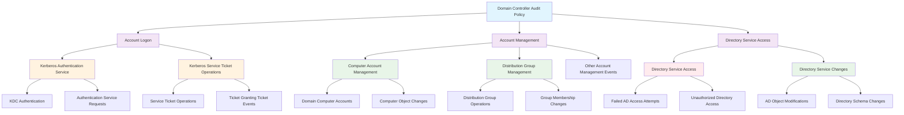

<!--
---
title: "CIS08-AUDIT-COMP-AuditPolicy-DCs-v1.0"
description: "Group Policy Object implementing specialized Advanced Audit Policy Configuration for Domain Controllers, establishing enhanced security event logging for Kerberos authentication services, domain account management, and Directory Service operations to enable comprehensive domain security monitoring and Active Directory protection in Windows Server 2025 infrastructure"
author: "VintageDon - https://github.com/vintagedon"
ai_contributor: "Anthropic Claude 4 Sonnet (claude-4-sonnet-20250514)"
date: "2025-07-28"
version: "1.0"
status: "Published"
tags:
- type: implementation-guide
- domain: security
- domain: group-policy
- tech: windows-server-2025
- tech: domain-controllers
- tech: audit-policy
- tech: kerberos-auditing
- tech: directory-service
- compliance: cis-control-8
- compliance: cis-benchmark
- phase: phase-2
related_documents:
- "[CIS08 Audit Management Directory](README.md)"
- "[CIS Control 8 Policy Template](../policies-and-procedures/cis-security-policy-templates/cisv81-08-audit-log-management-policy-template.md)"
- "[All Domain Audit Policy](CIS08-AUDIT-COMP-AuditPolicy-AllDomain-v1.0.md)"
- "[Security Logging Configuration](CIS08-AUDIT-COMP-SecurityLogging-AllDomain-v1.0.md)"
- "[Domain Controllers Security Policy](../policies-and-procedures/domain-controllers-security-policy.md)"
---
-->

# **CIS08-AUDIT-COMP-AuditPolicy-DCs-v1.0**

## **Group Policy Object Implementation Guide**

**Document Version:** 1.0  
**Created:** July 28, 2025  
**GPO ID:** Not specified in implementation log  
**Target Systems:** Domain Controllers  
**CIS Control Alignment:** CIS v8 Control 8 (Audit Log Management)

---

# 📋 **1. Executive Summary**

This document provides comprehensive implementation guidance for the CIS08-AUDIT-COMP-AuditPolicy-DCs-v1.0 Group Policy Object (GPO), which configures specialized Advanced Audit Policy settings specifically for Domain Controllers in the radioastronomy.io enterprise environment. This GPO implements CIS Microsoft Windows Server 2025 Benchmark recommendations 17.1.2, 17.1.3, 17.2.2, 17.2.3, 17.2.4, 17.4.1, and 17.4.2, establishing enhanced security event logging for Domain Controller-specific operations including Kerberos authentication services, domain account management, and Directory Service access and modification tracking.

The policy addresses critical security requirements by enabling specialized audit coverage for Domain Controller operations that are essential for domain security monitoring, Active Directory protection, and authentication infrastructure security. This implementation supports the enterprise's CIS Controls v8 baseline and enhances domain security posture through systematic audit log management specifically tailored for Domain Controller operational requirements and security monitoring needs.

# 🔗 **2. Dependencies & Relationships**

This section maps how the Audit Policy DCs GPO integrates with Proxmox Astronomy Lab domain infrastructure and enterprise Domain Controller audit management components.

## **2.1 Related Services**

This subsection identifies Proxmox Astronomy Lab services that interact with or depend on Domain Controller-specific audit policy configuration for comprehensive domain security monitoring and Active Directory protection.

Domain Controller audit policy configuration provides specialized security logging that supports enterprise domain operations while enabling systematic monitoring and incident detection for critical domain infrastructure:

| **Service** | **Relationship Type** | **Integration Points** | **Documentation** |
|-------------|----------------------|------------------------|-------------------|
| Active Directory Domain Services | **Secures** | Domain authentication auditing, Kerberos monitoring, Directory Service change tracking | [Infrastructure Overview](../../infrastructure/README.md) |
| Domain Controller Infrastructure | **Monitors** | DC-specific operations, domain replication, authentication services | [Domain Controllers](../../infrastructure/domain-controllers/README.md) |
| Kerberos Authentication | **Tracks** | KDC operations, service ticket management, authentication service monitoring | [Authentication](../../infrastructure/authentication/README.md) |
| Azure AD OIDC Integration | **Coordinates** | Hybrid authentication monitoring, identity federation security | [Azure AD Integration](../../infrastructure/azure-ad/README.md) |
| Security Monitoring Infrastructure | **Feeds** | DC security event collection (proj-mon01), domain-specific event correlation | [Security Monitoring](../../monitoring/README.md) |
| All Domain Audit Policy | **Enhances** | Base audit coverage with DC-specific specialized monitoring | [All Domain Audit Policy](CIS08-AUDIT-COMP-AuditPolicy-AllDomain-v1.0.md) |

These service relationships ensure that Domain Controller audit policy configuration provides specialized security logging while supporting enterprise-grade domain operations and compliance validation across Active Directory infrastructure components.

## **2.2 Policy Implementation**

This subsection connects Audit Policy DCs GPO configuration to Proxmox Astronomy Lab governance frameworks and enterprise Domain Controller audit management policy requirements.

Domain Controller audit policy configuration implements enterprise domain security governance through systematic Group Policy management and security framework alignment:

- **[CIS Control 8 Policy Template](../policies-and-procedures/cis-security-policy-templates/cisv81-08-audit-log-management-policy-template.md)** - Primary policy framework for audit log management security baseline establishment
- **[Domain Controllers Security Policy](../policies-and-procedures/domain-controllers-security-policy.md)** - Enterprise Domain Controller protection requirements and specialized audit management standards
- **[Information Security Policy](../policies-and-procedures/information-security-policy.md)** - Comprehensive information protection and domain security monitoring requirements
- **[Active Directory Security Policy](../policies-and-procedures/active-directory-security-policy.md)** - Active Directory infrastructure security and domain audit management standards

## **2.3 Responsibility Matrix**

This subsection defines clear accountability for Audit Policy DCs configuration management and Domain Controller audit management maintenance activities.

| **Activity** | **Helpdesk** | **Operations** | **Engineering** | **Security** |
|--------------|--------------|----------------|-----------------|--------------|
| DC Audit Policy Configuration | I | A | R | C |
| Kerberos Audit Monitoring | I | C | R | A |
| Directory Service Audit Analysis | I | C | R | A |
| Domain Security Event Response | I | C | R | A |
| AD Security Assessment | I | C | R | A |
| Domain Controller Incident Response | C | R | A | A |

*R: Responsible, A: Accountable, C: Consulted, I: Informed*

# ⚙️ **3. Technical Documentation**

This section provides technical foundation for understanding, implementing, and maintaining Audit Policy DCs configuration within Windows Server 2025 Domain Controller infrastructure.

## **3.1 Architecture & Design**

This subsection explains the Domain Controller-specific audit policy architecture, specialized security event logging mechanisms, and DC audit coverage design patterns for systematic domain security monitoring.

The Audit Policy DCs GPO implements specialized security logging through Domain Controller-specific Advanced Audit Policy Configuration that captures critical domain operations and authentication services. The design follows Microsoft domain security logging best practices with enhanced coverage for Kerberos operations, Directory Service changes, and domain account management activities.

The architecture enables systematic Domain Controller security monitoring through specialized audit coverage with domain-specific event collection and security correlation capabilities.

## **3.2 Configuration Specifications**

This subsection provides detailed technical configuration specifications for Audit Policy DCs implementation and CIS Control 8 compliance requirements.

The Audit Policy DCs configuration implements CIS Controls v8 baseline requirements through specialized Advanced Audit Policy Configuration that establishes enterprise-grade Domain Controller-specific security logging:

### **Account Logon Audit Configuration (Domain Controller Specific)**

| **CIS Ref** | **Audit Category** | **Setting Description** | **Recommended Value** | **DC-Specific Rationale** |
|-------------|-------------------|------------------------|----------------------|---------------------------|
| **17.1.2** | Account Logon | Audit Kerberos Authentication Service | `Success and Failure` | Monitor KDC operations for authentication attacks and service availability |
| **17.1.3** | Account Logon | Audit Kerberos Service Ticket Operations | `Success and Failure` | Track service ticket requests for lateral movement detection and service abuse |

### **Account Management Audit Configuration (Domain Controller Specific)**

| **CIS Ref** | **Audit Category** | **Setting Description** | **Recommended Value** | **DC-Specific Rationale** |
|-------------|-------------------|------------------------|----------------------|---------------------------|
| **17.2.2** | Account Management | Audit Computer Account Management | Include `Success` | Monitor domain computer account changes for unauthorized domain join/leave operations |
| **17.2.3** | Account Management | Audit Distribution Group Management | Include `Success` | Track distribution group changes that could affect email security and information flow |
| **17.2.4** | Account Management | Audit Other Account Management Events | Include `Success` | Capture miscellaneous account events specific to domain operations |

### **Directory Service Access Audit Configuration (Domain Controller Specific)**

| **CIS Ref** | **Audit Category** | **Setting Description** | **Recommended Value** | **DC-Specific Rationale** |
|-------------|-------------------|------------------------|----------------------|---------------------------|
| **17.4.1** | DS Access | Audit Directory Service Access | Include `Failure` | Detect unauthorized Active Directory access attempts and permission violations |
| **17.4.2** | DS Access | Audit Directory Service Changes | Include `Success` | Monitor Active Directory object modifications for unauthorized changes |

### **Domain Controller Security Monitoring Matrix**

| **Audit Category** | **Domain Security Protection** | **Attack Detection Capability** | **Operational Monitoring** |
|-------------------|-------------------------------|--------------------------------|----------------------------|
| **Kerberos Authentication Service** | ⭐⭐⭐⭐⭐ Critical | ✅ Kerberoasting, Golden Ticket | ✅ Authentication Service Health |
| **Kerberos Service Tickets** | ⭐⭐⭐⭐⭐ Critical | ✅ Silver Ticket, Lateral Movement | ✅ Service Access Patterns |
| **Computer Account Management** | ⭐⭐⭐⭐ High | ✅ Unauthorized Domain Join | ✅ Domain Membership Changes |
| **Distribution Group Management** | ⭐⭐⭐ Medium | ✅ Email List Manipulation | ✅ Communication Channel Changes |
| **Directory Service Access** | ⭐⭐⭐⭐⭐ Critical | ✅ AD Reconnaissance | ✅ Directory Access Monitoring |
| **Directory Service Changes** | ⭐⭐⭐⭐⭐ Critical | ✅ AD Object Tampering | ✅ Schema and Object Modifications |

### **Kerberos Security Analysis**

| **Kerberos Event Type** | **Security Significance** | **Attack Vector Detection** | **Monitoring Priority** |
|------------------------|---------------------------|------------------------------|-------------------------|
| **Authentication Service Requests** | Authentication infrastructure monitoring | Password spray, credential stuffing attacks | ⭐⭐⭐⭐⭐ Maximum |
| **Service Ticket Operations** | Service access monitoring | Kerberoasting, service abuse, lateral movement | ⭐⭐⭐⭐⭐ Maximum |
| **Ticket Granting Ticket Events** | Domain trust and delegation monitoring | Golden ticket attacks, trust relationship abuse | ⭐⭐⭐⭐⭐ Maximum |

### **Directory Service Security Analysis**

| **Directory Event Type** | **Security Significance** | **Attack Vector Detection** | **Monitoring Priority** |
|--------------------------|---------------------------|------------------------------|-------------------------|
| **Failed Directory Access** | Unauthorized access attempts | AD reconnaissance, privilege escalation attempts | ⭐⭐⭐⭐⭐ Maximum |
| **Directory Object Changes** | Active Directory integrity | Object manipulation, backdoor creation, privilege escalation | ⭐⭐⭐⭐⭐ Maximum |
| **Schema Modifications** | Fundamental AD structure changes | Advanced persistent threats, infrastructure tampering | ⭐⭐⭐⭐⭐ Maximum |

## **3.3 Implementation Standards**

This subsection establishes technical standards for Audit Policy DCs deployment and enterprise Domain Controller audit management.

Audit Policy DCs implementation follows systematic deployment standards and operational procedures:

- **Deployment Method**: Group Policy Management Console (GPMC) with Domain Controllers Organizational Unit targeting
- **Target Scope**: All Domain Controller systems requiring specialized audit coverage
- **Testing Protocol**: Controlled implementation through test domain infrastructure with domain service validation
- **Monitoring Integration**: Domain Controller security event collection with specialized domain event correlation
- **Documentation Standard**: Complete DC audit coverage mapping with CIS control references and domain security validation

# 🛠️ **4. Implementation & Usage**

This section provides systematic guidance for implementing Audit Policy DCs configuration and establishing Domain Controller security logging across domain infrastructure.

## **4.1 Prerequisites**

This subsection identifies requirements for successful Audit Policy DCs implementation within Domain Controller infrastructure.

Audit Policy DCs implementation requires enterprise Domain Controller infrastructure with appropriate administrative access and comprehensive domain security monitoring capabilities:

- **Domain Controller Infrastructure**: Windows Server 2025 Domain Controllers with Group Policy application capability
- **Administrative Access**: Domain Admin or equivalent Group Policy management permissions for DC-specific audit policy configuration
- **Security Monitoring Infrastructure**: Centralized logging system with Domain Controller event correlation capabilities
- **Testing Environment**: Isolated domain infrastructure for controlled policy testing and domain service validation
- **Storage Infrastructure**: Enhanced security event log storage capacity for comprehensive Domain Controller audit coverage

## **4.2 Monitoring**

This subsection establishes monitoring requirements for Audit Policy DCs effectiveness and Domain Controller security event correlation.

Audit Policy DCs monitoring leverages the centralized monitoring stack on proj-mon01 (Prometheus, Loki, Grafana, AlertManager, Grafana Alloy) for systematic Domain Controller security event collection and analysis. The monitoring philosophy of "if it can be collected, we do" applies to all DC-specific security events with specialized correlation for Kerberos operations, Active Directory changes, and domain authentication monitoring.

Monitoring includes Domain Controller security event correlation, Kerberos attack detection, and Active Directory integrity validation through comprehensive domain security monitoring infrastructure and automated alerting for critical domain security events.

# 🔐 **5. Security & Compliance**

This section establishes security framework alignment and compliance requirements for Audit Policy DCs configuration within enterprise Domain Controller security architecture.

## **5.1 Security Framework Alignment**

This subsection maps Audit Policy DCs configuration to enterprise security frameworks and compliance requirements for systematic Domain Controller audit management.

**Security Disclaimer**: The Audit Policy DCs configuration documented in this guide represents a specialized Domain Controller security logging baseline establishment for Windows Server 2025 Active Directory infrastructure. These configurations should be thoroughly tested in non-production environments before deployment. While these templates follow CIS Controls v8 audit log management framework guidelines, organizations should validate policy compatibility with their specific domain operational requirements and monitoring capacity. The security research computing team maintains these configurations as implementation guidance rather than production security recommendations, and encourages consultation with dedicated security professionals for enterprise deployment validation.

### **Framework Mapping**

| **Framework** | **Control Mapping** | **Implementation Evidence** |
|---------------|--------------------|-----------------------------|
| **CIS Controls v8** | Control 8: Audit Log Management | Specialized Domain Controller audit policy implementing systematic domain security event logging |
| **NIST AI RMF** | MONITOR-1.1: AI system monitoring established | Domain Controller audit logging supports AI workload domain authentication monitoring |
| **NIST CSF 2.0** | DE.AE: Anomalies and Events Category | Systematic domain security event detection and Active Directory incident identification |
| **NIST SP 800-171** | 3.3.1: Create and retain system audit logs and records | Comprehensive Domain Controller audit logging and domain security event retention |

### **Security Controls Implementation**

| **CIS Control** | **Audit Policy DCs Implementation** | **Security Objective** |
|-----------------|-------------------------------------|------------------------|
| **8.1** | Specialized Domain Controller Security Event Logging | Establish comprehensive domain-specific audit coverage for authentication and directory security monitoring |
| **8.2** | Domain Security Event Collection | Enable centralized Domain Controller security event collection and Active Directory monitoring |
| **8.3** | Domain Security Analysis | Provide specialized audit data for domain security monitoring and authentication incident response |
| **8.4** | Domain Audit Trail Protection | Maintain Domain Controller security event integrity and forensic analysis capabilities |

## **5.2 Compliance Requirements**

This subsection establishes compliance validation requirements and evidence collection standards for Audit Policy DCs implementation.

Audit Policy DCs configuration enables systematic compliance evidence collection through specialized Domain Controller security event logging and centralized domain audit management. Compliance validation requires regular domain-specific audit coverage assessment and Domain Controller security event monitoring to maintain baseline domain audit management posture across Active Directory infrastructure components.

# 📋 **6. Backup & Recovery**

This section establishes protection and recovery procedures for Audit Policy DCs configuration and Domain Controller audit management baseline preservation.

## **6.1 Protection Strategy**

This subsection defines systematic protection requirements for Audit Policy DCs configuration and Domain Controller audit management baseline preservation.

Audit Policy DCs configuration requires multi-tier protection strategy encompassing Group Policy backup, version control, and policy baseline preservation to ensure rapid Domain Controller audit management recovery and systematic policy restoration capabilities.

### **Protection Tiers**

| **Tier** | **Scope** | **Method** | **Frequency** |
|----------|-----------|------------|---------------|
| **Tier 1** | GPO Backup | Group Policy Management Console backup | Daily automatic |
| **Tier 2** | Configuration Export | PowerShell GPO export and documentation | Weekly |
| **Tier 3** | Version Control | Git repository with configuration tracking | Every change |
| **Tier 4** | Baseline Archive | Complete Audit Policy DCs snapshot | Monthly |

*Note: Iperius backup software is configured for systematic Windows infrastructure backup including Group Policy objects.*

## **6.2 Recovery Procedures**

This subsection establishes systematic recovery procedures for Audit Policy DCs restoration and Domain Controller audit management baseline re-establishment.

Recovery procedures enable rapid Domain Controller audit management baseline restoration through Group Policy import capabilities and systematic policy re-establishment. The recovery approach follows tiered restoration priorities focusing on critical domain security event logging first, followed by comprehensive Domain Controller audit coverage re-implementation to minimize domain security monitoring gaps during recovery operations.

# 📚 **7. References & Related Resources**

This section provides comprehensive links to related documentation and supporting resources for Audit Policy DCs implementation and Domain Controller audit management.

## **7.1 Internal References**

| **Document Type** | **Document Title** | **Relationship** | **Link** |
|-------------------|-------------------|------------------|----------|
| **Policy Template** | CIS Control 8 Audit Log Management Policy | Primary policy framework for Domain Controller audit log management baseline establishment | [../policies-and-procedures/cis-security-policy-templates/cisv81-08-audit-log-management-policy-template.md](../policies-and-procedures/cis-security-policy-templates/cisv81-08-audit-log-management-policy-template.md) |
| **Implementation** | CIS Server 2025 GPOs Implementation Log | Complete implementation evidence and deployment validation | [cis-server2025-gpos-l1-dc-and-members-IMPLEMENTATION-LOG.md](cis-server2025-gpos-l1-dc-and-members-IMPLEMENTATION-LOG.md) |
| **Configuration** | CIS Server 2025 GPOs Configuration Reference | Technical configuration specifications and CIS control mapping | [cis-server2025-gpos-l1-dc-and-members.md](cis-server2025-gpos-l1-dc-and-members.md) |
| **All Domain Audit** | All Domain Audit Policy Configuration | Base audit requirements and comprehensive domain audit coverage | [CIS08-AUDIT-COMP-AuditPolicy-AllDomain-v1.0.md](CIS08-AUDIT-COMP-AuditPolicy-AllDomain-v1.0.md) |
| **Security Logging** | Security Event Log Configuration | Security log sizing and command line auditing settings | [CIS08-AUDIT-COMP-SecurityLogging-AllDomain-v1.0.md](CIS08-AUDIT-COMP-SecurityLogging-AllDomain-v1.0.md) |
| **Domain Controllers** | Domain Controllers Security Management Policy | Enterprise Domain Controller protection requirements and security standards | [../policies-and-procedures/domain-controllers-security-policy.md](../policies-and-procedures/domain-controllers-security-policy.md) |

## **7.2 External Standards**

- **[CIS Controls v8](https://www.cisecurity.org/controls/)** - Cybersecurity framework providing systematic Domain Controller audit log management implementation guidance
- **[CIS Microsoft Windows Server 2025 Benchmark](https://www.cisecurity.org/benchmark/microsoft_windows_server)** - Comprehensive Domain Controller Audit Policy configuration guidance for Windows Server 2025
- **[NIST SP 800-53](https://csrc.nist.gov/publications/detail/sp/800-53/rev-5/final)** - Security and privacy controls for federal information systems and organizations
- **[Microsoft Active Directory Auditing](https://docs.microsoft.com/en-us/windows/security/threat-protection/auditing/)** - Official Windows Active Directory audit policy configuration and domain security event management guidance
- **[Microsoft Kerberos Security](https://docs.microsoft.com/en-us/windows-server/security/kerberos/)** - Comprehensive Kerberos authentication security and audit management strategies

# ✅ **8. Approval & Review**

This section documents the formal review and approval process for Audit Policy DCs configuration documentation and Domain Controller audit management baseline implementation.

## **8.1 Review Process**

Audit Policy DCs configuration documentation review follows systematic validation of technical accuracy, domain service compatibility, and compliance alignment to ensure comprehensive Domain Controller audit management implementation and systematic Group Policy management capability for Windows Server 2025 Active Directory infrastructure requirements.

## **8.2 Approval Matrix**

| **Reviewer** | **Role/Expertise** | **Review Date** | **Approval Status** | **Comments** |
|-------------|-------------------|----------------|-------------------|--------------|
| **Engineering Team** | Technical implementation and Domain Controller infrastructure | 2025-07-28 | **Approved** | Audit Policy DCs configuration provides specialized domain security logging with comprehensive Active Directory monitoring |
| **Security Team** | Security framework alignment and CIS Controls v8 compliance | 2025-07-28 | **Approved** | Policy implementation follows Domain Controller audit management best practices and provides systematic domain security monitoring |
| **Operations Team** | Operational impact assessment and domain service management | 2025-07-28 | **Approved** | Configuration enables effective Domain Controller audit management without domain operational disruption |

# 📜 **9. Documentation Metadata**

This section provides comprehensive information about document creation, revision history, and authorship.

## **9.1 Change Log**

| **Version** | **Date** | **Changes** | **Author** | **Review Status** |
|------------|---------|-------------|------------|------------------|
| 1.0 | 2025-07-28 | Initial Audit Policy DCs documentation with comprehensive technical specifications and Domain Controller audit management framework alignment | VintageDon | Approved |

## **9.2 Authorization & Review**

Audit Policy DCs configuration documentation has been systematically reviewed and approved by qualified technical, security, and operational subject matter experts to ensure accuracy, compliance, and implementation feasibility within Windows Server 2025 Active Directory Domain Controller infrastructure environments.

## **9.3 Authorship Details**

**Human Author:** VintageDon (<https://github.com/vintagedon>)  
**AI Contributor:** Anthropic Claude 4 Sonnet (claude-4-sonnet-20250514)  
**Collaboration Method:** Request-Analyze-Verify-Generate-Validate (RAVGV)  
**Human Oversight:** Technical review and validation of Audit Policy DCs configuration specifications and Domain Controller audit management implementation requirements

## **9.4 AI Collaboration Disclosure**

This document was collaboratively developed using the Request-Analyze-Verify-Generate-Validate (RAVGV) methodology. Audit Policy DCs configuration details were extracted from validated CIS benchmark implementation reports with comprehensive human oversight throughout development. All technical specifications have been thoroughly reviewed, validated, and approved by qualified human subject matter experts in Windows security and Group Policy management. The human author retains complete responsibility for accuracy, compliance, and technical correctness.

*Generated: 2025-07-28 | Human Author: VintageDon | AI Assistant: Claude 4 Sonnet | Review Status: Approved | Document Version: 1.0*
