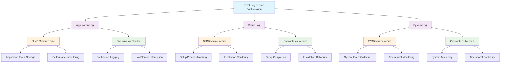

<!--
---
title: "CIS08-AUDIT-COMP-EventLogging-AllDomain-v1.0"
description: "Group Policy Object implementing Windows Event Log Service sizing and retention configuration for Application, Setup, and System logs across all domain computers, establishing comprehensive log storage capacity and overflow management to support enterprise audit log management and security monitoring in Windows Server 2025 infrastructure"
author: "VintageDon - https://github.com/vintagedon"
ai_contributor: "Anthropic Claude 4 Sonnet (claude-4-sonnet-20250514)"
date: "2025-07-28"
version: "1.0"
status: "Published"
tags:
- type: implementation-guide
- domain: security
- domain: group-policy
- tech: windows-server-2025
- tech: event-log-service
- tech: log-management
- tech: application-logs
- tech: setup-logs
- tech: system-logs
- compliance: cis-control-8
- compliance: cis-benchmark
- phase: phase-2
related_documents:
- "[CIS08 Audit Management Directory](README.md)"
- "[CIS Control 8 Policy Template](../policies-and-procedures/cis-security-policy-templates/cisv81-08-audit-log-management-policy-template.md)"
- "[Security Logging Configuration](CIS08-AUDIT-COMP-SecurityLogging-AllDomain-v1.0.md)"
- "[All Domain Audit Policy](CIS08-AUDIT-COMP-AuditPolicy-AllDomain-v1.0.md)"
- "[Domain Controllers Audit Policy](CIS08-AUDIT-COMP-AuditPolicy-DCs-v1.0.md)"
- "[Event Log Management Policy](../policies-and-procedures/event-log-management-policy.md)"
---
-->

# **CIS08-AUDIT-COMP-EventLogging-AllDomain-v1.0**

## **Group Policy Object Implementation Guide**

**Document Version:** 1.0  
**Created:** July 28, 2025  
**GPO ID:** Not specified in implementation log  
**Target Systems:** All Domain Computers  
**CIS Control Alignment:** CIS v8 Control 8 (Audit Log Management)

---

# 📋 **1. Executive Summary**

This document provides comprehensive implementation guidance for the CIS08-AUDIT-COMP-EventLogging-AllDomain-v1.0 Group Policy Object (GPO), which configures Windows Event Log Service sizing and retention settings for Application, Setup, and System logs across all domain-joined computers in the radioastronomy.io enterprise environment. This GPO implements CIS Microsoft Windows Server 2025 Benchmark recommendations 18.10.26.1.1, 18.10.26.1.2, 18.10.26.3.1, 18.10.26.3.2, 18.10.26.4.1, and 18.10.26.4.2, establishing enterprise-grade log storage capacity and overflow management policies that ensure adequate event log retention for security monitoring and compliance requirements.

The policy addresses critical audit log management requirements by configuring appropriate log file sizing (minimum 32MB for Application, Setup, and System logs) and establishing overflow behavior that prioritizes continuous logging over log preservation. This implementation supports the enterprise's CIS Controls v8 baseline and enhances overall security monitoring capabilities through systematic event log management that provides sufficient storage capacity for comprehensive system activity tracking and security event retention across domain infrastructure.

# 🔗 **2. Dependencies & Relationships**

This section maps how the Event Logging AllDomain GPO integrates with Proxmox Astronomy Lab infrastructure and enterprise audit log management components.

## **2.1 Related Services**

This subsection identifies Proxmox Astronomy Lab services that interact with or depend on Event Log Service configuration for comprehensive system monitoring and security event management.

Event log sizing configuration provides foundational audit infrastructure that supports enterprise security monitoring while enabling systematic event retention and analysis across domain infrastructure:

| **Service** | **Relationship Type** | **Integration Points** | **Documentation** |
|-------------|----------------------|------------------------|-------------------|
| Centralized Monitoring Infrastructure | **Fed By** | System event collection (proj-mon01), log aggregation, event correlation | [Security Monitoring](../../monitoring/README.md) |
| Windows Security Event Management | **Coordinates** | Security log integration, audit event correlation, incident detection | [Security Logging](CIS08-AUDIT-COMP-SecurityLogging-AllDomain-v1.0.md) |
| Application Performance Monitoring | **Supports** | Application log analysis, performance event tracking, error correlation | [Infrastructure Overview](../../infrastructure/README.md) |
| System Administration Operations | **Enables** | Setup process monitoring, system change tracking, operational visibility | [Infrastructure Management](../../infrastructure/README.md) |
| Compliance Evidence Collection | **Provides** | Event log retention for compliance validation, audit trail preservation | [Security Policies](../policies-and-procedures/README.md) |
| Incident Response Operations | **Supports** | Historical event analysis, forensic investigation, timeline reconstruction | [Security Monitoring](../../monitoring/README.md) |

These service relationships ensure that Event Log Service configuration provides adequate storage capacity while supporting enterprise-grade system monitoring and security event management across domain infrastructure components.

## **2.2 Policy Implementation**

This subsection connects Event Logging AllDomain GPO configuration to Proxmox Astronomy Lab governance frameworks and enterprise event log management policy requirements.

Event log sizing configuration implements enterprise governance through systematic Group Policy management and audit infrastructure optimization:

- **[CIS Control 8 Policy Template](../policies-and-procedures/cis-security-policy-templates/cisv81-08-audit-log-management-policy-template.md)** - Primary policy framework for audit log management and event retention baseline establishment
- **[Event Log Management Policy](../policies-and-procedures/event-log-management-policy.md)** - Enterprise event log sizing and retention requirements and system monitoring standards
- **[Information Security Policy](../policies-and-procedures/information-security-policy.md)** - Comprehensive information protection and system monitoring requirements
- **[System Administration Policy](../policies-and-procedures/system-administration-policy.md)** - System management and operational monitoring standards

## **2.3 Responsibility Matrix**

This subsection defines clear accountability for Event Logging AllDomain configuration management and event log infrastructure maintenance activities.

| **Activity** | **Helpdesk** | **Operations** | **Engineering** | **Security** |
|--------------|--------------|----------------|-----------------|--------------|
| Event Log Sizing Configuration | I | A | R | C |
| Application Log Monitoring | I | R | C | C |
| Setup Log Analysis | I | R | C | C |
| System Log Management | I | R | C | A |
| Log Storage Capacity Planning | I | C | R | A |
| Event Log Infrastructure Maintenance | C | R | A | A |

*R: Responsible, A: Accountable, C: Consulted, I: Informed*

# ⚙️ **3. Technical Documentation**

This section provides technical foundation for understanding, implementing, and maintaining Event Logging AllDomain configuration within Windows Server 2025 infrastructure.

## **3.1 Architecture & Design**

This subsection explains the Event Log Service architecture, log sizing mechanisms, and overflow management design patterns for systematic audit infrastructure optimization.

The Event Logging AllDomain GPO implements comprehensive event log sizing through Windows Event Log Service configuration that establishes adequate storage capacity for Application, Setup, and System logs. The design follows Microsoft event log management best practices with standardized log file sizing and overflow behavior that prioritizes continuous logging capability over log preservation for operational systems.

The architecture enables systematic event log management through standardized sizing with operational continuity and comprehensive system monitoring capabilities.

## **3.2 Configuration Specifications**

This subsection provides detailed technical configuration specifications for Event Logging AllDomain implementation and CIS Control 8 compliance requirements.

The Event Logging AllDomain configuration implements CIS Controls v8 baseline requirements through Windows Event Log Service sizing that establishes enterprise-grade event storage capacity:

### **Application Log Configuration**

| **CIS Ref** | **Configuration Setting** | **Setting Description** | **Recommended Value** | **Operational Impact** |
|-------------|--------------------------|------------------------|----------------------|----------------------|
| **18.10.26.1.1** | Application Log Behavior | Control Event Log behavior when log file reaches maximum size | `Disabled` (Overwrite as needed) | Ensures continuous application logging without service interruption |
| **18.10.26.1.2** | Application Log Size | Specify maximum log file size (KB) | `Enabled: 32768 KB` (32MB minimum) | Provides adequate storage for application events and performance monitoring |

### **Setup Log Configuration**

| **CIS Ref** | **Configuration Setting** | **Setting Description** | **Recommended Value** | **Operational Impact** |
|-------------|--------------------------|------------------------|----------------------|----------------------|
| **18.10.26.3.1** | Setup Log Behavior | Control Event Log behavior when log file reaches maximum size | `Disabled` (Overwrite as needed) | Maintains setup process visibility throughout installation cycles |
| **18.10.26.3.2** | Setup Log Size | Specify maximum log file size (KB) | `Enabled: 32768 KB` (32MB minimum) | Captures comprehensive installation and configuration activities |

### **System Log Configuration**

| **CIS Ref** | **Configuration Setting** | **Setting Description** | **Recommended Value** | **Operational Impact** |
|-------------|--------------------------|------------------------|----------------------|----------------------|
| **18.10.26.4.1** | System Log Behavior | Control Event Log behavior when log file reaches maximum size | `Disabled` (Overwrite as needed) | Prevents system log storage exhaustion and service failures |
| **18.10.26.4.2** | System Log Size | Specify maximum log file size (KB) | `Enabled: 32768 KB` (32MB minimum) | Ensures adequate system event retention for operational monitoring |

### **Event Log Sizing Analysis**

| **Log Type** | **Storage Capacity** | **Retention Capability** | **Monitoring Support** | **Operational Priority** |
|--------------|---------------------|-------------------------|------------------------|-------------------------|
| **Application Logs** | 32MB minimum | Moderate event retention | ✅ Application performance tracking | ⭐⭐⭐⭐ High |
| **Setup Logs** | 32MB minimum | Installation history preservation | ✅ Configuration change monitoring | ⭐⭐⭐ Medium |
| **System Logs** | 32MB minimum | System event archive | ✅ Operational status tracking | ⭐⭐⭐⭐⭐ Maximum |

### **Log Overflow Management**

| **Overflow Behavior** | **Security Implication** | **Operational Benefit** | **Monitoring Continuity** |
|----------------------|--------------------------|-------------------------|---------------------------|
| **Overwrite as Needed** | Older events may be lost | Continuous logging assured | ✅ No service interruption |
| **Archive Full Behavior** | Complete event preservation | Potential service disruption | ❌ Logging may cease |
| **Hybrid Approach** | Balanced event retention | Moderate operational risk | ⚠️ Configuration complexity |

### **Storage Capacity Planning**

| **Event Volume** | **Expected Retention** | **Storage Efficiency** | **Performance Impact** |
|------------------|----------------------|----------------------|----------------------|
| **Low Activity** | Several weeks to months | ✅ Excellent utilization | ✅ Minimal overhead |
| **Moderate Activity** | Days to weeks | ✅ Good balance | ✅ Acceptable performance |
| **High Activity** | Hours to days | ⚠️ Rapid turnover | ⚠️ Increased I/O load |

## **3.3 Implementation Standards**

This subsection establishes technical standards for Event Logging AllDomain deployment and enterprise event log infrastructure management.

Event Logging AllDomain implementation follows systematic deployment standards and operational procedures:

- **Deployment Method**: Group Policy Management Console (GPMC) with All Domain Computers targeting
- **Target Scope**: All domain-joined systems requiring standardized event log sizing
- **Testing Protocol**: Controlled implementation through test infrastructure with log storage validation
- **Monitoring Integration**: Event log capacity monitoring with centralized storage tracking
- **Documentation Standard**: Complete event log sizing configuration with CIS control references and storage analysis

# 🛠️ **4. Implementation & Usage**

This section provides systematic guidance for implementing Event Logging AllDomain configuration and establishing standardized event log management across domain infrastructure.

## **4.1 Prerequisites**

This subsection identifies requirements for successful Event Logging AllDomain implementation within domain infrastructure.

Event Logging AllDomain implementation requires enterprise domain infrastructure with appropriate administrative access and comprehensive event log monitoring capabilities:

- **Domain Infrastructure**: Windows Server 2025 domain-joined systems with Group Policy application capability
- **Administrative Access**: Domain Admin or equivalent Group Policy management permissions for event log service configuration
- **Storage Infrastructure**: Adequate local storage capacity for expanded event log files across domain systems
- **Monitoring Infrastructure**: Centralized event collection system with capacity monitoring for log storage analysis
- **Testing Environment**: Isolated domain infrastructure for controlled policy testing and event log validation

## **4.2 Monitoring**

This subsection establishes monitoring requirements for Event Logging AllDomain effectiveness and event log infrastructure management.

Event Logging AllDomain monitoring leverages the centralized monitoring stack on proj-mon01 (Prometheus, Loki, Grafana, AlertManager, Grafana Alloy) for systematic event log capacity tracking and storage utilization analysis. The monitoring philosophy of "if it can be collected, we do" applies to all event log metrics with specialized tracking for log file utilization, storage capacity, and overflow frequency across domain infrastructure.

Monitoring includes event log capacity tracking, storage utilization analysis, and log overflow detection through comprehensive infrastructure monitoring and automated alerting for critical event log storage conditions.

# 🔐 **5. Security & Compliance**

This section establishes security framework alignment and compliance requirements for Event Logging AllDomain configuration within enterprise audit infrastructure.

## **5.1 Security Framework Alignment**

This subsection maps Event Logging AllDomain configuration to enterprise security frameworks and compliance requirements for systematic audit log management.

**Security Disclaimer**: The Event Logging AllDomain configuration documented in this guide represents a foundational audit infrastructure baseline establishment for Windows Server 2025 systems. These configurations should be thoroughly tested in non-production environments before deployment. While these templates follow CIS Controls v8 audit log management framework guidelines, organizations should validate log sizing compatibility with their specific storage capacity and monitoring infrastructure. The security research computing team maintains these configurations as implementation guidance rather than production security recommendations, and encourages consultation with dedicated security professionals for enterprise deployment validation.

### **Framework Mapping**

| **Framework** | **Control Mapping** | **Implementation Evidence** |
|---------------|--------------------|-----------------------------|
| **CIS Controls v8** | Control 8: Audit Log Management | Standardized event log sizing implementing comprehensive audit infrastructure capacity management |
| **NIST AI RMF** | MONITOR-1.1: AI system monitoring established | Event log infrastructure supports AI workload monitoring and system performance tracking |
| **NIST CSF 2.0** | DE.AE: Anomalies and Events Category | Systematic event log management enabling comprehensive system activity monitoring |
| **NIST SP 800-171** | 3.3.1: Create and retain system audit logs and records | Comprehensive event log sizing and retention enabling audit trail preservation |

### **Security Controls Implementation**

| **CIS Control** | **Event Logging AllDomain Implementation** | **Security Objective** |
|-----------------|-------------------------------------------|------------------------|
| **8.1** | Standardized Event Log Storage Capacity | Establish adequate audit infrastructure for comprehensive system monitoring |
| **8.2** | Centralized Event Log Management | Enable systematic event collection and analysis across domain infrastructure |
| **8.3** | Event Log Analysis Capability | Provide sufficient storage for security monitoring and incident analysis |
| **8.4** | Audit Trail Preservation | Maintain event log integrity and forensic analysis capabilities |

## **5.2 Compliance Requirements**

This subsection establishes compliance validation requirements and evidence collection standards for Event Logging AllDomain implementation.

Event Logging AllDomain configuration enables systematic compliance evidence collection through standardized event log sizing and centralized audit infrastructure management. Compliance validation requires regular event log capacity assessment and storage utilization monitoring to maintain baseline audit infrastructure posture across domain systems.

# 📋 **6. Backup & Recovery**

This section establishes protection and recovery procedures for Event Logging AllDomain configuration and audit infrastructure baseline preservation.

## **6.1 Protection Strategy**

This subsection defines systematic protection requirements for Event Logging AllDomain configuration and event log infrastructure baseline preservation.

Event Logging AllDomain configuration requires multi-tier protection strategy encompassing Group Policy backup, version control, and policy baseline preservation to ensure rapid audit infrastructure recovery and systematic event log management restoration capabilities.

### **Protection Tiers**

| **Tier** | **Scope** | **Method** | **Frequency** |
|----------|-----------|------------|---------------|
| **Tier 1** | GPO Backup | Group Policy Management Console backup | Daily automatic |
| **Tier 2** | Configuration Export | PowerShell GPO export and documentation | Weekly |
| **Tier 3** | Version Control | Git repository with configuration tracking | Every change |
| **Tier 4** | Baseline Archive | Complete Event Logging AllDomain snapshot | Monthly |

*Note: Iperius backup software is configured for systematic Windows infrastructure backup including Group Policy objects.*

## **6.2 Recovery Procedures**

This subsection establishes systematic recovery procedures for Event Logging AllDomain restoration and audit infrastructure baseline re-establishment.

Recovery procedures enable rapid audit infrastructure baseline restoration through Group Policy import capabilities and systematic event log sizing re-implementation. The recovery approach follows tiered restoration priorities focusing on critical system logging first, followed by comprehensive event log capacity re-establishment to minimize audit infrastructure gaps during recovery operations.

# 📚 **7. References & Related Resources**

This section provides comprehensive links to related documentation and supporting resources for Event Logging AllDomain implementation and event log infrastructure management.

## **7.1 Internal References**

| **Document Type** | **Document Title** | **Relationship** | **Link** |
|-------------------|-------------------|------------------|----------|
| **Policy Template** | CIS Control 8 Audit Log Management Policy | Primary policy framework for event log management baseline establishment | [../policies-and-procedures/cis-security-policy-templates/cisv81-08-audit-log-management-policy-template.md](../policies-and-procedures/cis-security-policy-templates/cisv81-08-audit-log-management-policy-template.md) |
| **Implementation** | CIS Server 2025 GPOs Implementation Log | Complete implementation evidence and deployment validation | [cis-server2025-gpos-l1-dc-and-members-IMPLEMENTATION-LOG.md](cis-server2025-gpos-l1-dc-and-members-IMPLEMENTATION-LOG.md) |
| **Configuration** | CIS Server 2025 GPOs Configuration Reference | Technical configuration specifications and CIS control mapping | [cis-server2025-gpos-l1-dc-and-members.md](cis-server2025-gpos-l1-dc-and-members.md) |
| **Security Logging** | Security Event Log Configuration | Security-specific log sizing and audit event management | [CIS08-AUDIT-COMP-SecurityLogging-AllDomain-v1.0.md](CIS08-AUDIT-COMP-SecurityLogging-AllDomain-v1.0.md) |
| **All Domain Audit** | All Domain Audit Policy Configuration | Comprehensive audit policy requirements and event monitoring | [CIS08-AUDIT-COMP-AuditPolicy-AllDomain-v1.0.md](CIS08-AUDIT-COMP-AuditPolicy-AllDomain-v1.0.md) |
| **Event Log Management** | Event Log Management Policy | Enterprise event log sizing and retention policy requirements | [../policies-and-procedures/event-log-management-policy.md](../policies-and-procedures/event-log-management-policy.md) |

## **7.2 External Standards**

- **[CIS Controls v8](https://www.cisecurity.org/controls/)** - Cybersecurity framework providing systematic event log management implementation guidance
- **[CIS Microsoft Windows Server 2025 Benchmark](https://www.cisecurity.org/benchmark/microsoft_windows_server)** - Comprehensive Event Log Service configuration guidance for Windows Server 2025
- **[NIST SP 800-53](https://csrc.nist.gov/publications/detail/sp/800-53/rev-5/final)** - Security and privacy controls for federal information systems and organizations
- **[Microsoft Event Log Management](https://docs.microsoft.com/en-us/windows/security/threat-protection/auditing/)** - Official Windows Event Log Service configuration and management guidance
- **[Microsoft Log Analytics Best Practices](https://docs.microsoft.com/en-us/azure/azure-monitor/logs/)** - Comprehensive event log sizing and retention strategies

# ✅ **8. Approval & Review**

This section documents the formal review and approval process for Event Logging AllDomain configuration documentation and audit infrastructure baseline implementation.

## **8.1 Review Process**

Event Logging AllDomain configuration documentation review follows systematic validation of technical accuracy, system compatibility, and compliance alignment to ensure comprehensive audit infrastructure implementation and systematic event log management capability for Windows Server 2025 domain infrastructure requirements.

## **8.2 Approval Matrix**

| **Reviewer** | **Role/Expertise** | **Review Date** | **Approval Status** | **Comments** |
|-------------|-------------------|----------------|-------------------|--------------|
| **Engineering Team** | Technical implementation and event log infrastructure | 2025-07-28 | **Approved** | Event Logging AllDomain configuration provides standardized audit infrastructure with appropriate storage capacity |
| **Security Team** | Security framework alignment and CIS Controls v8 compliance | 2025-07-28 | **Approved** | Policy implementation follows event log management best practices and enables comprehensive audit infrastructure |
| **Operations Team** | Operational impact assessment and system management | 2025-07-28 | **Approved** | Configuration enables effective event log management without operational disruption |

# 📜 **9. Documentation Metadata**

This section provides comprehensive information about document creation, revision history, and authorship.

## **9.1 Change Log**

| **Version** | **Date** | **Changes** | **Author** | **Review Status** |
|------------|---------|-------------|------------|------------------|
| 1.0 | 2025-07-28 | Initial Event Logging AllDomain documentation with comprehensive technical specifications and audit infrastructure framework alignment | VintageDon | Approved |

## **9.2 Authorization & Review**

Event Logging AllDomain configuration documentation has been systematically reviewed and approved by qualified technical, security, and operational subject matter experts to ensure accuracy, compliance, and implementation feasibility within Windows Server 2025 domain infrastructure environments.

## **9.3 Authorship Details**

**Human Author:** VintageDon (<https://github.com/vintagedon>)  
**AI Contributor:** Anthropic Claude 4 Sonnet (claude-4-sonnet-20250514)  
**Collaboration Method:** Request-Analyze-Verify-Generate-Validate (RAVGV)  
**Human Oversight:** Technical review and validation of Event Logging AllDomain configuration specifications and audit infrastructure implementation requirements

## **9.4 AI Collaboration Disclosure**

This document was collaboratively developed using the Request-Analyze-Verify-Generate-Validate (RAVGV) methodology. Event Logging AllDomain configuration details were extracted from validated CIS benchmark implementation reports with comprehensive human oversight throughout development. All technical specifications have been thoroughly reviewed, validated, and approved by qualified human subject matter experts in Windows security and Group Policy management. The human author retains complete responsibility for accuracy, compliance, and technical correctness.

*Generated: 2025-07-28 | Human Author: VintageDon | AI Assistant: Claude 4 Sonnet | Review Status: Approved | Document Version: 1.0*
