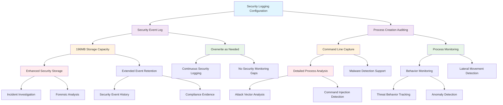

<!--
---
title: "CIS08-AUDIT-COMP-SecurityLogging-AllDomain-v1.0"
description: "Group Policy Object implementing Windows Security Event Log sizing and process creation command line auditing configuration across all domain computers, establishing enhanced security audit infrastructure with 196MB minimum log capacity and comprehensive process monitoring to support enterprise security monitoring and incident detection in Windows Server 2025 infrastructure"
author: "VintageDon - https://github.com/vintagedon"
ai_contributor: "Anthropic Claude 4 Sonnet (claude-4-sonnet-20250514)"
date: "2025-07-28"
version: "1.0"
status: "Published"
tags:
- type: implementation-guide
- domain: security
- domain: group-policy
- tech: windows-server-2025
- tech: security-event-log
- tech: process-auditing
- tech: command-line-auditing
- tech: security-monitoring
- compliance: cis-control-8
- compliance: cis-benchmark
- phase: phase-2
related_documents:
- "[CIS08 Audit Management Directory](README.md)"
- "[CIS Control 8 Policy Template](../policies-and-procedures/cis-security-policy-templates/cisv81-08-audit-log-management-policy-template.md)"
- "[Event Logging Configuration](CIS08-AUDIT-COMP-EventLogging-AllDomain-v1.0.md)"
- "[All Domain Audit Policy](CIS08-AUDIT-COMP-AuditPolicy-AllDomain-v1.0.md)"
- "[Domain Controllers Audit Policy](CIS08-AUDIT-COMP-AuditPolicy-DCs-v1.0.md)"
- "[Security Event Management Policy](../policies-and-procedures/security-event-management-policy.md)"
---
-->

# **CIS08-AUDIT-COMP-SecurityLogging-AllDomain-v1.0**

## **Group Policy Object Implementation Guide**

**Document Version:** 1.0  
**Created:** July 28, 2025  
**GPO ID:** Not specified in implementation log  
**Target Systems:** All Domain Computers  
**CIS Control Alignment:** CIS v8 Control 8 (Audit Log Management)

---

# 📋 **1. Executive Summary**

This document provides comprehensive implementation guidance for the CIS08-AUDIT-COMP-SecurityLogging-AllDomain-v1.0 Group Policy Object (GPO), which configures Windows Security Event Log sizing and process creation command line auditing across all domain-joined computers in the radioastronomy.io enterprise environment. This GPO implements CIS Microsoft Windows Server 2025 Benchmark recommendations 18.10.26.2.1, 18.10.26.2.2, and 18.9.3.1, establishing enhanced security audit infrastructure with 196MB minimum Security log capacity and comprehensive process monitoring capabilities that significantly exceed baseline event logging requirements.

The policy addresses critical security monitoring requirements by configuring substantial Security log storage capacity (6x larger than standard Application/System logs) and enabling detailed process creation auditing with command line parameter capture. This implementation supports the enterprise's CIS Controls v8 baseline and dramatically enhances security monitoring capabilities through systematic security event management that provides extensive storage for security incidents, attack detection, and forensic analysis across domain infrastructure while enabling comprehensive process behavior monitoring for advanced threat detection.

# 🔗 **2. Dependencies & Relationships**

This section maps how the Security Logging AllDomain GPO integrates with Proxmox Astronomy Lab infrastructure and enterprise security monitoring components.

## **2.1 Related Services**

This subsection identifies Proxmox Astronomy Lab services that interact with or depend on Security Event Log configuration for comprehensive security monitoring and threat detection.

Security log sizing and process auditing configuration provides critical security infrastructure that supports enterprise threat detection while enabling systematic security event analysis and incident response across domain infrastructure:

| **Service** | **Relationship Type** | **Integration Points** | **Documentation** |
|-------------|----------------------|------------------------|-------------------|
| Centralized Security Monitoring | **Fed By** | Security event collection (proj-mon01), threat correlation, incident detection | [Security Monitoring](../../monitoring/README.md) |
| Advanced Audit Policy Infrastructure | **Coordinates** | Security event generation, audit policy effectiveness, comprehensive monitoring | [All Domain Audit Policy](CIS08-AUDIT-COMP-AuditPolicy-AllDomain-v1.0.md) |
| Incident Response Operations | **Supports** | Security event analysis, forensic investigation, attack timeline reconstruction | [Security Operations](../../security/README.md) |
| Process Behavior Analysis | **Enables** | Command line monitoring, malware detection, lateral movement tracking | [Security Monitoring](../../monitoring/README.md) |
| Threat Detection Infrastructure | **Provides** | Security event storage for SIEM integration, behavioral analysis, attack detection | [Security Architecture](../../security/README.md) |
| Compliance Evidence Collection | **Maintains** | Security audit trails for compliance validation, regulatory requirements | [Security Policies](../policies-and-procedures/README.md) |

These service relationships ensure that Security Event Log configuration provides substantial storage capacity while supporting enterprise-grade security monitoring and comprehensive threat detection across domain infrastructure components.

## **2.2 Policy Implementation**

This subsection connects Security Logging AllDomain GPO configuration to Proxmox Astronomy Lab governance frameworks and enterprise security event management policy requirements.

Security log sizing and process auditing configuration implements enterprise security governance through systematic Group Policy management and security monitoring optimization:

- **[CIS Control 8 Policy Template](../policies-and-procedures/cis-security-policy-templates/cisv81-08-audit-log-management-policy-template.md)** - Primary policy framework for security audit log management and event retention baseline establishment
- **[Security Event Management Policy](../policies-and-procedures/security-event-management-policy.md)** - Enterprise security event log sizing and process monitoring requirements and threat detection standards
- **[Information Security Policy](../policies-and-procedures/information-security-policy.md)** - Comprehensive security monitoring and incident detection requirements
- **[Incident Response Policy](../policies-and-procedures/incident-response-policy.md)** - Security event analysis and forensic investigation standards

## **2.3 Responsibility Matrix**

This subsection defines clear accountability for Security Logging AllDomain configuration management and security event infrastructure maintenance activities.

| **Activity** | **Helpdesk** | **Operations** | **Engineering** | **Security** |
|--------------|--------------|----------------|-----------------|--------------|
| Security Log Sizing Configuration | I | C | R | A |
| Process Auditing Management | I | C | R | A |
| Security Event Analysis | I | C | C | R |
| Command Line Audit Monitoring | I | C | R | A |
| Security Log Capacity Planning | I | C | R | A |
| Threat Detection Infrastructure | I | C | R | A |

*R: Responsible, A: Accountable, C: Consulted, I: Informed*

# ⚙️ **3. Technical Documentation**

This section provides technical foundation for understanding, implementing, and maintaining Security Logging AllDomain configuration within Windows Server 2025 security infrastructure.

## **3.1 Architecture & Design**

This subsection explains the Security Event Log architecture, enhanced sizing mechanisms, and process auditing design patterns for systematic security monitoring optimization.

The Security Logging AllDomain GPO implements enhanced security audit infrastructure through Windows Security Event Log configuration that establishes substantially increased storage capacity (196MB vs 32MB for other logs) and comprehensive process creation monitoring with command line parameter capture. The design follows Microsoft security monitoring best practices with prioritized security event retention and detailed process behavior tracking for advanced threat detection and incident analysis capabilities.

The architecture enables comprehensive security monitoring through enhanced storage capacity with detailed process behavior tracking and systematic threat detection capabilities.

## **3.2 Configuration Specifications**

This subsection provides detailed technical configuration specifications for Security Logging AllDomain implementation and CIS Control 8 compliance requirements.

The Security Logging AllDomain configuration implements CIS Controls v8 baseline requirements through Windows Security Event Log Service optimization that establishes enterprise-grade security monitoring infrastructure:

### **Security Event Log Configuration**

| **CIS Ref** | **Configuration Setting** | **Setting Description** | **Recommended Value** | **Security Rationale** |
|-------------|--------------------------|------------------------|----------------------|----------------------|
| **18.10.26.2.1** | Security Log Behavior | Control Event Log behavior when log file reaches maximum size | `Disabled` (Overwrite as needed) | Ensures continuous security event logging without monitoring interruption |
| **18.10.26.2.2** | Security Log Size | Specify maximum log file size (KB) | `Enabled: 196608 KB` (192MB minimum) | Provides substantial storage for security events and incident analysis |

### **Process Creation Auditing Configuration**

| **CIS Ref** | **Configuration Setting** | **Setting Description** | **Recommended Value** | **Security Rationale** |
|-------------|--------------------------|------------------------|----------------------|----------------------|
| **18.9.3.1** | Command Line Auditing | Include command line in process creation events | `Enabled` | Enables detailed process behavior analysis and malware detection capabilities |

### **Security Log Sizing Analysis**

| **Log Capacity** | **Security Event Retention** | **Incident Analysis Support** | **Threat Detection Capability** |
|------------------|------------------------------|------------------------------|-------------------------------|
| **196MB (6x Standard)** | Extended security event history | ✅ Comprehensive forensic analysis | ✅ Advanced threat correlation |
| **Standard 32MB** | Limited security event retention | ⚠️ Reduced investigation capability | ⚠️ Constrained threat tracking |
| **Minimal Sizing** | Rapid security event turnover | ❌ Insufficient incident analysis | ❌ Limited detection effectiveness |

### **Process Auditing Security Analysis**

| **Process Monitoring Feature** | **Security Benefit** | **Threat Detection Support** | **Operational Impact** |
|-------------------------------|---------------------|------------------------------|------------------------|
| **Command Line Capture** | ⭐⭐⭐⭐⭐ Critical | ✅ Malware analysis, attack vector detection | ⚠️ Increased log volume |
| **Process Creation Events** | ⭐⭐⭐⭐ High | ✅ Lateral movement tracking, behavior analysis | ✅ Moderate overhead |
| **Enhanced Detail Level** | ⭐⭐⭐⭐⭐ Critical | ✅ Advanced persistent threat detection | ⚠️ Storage consumption |

### **Security Event Storage Comparison**

| **Event Log Type** | **Storage Allocation** | **Security Priority** | **Retention Capability** | **Monitoring Focus** |
|-------------------|----------------------|----------------------|-------------------------|---------------------|
| **Security Events** | 196MB (Enhanced) | ⭐⭐⭐⭐⭐ Maximum | Extended security history | Security incidents, threats |
| **Application Events** | 32MB (Standard) | ⭐⭐⭐ Medium | Basic application monitoring | Performance, errors |
| **System Events** | 32MB (Standard) | ⭐⭐⭐⭐ High | System operational tracking | Infrastructure health |
| **Setup Events** | 32MB (Standard) | ⭐⭐ Low | Installation process monitoring | Configuration changes |

### **Threat Detection Enhancement Matrix**

| **Security Capability** | **Without Enhanced Logging** | **With Security Log Sizing** | **With Process Auditing** |
|------------------------|------------------------------|------------------------------|---------------------------|
| **Malware Detection** | ⚠️ Limited visibility | ✅ Enhanced event retention | ⭐⭐⭐⭐⭐ Comprehensive analysis |
| **Lateral Movement Tracking** | ❌ Insufficient data | ✅ Extended event history | ⭐⭐⭐⭐⭐ Detailed behavior tracking |
| **Attack Vector Analysis** | ❌ Rapid event loss | ✅ Adequate event storage | ⭐⭐⭐⭐⭐ Command line visibility |
| **Incident Investigation** | ⚠️ Constrained analysis | ✅ Comprehensive event data | ⭐⭐⭐⭐⭐ Forensic detail |

## **3.3 Implementation Standards**

This subsection establishes technical standards for Security Logging AllDomain deployment and enterprise security event infrastructure management.

Security Logging AllDomain implementation follows systematic deployment standards and operational procedures:

- **Deployment Method**: Group Policy Management Console (GPMC) with All Domain Computers targeting
- **Target Scope**: All domain-joined systems requiring enhanced security monitoring
- **Testing Protocol**: Controlled implementation through security test infrastructure with event generation validation
- **Monitoring Integration**: Security event capacity monitoring with threat detection correlation
- **Documentation Standard**: Complete security log sizing configuration with CIS control references and threat detection analysis

# 🛠️ **4. Implementation & Usage**

This section provides systematic guidance for implementing Security Logging AllDomain configuration and establishing enhanced security monitoring across domain infrastructure.

## **4.1 Prerequisites**

This subsection identifies requirements for successful Security Logging AllDomain implementation within domain security infrastructure.

Security Logging AllDomain implementation requires enterprise domain infrastructure with appropriate administrative access and comprehensive security monitoring capabilities:

- **Domain Infrastructure**: Windows Server 2025 domain-joined systems with Group Policy application capability
- **Administrative Access**: Domain Admin or equivalent Group Policy management permissions for security event log configuration
- **Storage Infrastructure**: Enhanced local storage capacity for substantially increased security log files across domain systems
- **Security Monitoring Infrastructure**: Centralized SIEM system with capacity for increased security event volume and process auditing data
- **Testing Environment**: Isolated security infrastructure for controlled policy testing and security event validation

## **4.2 Monitoring**

This subsection establishes monitoring requirements for Security Logging AllDomain effectiveness and security event infrastructure management.

Security Logging AllDomain monitoring leverages the centralized monitoring stack on proj-mon01 (Prometheus, Loki, Grafana, AlertManager, Grafana Alloy) for systematic security event capacity tracking and process auditing analysis. The monitoring philosophy of "if it can be collected, we do" applies to all security event metrics with specialized tracking for security log utilization, process auditing volume, and threat detection correlation across domain infrastructure.

Monitoring includes security event capacity tracking, command line audit analysis, and threat detection effectiveness through comprehensive security monitoring infrastructure and automated alerting for critical security event storage conditions and suspicious process behavior patterns.

# 🔐 **5. Security & Compliance**

This section establishes security framework alignment and compliance requirements for Security Logging AllDomain configuration within enterprise security infrastructure.

## **5.1 Security Framework Alignment**

This subsection maps Security Logging AllDomain configuration to enterprise security frameworks and compliance requirements for systematic security audit management.

**Security Disclaimer**: The Security Logging AllDomain configuration documented in this guide represents an enhanced security audit infrastructure baseline establishment for Windows Server 2025 systems. These configurations should be thoroughly tested in non-production environments before deployment. While these templates follow CIS Controls v8 audit log management framework guidelines, organizations should validate log sizing compatibility with their specific storage capacity and security monitoring infrastructure. The security research computing team maintains these configurations as implementation guidance rather than production security recommendations, and encourages consultation with dedicated security professionals for enterprise deployment validation.

### **Framework Mapping**

| **Framework** | **Control Mapping** | **Implementation Evidence** |
|---------------|--------------------|-----------------------------|
| **CIS Controls v8** | Control 8: Audit Log Management | Enhanced security event log sizing implementing comprehensive security monitoring infrastructure capacity |
| **NIST AI RMF** | MONITOR-1.1: AI system monitoring established | Security event infrastructure supports AI workload security monitoring and threat detection |
| **NIST CSF 2.0** | DE.AE: Anomalies and Events Category | Systematic security event management enabling comprehensive threat detection and incident analysis |
| **NIST SP 800-171** | 3.3.1: Create and retain system audit logs and records | Enhanced security event log sizing and process auditing enabling comprehensive audit trail preservation |

### **Security Controls Implementation**

| **CIS Control** | **Security Logging AllDomain Implementation** | **Security Objective** |
|-----------------|---------------------------------------------|------------------------|
| **8.1** | Enhanced Security Event Log Storage Infrastructure | Establish comprehensive security monitoring capacity for threat detection and incident analysis |
| **8.2** | Centralized Security Event Management | Enable systematic security event collection and threat correlation across domain infrastructure |
| **8.3** | Security Event Analysis Capability | Provide substantial storage for security monitoring and comprehensive threat investigation |
| **8.4** | Security Audit Trail Preservation | Maintain security event integrity and forensic analysis capabilities with extended retention |

## **5.2 Compliance Requirements**

This subsection establishes compliance validation requirements and evidence collection standards for Security Logging AllDomain implementation.

Security Logging AllDomain configuration enables systematic compliance evidence collection through enhanced security event log sizing and centralized security audit management. Compliance validation requires regular security event capacity assessment and process auditing monitoring to maintain enhanced security audit posture across domain systems.

# 📋 **6. Backup & Recovery**

This section establishes protection and recovery procedures for Security Logging AllDomain configuration and security audit infrastructure baseline preservation.

## **6.1 Protection Strategy**

This subsection defines systematic protection requirements for Security Logging AllDomain configuration and security event infrastructure baseline preservation.

Security Logging AllDomain configuration requires multi-tier protection strategy encompassing Group Policy backup, version control, and policy baseline preservation to ensure rapid security audit infrastructure recovery and systematic security event management restoration capabilities.

### **Protection Tiers**

| **Tier** | **Scope** | **Method** | **Frequency** |
|----------|-----------|------------|---------------|
| **Tier 1** | GPO Backup | Group Policy Management Console backup | Daily automatic |
| **Tier 2** | Configuration Export | PowerShell GPO export and documentation | Weekly |
| **Tier 3** | Version Control | Git repository with configuration tracking | Every change |
| **Tier 4** | Baseline Archive | Complete Security Logging AllDomain snapshot | Monthly |

*Note: Iperius backup software is configured for systematic Windows infrastructure backup including Group Policy objects.*

## **6.2 Recovery Procedures**

This subsection establishes systematic recovery procedures for Security Logging AllDomain restoration and security audit infrastructure baseline re-establishment.

Recovery procedures enable rapid security audit infrastructure baseline restoration through Group Policy import capabilities and systematic security event management re-implementation. The recovery approach follows tiered restoration priorities focusing on critical security logging first, followed by comprehensive process auditing re-establishment to minimize security monitoring gaps during recovery operations.

# 📚 **7. References & Related Resources**

This section provides comprehensive links to related documentation and supporting resources for Security Logging AllDomain implementation and security event infrastructure management.

## **7.1 Internal References**

| **Document Type** | **Document Title** | **Relationship** | **Link** |
|-------------------|-------------------|------------------|----------|
| **Policy Template** | CIS Control 8 Audit Log Management Policy | Primary policy framework for security event log management baseline establishment | [../policies-and-procedures/cis-security-policy-templates/cisv81-08-audit-log-management-policy-template.md](../policies-and-procedures/cis-security-policy-templates/cisv81-08-audit-log-management-policy-template.md) |
| **Implementation** | CIS Server 2025 GPOs Implementation Log | Complete implementation evidence and deployment validation | [cis-server2025-gpos-l1-dc-and-members-IMPLEMENTATION-LOG.md](cis-server2025-gpos-l1-dc-and-members-IMPLEMENTATION-LOG.md) |
| **Configuration** | CIS Server 2025 GPOs Configuration Reference | Technical configuration specifications and CIS control mapping | [cis-server2025-gpos-l1-dc-and-members.md](cis-server2025-gpos-l1-dc-and-members.md) |
| **Event Logging** | Event Log Service Configuration | General event log sizing and retention management | [CIS08-AUDIT-COMP-EventLogging-AllDomain-v1.0.md](CIS08-AUDIT-COMP-EventLogging-AllDomain-v1.0.md) |
| **All Domain Audit** | All Domain Audit Policy Configuration | Comprehensive audit policy requirements and security event generation | [CIS08-AUDIT-COMP-AuditPolicy-AllDomain-v1.0.md](CIS08-AUDIT-COMP-AuditPolicy-AllDomain-v1.0.md) |
| **Security Event Management** | Security Event Management Policy | Enterprise security event log sizing and process monitoring policy requirements | [../policies-and-procedures/security-event-management-policy.md](../policies-and-procedures/security-event-management-policy.md) |

## **7.2 External Standards**

- **[CIS Controls v8](https://www.cisecurity.org/controls/)** - Cybersecurity framework providing systematic security event log management implementation guidance
- **[CIS Microsoft Windows Server 2025 Benchmark](https://www.cisecurity.org/benchmark/microsoft_windows_server)** - Comprehensive Security Event Log configuration guidance for Windows Server 2025
- **[NIST SP 800-53](https://csrc.nist.gov/publications/detail/sp/800-53/rev-5/final)** - Security and privacy controls for federal information systems and organizations
- **[Microsoft Security Event Log Management](https://docs.microsoft.com/en-us/windows/security/threat-protection/auditing/)** - Official Windows Security Event Log configuration and process auditing guidance
- **[Microsoft Process Auditing Best Practices](https://docs.microsoft.com/en-us/windows/security/threat-protection/auditing/audit-process-creation)** - Comprehensive process creation auditing and command line monitoring strategies

# ✅ **8. Approval & Review**

This section documents the formal review and approval process for Security Logging AllDomain configuration documentation and security audit infrastructure baseline implementation.

## **8.1 Review Process**

Security Logging AllDomain configuration documentation review follows systematic validation of technical accuracy, security monitoring compatibility, and compliance alignment to ensure comprehensive security audit infrastructure implementation and systematic security event management capability for Windows Server 2025 domain infrastructure requirements.

## **8.2 Approval Matrix**

| **Reviewer** | **Role/Expertise** | **Review Date** | **Approval Status** | **Comments** |
|-------------|-------------------|----------------|-------------------|--------------|
| **Engineering Team** | Technical implementation and security event infrastructure | 2025-07-28 | **Approved** | Security Logging AllDomain configuration provides enhanced security monitoring with substantial storage capacity |
| **Security Team** | Security framework alignment and CIS Controls v8 compliance | 2025-07-28 | **Approved** | Policy implementation follows security event management best practices and enables comprehensive threat detection |
| **Operations Team** | Operational impact assessment and security monitoring management | 2025-07-28 | **Approved** | Configuration enables effective security event management with enhanced monitoring capabilities |

# 📜 **9. Documentation Metadata**

This section provides comprehensive information about document creation, revision history, and authorship.

## **9.1 Change Log**

| **Version** | **Date** | **Changes** | **Author** | **Review Status** |
|------------|---------|-------------|------------|------------------|
| 1.0 | 2025-07-28 | Initial Security Logging AllDomain documentation with comprehensive technical specifications and security audit infrastructure framework alignment | VintageDon | Approved |

## **9.2 Authorization & Review**

Security Logging AllDomain configuration documentation has been systematically reviewed and approved by qualified technical, security, and operational subject matter experts to ensure accuracy, compliance, and implementation feasibility within Windows Server 2025 domain security infrastructure environments.

## **9.3 Authorship Details**

**Human Author:** VintageDon (<https://github.com/vintagedon>)  
**AI Contributor:** Anthropic Claude 4 Sonnet (claude-4-sonnet-20250514)  
**Collaboration Method:** Request-Analyze-Verify-Generate-Validate (RAVGV)  
**Human Oversight:** Technical review and validation of Security Logging AllDomain configuration specifications and security audit infrastructure implementation requirements

## **9.4 AI Collaboration Disclosure**

This document was collaboratively developed using the Request-Analyze-Verify-Generate-Validate (RAVGV) methodology. Security Logging AllDomain configuration details were extracted from validated CIS benchmark implementation reports with comprehensive human oversight throughout development. All technical specifications have been thoroughly reviewed, validated, and approved by qualified human subject matter experts in Windows security and Group Policy management. The human author retains complete responsibility for accuracy, compliance, and technical correctness.

*Generated: 2025-07-28 | Human Author: VintageDon | AI Assistant: Claude 4 Sonnet | Review Status: Approved | Document Version: 1.0*
