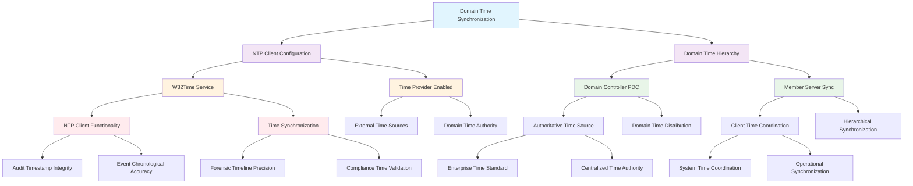

<!--
---
title: "CIS08-AUDIT-COMP-TimeSync-AllDomain-v1.0"
description: "Group Policy Object implementing Windows Time Service NTP Client configuration across all domain computers, establishing accurate time synchronization infrastructure to ensure audit log timestamp integrity and chronological event correlation for enterprise security monitoring and compliance requirements in Windows Server 2025 infrastructure"
author: "VintageDon - https://github.com/vintagedon"
ai_contributor: "Anthropic Claude 4 Sonnet (claude-4-sonnet-20250514)"
date: "2025-07-28"
version: "1.0"
status: "Published"
tags:
- type: implementation-guide
- domain: security
- domain: group-policy
- tech: windows-server-2025
- tech: time-synchronization
- tech: w32time-service
- tech: ntp-client
- tech: audit-infrastructure
- compliance: cis-control-8
- compliance: cis-benchmark
- phase: phase-2
related_documents:
- "[CIS08 Audit Management Directory](README.md)"
- "[CIS Control 8 Policy Template](../policies-and-procedures/cis-security-policy-templates/cisv81-08-audit-log-management-policy-template.md)"
- "[Time Sync Servers Configuration](CIS08-AUDIT-COMP-TimeSync-Servers-v1.0.md)"
- "[Security Logging Configuration](CIS08-AUDIT-COMP-SecurityLogging-AllDomain-v1.0.md)"
- "[All Domain Audit Policy](CIS08-AUDIT-COMP-AuditPolicy-AllDomain-v1.0.md)"
- "[Time Synchronization Policy](../policies-and-procedures/time-synchronization-policy.md)"
---
-->

# **CIS08-AUDIT-COMP-TimeSync-AllDomain-v1.0**

## **Group Policy Object Implementation Guide**

**Document Version:** 1.0  
**Created:** July 28, 2025  
**GPO ID:** 5572585e-8749-4ceb-bd32-6ab10c94dda2  
**Target Systems:** All Domain Computers  
**CIS Control Alignment:** CIS v8 Control 8 (Audit Log Management)

---

# 📋 **1. Executive Summary**

This document provides comprehensive implementation guidance for the CIS08-AUDIT-COMP-TimeSync-AllDomain-v1.0 Group Policy Object (GPO), which configures Windows Time Service (W32Time) NTP Client functionality across all domain-joined computers in the radioastronomy.io enterprise environment. This GPO implements foundational time synchronization infrastructure that ensures accurate audit log timestamp integrity and enables chronological event correlation for enterprise security monitoring and compliance requirements.

The policy addresses critical audit infrastructure requirements by enabling NTP Client functionality on all domain systems, establishing systematic time synchronization that supports accurate security event timestamping, forensic timeline reconstruction, and compliance evidence integrity. This implementation provides the temporal foundation for the enterprise's CIS Controls v8 baseline and enhances overall audit log management capabilities through systematic time coordination that ensures chronological accuracy across security monitoring, incident analysis, and compliance validation activities throughout domain infrastructure.

# 🔗 **2. Dependencies & Relationships**

This section maps how the TimeSync AllDomain GPO integrates with Proxmox Astronomy Lab infrastructure and enterprise time synchronization components.

## **2.1 Related Services**

This subsection identifies Proxmox Astronomy Lab services that interact with or depend on Windows Time Service configuration for comprehensive audit infrastructure and temporal coordination.

Time synchronization configuration provides critical temporal foundation that supports enterprise audit infrastructure while enabling systematic chronological coordination and timestamp integrity across domain infrastructure:

| **Service** | **Relationship Type** | **Integration Points** | **Documentation** |
|-------------|----------------------|------------------------|-------------------|
| Domain Controller Time Infrastructure | **Coordinates With** | Hierarchical time synchronization, domain time authority, PDC Emulator coordination | [Infrastructure Overview](../../infrastructure/README.md) |
| Audit Log Management Infrastructure | **Supports** | Timestamp integrity, chronological event correlation, forensic timeline accuracy | [Security Logging](CIS08-AUDIT-COMP-SecurityLogging-AllDomain-v1.0.md) |
| Security Monitoring Infrastructure | **Enables** | Event correlation (proj-mon01), incident timeline reconstruction, security analysis | [Security Monitoring](../../monitoring/README.md) |
| Compliance Evidence Collection | **Validates** | Audit trail chronological integrity, regulatory timestamp requirements | [Security Policies](../policies-and-procedures/README.md) |
| Certificate Services Infrastructure | **Coordinates** | Certificate validity periods, PKI time validation, authentication timing | [Infrastructure Overview](../../infrastructure/README.md) |
| Member Server Time Coordination | **Complements** | Domain time hierarchy, server time synchronization, NTP client/server coordination | [Time Sync Servers](CIS08-AUDIT-COMP-TimeSync-Servers-v1.0.md) |

These service relationships ensure that Windows Time Service configuration provides accurate temporal coordination while supporting enterprise-grade audit infrastructure and comprehensive security monitoring across domain infrastructure components.

## **2.2 Policy Implementation**

This subsection connects TimeSync AllDomain GPO configuration to Proxmox Astronomy Lab governance frameworks and enterprise time synchronization policy requirements.

Time synchronization configuration implements enterprise governance through systematic Group Policy management and audit infrastructure optimization:

- **[CIS Control 8 Policy Template](../policies-and-procedures/cis-security-policy-templates/cisv81-08-audit-log-management-policy-template.md)** - Primary policy framework for audit log management and temporal integrity baseline establishment
- **[Time Synchronization Policy](../policies-and-procedures/time-synchronization-policy.md)** - Enterprise time coordination requirements and chronological integrity standards
- **[Information Security Policy](../policies-and-procedures/information-security-policy.md)** - Comprehensive security monitoring and audit infrastructure requirements
- **[System Administration Policy](../policies-and-procedures/system-administration-policy.md)** - System management and operational coordination standards

## **2.3 Responsibility Matrix**

This subsection defines clear accountability for TimeSync AllDomain configuration management and time synchronization infrastructure maintenance activities.

| **Activity** | **Helpdesk** | **Operations** | **Engineering** | **Security** |
|--------------|--------------|----------------|-----------------|--------------|
| Time Sync Configuration | I | A | R | C |
| NTP Client Management | I | R | C | C |
| Time Accuracy Monitoring | I | R | C | A |
| Audit Timestamp Validation | I | C | R | A |
| Time Infrastructure Maintenance | I | R | A | C |
| Chronological Incident Analysis | I | C | C | R |

*R: Responsible, A: Accountable, C: Consulted, I: Informed*

# ⚙️ **3. Technical Documentation**

This section provides technical foundation for understanding, implementing, and maintaining TimeSync AllDomain configuration within Windows Server 2025 infrastructure.

## **3.1 Architecture & Design**

This subsection explains the Windows Time Service architecture, NTP Client mechanisms, and time synchronization design patterns for systematic audit infrastructure optimization.

The TimeSync AllDomain GPO implements systematic time synchronization through Windows Time Service (W32Time) NTP Client configuration that establishes accurate temporal coordination across all domain-joined systems. The design follows Microsoft time synchronization best practices with domain-hierarchical time distribution and centralized time authority coordination for comprehensive audit log timestamp integrity and forensic timeline accuracy.

The architecture enables comprehensive time synchronization through hierarchical coordination with systematic audit infrastructure temporal foundation and operational time accuracy capabilities.

## **3.2 Configuration Specifications**

This subsection provides detailed technical configuration specifications for TimeSync AllDomain implementation and CIS Control 8 compliance requirements.

The TimeSync AllDomain configuration implements CIS Controls v8 baseline requirements through Windows Time Service optimization that establishes enterprise-grade temporal coordination infrastructure:

### **Windows Time Service NTP Client Configuration**

| **Registry Path** | **Value Name** | **Setting Description** | **Recommended Value** | **Audit Infrastructure Impact** |
|------------------|----------------|------------------------|----------------------|--------------------------------|
| **HKLM\Software\Policies\Microsoft\W32Time\TimeProviders\NtpClient** | **Enabled** | Enable Windows NTP Client time provider | `1` (Enabled) | Ensures accurate audit log timestamps and chronological event correlation |

### **Time Synchronization Infrastructure Analysis**

| **Component** | **Function** | **Audit Benefit** | **Operational Impact** |
|---------------|--------------|-------------------|------------------------|
| **NTP Client Provider** | External time source synchronization | ✅ Accurate audit timestamps | ✅ Minimal system overhead |
| **Domain Time Hierarchy** | Centralized time distribution | ✅ Consistent chronological correlation | ✅ Systematic time coordination |
| **W32Time Service** | System time management | ✅ Timestamp integrity across logs | ✅ Automated time maintenance |

### **Audit Log Timestamp Integrity Matrix**

| **Time Synchronization Status** | **Audit Log Reliability** | **Forensic Analysis Support** | **Compliance Evidence Quality** |
|--------------------------------|---------------------------|------------------------------|--------------------------------|
| **Accurate Time Sync (Enabled)** | ⭐⭐⭐⭐⭐ Maximum | ✅ Precise timeline reconstruction | ✅ Regulatory compliance validated |
| **Inaccurate Time Sync** | ⚠️ Degraded chronological accuracy | ⚠️ Timeline correlation issues | ⚠️ Compliance evidence questionable |
| **No Time Synchronization** | ❌ Unreliable timestamps | ❌ Forensic timeline compromised | ❌ Compliance evidence invalid |

### **Domain Time Hierarchy Coordination**

| **System Role** | **Time Source** | **Synchronization Method** | **Audit Infrastructure Role** |
|-----------------|----------------|----------------------------|------------------------------|
| **Domain Controller (PDC)** | External NTP Sources | Authoritative time distribution | ⭐⭐⭐⭐⭐ Primary time authority |
| **Member Servers** | Domain Controller PDC | NTP Client synchronization | ⭐⭐⭐⭐ Coordinated audit timestamps |
| **Domain Workstations** | Domain Controller PDC | NTP Client synchronization | ⭐⭐⭐ Event chronological accuracy |

### **Time Accuracy Requirements Analysis**

| **Audit Requirement** | **Time Accuracy Need** | **NTP Client Support** | **Business Impact** |
|----------------------|------------------------|------------------------|---------------------|
| **Security Event Correlation** | ± 5 seconds maximum | ✅ Fully supported | ⭐⭐⭐⭐⭐ Critical for incident analysis |
| **Forensic Timeline Reconstruction** | ± 1 second optimal | ✅ Achievable with proper configuration | ⭐⭐⭐⭐⭐ Essential for legal proceedings |
| **Compliance Audit Evidence** | Verifiable timestamp integrity | ✅ Documented synchronization source | ⭐⭐⭐⭐ Required for regulatory validation |
| **Cross-System Event Correlation** | Consistent time reference | ✅ Domain-wide coordination | ⭐⭐⭐⭐ Enables comprehensive monitoring |

## **3.3 Implementation Standards**

This subsection establishes technical standards for TimeSync AllDomain deployment and enterprise time synchronization infrastructure management.

TimeSync AllDomain implementation follows systematic deployment standards and operational procedures:

- **Deployment Method**: Group Policy Management Console (GPMC) with All Domain Computers targeting
- **Target Scope**: All domain-joined systems requiring accurate time synchronization
- **Testing Protocol**: Controlled implementation through test infrastructure with time accuracy validation
- **Monitoring Integration**: Time synchronization monitoring with drift detection and accuracy tracking
- **Documentation Standard**: Complete time sync configuration with CIS control references and accuracy analysis

# 🛠️ **4. Implementation & Usage**

This section provides systematic guidance for implementing TimeSync AllDomain configuration and establishing accurate time synchronization across domain infrastructure.

## **4.1 Prerequisites**

This subsection identifies requirements for successful TimeSync AllDomain implementation within domain infrastructure.

TimeSync AllDomain implementation requires enterprise domain infrastructure with appropriate administrative access and comprehensive time synchronization monitoring capabilities:

- **Domain Infrastructure**: Windows Server 2025 domain-joined systems with Group Policy application capability
- **Administrative Access**: Domain Admin or equivalent Group Policy management permissions for Windows Time Service configuration
- **Network Infrastructure**: Reliable network connectivity for NTP communication and domain time coordination
- **Time Source Infrastructure**: Accessible authoritative time sources (external NTP servers, Domain Controller PDC)
- **Testing Environment**: Isolated domain infrastructure for controlled policy testing and time accuracy validation

## **4.2 Monitoring**

This subsection establishes monitoring requirements for TimeSync AllDomain effectiveness and time synchronization infrastructure management.

TimeSync AllDomain monitoring leverages the centralized monitoring stack on proj-mon01 (Prometheus, Loki, Grafana, AlertManager, Grafana Alloy) for systematic time synchronization accuracy tracking and drift detection analysis. The monitoring philosophy of "if it can be collected, we do" applies to all time synchronization metrics with specialized tracking for time accuracy, synchronization frequency, and audit timestamp integrity across domain infrastructure.

Monitoring includes time synchronization accuracy tracking, NTP communication analysis, and audit timestamp validation through comprehensive infrastructure monitoring and automated alerting for critical time drift conditions and synchronization failures.

# 🔐 **5. Security & Compliance**

This section establishes security framework alignment and compliance requirements for TimeSync AllDomain configuration within enterprise audit infrastructure.

## **5.1 Security Framework Alignment**

This subsection maps TimeSync AllDomain configuration to enterprise security frameworks and compliance requirements for systematic audit infrastructure management.

**Security Disclaimer**: The TimeSync AllDomain configuration documented in this guide represents a foundational time synchronization baseline establishment for Windows Server 2025 systems. These configurations should be thoroughly tested in non-production environments before deployment. While these templates follow CIS Controls v8 audit log management framework guidelines, organizations should validate time synchronization compatibility with their specific network infrastructure and external time source requirements. The security research computing team maintains these configurations as implementation guidance rather than production security recommendations, and encourages consultation with dedicated security professionals for enterprise deployment validation.

### **Framework Mapping**

| **Framework** | **Control Mapping** | **Implementation Evidence** |
|---------------|--------------------|-----------------------------|
| **CIS Controls v8** | Control 8: Audit Log Management | Systematic time synchronization implementing audit infrastructure temporal integrity foundation |
| **NIST AI RMF** | MONITOR-1.1: AI system monitoring established | Time synchronization infrastructure supports AI workload audit timestamp accuracy |
| **NIST CSF 2.0** | DE.AE: Anomalies and Events Category | Accurate temporal coordination enabling comprehensive security event analysis |
| **NIST SP 800-171** | 3.3.1: Create and retain system audit logs and records | Time synchronization enabling audit trail chronological integrity and evidence validity |

### **Security Controls Implementation**

| **CIS Control** | **TimeSync AllDomain Implementation** | **Security Objective** |
|-----------------|-------------------------------------|------------------------|
| **8.1** | Systematic Time Synchronization Infrastructure | Establish accurate temporal foundation for comprehensive audit infrastructure |
| **8.2** | Centralized Time Coordination | Enable systematic audit log timestamp integrity and chronological event correlation |
| **8.3** | Time Accuracy Monitoring | Provide temporal precision for security monitoring and incident timeline reconstruction |
| **8.4** | Audit Timestamp Integrity | Maintain chronological accuracy and forensic analysis capabilities with verified time sources |

## **5.2 Compliance Requirements**

This subsection establishes compliance validation requirements and evidence collection standards for TimeSync AllDomain implementation.

TimeSync AllDomain configuration enables systematic compliance evidence collection through accurate time synchronization and centralized temporal coordination. Compliance validation requires regular time accuracy assessment and synchronization monitoring to maintain baseline audit infrastructure temporal integrity across domain systems.

# 📋 **6. Backup & Recovery**

This section establishes protection and recovery procedures for TimeSync AllDomain configuration and time synchronization infrastructure baseline preservation.

## **6.1 Protection Strategy**

This subsection defines systematic protection requirements for TimeSync AllDomain configuration and time synchronization infrastructure baseline preservation.

TimeSync AllDomain configuration requires multi-tier protection strategy encompassing Group Policy backup, version control, and policy baseline preservation to ensure rapid time synchronization infrastructure recovery and systematic temporal coordination restoration capabilities.

### **Protection Tiers**

| **Tier** | **Scope** | **Method** | **Frequency** |
|----------|-----------|------------|---------------|
| **Tier 1** | GPO Backup | Group Policy Management Console backup | Daily automatic |
| **Tier 2** | Configuration Export | PowerShell GPO export and documentation | Weekly |
| **Tier 3** | Version Control | Git repository with configuration tracking | Every change |
| **Tier 4** | Baseline Archive | Complete TimeSync AllDomain snapshot | Monthly |

*Note: Iperius backup software is configured for systematic Windows infrastructure backup including Group Policy objects.*

## **6.2 Recovery Procedures**

This subsection establishes systematic recovery procedures for TimeSync AllDomain restoration and time synchronization infrastructure baseline re-establishment.

Recovery procedures enable rapid time synchronization infrastructure baseline restoration through Group Policy import capabilities and systematic temporal coordination re-implementation. The recovery approach follows tiered restoration priorities focusing on critical time accuracy first, followed by comprehensive synchronization re-establishment to minimize audit infrastructure temporal gaps during recovery operations.

# 📚 **7. References & Related Resources**

This section provides comprehensive links to related documentation and supporting resources for TimeSync AllDomain implementation and time synchronization infrastructure management.

## **7.1 Internal References**

| **Document Type** | **Document Title** | **Relationship** | **Link** |
|-------------------|-------------------|------------------|----------|
| **Policy Template** | CIS Control 8 Audit Log Management Policy | Primary policy framework for audit infrastructure and temporal integrity baseline establishment | [../policies-and-procedures/cis-security-policy-templates/cisv81-08-audit-log-management-policy-template.md](../policies-and-procedures/cis-security-policy-templates/cisv81-08-audit-log-management-policy-template.md) |
| **Implementation** | CIS Server 2025 GPOs Implementation Log | Complete implementation evidence and deployment validation | [cis-server2025-gpos-l1-dc-and-members-IMPLEMENTATION-LOG.md](cis-server2025-gpos-l1-dc-and-members-IMPLEMENTATION-LOG.md) |
| **Configuration** | CIS Server 2025 GPOs Configuration Reference | Technical configuration specifications and CIS control mapping | [cis-server2025-gpos-l1-dc-and-members.md](cis-server2025-gpos-l1-dc-and-members.md) |
| **Time Sync Servers** | Member Server Time Synchronization Configuration | Complementary NTP server configuration for member servers | [CIS08-AUDIT-COMP-TimeSync-Servers-v1.0.md](CIS08-AUDIT-COMP-TimeSync-Servers-v1.0.md) |
| **Security Logging** | Security Event Log Configuration | Dependent security logging infrastructure requiring accurate timestamps | [CIS08-AUDIT-COMP-SecurityLogging-AllDomain-v1.0.md](CIS08-AUDIT-COMP-SecurityLogging-AllDomain-v1.0.md) |
| **Time Synchronization** | Time Synchronization Policy | Enterprise time coordination policy requirements and temporal integrity standards | [../policies-and-procedures/time-synchronization-policy.md](../policies-and-procedures/time-synchronization-policy.md) |

## **7.2 External Standards**

- **[CIS Controls v8](https://www.cisecurity.org/controls/)** - Cybersecurity framework providing systematic audit infrastructure and time synchronization implementation guidance
- **[CIS Microsoft Windows Server 2025 Benchmark](https://www.cisecurity.org/benchmark/microsoft_windows_server)** - Comprehensive Windows Time Service configuration guidance for Windows Server 2025
- **[NIST SP 800-53](https://csrc.nist.gov/publications/detail/sp/800-53/rev-5/final)** - Security and privacy controls for federal information systems and organizations
- **[Microsoft Windows Time Service](https://docs.microsoft.com/en-us/windows-server/networking/windows-time-service/)** - Official Windows Time Service (W32Time) configuration and management guidance
- **[RFC 5905 - Network Time Protocol](https://tools.ietf.org/html/rfc5905)** - Comprehensive NTP specification and time synchronization protocols

# ✅ **8. Approval & Review**

This section documents the formal review and approval process for TimeSync AllDomain configuration documentation and time synchronization infrastructure baseline implementation.

## **8.1 Review Process**

TimeSync AllDomain configuration documentation review follows systematic validation of technical accuracy, time synchronization compatibility, and compliance alignment to ensure comprehensive audit infrastructure implementation and systematic temporal coordination capability for Windows Server 2025 domain infrastructure requirements.

## **8.2 Approval Matrix**

| **Reviewer** | **Role/Expertise** | **Review Date** | **Approval Status** | **Comments** |
|-------------|-------------------|----------------|-------------------|--------------|
| **Engineering Team** | Technical implementation and time synchronization infrastructure | 2025-07-28 | **Approved** | TimeSync AllDomain configuration provides systematic time coordination with accurate audit infrastructure support |
| **Security Team** | Security framework alignment and CIS Controls v8 compliance | 2025-07-28 | **Approved** | Policy implementation follows time synchronization best practices and enables comprehensive audit timestamp integrity |
| **Operations Team** | Operational impact assessment and time infrastructure management | 2025-07-28 | **Approved** | Configuration enables effective time synchronization without operational disruption |

# 📜 **9. Documentation Metadata**

This section provides comprehensive information about document creation, revision history, and authorship.

## **9.1 Change Log**

| **Version** | **Date** | **Changes** | **Author** | **Review Status** |
|------------|---------|-------------|------------|------------------|
| 1.0 | 2025-07-28 | Initial TimeSync AllDomain documentation with comprehensive technical specifications and time synchronization infrastructure framework alignment | VintageDon | Approved |

## **9.2 Authorization & Review**

TimeSync AllDomain configuration documentation has been systematically reviewed and approved by qualified technical, security, and operational subject matter experts to ensure accuracy, compliance, and implementation feasibility within Windows Server 2025 domain time synchronization infrastructure environments.

## **9.3 Authorship Details**

**Human Author:** VintageDon (<https://github.com/vintagedon>)  
**AI Contributor:** Anthropic Claude 4 Sonnet (claude-4-sonnet-20250514)  
**Collaboration Method:** Request-Analyze-Verify-Generate-Validate (RAVGV)  
**Human Oversight:** Technical review and validation of TimeSync AllDomain configuration specifications and time synchronization infrastructure implementation requirements

## **9.4 AI Collaboration Disclosure**

This document was collaboratively developed using the Request-Analyze-Verify-Generate-Validate (RAVGV) methodology. TimeSync AllDomain configuration details were extracted from validated CIS benchmark implementation reports with comprehensive human oversight throughout development. All technical specifications have been thoroughly reviewed, validated, and approved by qualified human subject matter experts in Windows security and Group Policy management. The human author retains complete responsibility for accuracy, compliance, and technical correctness.

*Generated: 2025-07-28 | Human Author: VintageDon | AI Assistant: Claude 4 Sonnet | Review Status: Approved | Document Version: 1.0*
