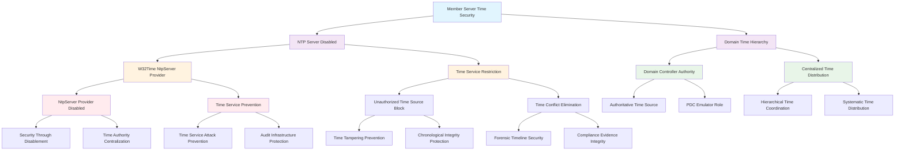

<!--
---
title: "CIS08-AUDIT-COMP-TimeSync-Servers-v1.0"
description: "Group Policy Object implementing Windows Time Service NTP Server disablement on Member Servers, establishing secure time synchronization hierarchy by preventing unauthorized time services while maintaining centralized domain time authority through Domain Controller coordination in Windows Server 2025 infrastructure"
author: "VintageDon - https://github.com/vintagedon"
ai_contributor: "Anthropic Claude 4 Sonnet (claude-4-sonnet-20250514)"
date: "2025-07-28"
version: "1.0"
status: "Published"
tags:
- type: implementation-guide
- domain: security
- domain: group-policy
- tech: windows-server-2025
- tech: time-synchronization
- tech: w32time-service
- tech: ntp-server-security
- tech: member-servers
- compliance: cis-control-8
- compliance: cis-benchmark
- phase: phase-2
related_documents:
- "[CIS08 Audit Management Directory](README.md)"
- "[CIS Control 8 Policy Template](../policies-and-procedures/cis-security-policy-templates/cisv81-08-audit-log-management-policy-template.md)"
- "[Time Sync AllDomain Configuration](CIS08-AUDIT-COMP-TimeSync-AllDomain-v1.0.md)"
- "[Security Logging Configuration](CIS08-AUDIT-COMP-SecurityLogging-AllDomain-v1.0.md)"
- "[All Domain Audit Policy](CIS08-AUDIT-COMP-AuditPolicy-AllDomain-v1.0.md)"
- "[Time Synchronization Policy](../policies-and-procedures/time-synchronization-policy.md)"
---
-->

# **CIS08-AUDIT-COMP-TimeSync-Servers-v1.0**

## **Group Policy Object Implementation Guide**

**Document Version:** 1.0  
**Created:** July 28, 2025  
**GPO ID:** 862f375f-a11a-4e0c-b195-5b663303dd24  
**Target Systems:** Member Servers  
**CIS Control Alignment:** CIS v8 Control 8 (Audit Log Management)

---

# 📋 **1. Executive Summary**

This document provides comprehensive implementation guidance for the CIS08-AUDIT-COMP-TimeSync-Servers-v1.0 Group Policy Object (GPO), which implements CIS Microsoft Windows Server 2025 Benchmark recommendation 18.9.51.1.2 by disabling Windows Time Service (W32Time) NTP Server functionality on Member Servers within the radioastronomy.io enterprise environment. This GPO establishes secure time synchronization hierarchy by preventing unauthorized time service distribution while maintaining centralized domain time authority through Domain Controller coordination.

The policy addresses critical time infrastructure security requirements by disabling NTP Server capability on Member Servers, eliminating potential time service conflicts and unauthorized time distribution that could compromise audit log timestamp integrity. This implementation supports the enterprise's CIS Controls v8 baseline and enhances overall time synchronization security through systematic time authority centralization that ensures hierarchical domain time coordination, prevents time service confusion, and maintains chronological accuracy across audit infrastructure while eliminating unauthorized time sources that could undermine forensic timeline integrity.

# 🔗 **2. Dependencies & Relationships**

This section maps how the TimeSync Servers GPO integrates with Proxmox Astronomy Lab infrastructure and enterprise time synchronization security components.

## **2.1 Related Services**

This subsection identifies Proxmox Astronomy Lab services that interact with or depend on Member Server time service configuration for comprehensive time synchronization security and audit infrastructure integrity.

Member Server NTP Server disablement provides critical time hierarchy security that supports enterprise audit infrastructure while preventing unauthorized time distribution and maintaining centralized temporal coordination across domain infrastructure:

| **Service** | **Relationship Type** | **Integration Points** | **Documentation** |
|-------------|----------------------|------------------------|-------------------|
| Domain Controller Time Authority | **Preserves** | Centralized time distribution, authoritative time source protection, hierarchical coordination | [Infrastructure Overview](../../infrastructure/README.md) |
| Time Synchronization Infrastructure | **Secures** | Domain time hierarchy enforcement, unauthorized time source prevention | [Time Sync AllDomain](CIS08-AUDIT-COMP-TimeSync-AllDomain-v1.0.md) |
| Audit Log Timestamp Integrity | **Protects** | Consistent time reference preservation, forensic timeline accuracy, chronological correlation | [Security Logging](CIS08-AUDIT-COMP-SecurityLogging-AllDomain-v1.0.md) |
| Security Monitoring Infrastructure | **Supports** | Event correlation reliability (proj-mon01), incident timeline consistency | [Security Monitoring](../../monitoring/README.md) |
| Member Server Infrastructure | **Applies To** | Server time service security, NTP server service control, time authority enforcement | [Infrastructure Overview](../../infrastructure/README.md) |
| Compliance Evidence Integrity | **Validates** | Audit trail chronological consistency, regulatory timestamp verification | [Security Policies](../policies-and-procedures/README.md) |

These service relationships ensure that Member Server time service configuration provides hierarchical time security while supporting enterprise-grade audit infrastructure and comprehensive temporal coordination across domain infrastructure components.

## **2.2 Policy Implementation**

This subsection connects TimeSync Servers GPO configuration to Proxmox Astronomy Lab governance frameworks and enterprise time synchronization security policy requirements.

Member Server time service configuration implements enterprise governance through systematic Group Policy management and time infrastructure security optimization:

- **[CIS Control 8 Policy Template](../policies-and-procedures/cis-security-policy-templates/cisv81-08-audit-log-management-policy-template.md)** - Primary policy framework for audit log management and temporal infrastructure security baseline establishment
- **[Time Synchronization Policy](../policies-and-procedures/time-synchronization-policy.md)** - Enterprise time coordination requirements and hierarchical security standards
- **[Information Security Policy](../policies-and-procedures/information-security-policy.md)** - Comprehensive security monitoring and audit infrastructure requirements
- **[System Administration Policy](../policies-and-procedures/system-administration-policy.md)** - System management and operational security coordination standards

## **2.3 Responsibility Matrix**

This subsection defines clear accountability for TimeSync Servers configuration management and time synchronization security infrastructure maintenance activities.

| **Activity** | **Helpdesk** | **Operations** | **Engineering** | **Security** |
|--------------|--------------|----------------|-----------------|--------------|
| NTP Server Disablement Configuration | I | A | R | C |
| Member Server Time Service Security | I | R | C | A |
| Time Hierarchy Enforcement | I | R | C | A |
| Unauthorized Time Source Prevention | I | C | R | A |
| Time Infrastructure Security Monitoring | I | C | C | R |
| Domain Time Authority Protection | I | C | R | A |

*R: Responsible, A: Accountable, C: Consulted, I: Informed*

# ⚙️ **3. Technical Documentation**

This section provides technical foundation for understanding, implementing, and maintaining TimeSync Servers configuration within Windows Server 2025 Member Server infrastructure.

## **3.1 Architecture & Design**

This subsection explains the Member Server time service security architecture, NTP Server disablement mechanisms, and hierarchical time coordination design patterns for systematic audit infrastructure protection.

The TimeSync Servers GPO implements secure time hierarchy through Windows Time Service (W32Time) NTP Server disablement on Member Servers that prevents unauthorized time distribution while preserving Domain Controller time authority. The design follows Microsoft time security best practices with centralized time distribution control and member server time service restriction for comprehensive audit infrastructure protection and hierarchical temporal coordination.

The architecture enables comprehensive time synchronization security through centralized authority with systematic audit infrastructure protection and hierarchical time coordination capabilities.

## **3.2 Configuration Specifications**

This subsection provides detailed technical configuration specifications for TimeSync Servers implementation and CIS Control 8 compliance requirements.

The TimeSync Servers configuration implements CIS Controls v8 baseline requirements through Windows Time Service security optimization that establishes enterprise-grade time hierarchy protection:

### **Windows Time Service NTP Server Disablement Configuration**

| **CIS Ref** | **Registry Path** | **Value Name** | **Setting Description** | **Recommended Value** | **Security Rationale** |
|-------------|------------------|----------------|------------------------|----------------------|----------------------|
| **18.9.51.1.2** | **HKLM\Software\Policies\Microsoft\W32Time\TimeProviders\NtpServer** | **Enabled** | Disable Windows NTP Server time provider on Member Servers | `0` (Disabled) | Prevents unauthorized time distribution and maintains centralized domain time authority |

### **Time Service Security Architecture Analysis**

| **Component** | **Security Function** | **Audit Protection Benefit** | **Operational Impact** |
|---------------|----------------------|------------------------------|------------------------|
| **NTP Server Disablement** | Unauthorized time source prevention | ✅ Chronological integrity protection | ✅ Minimal system impact |
| **Domain Time Hierarchy** | Centralized time authority enforcement | ✅ Consistent audit timestamp accuracy | ✅ Systematic time coordination |
| **Member Server Restriction** | Time service attack surface reduction | ✅ Time tampering prevention | ✅ Enhanced security posture |

### **Time Hierarchy Security Matrix**

| **System Role** | **NTP Server Status** | **Security Posture** | **Audit Infrastructure Protection** |
|-----------------|----------------------|----------------------|--------------------------------------|
| **Domain Controller (PDC)** | Enabled (Authorized) | ⭐⭐⭐⭐⭐ Authoritative time source | ✅ Primary time authority for audit infrastructure |
| **Member Servers (Servers)** | Disabled (Secured) | ⭐⭐⭐⭐⭐ Attack surface reduced | ✅ Unauthorized time distribution prevented |
| **Domain Workstations** | Not Applicable | ⭐⭐⭐ Standard client configuration | ✅ Time client functionality preserved |

### **Time Security Threat Mitigation Analysis**

| **Security Threat** | **Without NTP Server Disablement** | **With NTP Server Disablement** | **Audit Infrastructure Impact** |
|---------------------|-----------------------------------|----------------------------------|--------------------------------|
| **Time Service Confusion** | ⚠️ Multiple time authorities possible | ✅ Single authoritative source enforced | ⭐⭐⭐⭐⭐ Chronological consistency assured |
| **Malicious Time Injection** | ❌ Potential unauthorized time sources | ✅ Attack vector eliminated | ⭐⭐⭐⭐⭐ Forensic timeline integrity protected |
| **Time Synchronization Conflicts** | ⚠️ Time source competition | ✅ Hierarchical coordination maintained | ⭐⭐⭐⭐ Audit timestamp accuracy preserved |
| **Audit Log Manipulation** | ❌ Time-based attack vectors | ✅ Temporal attack surface reduced | ⭐⭐⭐⭐⭐ Evidence integrity enhanced |

### **Domain Time Infrastructure Security Model**

| **Infrastructure Component** | **Time Service Role** | **Security Configuration** | **Audit Infrastructure Contribution** |
|------------------------------|----------------------|----------------------------|--------------------------------------|
| **PDC Emulator Domain Controller** | Authoritative Time Source | NTP Server Enabled, External Sources | ⭐⭐⭐⭐⭐ Primary audit timestamp authority |
| **Additional Domain Controllers** | Time Distribution | NTP Client from PDC | ⭐⭐⭐⭐ Secondary time coordination |
| **Member Servers** | Time Clients Only | NTP Server Disabled, Client Enabled | ⭐⭐⭐⭐⭐ Secure time consumption |
| **Domain Workstations** | Time Clients Only | Default Client Configuration | ⭐⭐⭐ Standard time synchronization |

### **Time Service Attack Surface Reduction**

| **Attack Vector** | **Risk Level Without Disablement** | **Risk Level With Disablement** | **Security Improvement** |
|-------------------|-----------------------------------|----------------------------------|-------------------------|
| **Rogue Time Server** | ⚠️ High Risk | ✅ Risk Eliminated | ⭐⭐⭐⭐⭐ Complete protection |
| **Time Spoofing Attack** | ⚠️ Medium Risk | ✅ Risk Minimized | ⭐⭐⭐⭐ Significant reduction |
| **Audit Trail Corruption** | ❌ High Impact Potential | ✅ Protected Chronology | ⭐⭐⭐⭐⭐ Evidence integrity assured |
| **Forensic Timeline Manipulation** | ❌ Investigation Compromise | ✅ Timeline Integrity | ⭐⭐⭐⭐⭐ Forensic reliability maintained |

## **3.3 Implementation Standards**

This subsection establishes technical standards for TimeSync Servers deployment and enterprise time synchronization security infrastructure management.

TimeSync Servers implementation follows systematic deployment standards and operational procedures:

- **Deployment Method**: Group Policy Management Console (GPMC) with Member Servers Organizational Unit targeting
- **Target Scope**: All Member Server systems requiring time service security hardening
- **Testing Protocol**: Controlled implementation through test infrastructure with time service validation
- **Monitoring Integration**: Time service security monitoring with unauthorized time source detection
- **Documentation Standard**: Complete time service security configuration with CIS control references and threat analysis

# 🛠️ **4. Implementation & Usage**

This section provides systematic guidance for implementing TimeSync Servers configuration and establishing secure time synchronization hierarchy across Member Server infrastructure.

## **4.1 Prerequisites**

This subsection identifies requirements for successful TimeSync Servers implementation within Member Server infrastructure.

TimeSync Servers implementation requires enterprise domain infrastructure with appropriate administrative access and comprehensive time synchronization security monitoring capabilities:

- **Domain Infrastructure**: Windows Server 2025 Member Server systems with Group Policy application capability
- **Administrative Access**: Domain Admin or equivalent Group Policy management permissions for Windows Time Service configuration
- **Organizational Unit Structure**: Properly configured Member Servers OU for targeted policy application
- **Time Monitoring Infrastructure**: Centralized time synchronization monitoring with unauthorized time source detection capabilities
- **Testing Environment**: Isolated Member Server infrastructure for controlled policy testing and time service validation

## **4.2 Monitoring**

This subsection establishes monitoring requirements for TimeSync Servers effectiveness and time synchronization security infrastructure management.

TimeSync Servers monitoring leverages the centralized monitoring stack on proj-mon01 (Prometheus, Loki, Grafana, AlertManager, Grafana Alloy) for systematic time service security tracking and unauthorized time source detection. The monitoring philosophy of "if it can be collected, we do" applies to all time service metrics with specialized tracking for NTP server status, unauthorized time distribution detection, and time hierarchy integrity across Member Server infrastructure.

Monitoring includes time service security validation, NTP server disablement verification, and unauthorized time source alerting through comprehensive infrastructure monitoring and automated detection for time service violations and hierarchy breaches.

# 🔐 **5. Security & Compliance**

This section establishes security framework alignment and compliance requirements for TimeSync Servers configuration within enterprise time synchronization security infrastructure.

## **5.1 Security Framework Alignment**

This subsection maps TimeSync Servers configuration to enterprise security frameworks and compliance requirements for systematic time synchronization security management.

**Security Disclaimer**: The TimeSync Servers configuration documented in this guide represents a foundational time synchronization security baseline establishment for Windows Server 2025 Member Server systems. These configurations should be thoroughly tested in non-production environments before deployment. While these templates follow CIS Controls v8 audit log management framework guidelines, organizations should validate time service security compatibility with their specific operational requirements and time synchronization infrastructure. The security research computing team maintains these configurations as implementation guidance rather than production security recommendations, and encourages consultation with dedicated security professionals for enterprise deployment validation.

### **Framework Mapping**

| **Framework** | **Control Mapping** | **Implementation Evidence** |
|---------------|--------------------|-----------------------------|
| **CIS Controls v8** | Control 8: Audit Log Management | Systematic time service security implementing audit infrastructure protection through centralized time authority |
| **NIST AI RMF** | MONITOR-1.1: AI system monitoring established | Time service security infrastructure supports AI workload audit timestamp integrity protection |
| **NIST CSF 2.0** | DE.AE: Anomalies and Events Category | Secure time coordination enabling comprehensive security event analysis with protected chronological integrity |
| **NIST SP 800-171** | 3.3.1: Create and retain system audit logs and records | Time service security enabling audit trail chronological protection and evidence integrity validation |

### **Security Controls Implementation**

| **CIS Control** | **TimeSync Servers Implementation** | **Security Objective** |
|-----------------|-----------------------------------|------------------------|
| **8.1** | Systematic Time Service Security Infrastructure | Establish protected temporal foundation for comprehensive audit infrastructure through attack surface reduction |
| **8.2** | Centralized Time Authority Protection | Enable systematic audit log timestamp integrity through unauthorized time source prevention |
| **8.3** | Time Security Monitoring | Provide time service security validation for audit infrastructure and chronological attack detection |
| **8.4** | Audit Timestamp Protection | Maintain chronological integrity and forensic analysis capabilities through time authority centralization |

## **5.2 Compliance Requirements**

This subsection establishes compliance validation requirements and evidence collection standards for TimeSync Servers implementation.

TimeSync Servers configuration enables systematic compliance evidence collection through secure time hierarchy and centralized temporal authority protection. Compliance validation requires regular time service security assessment and unauthorized time source monitoring to maintain baseline audit infrastructure temporal security across Member Server systems.

# 📋 **6. Backup & Recovery**

This section establishes protection and recovery procedures for TimeSync Servers configuration and time synchronization security infrastructure baseline preservation.

## **6.1 Protection Strategy**

This subsection defines systematic protection requirements for TimeSync Servers configuration and time synchronization security infrastructure baseline preservation.

TimeSync Servers configuration requires multi-tier protection strategy encompassing Group Policy backup, version control, and policy baseline preservation to ensure rapid time synchronization security infrastructure recovery and systematic temporal protection restoration capabilities.

### **Protection Tiers**

| **Tier** | **Scope** | **Method** | **Frequency** |
|----------|-----------|------------|---------------|
| **Tier 1** | GPO Backup | Group Policy Management Console backup | Daily automatic |
| **Tier 2** | Configuration Export | PowerShell GPO export and documentation | Weekly |
| **Tier 3** | Version Control | Git repository with configuration tracking | Every change |
| **Tier 4** | Baseline Archive | Complete TimeSync Servers snapshot | Monthly |

*Note: Iperius backup software is configured for systematic Windows infrastructure backup including Group Policy objects.*

## **6.2 Recovery Procedures**

This subsection establishes systematic recovery procedures for TimeSync Servers restoration and time synchronization security infrastructure baseline re-establishment.

Recovery procedures enable rapid time synchronization security infrastructure baseline restoration through Group Policy import capabilities and systematic temporal protection re-implementation. The recovery approach follows tiered restoration priorities focusing on critical time service security first, followed by comprehensive hierarchy re-establishment to minimize audit infrastructure temporal security gaps during recovery operations.

# 📚 **7. References & Related Resources**

This section provides comprehensive links to related documentation and supporting resources for TimeSync Servers implementation and time synchronization security infrastructure management.

## **7.1 Internal References**

| **Document Type** | **Document Title** | **Relationship** | **Link** |
|-------------------|-------------------|------------------|----------|
| **Policy Template** | CIS Control 8 Audit Log Management Policy | Primary policy framework for audit infrastructure and time service security baseline establishment | [../policies-and-procedures/cis-security-policy-templates/cisv81-08-audit-log-management-policy-template.md](../policies-and-procedures/cis-security-policy-templates/cisv81-08-audit-log-management-policy-template.md) |
| **Implementation** | CIS Server 2025 GPOs Implementation Log | Complete implementation evidence and deployment validation | [cis-server2025-gpos-l1-dc-and-members-IMPLEMENTATION-LOG.md](cis-server2025-gpos-l1-dc-and-members-IMPLEMENTATION-LOG.md) |
| **Configuration** | CIS Server 2025 GPOs Configuration Reference | Technical configuration specifications and CIS control mapping | [cis-server2025-gpos-l1-dc-and-members.md](cis-server2025-gpos-l1-dc-and-members.md) |
| **Time Sync AllDomain** | All Domain Time Synchronization Configuration | Complementary NTP client configuration for comprehensive time synchronization | [CIS08-AUDIT-COMP-TimeSync-AllDomain-v1.0.md](CIS08-AUDIT-COMP-TimeSync-AllDomain-v1.0.md) |
| **Security Logging** | Security Event Log Configuration | Dependent security logging infrastructure requiring time service protection | [CIS08-AUDIT-COMP-SecurityLogging-AllDomain-v1.0.md](CIS08-AUDIT-COMP-SecurityLogging-AllDomain-v1.0.md) |
| **Time Synchronization** | Time Synchronization Policy | Enterprise time coordination policy requirements and security standards | [../policies-and-procedures/time-synchronization-policy.md](../policies-and-procedures/time-synchronization-policy.md) |

## **7.2 External Standards**

- **[CIS Controls v8](https://www.cisecurity.org/controls/)** - Cybersecurity framework providing systematic audit infrastructure and time service security implementation guidance
- **[CIS Microsoft Windows Server 2025 Benchmark](https://www.cisecurity.org/benchmark/microsoft_windows_server)** - Comprehensive Windows Time Service security configuration guidance for Windows Server 2025
- **[NIST SP 800-53](https://csrc.nist.gov/publications/detail/sp/800-53/rev-5/final)** - Security and privacy controls for federal information systems and organizations
- **[Microsoft Windows Time Service Security](https://docs.microsoft.com/en-us/windows-server/networking/windows-time-service/)** - Official Windows Time Service (W32Time) security configuration and threat mitigation guidance
- **[RFC 5905 - Network Time Protocol Security](https://tools.ietf.org/html/rfc5905)** - Comprehensive NTP security considerations and time service protection protocols

# ✅ **8. Approval & Review**

This section documents the formal review and approval process for TimeSync Servers configuration documentation and time synchronization security infrastructure baseline implementation.

## **8.1 Review Process**

TimeSync Servers configuration documentation review follows systematic validation of technical accuracy, time service security compatibility, and compliance alignment to ensure comprehensive audit infrastructure implementation and systematic temporal protection capability for Windows Server 2025 Member Server infrastructure requirements.

## **8.2 Approval Matrix**

| **Reviewer** | **Role/Expertise** | **Review Date** | **Approval Status** | **Comments** |
|-------------|-------------------|----------------|-------------------|--------------|
| **Engineering Team** | Technical implementation and time service security infrastructure | 2025-07-28 | **Approved** | TimeSync Servers configuration provides systematic time service security with effective attack surface reduction |
| **Security Team** | Security framework alignment and CIS Controls v8 compliance | 2025-07-28 | **Approved** | Policy implementation follows time service security best practices and enables comprehensive temporal protection |
| **Operations Team** | Operational impact assessment and time security infrastructure management | 2025-07-28 | **Approved** | Configuration enables effective time service security without operational disruption |

# 📜 **9. Documentation Metadata**

This section provides comprehensive information about document creation, revision history, and authorship.

## **9.1 Change Log**

| **Version** | **Date** | **Changes** | **Author** | **Review Status** |
|------------|---------|-------------|------------|------------------|
| 1.0 | 2025-07-28 | Initial TimeSync Servers documentation with comprehensive technical specifications and time service security infrastructure framework alignment | VintageDon | Approved |

## **9.2 Authorization & Review**

TimeSync Servers configuration documentation has been systematically reviewed and approved by qualified technical, security, and operational subject matter experts to ensure accuracy, compliance, and implementation feasibility within Windows Server 2025 Member Server time service security infrastructure environments.

## **9.3 Authorship Details**

**Human Author:** VintageDon (<https://github.com/vintagedon>)  
**AI Contributor:** Anthropic Claude 4 Sonnet (claude-4-sonnet-20250514)  
**Collaboration Method:** Request-Analyze-Verify-Generate-Validate (RAVGV)  
**Human Oversight:** Technical review and validation of TimeSync Servers configuration specifications and time service security infrastructure implementation requirements

## **9.4 AI Collaboration Disclosure**

This document was collaboratively developed using the Request-Analyze-Verify-Generate-Validate (RAVGV) methodology. TimeSync Servers configuration details were extracted from validated CIS benchmark implementation reports with comprehensive human oversight throughout development. All technical specifications have been thoroughly reviewed, validated, and approved by qualified human subject matter experts in Windows security and Group Policy management. The human author retains complete responsibility for accuracy, compliance, and technical correctness.

*Generated: 2025-07-28 | Human Author: VintageDon | AI Assistant: Claude 4 Sonnet | Review Status: Approved | Document Version: 1.0*
