<!--
---
title: "CIS10-MAL-COMP-WindowsDefender-AllDomain-v1.0"
description: "Group Policy Object implementing comprehensive Microsoft Defender Antivirus and Exploit Guard configuration across all domain computers, establishing enterprise malware defense through real-time protection, advanced scanning capabilities, Attack Surface Reduction rules, and network protection to provide systematic threat detection and prevention in Windows Server 2025 infrastructure"
author: "VintageDon - https://github.com/vintagedon"
ai_contributor: "Anthropic Claude 4 Sonnet (claude-4-sonnet-20250514)"
date: "2025-07-28"
version: "1.0"
status: "Published"
tags:
- type: implementation-guide
- domain: security
- domain: group-policy
- tech: windows-server-2025
- tech: microsoft-defender
- tech: antivirus-protection
- tech: exploit-guard
- tech: attack-surface-reduction
- tech: network-protection
- compliance: cis-control-10
- compliance: cis-benchmark
- phase: phase-2
related_documents:
- "[CIS10 Malware Defenses Directory](README.md)"
- "[CIS Control 10 Policy Template](../policies-and-procedures/cis-security-policy-templates/cisv81-10-malware-defenses-policy-template.md)"
- "[Security Monitoring Infrastructure](../../monitoring/README.md)"
- "[Incident Response Policy](../policies-and-procedures/incident-response-policy.md)"
- "[Malware Defense Policy](../policies-and-procedures/malware-defense-policy.md)"
---
-->

# **CIS10-MAL-COMP-WindowsDefender-AllDomain-v1.0**

## **Group Policy Object Implementation Guide**

**Document Version:** 1.0  
**Created:** July 28, 2025  
**GPO ID:** Not specified in implementation log  
**Target Systems:** All Domain Computers  
**CIS Control Alignment:** CIS v8 Control 10 (Malware Defenses)

---

# 📋 **1. Executive Summary**

This document provides comprehensive implementation guidance for the CIS10-MAL-COMP-WindowsDefender-AllDomain-v1.0 Group Policy Object (GPO), which configures Microsoft Defender Antivirus and Exploit Guard settings across all domain-joined computers in the radioastronomy.io enterprise environment. This GPO implements CIS Microsoft Windows Server 2025 Benchmark recommendations including 18.10.43.10.2, 18.10.43.10.3, 18.10.43.10.4, 18.10.43.13.2, 18.10.43.13.3, 18.10.43.13.5, 18.10.43.16, 18.10.43.6.1.1, 18.10.43.6.1.2, 18.10.43.6.3.1, and 18.10.43.7.1, establishing enterprise-grade malware defense through comprehensive real-time protection, advanced scanning capabilities, Attack Surface Reduction (ASR) rules, and network protection mechanisms.

The policy addresses critical cybersecurity requirements by implementing systematic malware detection and prevention across domain infrastructure, enabling real-time threat monitoring, behavioral analysis, and advanced attack prevention capabilities. This implementation supports the enterprise's CIS Controls v8 baseline and significantly enhances overall security posture through Microsoft Defender's integrated threat protection platform that provides comprehensive malware defense, exploit prevention, and network security monitoring capabilities essential for protecting the scientific computing environment and research data integrity throughout domain infrastructure.

# 🔗 **2. Dependencies & Relationships**

This section maps how the Windows Defender AllDomain GPO integrates with Proxmox Astronomy Lab infrastructure and enterprise malware defense components.

## **2.1 Related Services**

This subsection identifies Proxmox Astronomy Lab services that interact with or depend on Microsoft Defender configuration for comprehensive malware protection and threat detection.

Windows Defender configuration provides critical malware defense infrastructure that supports enterprise security operations while enabling systematic threat detection and incident response across domain infrastructure:

| **Service** | **Relationship Type** | **Integration Points** | **Documentation** |
|-------------|----------------------|------------------------|-------------------|
| Centralized Security Monitoring | **Fed By** | Defender threat alerts, malware detection events (proj-mon01), security correlation | [Security Monitoring](../../monitoring/README.md) |
| Incident Response Operations | **Triggers** | Malware detection workflows, threat containment procedures, forensic analysis | [Incident Response](../../security/README.md) |
| Research Computing Infrastructure | **Protects** | AI/ML workloads, scientific data processing, DESI analysis pipelines | [AI Infrastructure](../../ai/README.md) |
| File Storage and Data Management | **Secures** | Network file shares, data repositories, research datasets | [Infrastructure Overview](../../infrastructure/README.md) |
| Email and Communication Systems | **Scans** | Email attachment protection, communication security, data exchange | [Infrastructure Overview](../../infrastructure/README.md) |
| Network Infrastructure | **Monitors** | Network traffic analysis, malicious website blocking, lateral movement prevention | [Monitoring Infrastructure](../../monitoring/README.md) |

These service relationships ensure that Microsoft Defender configuration provides comprehensive malware protection while supporting enterprise-grade threat detection and incident response across domain infrastructure components.

## **2.2 Policy Implementation**

This subsection connects Windows Defender AllDomain GPO configuration to Proxmox Astronomy Lab governance frameworks and enterprise malware defense policy requirements.

Windows Defender configuration implements enterprise governance through systematic Group Policy management and malware defense optimization:

- **[CIS Control 10 Policy Template](../policies-and-procedures/cis-security-policy-templates/cisv81-10-malware-defenses-policy-template.md)** - Primary policy framework for malware defense and threat protection baseline establishment
- **[Malware Defense Policy](../policies-and-procedures/malware-defense-policy.md)** - Enterprise malware protection requirements and threat response standards
- **[Information Security Policy](../policies-and-procedures/information-security-policy.md)** - Comprehensive security protection and threat management requirements
- **[Incident Response Policy](../policies-and-procedures/incident-response-policy.md)** - Security incident detection and response coordination standards

## **2.3 Responsibility Matrix**

This subsection defines clear accountability for Windows Defender AllDomain configuration management and malware defense infrastructure maintenance activities.

| **Activity** | **Helpdesk** | **Operations** | **Engineering** | **Security** |
|--------------|--------------|----------------|-----------------|--------------|
| Defender Configuration Management | I | A | R | C |
| Malware Detection Response | I | C | C | R |
| Attack Surface Reduction Management | I | C | R | A |
| Network Protection Monitoring | I | C | R | A |
| Threat Intelligence Integration | I | C | C | R |
| Malware Incident Coordination | C | R | C | A |

*R: Responsible, A: Accountable, C: Consulted, I: Informed*

# ⚙️ **3. Technical Documentation**

This section provides technical foundation for understanding, implementing, and maintaining Windows Defender AllDomain configuration within Windows Server 2025 infrastructure.

## **3.1 Architecture & Design**

This subsection explains the Microsoft Defender architecture, comprehensive protection mechanisms, and threat detection design patterns for systematic malware defense optimization.

The Windows Defender AllDomain GPO implements comprehensive malware protection through Microsoft Defender Antivirus and Exploit Guard configuration that establishes multi-layered threat detection and prevention capabilities. The design follows Microsoft security best practices with real-time protection, behavioral monitoring, Attack Surface Reduction rules, and network protection for comprehensive enterprise threat defense and systematic malware prevention.

```mermaid
graph TD
    A[Microsoft Defender Configuration] --> B[Antivirus Protection]
    A --> C[Exploit Guard]
    A --> D[Network Protection]
    
    B --> E[Real-Time Protection]
    B --> F[Scan Configuration]
    B --> G[PUA Detection]
    
    C --> H[Attack Surface Reduction]
    C --> I[Behavioral Monitoring]
    
    D --> J[Network Traffic Analysis]
    D --> K[Malicious Website Blocking]
    
    E --> L[File System Monitoring]
    E --> M[Download Protection]
    E --> N[Email Scanning]
    
    F --> O[Packed Executable Scanning]
    F --> P[Removable Drive Protection]
    F --> Q[Comprehensive File Analysis]
    
    G --> R[Potentially Unwanted Apps Block]
    G --> S[Software Reputation Analysis]
    
    H --> T[12 ASR Rules Enabled]
    H --> U[Attack Vector Prevention]
    
    I --> V[Process Behavior Analysis]
    I --> W[Anomaly Detection]
    
    J --> X[Traffic Inspection]
    J --> Y[Threat Intelligence Integration]
    
    K --> Z[URL Reputation Blocking]
    K --> AA[Phishing Protection]
    
    style A fill:#e1f5fe
    style B fill:#f3e5f5
    style C fill:#f3e5f5
    style D fill:#f3e5f5
    style E fill:#fff3e0
    style F fill:#fff3e0
    style G fill:#fff3e0
    style H fill:#e8f5e8
    style I fill:#e8f5e8
    style J fill:#ffebee
    style K fill:#ffebee
```

The architecture enables comprehensive malware defense through multi-layered protection with systematic threat detection and prevention capabilities across enterprise infrastructure.

## **3.2 Configuration Specifications**

This subsection provides detailed technical configuration specifications for Windows Defender AllDomain implementation and CIS Control 10 compliance requirements.

The Windows Defender AllDomain configuration implements CIS Controls v8 baseline requirements through Microsoft Defender optimization that establishes enterprise-grade malware defense infrastructure:

### **Real-Time Protection Configuration**

| **CIS Ref** | **Configuration Setting** | **Setting Description** | **Recommended Value** | **Threat Protection Benefit** |
|-------------|--------------------------|------------------------|----------------------|------------------------------|
| **18.10.43.10.2** | Scan Downloaded Files | Scan all downloaded files and attachments | `Enabled` | Prevents malware delivery through downloads and email attachments |
| **18.10.43.10.3** | Real-Time Protection | Turn off real-time protection | `Disabled` | Ensures continuous malware monitoring and threat detection |
| **18.10.43.10.4** | Behavior Monitoring | Turn on behavior monitoring | `Enabled` | Enables advanced threat detection through behavioral analysis |

### **Scan Configuration Settings**

| **CIS Ref** | **Configuration Setting** | **Setting Description** | **Recommended Value** | **Threat Protection Benefit** |
|-------------|--------------------------|------------------------|----------------------|------------------------------|
| **18.10.43.13.2** | Packed Executables | Scan packed executables | `Enabled` | Detects malware hidden in compressed/obfuscated executables |
| **18.10.43.13.3** | Removable Drives | Scan removable drives | `Enabled` | Prevents malware spread through USB devices and external storage |
| **18.10.43.13.5** | Email Scanning | Turn on e-mail scanning | `Enabled` | Protects against email-borne malware and phishing attacks |

### **Advanced Protection Features**

| **CIS Ref** | **Configuration Setting** | **Setting Description** | **Recommended Value** | **Threat Protection Benefit** |
|-------------|--------------------------|------------------------|----------------------|------------------------------|
| **18.10.43.16** | PUA Detection | Configure detection for potentially unwanted applications | `Enabled: Block` | Blocks potentially unwanted applications and suspicious software |
| **18.10.43.7.1** | File Hash Computation | Enable file hash computation feature | `Enabled` | Enhances threat intelligence and malware analysis capabilities |

### **Attack Surface Reduction (ASR) Configuration**

| **CIS Ref** | **Configuration Setting** | **Setting Description** | **Recommended Value** | **Attack Prevention Capability** |
|-------------|--------------------------|------------------------|----------------------|----------------------------------|
| **18.10.43.6.1.1** | ASR Rules Configuration | Configure Attack Surface Reduction rules | `Enabled` | Enables systematic attack vector prevention |
| **18.10.43.6.1.2** | ASR Rules Implementation | Configure all recommended ASR rules to Block (1) | `12 GUID rules set to value 1` | Comprehensive attack surface reduction across multiple vectors |

### **Network Protection Configuration**

| **CIS Ref** | **Configuration Setting** | **Setting Description** | **Recommended Value** | **Network Security Benefit** |
|-------------|--------------------------|------------------------|----------------------|------------------------------|
| **18.10.43.6.3.1** | Network Protection | Prevent users and apps from accessing dangerous websites | `Enabled: Block` | Blocks access to malicious websites and prevents network-based attacks |

### **Threat Detection Capability Matrix**

| **Protection Layer** | **Threat Types Addressed** | **Detection Method** | **Prevention Effectiveness** |
|----------------------|---------------------------|---------------------|----------------------------|
| **Real-Time Protection** | File-based malware, trojans, viruses | ✅ Signature + heuristic analysis | ⭐⭐⭐⭐⭐ Maximum effectiveness |
| **Behavioral Monitoring** | Zero-day attacks, advanced persistent threats | ✅ Behavioral pattern analysis | ⭐⭐⭐⭐⭐ Advanced threat detection |
| **Download Protection** | Drive-by downloads, malicious attachments | ✅ Real-time file scanning | ⭐⭐⭐⭐⭐ Download vector protection |
| **Email Scanning** | Email malware, phishing attachments | ✅ Email content analysis | ⭐⭐⭐⭐ Email security |
| **ASR Rules** | Exploit techniques, living-off-the-land attacks | ✅ Attack technique prevention | ⭐⭐⭐⭐⭐ Exploit prevention |
| **Network Protection** | Web-based threats, malicious domains | ✅ URL reputation analysis | ⭐⭐⭐⭐ Network security |

### **Attack Surface Reduction Rules Analysis**

The ASR implementation includes 12 critical rules targeting specific attack vectors:

| **ASR Rule Category** | **Attack Vectors Prevented** | **Business Impact Protection** |
|----------------------|------------------------------|-------------------------------|
| **Office Application Protection** | Macro-based attacks, Office exploits | ✅ Document security, productivity protection |
| **Script and PowerShell Protection** | Script-based attacks, PowerShell abuse | ✅ Administrative tool security |
| **Email Protection** | Email-based attack vectors | ✅ Communication security |
| **USB and Removable Media** | Physical media attacks | ✅ Data transfer security |
| **Network Share Protection** | Lateral movement prevention | ✅ Infrastructure security |
| **Process Injection Prevention** | Advanced malware techniques | ✅ System integrity protection |

### **Performance and Operational Impact Analysis**

| **Protection Feature** | **System Resource Impact** | **User Experience Impact** | **Security Value** |
|------------------------|---------------------------|----------------------------|-------------------|
| **Real-Time Protection** | ⚠️ Moderate CPU usage | ✅ Transparent operation | ⭐⭐⭐⭐⭐ Critical |
| **Behavioral Monitoring** | ⚠️ Memory and CPU overhead | ✅ Minimal user impact | ⭐⭐⭐⭐⭐ Essential |
| **Email Scanning** | ⚠️ Email processing delay | ⚠️ Slight email latency | ⭐⭐⭐⭐ Important |
| **ASR Rules** | ✅ Minimal resource usage | ⚠️ May block legitimate activities | ⭐⭐⭐⭐⭐ Maximum |
| **Network Protection** | ✅ Low overhead | ⚠️ May block legitimate websites | ⭐⭐⭐⭐ High |

## **3.3 Implementation Standards**

This subsection establishes technical standards for Windows Defender AllDomain deployment and enterprise malware defense infrastructure management.

Windows Defender AllDomain implementation follows systematic deployment standards and operational procedures:

- **Deployment Method**: Group Policy Management Console (GPMC) with All Domain Computers targeting
- **Target Scope**: All domain-joined systems requiring comprehensive malware protection
- **Testing Protocol**: Controlled implementation through test infrastructure with malware detection validation
- **Monitoring Integration**: Defender event collection with centralized threat correlation and incident response
- **Documentation Standard**: Complete malware defense configuration with CIS control references and threat analysis

# 🛠️ **4. Implementation & Usage**

This section provides systematic guidance for implementing Windows Defender AllDomain configuration and establishing comprehensive malware defense across domain infrastructure.

## **4.1 Prerequisites**

This subsection identifies requirements for successful Windows Defender AllDomain implementation within domain infrastructure.

Windows Defender AllDomain implementation requires enterprise domain infrastructure with appropriate administrative access and comprehensive security monitoring capabilities:

- **Domain Infrastructure**: Windows Server 2025 domain-joined systems with Group Policy application capability
- **Administrative Access**: Domain Admin or equivalent Group Policy management permissions for Microsoft Defender configuration
- **Security Monitoring Infrastructure**: Centralized threat detection system with Defender event correlation capabilities
- **Testing Environment**: Isolated domain infrastructure for controlled policy testing and malware defense validation
- **Update Infrastructure**: Windows Update services or WSUS for Defender signature and engine updates

## **4.2 Monitoring**

This subsection establishes monitoring requirements for Windows Defender AllDomain effectiveness and malware defense infrastructure management.

Windows Defender AllDomain monitoring leverages the centralized monitoring stack on proj-mon01 (Prometheus, Loki, Grafana, AlertManager, Grafana Alloy) for systematic threat detection tracking and malware defense analysis. The monitoring philosophy of "if it can be collected, we do" applies to all Defender security events with specialized tracking for malware detection, threat prevention, and attack surface reduction effectiveness across domain infrastructure.

Monitoring includes malware detection analysis, threat prevention effectiveness, ASR rule performance, and network protection blocking through comprehensive security monitoring infrastructure and automated alerting for critical malware incidents and advanced threat detection events.

# 🔐 **5. Security & Compliance**

This section establishes security framework alignment and compliance requirements for Windows Defender AllDomain configuration within enterprise malware defense infrastructure.

## **5.1 Security Framework Alignment**

This subsection maps Windows Defender AllDomain configuration to enterprise security frameworks and compliance requirements for systematic malware defense management.

**Security Disclaimer**: The Windows Defender AllDomain configuration documented in this guide represents a comprehensive malware defense baseline establishment for Windows Server 2025 systems. These configurations should be thoroughly tested in non-production environments before deployment. While these templates follow CIS Controls v8 malware defense framework guidelines, organizations should validate Defender configuration compatibility with their specific application requirements and operational workflows. The security research computing team maintains these configurations as implementation guidance rather than production security recommendations, and encourages consultation with dedicated security professionals for enterprise deployment validation.

### **Framework Mapping**

| **Framework** | **Control Mapping** | **Implementation Evidence** |
|---------------|--------------------|-----------------------------|
| **CIS Controls v8** | Control 10: Malware Defenses | Comprehensive Microsoft Defender implementation providing systematic malware detection and prevention capabilities |
| **NIST AI RMF** | GOVERN-1.1: AI system risk management established | Malware defense infrastructure supports AI workload protection and research data security |
| **NIST CSF 2.0** | PR.DS: Data Security Category | Systematic malware protection enabling comprehensive data integrity and availability assurance |
| **NIST SP 800-171** | 3.14.1: Identify, report, and correct information and information system flaws | Comprehensive malware detection and threat identification enabling systematic security flaw management |

### **Security Controls Implementation**

| **CIS Control** | **Windows Defender AllDomain Implementation** | **Security Objective** |
|-----------------|---------------------------------------------|------------------------|
| **10.1** | Comprehensive Malware Detection Infrastructure | Establish systematic malware detection and prevention across enterprise infrastructure |
| **10.2** | Real-Time Threat Monitoring | Enable continuous malware monitoring and immediate threat response capabilities |
| **10.3** | Advanced Threat Prevention | Provide Attack Surface Reduction and behavioral analysis for sophisticated threat prevention |
| **10.4** | Network-Based Malware Protection | Maintain network security through malicious website blocking and traffic analysis |

## **5.2 Compliance Requirements**

This subsection establishes compliance validation requirements and evidence collection standards for Windows Defender AllDomain implementation.

Windows Defender AllDomain configuration enables systematic compliance evidence collection through comprehensive malware defense and centralized threat detection management. Compliance validation requires regular malware protection effectiveness assessment and threat prevention monitoring to maintain baseline security posture across domain systems.

# 📋 **6. Backup & Recovery**

This section establishes protection and recovery procedures for Windows Defender AllDomain configuration and malware defense infrastructure baseline preservation.

## **6.1 Protection Strategy**

This subsection defines systematic protection requirements for Windows Defender AllDomain configuration and malware defense infrastructure baseline preservation.

Windows Defender AllDomain configuration requires multi-tier protection strategy encompassing Group Policy backup, version control, and policy baseline preservation to ensure rapid malware defense infrastructure recovery and systematic threat protection restoration capabilities.

### **Protection Tiers**

| **Tier** | **Scope** | **Method** | **Frequency** |
|----------|-----------|------------|---------------|
| **Tier 1** | GPO Backup | Group Policy Management Console backup | Daily automatic |
| **Tier 2** | Configuration Export | PowerShell GPO export and documentation | Weekly |
| **Tier 3** | Version Control | Git repository with configuration tracking | Every change |
| **Tier 4** | Baseline Archive | Complete Windows Defender AllDomain snapshot | Monthly |

*Note: Iperius backup software is configured for systematic Windows infrastructure backup including Group Policy objects.*

## **6.2 Recovery Procedures**

This subsection establishes systematic recovery procedures for Windows Defender AllDomain restoration and malware defense infrastructure baseline re-establishment.

Recovery procedures enable rapid malware defense infrastructure baseline restoration through Group Policy import capabilities and systematic threat protection re-implementation. The recovery approach follows tiered restoration priorities focusing on critical malware protection first, followed by comprehensive threat defense re-establishment to minimize security gaps during recovery operations.

# 📚 **7. References & Related Resources**

This section provides comprehensive links to related documentation and supporting resources for Windows Defender AllDomain implementation and malware defense infrastructure management.

## **7.1 Internal References**

| **Document Type** | **Document Title** | **Relationship** | **Link** |
|-------------------|-------------------|------------------|----------|
| **Policy Template** | CIS Control 10 Malware Defenses Policy | Primary policy framework for malware defense baseline establishment | [../policies-and-procedures/cis-security-policy-templates/cisv81-10-malware-defenses-policy-template.md](../policies-and-procedures/cis-security-policy-templates/cisv81-10-malware-defenses-policy-template.md) |
| **Implementation** | CIS Server 2025 GPOs Implementation Log | Complete implementation evidence and deployment validation | [cis-server2025-gpos-l1-dc-and-members-IMPLEMENTATION-LOG.md](cis-server2025-gpos-l1-dc-and-members-IMPLEMENTATION-LOG.md) |
| **Configuration** | CIS Server 2025 GPOs Configuration Reference | Technical configuration specifications and CIS control mapping | [cis-server2025-gpos-l1-dc-and-members.md](cis-server2025-gpos-l1-dc-and-members.md) |
| **Security Monitoring** | Centralized Security Monitoring Infrastructure | Defender event collection and threat correlation integration | [../../monitoring/README.md](../../monitoring/README.md) |
| **Incident Response** | Security Incident Response Procedures | Malware incident detection and response coordination | [../policies-and-procedures/incident-response-policy.md](../policies-and-procedures/incident-response-policy.md) |
| **Malware Defense** | Enterprise Malware Defense Policy | Comprehensive malware protection policy requirements and threat response standards | [../policies-and-procedures/malware-defense-policy.md](../policies-and-procedures/malware-defense-policy.md) |

## **7.2 External Standards**

- **[CIS Controls v8](https://www.cisecurity.org/controls/)** - Cybersecurity framework providing systematic malware defense implementation guidance
- **[CIS Microsoft Windows Server 2025 Benchmark](https://www.cisecurity.org/benchmark/microsoft_windows_server)** - Comprehensive Microsoft Defender configuration guidance for Windows Server 2025
- **[NIST SP 800-53](https://csrc.nist.gov/publications/detail/sp/800-53/rev-5/final)** - Security and privacy controls for federal information systems and organizations
- **[Microsoft Defender Antivirus Documentation](https://docs.microsoft.com/en-us/windows/security/threat-protection/microsoft-defender-antivirus/)** - Official Microsoft Defender configuration and management guidance
- **[Microsoft Defender for Endpoint](https://docs.microsoft.com/en-us/windows/security/threat-protection/microsoft-defender-atp/)** - Advanced threat protection and enterprise security management strategies

# ✅ **8. Approval & Review**

This section documents the formal review and approval process for Windows Defender AllDomain configuration documentation and malware defense infrastructure baseline implementation.

## **8.1 Review Process**

Windows Defender AllDomain configuration documentation review follows systematic validation of technical accuracy, threat protection effectiveness, and compliance alignment to ensure comprehensive malware defense implementation and systematic threat detection capability for Windows Server 2025 domain infrastructure requirements.

## **8.2 Approval Matrix**

| **Reviewer** | **Role/Expertise** | **Review Date** | **Approval Status** | **Comments** |
|-------------|-------------------|----------------|-------------------|--------------|
| **Engineering Team** | Technical implementation and malware defense infrastructure | 2025-07-28 | **Approved** | Windows Defender configuration provides comprehensive malware protection with advanced threat detection capabilities |
| **Security Team** | Security framework alignment and CIS Controls v8 compliance | 2025-07-28 | **Approved** | Policy implementation follows malware defense best practices and enables systematic threat protection |
| **Operations Team** | Operational impact assessment and security infrastructure management | 2025-07-28 | **Approved** | Configuration enables effective malware defense without significant operational disruption |

# 📜 **9. Documentation Metadata**

This section provides comprehensive information about document creation, revision history, and authorship.

## **9.1 Change Log**

| **Version** | **Date** | **Changes** | **Author** | **Review Status** |
|------------|---------|-------------|------------|------------------|
| 1.0 | 2025-07-28 | Initial Windows Defender AllDomain documentation with comprehensive technical specifications and malware defense infrastructure framework alignment | VintageDon | Approved |

## **9.2 Authorization & Review**

Windows Defender AllDomain configuration documentation has been systematically reviewed and approved by qualified technical, security, and operational subject matter experts to ensure accuracy, compliance, and implementation feasibility within Windows Server 2025 domain malware defense infrastructure environments.

## **9.3 Authorship Details**

**Human Author:** VintageDon (<https://github.com/vintagedon>)  
**AI Contributor:** Anthropic Claude 4 Sonnet (claude-4-sonnet-20250514)  
**Collaboration Method:** Request-Analyze-Verify-Generate-Validate (RAVGV)  
**Human Oversight:** Technical review and validation of Windows Defender AllDomain configuration specifications and malware defense infrastructure implementation requirements

## **9.4 AI Collaboration Disclosure**

This document was collaboratively developed using the Request-Analyze-Verify-Generate-Validate (RAVGV) methodology. Windows Defender AllDomain configuration details were extracted from validated CIS benchmark implementation reports with comprehensive human oversight throughout development. All technical specifications have been thoroughly reviewed, validated, and approved by qualified human subject matter experts in Windows security and Group Policy management. The human author retains complete responsibility for accuracy, compliance, and technical correctness.

*Generated: 2025-07-28 | Human Author: VintageDon | AI Assistant: Claude 4 Sonnet | Review Status: Approved | Document Version: 1.0*
