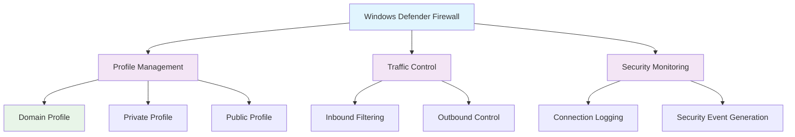

<!--
---
title: "CIS12-NET-COMP-Firewall-AllDomain-v1.0"
description: "Group Policy Object implementing Windows Defender Firewall security configuration for all domain-joined computers, enabling firewall state and logging for all network profiles to enhance network infrastructure protection and security monitoring"
author: "VintageDon - https://github.com/vintagedon"
ai_contributor: "Anthropic Claude 4 Sonnet (claude-4-sonnet-20250514)"
date: "2025-07-28"
version: "1.0"
status: "Published"
tags:
- type: implementation-guide
- domain: security
- domain: group-policy
- tech: windows-server-2025
- tech: windows-defender-firewall
- compliance: cis-control-12
- compliance: cis-benchmark
- phase: phase-2
related_documents:
- "[CIS12 Network Infrastructure Directory](README.md)"
- "[CIS Control 12 Policy Template](../../policies-and-procedures/cis-security-policy-templates/cisv81-12-network-infrastructure-management-policy-template.md)"
- "[Implementation Log](cis-server2025-gpos-l1-dc-and-members-IMPLEMENTATION-LOG.md)"
- "[Technical Reference](cis-server2025-gpos-l1-dc-and-members.md)"
---
-->

# 🔒 **CIS12-NET-COMP-Firewall-AllDomain-v1.0**

## **Windows Defender Firewall Security Configuration**

**Document Version:** 1.0  
**Created:** July 28, 2025  
**GPO Type:** Computer Configuration  
**Target Systems:** All Domain-Joined Computers  
**CIS Control Alignment:** CIS v8 Control 12 (Network Infrastructure Management)

---

# 📋 **1. Implementation Overview**

This Group Policy Object implements Windows Defender Firewall security configuration for all domain-joined computers within the Proxmox Astronomy Lab enterprise environment. The GPO enables firewall state and logging for all network profiles (Domain, Private, Public) to provide comprehensive network traffic filtering, enhance security monitoring capabilities, and maintain consistent firewall protection across diverse network environments and connection scenarios.

The configuration addresses fundamental network security requirements by ensuring Windows Defender Firewall is enabled across all network profiles, implementing comprehensive logging for security analysis, and providing systematic network traffic control essential for network infrastructure protection, threat detection, and security incident response across the domain infrastructure.

# 🔗 **2. Dependencies & Relationships**

This section maps how the Windows Defender Firewall GPO integrates with Proxmox Astronomy Lab network security infrastructure and perimeter defense components.

## **2.1 Related Services**

| **Service** | **Relationship Type** | **Integration Points** | **Documentation** |
|-------------|----------------------|------------------------|-------------------|
| Network Security Infrastructure | **Protects** | Perimeter defense, traffic filtering, network segmentation | [Network Security](../../../infrastructure/networking/README.md) |
| Security Monitoring Infrastructure | **Feeds** | Firewall logs, traffic analysis, security event correlation | [Security Monitoring](../../../monitoring/README.md) |
| Network Access Control | **Enforces** | Connection restrictions, traffic control, security policy implementation | [Access Control](../../../infrastructure/access-control/README.md) |
| Intrusion Detection Systems | **Coordinates** | Network threat detection, traffic analysis, security alerting | [Intrusion Detection](../../../infrastructure/intrusion-detection/README.md) |

## **2.2 Policy Implementation**

Windows Defender Firewall security policies implement enterprise network defense governance through systematic Group Policy management and perimeter protection:

- **[CIS Control 12 Policy Template](../../policies-and-procedures/cis-security-policy-templates/cisv81-12-network-infrastructure-management-policy-template.md)** - Network infrastructure management framework
- **[Firewall Security Policy](../../policies-and-procedures/firewall-security-policy.md)** - Firewall configuration and traffic control requirements
- **[Network Defense Policy](../../policies-and-procedures/network-defense-policy.md)** - Perimeter security and traffic filtering standards

## **2.3 Responsibility Matrix**

| **Activity** | **Helpdesk** | **Operations** | **Engineering** | **Security** |
|--------------|--------------|----------------|-----------------|--------------|
| Firewall Policy Implementation | I | A | R | C |
| Firewall State Management | I | C | R | A |
| Network Security Monitoring | I | R | C | A |
| Firewall Security Incident Response | C | R | A | A |

*R: Responsible, A: Accountable, C: Consulted, I: Informed*

# ⚙️ **3. Technical Documentation**

This section provides technical foundation for understanding, implementing, and maintaining Windows Defender Firewall security configuration within domain-joined systems.

## **3.1 Architecture & Design**

The Windows Defender Firewall GPO implements network perimeter security through comprehensive firewall enablement and logging that provides traffic filtering, security monitoring, and threat detection capabilities.

## **3.2 Structure and Organization**

The Windows Defender Firewall GPO implements comprehensive firewall security controls through Group Policy Advanced Firewall configuration targeting all network profiles:

### **Firewall Profile Configuration**

| **Network Profile** | **Firewall State** | **Logging Configuration** | **Security Impact** |
|---------------------|-------------------|---------------------------|---------------------|
| **Domain Profile** | Enabled | Connections and dropped packets logged | Protects domain-connected systems with enterprise security policies |
| **Private Profile** | Enabled | Connections and dropped packets logged | Secures private network connections with appropriate filtering |
| **Public Profile** | Enabled | Connections and dropped packets logged | Provides maximum protection on untrusted public networks |

### **Firewall Security Controls**

| **Security Control** | **Configuration Path** | **Setting** | **Security Objective** |
|---------------------|------------------------|-------------|------------------------|
| **Domain Firewall State** | Windows Firewall with Advanced Security → Domain Profile | State: On | Enable firewall protection for domain network connections |
| **Private Firewall State** | Windows Firewall with Advanced Security → Private Profile | State: On | Enable firewall protection for private network connections |
| **Public Firewall State** | Windows Firewall with Advanced Security → Public Profile | State: On | Enable firewall protection for public network connections |
| **Domain Logging** | Windows Firewall with Advanced Security → Domain Profile → Logging | Log successful connections: Yes, Log dropped packets: Yes | Comprehensive domain network traffic logging |
| **Private Logging** | Windows Firewall with Advanced Security → Private Profile → Logging | Log successful connections: Yes, Log dropped packets: Yes | Complete private network traffic logging |
| **Public Logging** | Windows Firewall with Advanced Security → Public Profile → Logging | Log successful connections: Yes, Log dropped packets: Yes | Full public network traffic logging |

### **Implementation Verification**

| **Verification Method** | **Expected Result** | **Validation Command** |
|------------------------|--------------------|-----------------------|
| **Firewall State Check** | All profiles enabled | `Get-NetFirewallProfile | Select Name, Enabled` |
| **Logging Configuration** | Logging enabled for all profiles | `Get-NetFirewallProfile | Select Name, LogAllowed, LogBlocked` |
| **Policy Application** | Group Policy settings applied | `gpresult /h firewall_policy_report.html` |
| **Log File Verification** | Firewall logs being generated | Check `%SystemRoot%\System32\LogFiles\Firewall\pfirewall.log` |

## **3.3 Integration and Procedures**

Windows Defender Firewall security implementation follows systematic deployment through Group Policy targeting all domain-joined computers with comprehensive firewall protection validation.

### **Deployment Procedure**

1. **Pre-Deployment Assessment**
   - Verify domain infrastructure readiness and firewall service dependencies
   - Confirm network application requirements and firewall rule compatibility
   - Validate logging infrastructure capacity and log management procedures

2. **GPO Implementation**
   - Deploy GPO targeting All Domain Computers through Group Policy Management Console
   - Configure firewall settings through Windows Firewall with Advanced Security
   - Validate policy precedence and firewall configuration inheritance

3. **Post-Deployment Validation**
   - Force policy update on all domain systems
   - Verify firewall state through administrative validation
   - Test network connectivity and application functionality
   - Confirm logging operation and log file generation

# 🛠️ **4. Management & Operations**

## **4.1 Lifecycle Management**

Windows Defender Firewall security lifecycle management encompasses firewall assessment, systematic deployment, operational monitoring, and continuous security validation based on network threat landscape evolution.

## **4.2 Monitoring & Quality Assurance**

**Monitoring Infrastructure:** All monitoring is handled by proj-mon01, the centralized monitoring stack consisting of Prometheus (metrics), Loki (logs), Grafana (visualization), AlertManager (alerting), and Grafana Alloy (metrics/logging agent). Monitoring philosophy follows "if it can be collected, we do" approach with comprehensive Windows Defender Firewall log collection, traffic analysis, and security event correlation.

## **4.3 Maintenance and Optimization**

Windows Defender Firewall security maintenance encompasses regular firewall state validation, log analysis procedures, rule optimization assessment, and systematic security control verification for sustained network perimeter protection.

# 🔒 **5. Security & Compliance**

## **5.1 Security Framework Alignment**

**Security Disclaimer**: The Windows Defender Firewall security configuration documented in this GPO represents a network perimeter security baseline for Windows domain-joined systems. These configurations should be thoroughly tested in non-production environments before deployment. While these templates follow CIS Controls v8 network infrastructure management framework guidelines, organizations should validate Windows Defender Firewall security compatibility with their specific application requirements and network connectivity needs. The security research computing team maintains these configurations as implementation guidance rather than production security recommendations, and encourages consultation with dedicated security professionals for enterprise deployment validation.

### **Framework Mapping**

| **Framework** | **Control Mapping** | **Implementation Evidence** |
|---------------|--------------------|-----------------------------|
| **CIS Controls v8** | Control 12: Network Infrastructure Management | Windows Defender Firewall configuration implementing network perimeter defense across domain infrastructure |
| **NIST AI RMF** | GOVERN-1.1: AI governance processes established | Firewall protection supports AI workload network security and prevents unauthorized network access |
| **NIST CSF 2.0** | PR.AC-4: Access permissions and authorizations are managed | Firewall controls manage network access permissions and traffic authorization |
| **NIST SP 800-171** | 3.1.3: Control the flow of information within the system | Firewall traffic control manages information flow and prevents unauthorized network communication |

### **Security Controls Implementation**

| **CIS Control** | **Firewall Implementation** | **Security Objective** |
|-----------------|----------------------------|------------------------|
| **9.4.1-9.4.4** | Windows Defender Firewall enabled for all network profiles with comprehensive logging | Provide network perimeter defense and enable comprehensive traffic monitoring |

## **5.2 Compliance Requirements**

Windows Defender Firewall security compliance validation requires systematic policy application assessment and firewall protection monitoring through Group Policy RSoP reporting and network traffic analysis to maintain secure firewall configuration posture.

# 📋 **6. Backup & Recovery**

## **6.1 Protection Strategy**

Windows Defender Firewall security configuration requires multi-tier protection strategy encompassing Group Policy backup, firewall configuration export, and network security baseline preservation.

### **Protection Tiers**

| **Tier** | **Scope** | **Method** | **Frequency** |
|----------|-----------|------------|---------------|
| **Tier 1** | GPO Backup | Group Policy Management Console backup | Daily automatic |
| **Tier 2** | Firewall Configuration Export** | PowerShell firewall configuration export | Weekly |
| **Tier 3** | Version Control** | Git repository with configuration tracking | Every change |
| **Tier 4** | Security Baseline** | Complete firewall security configuration archive | Monthly |

*Note: Iperius backup software is configured for systematic Windows infrastructure backup including Group Policy objects.*

## **6.2 Recovery Procedures**

Recovery procedures enable rapid Windows Defender Firewall security baseline restoration through Group Policy import capabilities and firewall configuration restoration with priority focus on firewall state enablement and logging configuration re-establishment.

# 📚 **7. References & Related Resources**

## **7.1 Internal References**

| **Document Type** | **Document Title** | **Relationship** | **Link** |
|-------------------|-------------------|------------------|----------|
| **Policy Template** | CIS Control 12 Network Infrastructure Management Policy | Primary network infrastructure security framework | [../policies-and-procedures/cis-security-policy-templates/cisv81-12-network-infrastructure-management-policy-template.md](../policies-and-procedures/cis-security-policy-templates/cisv81-12-network-infrastructure-management-policy-template.md) |
| **Implementation** | CIS Server 2025 GPOs Implementation Log | Complete deployment evidence and validation | [cis-server2025-gpos-l1-dc-and-members-IMPLEMENTATION-LOG.md](cis-server2025-gpos-l1-dc-and-members-IMPLEMENTATION-LOG.md) |
| **Configuration** | CIS Server 2025 GPOs Configuration Reference | Technical specifications and control mapping | [cis-server2025-gpos-l1-dc-and-members.md](cis-server2025-gpos-l1-dc-and-members.md) |
| **Network Infrastructure** | CIS12 Network Infrastructure Directory | Complete network security policy framework | [README.md](README.md) |

## **7.2 External Standards**

- **[CIS Controls v8](https://www.cisecurity.org/controls/)** - Cybersecurity framework providing network infrastructure management guidance
- **[CIS Microsoft Windows Server 2025 Benchmark](https://www.cisecurity.org/benchmark/microsoft_windows_server)** - Windows Defender Firewall security configuration guidance
- **[Microsoft Windows Defender Firewall Documentation](https://docs.microsoft.com/en-us/windows/security/threat-protection/windows-firewall/)** - Official Windows Defender Firewall configuration and security documentation
- **[NIST Firewall Security](https://csrc.nist.gov/publications/)** - Firewall security guidance and network perimeter defense best practices
- **[Microsoft Network Security](https://docs.microsoft.com/en-us/windows-server/networking/technologies/)** - Network security technologies and firewall management guidance

# ✅ **8. Approval & Review**

## **8.1 Review Process**

Windows Defender Firewall security documentation review follows systematic validation of technical accuracy, firewall security effectiveness, and network compatibility to ensure comprehensive perimeter defense protection.

### **Review Validation**

| **Review Area** | **Validation Criteria** | **Reviewer** | **Status** |
|-----------------|-------------------------|--------------|------------|
| **Technical Accuracy** | Firewall configuration accuracy and policy implementation | Engineering Team | ✅ Validated |
| **Security Effectiveness** | Perimeter defense and traffic filtering capability | Security Team | ✅ Validated |
| **Network Compatibility** | Application functionality and network connectivity validation | Operations Team | ✅ Validated |

## **8.2 Approval Matrix**

| **Reviewer** | **Role/Expertise** | **Review Date** | **Approval Status** | **Comments** |
|-------------|-------------------|----------------|-------------------|--------------|
| **Engineering Team** | Network infrastructure and firewall systems | 2025-07-28 | **Approved** | Windows Defender Firewall provides effective network perimeter defense |
| **Security Team** | Firewall security and CIS compliance | 2025-07-28 | **Approved** | Firewall enablement follows security best practices |
| **Operations Team** | Network operations and application compatibility | 2025-07-28 | **Approved** | Configuration enables effective security without network disruption |

# 📜 **9. Documentation Metadata**

## **9.1 Change Log**

| **Version** | **Date** | **Changes** | **Author** | **Review Status** |
|------------|---------|-------------|------------|------------------|
| 1.0 | 2025-07-28 | Initial Windows Defender Firewall security GPO documentation with comprehensive profile enablement and logging specifications | VintageDon | Approved |

## **9.2 Authorization & Review**

Windows Defender Firewall security documentation has been systematically reviewed and approved by qualified technical, security, and operational subject matter experts to ensure accuracy, compliance, and implementation feasibility within Windows domain environments.

## **9.3 Authorship Details**

**Human Author:** VintageDon (<https://github.com/vintagedon>)  
**AI Contributor:** Anthropic Claude 4 Sonnet (claude-4-sonnet-20250514)  
**Collaboration Method:** Request-Analyze-Verify-Generate-Validate (RAVGV)  
**Human Oversight:** Technical review and validation of Windows Defender Firewall security specifications

## **9.4 AI Collaboration Disclosure**

This document was collaboratively developed using the Request-Analyze-Verify-Generate-Validate (RAVGV) methodology. Windows Defender Firewall security configuration details were extracted from validated CIS benchmark implementation reports with comprehensive human oversight throughout development. All technical specifications have been thoroughly reviewed, validated, and approved by qualified human subject matter experts in Windows security and firewall management. The human author retains complete responsibility for accuracy, compliance, and technical correctness.

---

**Generated:** 2025-07-28 | **Human Author:** VintageDon | **AI Assistant:** Claude 4 Sonnet | **Review Status:** Approved | **Document Version:** 1.0
