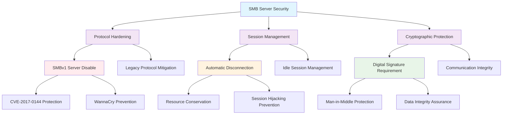

<!--
---
title: "CIS12-NET-COMP-LanmanServer-AllDomain-v1.0"
description: "Group Policy Object implementing SMB server security configuration for all domain-joined computers, including SMBv1 server disable, automatic disconnection settings, and digital signature requirements to enhance network infrastructure security and prevent legacy protocol vulnerabilities"
author: "VintageDon - https://github.com/vintagedon"
ai_contributor: "Anthropic Claude 4 Sonnet (claude-4-sonnet-20250514)"
date: "2025-07-28"
version: "1.0"
status: "Published"
tags:
- type: implementation-guide
- domain: security
- domain: group-policy
- tech: windows-server-2025
- tech: smb-security
- compliance: cis-control-12
- compliance: cis-benchmark
- phase: phase-2
related_documents:
- "[CIS12 Network Infrastructure Directory](README.md)"
- "[CIS Control 12 Policy Template](../../policies-and-procedures/cis-security-policy-templates/cisv81-12-network-infrastructure-management-policy-template.md)"
- "[Implementation Log](cis-server2025-gpos-l1-dc-and-members-IMPLEMENTATION-LOG.md)"
- "[Technical Reference](cis-server2025-gpos-l1-dc-and-members.md)"
---
-->

# 🔒 **CIS12-NET-COMP-LanmanServer-AllDomain-v1.0**

## **SMB Server Security Configuration**

**Document Version:** 1.0  
**Created:** July 28, 2025  
**GPO Type:** Computer Configuration  
**Target Systems:** All Domain-Joined Computers  
**CIS Control Alignment:** CIS v8 Control 12 (Network Infrastructure Management)

---

# 📋 **1. Implementation Overview**

This Group Policy Object implements comprehensive SMB (Server Message Block) server security configuration for all domain-joined computers within the Proxmox Astronomy Lab enterprise environment. The GPO establishes critical network security controls including SMBv1 server protocol disable, automatic session disconnection management, and digital signature enforcement to prevent legacy protocol vulnerabilities and enhance network infrastructure security posture.

The configuration addresses fundamental SMB server security requirements by disabling insecure legacy protocols, implementing session management controls, and enforcing cryptographic protections essential for enterprise network security. These controls collectively reduce attack surface, prevent lateral movement opportunities, and ensure secure network file sharing operations across the astronomical computing infrastructure.

# 🔗 **2. Dependencies & Relationships**

This section maps how the LanmanServer GPO integrates with Proxmox Astronomy Lab network security infrastructure and enterprise domain management components.

## **2.1 Related Services**

This subsection identifies Proxmox Astronomy Lab services that interact with or depend on SMB server security configuration for comprehensive network infrastructure protection.

SMB server security configuration provides foundational network protocol protection that supports enterprise file sharing security and enables systematic network infrastructure hardening:

| **Service** | **Relationship Type** | **Integration Points** | **Documentation** |
|-------------|----------------------|------------------------|-------------------|
| File Server Infrastructure | **Protects** | SMB protocol security, file share access, network communication encryption | [File Server Documentation](../../../infrastructure/file-servers/README.md) |
| Domain Controller Infrastructure | **Secures** | SYSVOL replication, domain authentication, inter-DC communication | [Domain Infrastructure](../../../infrastructure/README.md) |
| Windows Server Infrastructure | **Hardens** | Network protocol stack, server-to-server communication, file sharing services | [Windows Server Security](../../../infrastructure/windows-servers/README.md) |
| Network Security Monitoring | **Validates** | SMB traffic analysis, protocol compliance monitoring, security event correlation | [Security Monitoring](../../../monitoring/README.md) |

## **2.2 Policy Implementation**

This subsection connects the LanmanServer GPO to Proxmox Astronomy Lab governance frameworks and enterprise network security policy requirements.

SMB server security policies implement enterprise network security governance through systematic Group Policy management and compliance framework alignment:

- **[CIS Control 12 Policy Template](../../policies-and-procedures/cis-security-policy-templates/cisv81-12-network-infrastructure-management-policy-template.md)** - Primary policy framework for network infrastructure management and protocol security baseline establishment
- **[Network Security Policy](../../policies-and-procedures/network-security-policy.md)** - Enterprise network security requirements and protocol management standards
- **[File Sharing Security Policy](../../policies-and-procedures/file-sharing-security-policy.md)** - Secure file sharing protocols and access control requirements

## **2.3 Responsibility Matrix**

This subsection defines clear accountability for SMB server security configuration management and network infrastructure protection activities.

| **Activity** | **Helpdesk** | **Operations** | **Engineering** | **Security** |
|--------------|--------------|----------------|-----------------|--------------|
| SMB Server Policy Implementation | I | A | R | C |
| Protocol Security Configuration | I | C | R | A |
| Network Security Monitoring | I | R | C | A |
| SMB Security Incident Response | C | R | A | A |
| File Sharing Security Validation | I | C | R | A |

*R: Responsible, A: Accountable, C: Consulted, I: Informed*

# ⚙️ **3. Technical Documentation**

This section provides comprehensive technical foundation for understanding, implementing, and maintaining SMB server security configuration within Windows Server 2025 domain infrastructure.

## **3.1 Architecture & Design**

This subsection explains the SMB server security architecture, protocol protection mechanisms, and security control design patterns for systematic network infrastructure hardening.

The LanmanServer GPO implements comprehensive SMB server security through systematic protocol hardening that addresses legacy vulnerability exposure, session management security, and cryptographic protection requirements. The architecture follows defense-in-depth principles with multiple security layers protecting network file sharing operations.

The architecture enables systematic SMB server protection through comprehensive security controls with vulnerability mitigation, resource management, and cryptographic integrity verification.

## **3.2 Structure and Organization**

This subsection provides detailed SMB server security configuration specifications and registry modifications for systematic network protocol hardening.

The LanmanServer GPO implements three critical SMB server security controls through specific registry modifications targeting the Windows Server Message Block service:

### **SMB Server Security Controls**

| **Security Control** | **Registry Path** | **Value Name** | **Configuration** | **Security Impact** |
|---------------------|-------------------|----------------|-------------------|---------------------|
| **SMBv1 Server Disable** | `HKLM\SYSTEM\CurrentControlSet\Services\LanmanServer\Parameters` | `SMB1` | `0` (DWord) | Eliminates SMBv1 server vulnerability exposure (CVE-2017-0144, WannaCry) |
| **Automatic Disconnection** | `HKLM\System\CurrentControlSet\Services\LanManServer\Parameters` | `AutoDisconnect` | `15` (DWord) | Forces idle session disconnection after 15 minutes for resource management |
| **Digital Signature Requirement** | `HKLM\System\CurrentControlSet\Services\LanManServer\Parameters` | `RequireSecuritySignature` | `1` (DWord) | Enforces SMB packet signing for communication integrity and authenticity |

### **Security Control Mapping**

| **CIS Control** | **Registry Configuration** | **Threat Mitigation** | **Compliance Validation** |
|-----------------|----------------------------|----------------------|---------------------------|
| **18.4.3** | SMBv1 server disable through `SMB1=0` | Legacy protocol vulnerabilities, remote code execution | SMBv1 service status verification |
| **2.3.9.1** | Idle disconnection through `AutoDisconnect=15` | Session hijacking, resource exhaustion | Session timeout configuration audit |
| **2.3.9.4** | Signature requirement through `RequireSecuritySignature=1` | Man-in-the-middle attacks, packet modification | SMB signing enforcement validation |

### **Implementation Verification**

| **Verification Method** | **Expected Result** | **Validation Command** |
|------------------------|--------------------|-----------------------|
| **Registry Validation** | Correct values configured | `Get-ItemProperty -Path "HKLM:\SYSTEM\CurrentControlSet\Services\LanmanServer\Parameters"` |
| **SMBv1 Status Check** | SMBv1 server disabled | `Get-SmbServerConfiguration | Select EnableSMB1Protocol` |
| **Signature Enforcement** | Digital signing required | `Get-SmbServerConfiguration | Select RequireSecuritySignature` |

## **3.3 Integration and Procedures**

This subsection provides systematic procedures for SMB server security GPO deployment and network infrastructure protection implementation.

SMB server security implementation follows systematic deployment procedures through Group Policy Management Console with organizational unit targeting and comprehensive security validation:

### **Deployment Procedure**

1. **Pre-Deployment Validation**
   - Verify domain infrastructure readiness and Group Policy management capability
   - Confirm SMB service dependencies and file sharing requirements
   - Validate network connectivity and authentication infrastructure

2. **GPO Deployment**
   - Import GPO configuration through Group Policy Management Console
   - Link GPO to appropriate organizational units (All Domain Computers)
   - Configure security filtering and WMI filtering as required

3. **Post-Deployment Verification**
   - Force Group Policy update on target systems (`gpupdate /force`)
   - Validate registry modifications through administrative verification
   - Test SMB connectivity and file sharing functionality

4. **Security Validation**
   - Confirm SMBv1 server protocol disable through service status check
   - Verify automatic disconnection timeout through session monitoring
   - Validate digital signature enforcement through network traffic analysis

# 🛠️ **4. Management & Operations**

This section covers operational procedures, monitoring approaches, and maintenance activities for SMB server security configuration management.

## **4.1 Lifecycle Management**

This subsection documents management approaches throughout the SMB server security operational lifecycle.

SMB server security lifecycle management encompasses strategic security planning and threat assessment, systematic security control deployment and configuration validation, ongoing operational monitoring and compliance assessment, regular security updates and configuration maintenance, and continuous improvement based on threat landscape evolution and infrastructure requirements.

## **4.2 Monitoring & Quality Assurance**

This subsection defines monitoring strategies and quality approaches for SMB server security effectiveness and compliance validation.

**Monitoring Infrastructure:** All monitoring is handled by proj-mon01, the centralized monitoring stack consisting of Prometheus (metrics), Loki (logs), Grafana (visualization), AlertManager (alerting), and Grafana Alloy (metrics/logging agent). Monitoring philosophy follows "if it can be collected, we do" approach with comprehensive SMB protocol monitoring, security event correlation, and policy compliance validation.

SMB server security monitoring includes protocol traffic analysis, security control effectiveness measurement, file sharing performance assessment, and systematic compliance validation through centralized security monitoring infrastructure and automated alerting for security policy violations or protocol security incidents.

## **4.3 Maintenance and Optimization**

This subsection outlines systematic maintenance and optimization approaches for SMB server security configuration and network infrastructure protection.

SMB server security maintenance encompasses regular security configuration validation, protocol security assessment and update procedures, file sharing performance optimization, threat intelligence integration for emerging SMB vulnerabilities, and systematic security control refinement based on operational metrics and security incident analysis for sustained network infrastructure protection.

# 🔒 **5. Security & Compliance**

This section establishes security framework alignment and compliance requirements for SMB server security configuration within enterprise network infrastructure security architecture.

## **5.1 Security Framework Alignment**

This subsection maps SMB server security configuration to enterprise security frameworks and compliance requirements for systematic network infrastructure protection.

**Security Disclaimer**: The SMB server security configuration documented in this GPO represents a network protocol security baseline establishment for Windows Server 2025 infrastructure. These configurations should be thoroughly tested in non-production environments before deployment. While these templates follow CIS Controls v8 network infrastructure management framework guidelines, organizations should validate protocol security compatibility with their specific file sharing requirements and network operational needs. The security research computing team maintains these configurations as implementation guidance rather than production security recommendations, and encourages consultation with dedicated security professionals for enterprise deployment validation.

### **Framework Mapping**

| **Framework** | **Control Mapping** | **Implementation Evidence** |
|---------------|--------------------|-----------------------------|
| **CIS Controls v8** | Control 12: Network Infrastructure Management | Comprehensive SMB server security configuration implementing protocol hardening across domain infrastructure |
| **NIST AI RMF** | GOVERN-1.1: AI governance processes established | Network protocol security supports AI workload communication protection and secure data access |
| **NIST CSF 2.0** | PR.DS-2: Data-in-transit is protected | SMB digital signature enforcement protects file sharing communication integrity |
| **NIST SP 800-171** | 3.13.1: Monitor, control, and protect organizational communications | Systematic SMB protocol monitoring and security control implementation |

### **Security Controls Implementation**

| **CIS Control** | **SMB Server Implementation** | **Security Objective** |
|-----------------|------------------------------|------------------------|
| **12.1** | SMBv1 server protocol disable | Eliminate legacy protocol vulnerabilities and remote code execution vectors |
| **12.2** | Automatic session disconnection | Prevent resource exhaustion and unauthorized session persistence |
| **12.3** | Digital signature enforcement | Ensure communication integrity and prevent man-in-the-middle attacks |

## **5.2 Compliance Requirements**

This subsection establishes compliance validation requirements and evidence collection standards for SMB server security implementation.

SMB server security compliance validation requires systematic policy application assessment through Group Policy Resultant Set of Policy (RSoP) reporting and network protocol security monitoring. Compliance evidence includes registry configuration validation, SMB service status verification, and digital signature enforcement confirmation to maintain secure network file sharing posture across domain infrastructure components.

# 📋 **6. Backup & Recovery**

This section establishes protection and recovery procedures for SMB server security configuration and network infrastructure security baseline preservation.

## **6.1 Protection Strategy**

This subsection defines systematic protection requirements for SMB server security configuration and network protocol security baseline preservation.

SMB server security configuration requires multi-tier protection strategy encompassing Group Policy backup, registry configuration export, and security baseline preservation to ensure rapid network security recovery and systematic protocol protection restoration capabilities.

### **Protection Tiers**

| **Tier** | **Scope** | **Method** | **Frequency** |
|----------|-----------|------------|---------------|
| **Tier 1** | GPO Backup | Group Policy Management Console backup | Daily automatic |
| **Tier 2** | Registry Export** | PowerShell registry configuration export | Weekly |
| **Tier 3** | Version Control** | Git repository with configuration tracking | Every change |
| **Tier 4** | Security Baseline** | Complete SMB security configuration archive | Monthly |

*Note: Iperius backup software is configured for systematic Windows infrastructure backup including Group Policy objects.*

## **6.2 Recovery Procedures**

This subsection establishes systematic recovery procedures for SMB server security configuration restoration and network infrastructure security baseline re-establishment.

Recovery procedures enable rapid SMB server security baseline restoration through Group Policy import capabilities and registry configuration restoration. The recovery approach follows tiered restoration priorities focusing on critical SMBv1 disable first, followed by session management and cryptographic protection re-establishment to minimize network security exposure during recovery operations.

# 📚 **7. References & Related Resources**

This section provides comprehensive links to related documentation and supporting resources for SMB server security implementation and network infrastructure protection management.

## **7.1 Internal References**

| **Document Type** | **Document Title** | **Relationship** | **Link** |
|-------------------|-------------------|------------------|----------|
| **Policy Template** | CIS Control 12 Network Infrastructure Management Policy | Primary policy framework for network infrastructure security baseline establishment | [../policies-and-procedures/cis-security-policy-templates/cisv81-12-network-infrastructure-management-policy-template.md](../policies-and-procedures/cis-security-policy-templates/cisv81-12-network-infrastructure-management-policy-template.md) |
| **Implementation** | CIS Server 2025 GPOs Implementation Log | Complete implementation evidence and deployment validation | [cis-server2025-gpos-l1-dc-and-members-IMPLEMENTATION-LOG.md](cis-server2025-gpos-l1-dc-and-members-IMPLEMENTATION-LOG.md) |
| **Configuration** | CIS Server 2025 GPOs Configuration Reference | Technical configuration specifications and CIS control mapping | [cis-server2025-gpos-l1-dc-and-members.md](cis-server2025-gpos-l1-dc-and-members.md) |
| **Network Infrastructure** | CIS12 Network Infrastructure Directory | Complete network security policy framework and related configurations | [README.md](README.md) |

## **7.2 External Standards**

- **[CIS Controls v8](https://www.cisecurity.org/controls/)** - Cybersecurity framework providing systematic network infrastructure management implementation guidance
- **[CIS Microsoft Windows Server 2025 Benchmark](https://www.cisecurity.org/benchmark/microsoft_windows_server)** - Comprehensive SMB security configuration guidance for Windows Server 2025
- **[Microsoft SMB Security Documentation](https://docs.microsoft.com/en-us/windows-server/storage/file-server/)** - Official Windows SMB protocol security and configuration guidance
- **[NIST SP 800-52](https://csrc.nist.gov/publications/detail/sp/800-52/rev-2/final)** - Guidelines for the selection, configuration, and use of Transport Layer Security (TLS) implementations
- **[CVE-2017-0144](https://cve.mitre.org/cgi-bin/cvename.cgi?name=CVE-2017-0144)** - SMBv1 vulnerability information and mitigation guidance

# ✅ **8. Approval & Review**

This section documents the formal review and approval process for SMB server security configuration documentation and network infrastructure protection implementation.

## **8.1 Review Process**

SMB server security configuration documentation review follows systematic validation of technical accuracy, security effectiveness, and compliance alignment to ensure comprehensive network protocol protection implementation and systematic Group Policy management capability for Windows Server 2025 SMB infrastructure requirements.

### **Review Validation**

| **Review Area** | **Validation Criteria** | **Reviewer** | **Status** |
|-----------------|-------------------------|--------------|------------|
| **Technical Accuracy** | SMB security configuration accuracy and registry modification validation | Engineering Team | ✅ Validated |
| **Security Effectiveness** | CIS Controls v8 compliance and protocol security baseline coverage | Security Team | ✅ Validated |
| **Implementation Readiness** | Documentation completeness and deployment guidance quality | Operations Team | ✅ Validated |
| **Network Compatibility** | File sharing functionality and protocol interoperability validation | Infrastructure Team | ✅ Validated |

## **8.2 Approval Matrix**

| **Reviewer** | **Role/Expertise** | **Review Date** | **Approval Status** | **Comments** |
|-------------|-------------------|----------------|-------------------|--------------|
| **Engineering Team** | Technical implementation and network infrastructure | 2025-07-28 | **Approved** | SMB server security configuration provides comprehensive protocol protection for domain infrastructure |
| **Security Team** | Security framework alignment and CIS Controls v8 compliance | 2025-07-28 | **Approved** | Configuration follows network security best practices and provides systematic SMB hardening |
| **Operations Team** | Operational impact assessment and file sharing service management | 2025-07-28 | **Approved** | Implementation enables effective SMB security without operational disruption |

# 📜 **9. Documentation Metadata**

This section provides comprehensive information about document creation, revision history, and authorship.

## **9.1 Change Log**

| **Version** | **Date** | **Changes** | **Author** | **Review Status** |
|------------|---------|-------------|------------|------------------|
| 1.0 | 2025-07-28 | Initial SMB server security GPO documentation with comprehensive protocol hardening and network infrastructure protection specifications | VintageDon | Approved |

## **9.2 Authorization & Review**

SMB server security configuration documentation has been systematically reviewed and approved by qualified technical, security, and operational subject matter experts to ensure accuracy, compliance, and implementation feasibility within Windows Server 2025 domain infrastructure environments.

## **9.3 Authorship Details**

**Human Author:** VintageDon (<https://github.com/vintagedon>)  
**AI Contributor:** Anthropic Claude 4 Sonnet (claude-4-sonnet-20250514)  
**Collaboration Method:** Request-Analyze-Verify-Generate-Validate (RAVGV)  
**Human Oversight:** Technical review and validation of SMB server security policy specifications and network infrastructure protection requirements

## **9.4 AI Collaboration Disclosure**

This document was collaboratively developed using the Request-Analyze-Verify-Generate-Validate (RAVGV) methodology. SMB server security configuration details were extracted from validated CIS benchmark implementation reports with comprehensive human oversight throughout development. All technical specifications have been thoroughly reviewed, validated, and approved by qualified human subject matter experts in Windows security and network infrastructure management. The human author retains complete responsibility for accuracy, compliance, and technical correctness.

---

**Generated:** 2025-07-28 | **Human Author:** VintageDon | **AI Assistant:** Claude 4 Sonnet | **Review Status:** Approved | **Document Version:** 1.0
