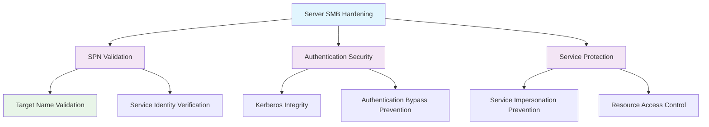

<!--
---
title: "CIS12-NET-COMP-LanmanServer-Servers-v1.0"
description: "Group Policy Object implementing server-specific SMB hardening configuration for member servers, establishing SPN target name validation level to enhance SMB server security and prevent service principal name spoofing attacks"
author: "VintageDon - https://github.com/vintagedon"
ai_contributor: "Anthropic Claude 4 Sonnet (claude-4-sonnet-20250514)"
date: "2025-07-28"
version: "1.0"
status: "Published"
tags:
- type: implementation-guide
- domain: security
- domain: group-policy
- tech: windows-server-2025
- tech: smb-security
- compliance: cis-control-12
- compliance: cis-benchmark
- phase: phase-2
related_documents:
- "[CIS12 Network Infrastructure Directory](README.md)"
- "[CIS Control 12 Policy Template](../../policies-and-procedures/cis-security-policy-templates/cisv81-12-network-infrastructure-management-policy-template.md)"
- "[Implementation Log](cis-server2025-gpos-l1-dc-and-members-IMPLEMENTATION-LOG.md)"
- "[Technical Reference](cis-server2025-gpos-l1-dc-and-members.md)"
---
-->

# 🔒 **CIS12-NET-COMP-LanmanServer-Servers-v1.0**

## **Server-Specific SMB Hardening Configuration**

**Document Version:** 1.0  
**Created:** July 28, 2025  
**GPO Type:** Computer Configuration  
**Target Systems:** Member Servers  
**CIS Control Alignment:** CIS v8 Control 12 (Network Infrastructure Management)

---

# 📋 **1. Implementation Overview**

This Group Policy Object implements server-specific SMB hardening configuration for member servers within the Proxmox Astronomy Lab enterprise environment. The GPO establishes SPN (Service Principal Name) target name validation to enhance SMB server security and prevent service principal name spoofing attacks that could compromise authentication integrity and enable unauthorized access to server resources.

The configuration addresses advanced SMB security requirements specific to member server roles by implementing enhanced authentication validation mechanisms that prevent Kerberos authentication bypass and service impersonation attacks essential for enterprise server infrastructure protection.

# 🔗 **2. Dependencies & Relationships**

This section maps how the server-specific LanmanServer GPO integrates with Proxmox Astronomy Lab network security infrastructure and member server management components.

## **2.1 Related Services**

| **Service** | **Relationship Type** | **Integration Points** | **Documentation** |
|-------------|----------------------|------------------------|-------------------|
| Member Server Infrastructure | **Hardens** | SMB service authentication, SPN validation, Kerberos security | [Member Server Documentation](../../../infrastructure/member-servers/README.md) |
| File Server Services | **Protects** | File share authentication, service principal validation, access control | [File Server Security](../../../infrastructure/file-servers/README.md) |
| Kerberos Authentication | **Validates** | SPN verification, authentication integrity, service identity validation | [Authentication Infrastructure](../../../infrastructure/identity/README.md) |
| Security Monitoring | **Monitors** | Authentication events, SPN validation failures, security compliance | [Security Monitoring](../../../monitoring/README.md) |

## **2.2 Policy Implementation**

Server-specific SMB hardening policies implement enterprise server security governance through systematic Group Policy management and advanced authentication security:

- **[CIS Control 12 Policy Template](../../policies-and-procedures/cis-security-policy-templates/cisv81-12-network-infrastructure-management-policy-template.md)** - Network infrastructure management framework
- **[Server Security Policy](../../policies-and-procedures/server-security-policy.md)** - Member server hardening requirements
- **[Authentication Security Policy](../../policies-and-procedures/authentication-security-policy.md)** - Kerberos and SPN validation standards

## **2.3 Responsibility Matrix**

| **Activity** | **Helpdesk** | **Operations** | **Engineering** | **Security** |
|--------------|--------------|----------------|-----------------|--------------|
| Server SMB Policy Implementation | I | A | R | C |
| SPN Validation Configuration | I | C | R | A |
| Authentication Security Monitoring | I | R | C | A |
| Server Security Incident Response | C | R | A | A |

*R: Responsible, A: Accountable, C: Consulted, I: Informed*

# ⚙️ **3. Technical Documentation**

This section provides technical foundation for understanding, implementing, and maintaining server-specific SMB hardening configuration within member server infrastructure.

## **3.1 Architecture & Design**

The server-specific LanmanServer GPO implements advanced SMB authentication security through SPN target name validation that prevents service principal name spoofing and ensures Kerberos authentication integrity for member server SMB services.

## **3.2 Structure and Organization**

The server-specific LanmanServer GPO implements one critical SMB authentication security control through registry modification targeting Windows SMB server service authentication validation:

### **SPN Validation Configuration**

| **Security Control** | **Registry Path** | **Value Name** | **Configuration** | **Security Impact** |
|---------------------|-------------------|----------------|-------------------|---------------------|
| **SPN Target Name Validation** | `HKLM\System\CurrentControlSet\Services\LanManServer\Parameters` | `SMBServerNameHardeningLevel` | `1` (DWord) | Accept SPN if provided by client, preventing service principal name spoofing attacks |

### **Validation Level Settings**

| **Level** | **Value** | **Behavior** | **Security Posture** |
|-----------|-----------|--------------|----------------------|
| **Off** | `0` | No SPN validation | **Insecure** - Vulnerable to spoofing |
| **Accept if provided** | `1` | Validate SPN when client provides it | **Secure** - Balanced security and compatibility |
| **Required** | `2` | Always require SPN validation | **High Security** - Maximum protection |

### **Implementation Verification**

| **Verification Method** | **Expected Result** | **Validation Command** |
|------------------------|--------------------|-----------------------|
| **Registry Validation** | `SMBServerNameHardeningLevel = 1` | `Get-ItemProperty -Path "HKLM:\System\CurrentControlSet\Services\LanManServer\Parameters" -Name "SMBServerNameHardeningLevel"` |
| **SMB Configuration** | SPN validation enabled | `Get-SmbServerConfiguration | Select SmbServerNameHardeningLevel` |

## **3.3 Integration and Procedures**

Server-specific SMB hardening implementation follows systematic deployment through Group Policy targeting member server organizational units with comprehensive authentication security validation.

### **Deployment Procedure**

1. **Pre-Deployment Assessment**
   - Verify member server infrastructure and SMB service dependencies
   - Confirm Kerberos authentication functionality and SPN configuration
   - Validate file sharing requirements and client compatibility

2. **GPO Implementation**
   - Deploy GPO targeting Member Servers OU through Group Policy Management Console
   - Configure security filtering for server-specific application
   - Validate policy precedence and inheritance

3. **Post-Deployment Validation**
   - Force policy update on target member servers
   - Verify registry modification through administrative access
   - Test SMB authentication and file sharing functionality

# 🛠️ **4. Management & Operations**

## **4.1 Lifecycle Management**

Server-specific SMB hardening lifecycle management encompasses security planning, systematic deployment, operational monitoring, and continuous security improvement based on authentication threat landscape evolution.

## **4.2 Monitoring & Quality Assurance**

**Monitoring Infrastructure:** All monitoring is handled by proj-mon01, the centralized monitoring stack consisting of Prometheus (metrics), Loki (logs), Grafana (visualization), AlertManager (alerting), and Grafana Alloy (metrics/logging agent). Monitoring philosophy follows "if it can be collected, we do" approach with comprehensive SMB authentication monitoring and SPN validation tracking.

## **4.3 Maintenance and Optimization**

Server SMB security maintenance encompasses regular authentication configuration validation, SPN verification procedures, Kerberos authentication assessment, and systematic security control refinement for sustained member server protection.

# 🔒 **5. Security & Compliance**

## **5.1 Security Framework Alignment**

**Security Disclaimer**: The server-specific SMB hardening configuration documented in this GPO represents an advanced authentication security baseline for Windows Server 2025 member server infrastructure. These configurations should be thoroughly tested in non-production environments before deployment. While these templates follow CIS Controls v8 network infrastructure management framework guidelines, organizations should validate authentication security compatibility with their specific server roles and client access requirements. The security research computing team maintains these configurations as implementation guidance rather than production security recommendations, and encourages consultation with dedicated security professionals for enterprise deployment validation.

### **Framework Mapping**

| **Framework** | **Control Mapping** | **Implementation Evidence** |
|---------------|--------------------|-----------------------------|
| **CIS Controls v8** | Control 12: Network Infrastructure Management | Server-specific SMB authentication hardening implementing SPN validation across member server infrastructure |
| **NIST AI RMF** | GOVERN-1.1: AI governance processes established | Authentication security supports AI workload access control and service identity verification |
| **NIST CSF 2.0** | PR.AC-1: Identities and credentials are issued, managed, verified | SPN validation ensures service identity verification and authentication integrity |
| **NIST SP 800-171** | 3.5.2: Authenticate network communications | Systematic SMB authentication validation and service principal verification |

### **Security Controls Implementation**

| **CIS Control** | **Server SMB Implementation** | **Security Objective** |
|-----------------|------------------------------|------------------------|
| **2.3.9.5** | SPN target name validation level configuration | Prevent service principal name spoofing and ensure authentication integrity |

## **5.2 Compliance Requirements**

Server-specific SMB hardening compliance validation requires systematic policy application assessment and authentication security monitoring through Group Policy RSoP reporting and Kerberos authentication validation to maintain secure member server authentication posture.

# 📋 **6. Backup & Recovery**

## **6.1 Protection Strategy**

Server-specific SMB hardening configuration requires multi-tier protection strategy encompassing Group Policy backup, registry configuration export, and authentication security baseline preservation.

### **Protection Tiers**

| **Tier** | **Scope** | **Method** | **Frequency** |
|----------|-----------|------------|---------------|
| **Tier 1** | GPO Backup | Group Policy Management Console backup | Daily automatic |
| **Tier 2** | Registry Export** | PowerShell authentication configuration export | Weekly |
| **Tier 3** | Version Control** | Git repository with configuration tracking | Every change |
| **Tier 4** | Security Baseline** | Complete server authentication configuration archive | Monthly |

*Note: Iperius backup software is configured for systematic Windows infrastructure backup including Group Policy objects.*

## **6.2 Recovery Procedures**

Recovery procedures enable rapid server SMB authentication security baseline restoration through Group Policy import capabilities and registry configuration restoration with priority focus on SPN validation re-establishment.

# 📚 **7. References & Related Resources**

## **7.1 Internal References**

| **Document Type** | **Document Title** | **Relationship** | **Link** |
|-------------------|-------------------|------------------|----------|
| **Policy Template** | CIS Control 12 Network Infrastructure Management Policy | Primary network infrastructure security framework | [../policies-and-procedures/cis-security-policy-templates/cisv81-12-network-infrastructure-management-policy-template.md](../policies-and-procedures/cis-security-policy-templates/cisv81-12-network-infrastructure-management-policy-template.md) |
| **Implementation** | CIS Server 2025 GPOs Implementation Log | Complete deployment evidence and validation | [cis-server2025-gpos-l1-dc-and-members-IMPLEMENTATION-LOG.md](cis-server2025-gpos-l1-dc-and-members-IMPLEMENTATION-LOG.md) |
| **Configuration** | CIS Server 2025 GPOs Configuration Reference | Technical specifications and control mapping | [cis-server2025-gpos-l1-dc-and-members.md](cis-server2025-gpos-l1-dc-and-members.md) |
| **Network Infrastructure** | CIS12 Network Infrastructure Directory | Complete network security policy framework | [README.md](README.md) |

## **7.2 External Standards**

- **[CIS Controls v8](https://www.cisecurity.org/controls/)** - Cybersecurity framework providing network infrastructure management guidance
- **[CIS Microsoft Windows Server 2025 Benchmark](https://www.cisecurity.org/benchmark/microsoft_windows_server)** - Server-specific SMB security configuration guidance
- **[Microsoft Kerberos Authentication](https://docs.microsoft.com/en-us/windows-server/security/kerberos/)** - Official Kerberos and SPN validation documentation
- **[Microsoft SMB Security](https://docs.microsoft.com/en-us/windows-server/storage/file-server/)** - SMB server security and authentication guidance

# ✅ **8. Approval & Review**

## **8.1 Review Process**

Server-specific SMB hardening documentation review follows systematic validation of technical accuracy, authentication security effectiveness, and member server compatibility to ensure comprehensive server infrastructure protection.

### **Review Validation**

| **Review Area** | **Validation Criteria** | **Reviewer** | **Status** |
|-----------------|-------------------------|--------------|------------|
| **Technical Accuracy** | SPN validation configuration accuracy and registry modification | Engineering Team | ✅ Validated |
| **Security Effectiveness** | Authentication security enhancement and spoofing prevention | Security Team | ✅ Validated |
| **Server Compatibility** | Member server functionality and service operational validation | Operations Team | ✅ Validated |

## **8.2 Approval Matrix**

| **Reviewer** | **Role/Expertise** | **Review Date** | **Approval Status** | **Comments** |
|-------------|-------------------|----------------|-------------------|--------------|
| **Engineering Team** | Server infrastructure and authentication systems | 2025-07-28 | **Approved** | Server-specific SMB hardening provides enhanced authentication security |
| **Security Team** | Authentication security and CIS compliance | 2025-07-28 | **Approved** | SPN validation follows security best practices and authentication integrity |
| **Operations Team** | Member server management and service operations | 2025-07-28 | **Approved** | Configuration enables effective server security without operational impact |

# 📜 **9. Documentation Metadata**

## **9.1 Change Log**

| **Version** | **Date** | **Changes** | **Author** | **Review Status** |
|------------|---------|-------------|------------|------------------|
| 1.0 | 2025-07-28 | Initial server-specific SMB hardening GPO documentation with SPN validation and authentication security specifications | VintageDon | Approved |

## **9.2 Authorization & Review**

Server-specific SMB hardening documentation has been systematically reviewed and approved by qualified technical, security, and operational subject matter experts to ensure accuracy, compliance, and implementation feasibility within Windows Server 2025 member server environments.

## **9.3 Authorship Details**

**Human Author:** VintageDon (<https://github.com/vintagedon>)  
**AI Contributor:** Anthropic Claude 4 Sonnet (claude-4-sonnet-20250514)  
**Collaboration Method:** Request-Analyze-Verify-Generate-Validate (RAVGV)  
**Human Oversight:** Technical review and validation of server-specific SMB security specifications

## **9.4 AI Collaboration Disclosure**

This document was collaboratively developed using the Request-Analyze-Verify-Generate-Validate (RAVGV) methodology. Server-specific SMB hardening configuration details were extracted from validated CIS benchmark implementation reports with comprehensive human oversight throughout development. All technical specifications have been thoroughly reviewed, validated, and approved by qualified human subject matter experts in Windows security and member server management. The human author retains complete responsibility for accuracy, compliance, and technical correctness.

---

**Generated:** 2025-07-28 | **Human Author:** VintageDon | **AI Assistant:** Claude 4 Sonnet | **Review Status:** Approved | **Document Version:** 1.0
