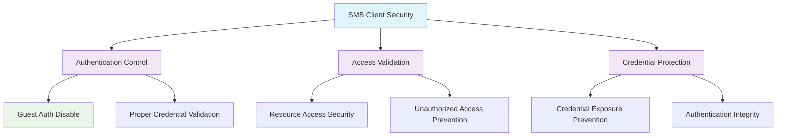

<!--
---
title: "CIS12-NET-COMP-LanmanWorkstation-AllDomain-v1.0"
description: "Group Policy Object implementing SMB client security configuration for all domain-joined computers, disabling insecure guest authentication to prevent unauthorized access and enhance network client security posture"
author: "VintageDon - https://github.com/vintagedon"
ai_contributor: "Anthropic Claude 4 Sonnet (claude-4-sonnet-20250514)"
date: "2025-07-28"
version: "1.0"
status: "Published"
tags:
- type: implementation-guide
- domain: security
- domain: group-policy
- tech: windows-server-2025
- tech: smb-security
- compliance: cis-control-12
- compliance: cis-benchmark
- phase: phase-2
related_documents:
- "[CIS12 Network Infrastructure Directory](README.md)"
- "[CIS Control 12 Policy Template](../../policies-and-procedures/cis-security-policy-templates/cisv81-12-network-infrastructure-management-policy-template.md)"
- "[Implementation Log](cis-server2025-gpos-l1-dc-and-members-IMPLEMENTATION-LOG.md)"
- "[Technical Reference](cis-server2025-gpos-l1-dc-and-members.md)"
---
-->

# 🔒 **CIS12-NET-COMP-LanmanWorkstation-AllDomain-v1.0**

## **SMB Client Security Configuration**

**Document Version:** 1.0  
**Created:** July 28, 2025  
**GPO Type:** Computer Configuration  
**Target Systems:** All Domain-Joined Computers  
**CIS Control Alignment:** CIS v8 Control 12 (Network Infrastructure Management)

---

# 📋 **1. Implementation Overview**

This Group Policy Object implements SMB client security configuration for all domain-joined computers within the Proxmox Astronomy Lab enterprise environment. The GPO disables insecure guest authentication for SMB client connections to prevent unauthorized access, credential exposure, and network security vulnerabilities that could compromise client-to-server communication integrity.

The configuration addresses fundamental SMB client security requirements by eliminating insecure guest authentication mechanisms that bypass proper credential validation and enable unauthorized network resource access essential for enterprise client security posture.

# 🔗 **2. Dependencies & Relationships**

This section maps how the LanmanWorkstation GPO integrates with Proxmox Astronomy Lab network security infrastructure and client system management components.

## **2.1 Related Services**

| **Service** | **Relationship Type** | **Integration Points** | **Documentation** |
|-------------|----------------------|------------------------|-------------------|
| Domain Client Infrastructure | **Protects** | SMB client authentication, network resource access, credential security | [Client Systems Documentation](../../../infrastructure/clients/README.md) |
| File Server Access | **Secures** | Client-to-server authentication, file share access, credential validation | [File Server Security](../../../infrastructure/file-servers/README.md) |
| Network Authentication | **Validates** | Client credential validation, authentication integrity, access control | [Authentication Infrastructure](../../../infrastructure/identity/README.md) |
| Security Monitoring | **Monitors** | Client authentication events, access violations, security compliance | [Security Monitoring](../../../monitoring/README.md) |

## **2.2 Policy Implementation**

SMB client security policies implement enterprise client security governance through systematic Group Policy management and authentication security:

- **[CIS Control 12 Policy Template](../../policies-and-procedures/cis-security-policy-templates/cisv81-12-network-infrastructure-management-policy-template.md)** - Network infrastructure management framework
- **[Client Security Policy](../../policies-and-procedures/client-security-policy.md)** - Domain client hardening requirements
- **[Authentication Security Policy](../../policies-and-procedures/authentication-security-policy.md)** - Client authentication and credential protection standards

## **2.3 Responsibility Matrix**

| **Activity** | **Helpdesk** | **Operations** | **Engineering** | **Security** |
|--------------|--------------|----------------|-----------------|--------------|
| SMB Client Policy Implementation | I | A | R | C |
| Guest Authentication Disable | I | C | R | A |
| Client Security Monitoring | I | R | C | A |
| Authentication Security Incident Response | C | R | A | A |

*R: Responsible, A: Accountable, C: Consulted, I: Informed*

# ⚙️ **3. Technical Documentation**

This section provides technical foundation for understanding, implementing, and maintaining SMB client security configuration within domain-joined client systems.

## **3.1 Architecture & Design**

The LanmanWorkstation GPO implements SMB client security through insecure guest authentication disable that prevents credential bypass and ensures proper authentication validation for all SMB client connections.

## **3.2 Structure and Organization**

The LanmanWorkstation GPO implements one critical SMB client security control through registry modification targeting Windows SMB client service authentication behavior:

### **SMB Client Security Control**

| **Security Control** | **Registry Path** | **Value Name** | **Configuration** | **Security Impact** |
|---------------------|-------------------|----------------|-------------------|---------------------|
| **Insecure Guest Auth Disable** | `HKLM\SOFTWARE\Policies\Microsoft\Windows\LanmanWorkstation` | `AllowInsecureGuestAuth` | `0` (DWord) | Prevents SMB client from using insecure guest authentication, enforcing proper credential validation |

### **Authentication Behavior**

| **Setting** | **Value** | **Behavior** | **Security Posture** |
|-------------|-----------|--------------|----------------------|
| **Enabled** | `1` | Allow insecure guest authentication | **Insecure** - Vulnerable to unauthorized access |
| **Disabled** | `0` | Prevent insecure guest authentication | **Secure** - Enforces proper authentication |

### **Implementation Verification**

| **Verification Method** | **Expected Result** | **Validation Command** |
|------------------------|--------------------|-----------------------|
| **Registry Validation** | `AllowInsecureGuestAuth = 0` | `Get-ItemProperty -Path "HKLM:\SOFTWARE\Policies\Microsoft\Windows\LanmanWorkstation" -Name "AllowInsecureGuestAuth"` |
| **SMB Client Configuration** | Insecure guest auth disabled | `Get-SmbClientConfiguration | Select RequireSecuritySignature, EnableInsecureGuestLogons` |

## **3.3 Integration and Procedures**

SMB client security implementation follows systematic deployment through Group Policy targeting all domain-joined computers with comprehensive authentication security validation.

### **Deployment Procedure**

1. **Pre-Deployment Assessment**
   - Verify domain client infrastructure and SMB client dependencies
   - Confirm file server access patterns and authentication requirements
   - Validate network resource access and credential management

2. **GPO Implementation**
   - Deploy GPO targeting All Domain Computers through Group Policy Management Console
   - Configure universal application across all domain-joined systems
   - Validate policy precedence and inheritance

3. **Post-Deployment Validation**
   - Force policy update on all domain clients
   - Verify registry modification through administrative validation
   - Test SMB client connectivity and file access functionality

# 🛠️ **4. Management & Operations**

## **4.1 Lifecycle Management**

SMB client security lifecycle management encompasses security planning, systematic deployment, operational monitoring, and continuous security improvement based on client authentication threat landscape evolution.

## **4.2 Monitoring & Quality Assurance**

**Monitoring Infrastructure:** All monitoring is handled by proj-mon01, the centralized monitoring stack consisting of Prometheus (metrics), Loki (logs), Grafana (visualization), AlertManager (alerting), and Grafana Alloy (metrics/logging agent). Monitoring philosophy follows "if it can be collected, we do" approach with comprehensive SMB client authentication monitoring and guest authentication attempt tracking.

## **4.3 Maintenance and Optimization**

SMB client security maintenance encompasses regular authentication configuration validation, client connectivity assessment, credential security monitoring, and systematic security control refinement for sustained domain client protection.

# 🔒 **5. Security & Compliance**

## **5.1 Security Framework Alignment**

**Security Disclaimer**: The SMB client security configuration documented in this GPO represents a client authentication security baseline for Windows domain-joined systems. These configurations should be thoroughly tested in non-production environments before deployment. While these templates follow CIS Controls v8 network infrastructure management framework guidelines, organizations should validate client authentication security compatibility with their specific network access requirements and file sharing dependencies. The security research computing team maintains these configurations as implementation guidance rather than production security recommendations, and encourages consultation with dedicated security professionals for enterprise deployment validation.

### **Framework Mapping**

| **Framework** | **Control Mapping** | **Implementation Evidence** |
|---------------|--------------------|-----------------------------|
| **CIS Controls v8** | Control 12: Network Infrastructure Management | SMB client authentication hardening implementing guest authentication disable across domain client infrastructure |
| **NIST AI RMF** | GOVERN-1.1: AI governance processes established | Client authentication security supports AI workload access control and secure network resource connectivity |
| **NIST CSF 2.0** | PR.AC-1: Identities and credentials are issued, managed, verified | Client authentication enforcement ensures proper credential validation and access control |
| **NIST SP 800-171** | 3.5.2: Authenticate network communications | Systematic SMB client authentication validation and credential verification |

### **Security Controls Implementation**

| **CIS Control** | **SMB Client Implementation** | **Security Objective** |
|-----------------|------------------------------|------------------------|
| **18.6.8.4** | Insecure guest authentication disable | Prevent unauthorized network resource access and enforce proper credential validation |

## **5.2 Compliance Requirements**

SMB client security compliance validation requires systematic policy application assessment and client authentication monitoring through Group Policy RSoP reporting and authentication validation to maintain secure domain client authentication posture.

# 📋 **6. Backup & Recovery**

## **6.1 Protection Strategy**

SMB client security configuration requires multi-tier protection strategy encompassing Group Policy backup, registry configuration export, and client authentication security baseline preservation.

### **Protection Tiers**

| **Tier** | **Scope** | **Method** | **Frequency** |
|----------|-----------|------------|---------------|
| **Tier 1** | GPO Backup | Group Policy Management Console backup | Daily automatic |
| **Tier 2** | Registry Export** | PowerShell client configuration export | Weekly |
| **Tier 3** | Version Control** | Git repository with configuration tracking | Every change |
| **Tier 4** | Security Baseline** | Complete client authentication configuration archive | Monthly |

*Note: Iperius backup software is configured for systematic Windows infrastructure backup including Group Policy objects.*

## **6.2 Recovery Procedures**

Recovery procedures enable rapid SMB client authentication security baseline restoration through Group Policy import capabilities and registry configuration restoration with priority focus on guest authentication disable re-establishment.

# 📚 **7. References & Related Resources**

## **7.1 Internal References**

| **Document Type** | **Document Title** | **Relationship** | **Link** |
|-------------------|-------------------|------------------|----------|
| **Policy Template** | CIS Control 12 Network Infrastructure Management Policy | Primary network infrastructure security framework | [../policies-and-procedures/cis-security-policy-templates/cisv81-12-network-infrastructure-management-policy-template.md](../policies-and-procedures/cis-security-policy-templates/cisv81-12-network-infrastructure-management-policy-template.md) |
| **Implementation** | CIS Server 2025 GPOs Implementation Log | Complete deployment evidence and validation | [cis-server2025-gpos-l1-dc-and-members-IMPLEMENTATION-LOG.md](cis-server2025-gpos-l1-dc-and-members-IMPLEMENTATION-LOG.md) |
| **Configuration** | CIS Server 2025 GPOs Configuration Reference | Technical specifications and control mapping | [cis-server2025-gpos-l1-dc-and-members.md](cis-server2025-gpos-l1-dc-and-members.md) |
| **Network Infrastructure** | CIS12 Network Infrastructure Directory | Complete network security policy framework | [README.md](README.md) |

## **7.2 External Standards**

- **[CIS Controls v8](https://www.cisecurity.org/controls/)** - Cybersecurity framework providing network infrastructure management guidance
- **[CIS Microsoft Windows Server 2025 Benchmark](https://www.cisecurity.org/benchmark/microsoft_windows_server)** - SMB client security configuration guidance
- **[Microsoft SMB Client Security](https://docs.microsoft.com/en-us/windows-server/storage/file-server/)** - Official SMB client authentication and security guidance
- **[Microsoft Network Security](https://docs.microsoft.com/en-us/windows-server/networking/)** - Network client security and authentication documentation

# ✅ **8. Approval & Review**

## **8.1 Review Process**

SMB client security documentation review follows systematic validation of technical accuracy, authentication security effectiveness, and domain client compatibility to ensure comprehensive client infrastructure protection.

### **Review Validation**

| **Review Area** | **Validation Criteria** | **Reviewer** | **Status** |
|-----------------|-------------------------|--------------|------------|
| **Technical Accuracy** | Client authentication configuration accuracy and registry modification | Engineering Team | ✅ Validated |
| **Security Effectiveness** | Guest authentication disable and credential validation enforcement | Security Team | ✅ Validated |
| **Client Compatibility** | Domain client functionality and network resource access validation | Operations Team | ✅ Validated |

## **8.2 Approval Matrix**

| **Reviewer** | **Role/Expertise** | **Review Date** | **Approval Status** | **Comments** |
|-------------|-------------------|----------------|-------------------|--------------|
| **Engineering Team** | Client infrastructure and authentication systems | 2025-07-28 | **Approved** | SMB client security provides enhanced authentication validation |
| **Security Team** | Client authentication security and CIS compliance | 2025-07-28 | **Approved** | Guest authentication disable follows security best practices |
| **Operations Team** | Domain client management and network access operations | 2025-07-28 | **Approved** | Configuration enables effective client security without access disruption |

# 📜 **9. Documentation Metadata**

## **9.1 Change Log**

| **Version** | **Date** | **Changes** | **Author** | **Review Status** |
|------------|---------|-------------|------------|------------------|
| 1.0 | 2025-07-28 | Initial SMB client security GPO documentation with insecure guest authentication disable and client authentication specifications | VintageDon | Approved |

## **9.2 Authorization & Review**

SMB client security documentation has been systematically reviewed and approved by qualified technical, security, and operational subject matter experts to ensure accuracy, compliance, and implementation feasibility within Windows domain client environments.

## **9.3 Authorship Details**

**Human Author:** VintageDon (<https://github.com/vintagedon>)  
**AI Contributor:** Anthropic Claude 4 Sonnet (claude-4-sonnet-20250514)  
**Collaboration Method:** Request-Analyze-Verify-Generate-Validate (RAVGV)  
**Human Oversight:** Technical review and validation of SMB client security specifications

## **9.4 AI Collaboration Disclosure**

This document was collaboratively developed using the Request-Analyze-Verify-Generate-Validate (RAVGV) methodology. SMB client security configuration details were extracted from validated CIS benchmark implementation reports with comprehensive human oversight throughout development. All technical specifications have been thoroughly reviewed, validated, and approved by qualified human subject matter experts in Windows security and domain client management. The human author retains complete responsibility for accuracy, compliance, and technical correctness.

---

**Generated:** 2025-07-28 | **Human Author:** VintageDon | **AI Assistant:** Claude 4 Sonnet | **Review Status:** Approved | **Document Version:** 1.0
