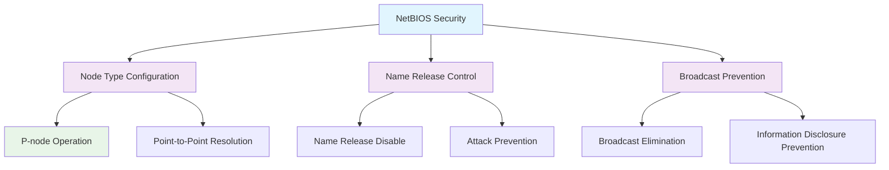

<!--
---
title: "CIS12-NET-COMP-NetBT-AllDomain-v1.0"
description: "Group Policy Object implementing NetBIOS over TCP/IP security configuration for all domain-joined computers, configuring P-node operation and preventing name release on demand to enhance network security and prevent NetBIOS-based attacks"
author: "VintageDon - https://github.com/vintagedon"
ai_contributor: "Anthropic Claude 4 Sonnet (claude-4-sonnet-20250514)"
date: "2025-07-28"
version: "1.0"
status: "Published"
tags:
- type: implementation-guide
- domain: security
- domain: group-policy
- tech: windows-server-2025
- tech: netbios-security
- compliance: cis-control-12
- compliance: cis-benchmark
- phase: phase-2
related_documents:
- "[CIS12 Network Infrastructure Directory](README.md)"
- "[CIS Control 12 Policy Template](../../policies-and-procedures/cis-security-policy-templates/cisv81-12-network-infrastructure-management-policy-template.md)"
- "[Implementation Log](cis-server2025-gpos-l1-dc-and-members-IMPLEMENTATION-LOG.md)"
- "[Technical Reference](cis-server2025-gpos-l1-dc-and-members.md)"
---
-->

# 🔒 **CIS12-NET-COMP-NetBT-AllDomain-v1.0**

## **NetBIOS over TCP/IP Security Configuration**

**Document Version:** 1.0  
**Created:** July 28, 2025  
**GPO Type:** Computer Configuration  
**Target Systems:** All Domain-Joined Computers  
**CIS Control Alignment:** CIS v8 Control 12 (Network Infrastructure Management)

---

# 📋 **1. Implementation Overview**

This Group Policy Object implements NetBIOS over TCP/IP security configuration for all domain-joined computers within the Proxmox Astronomy Lab enterprise environment. The GPO configures P-node (Point-to-Point) operation and prevents name release on demand to enhance network security, eliminate NetBIOS broadcast vulnerabilities, and prevent NetBIOS-based reconnaissance and poisoning attacks.

The configuration addresses fundamental NetBIOS security requirements by enforcing point-to-point name resolution, preventing broadcast-based information disclosure, and blocking malicious name release attacks that could compromise network communication integrity and enable lateral movement within the domain infrastructure.

# 🔗 **2. Dependencies & Relationships**

This section maps how the NetBT GPO integrates with Proxmox Astronomy Lab network security infrastructure and NetBIOS protocol management components.

## **2.1 Related Services**

| **Service** | **Relationship Type** | **Integration Points** | **Documentation** |
|-------------|----------------------|------------------------|-------------------|
| Domain Name Resolution | **Secures** | NetBIOS name resolution, broadcast prevention, P-node operation | [DNS Infrastructure](../../../infrastructure/dns/README.md) |
| Network Security Infrastructure | **Hardens** | Broadcast attack prevention, protocol security, reconnaissance mitigation | [Network Security](../../../infrastructure/networking/README.md) |
| Legacy Protocol Management | **Controls** | NetBIOS protocol configuration, broadcast elimination, secure name resolution | [Protocol Security](../../../infrastructure/protocols/README.md) |
| Security Monitoring | **Monitors** | NetBIOS traffic analysis, broadcast detection, security compliance validation | [Security Monitoring](../../../monitoring/README.md) |

## **2.2 Policy Implementation**

NetBIOS security policies implement enterprise protocol security governance through systematic Group Policy management and broadcast attack prevention:

- **[CIS Control 12 Policy Template](../../policies-and-procedures/cis-security-policy-templates/cisv81-12-network-infrastructure-management-policy-template.md)** - Network infrastructure management framework
- **[Network Protocol Security Policy](../../policies-and-procedures/network-protocol-security-policy.md)** - Protocol security hardening and broadcast prevention requirements
- **[Legacy Protocol Management Policy](../../policies-and-procedures/legacy-protocol-management-policy.md)** - NetBIOS and legacy protocol security standards

## **2.3 Responsibility Matrix**

| **Activity** | **Helpdesk** | **Operations** | **Engineering** | **Security** |
|--------------|--------------|----------------|-----------------|--------------|
| NetBIOS Security Policy Implementation | I | A | R | C |
| P-node Configuration Management | I | C | R | A |
| Network Security Monitoring | I | R | C | A |
| Protocol Security Incident Response | C | R | A | A |

*R: Responsible, A: Accountable, C: Consulted, I: Informed*

# ⚙️ **3. Technical Documentation**

This section provides technical foundation for understanding, implementing, and maintaining NetBIOS over TCP/IP security configuration within domain-joined systems.

## **3.1 Architecture & Design**

The NetBT GPO implements NetBIOS security through P-node configuration and name release prevention that eliminates broadcast vulnerabilities and ensures secure name resolution behavior.

## **3.2 Structure and Organization**

The NetBT GPO implements two critical NetBIOS security controls through registry modifications targeting Windows NetBIOS over TCP/IP service configuration:

### **NetBIOS Security Controls**

| **Security Control** | **Registry Path** | **Value Name** | **Configuration** | **Security Impact** |
|---------------------|-------------------|----------------|-------------------|---------------------|
| **Node Type Configuration** | `HKLM\System\CurrentControlSet\Services\NetBT\Parameters` | `NodeType` | `2` (DWord) | Configures P-node operation to prevent NetBIOS broadcasts and enable point-to-point name resolution |
| **Name Release Prevention** | `HKLM\System\CurrentControlSet\Services\NetBT\Parameters` | `NoNameReleaseOnDemand` | `1` (DWord) | Prevents NetBIOS name release attacks and maintains name ownership integrity |

### **NetBIOS Node Types**

| **Node Type** | **Value** | **Behavior** | **Security Posture** |
|---------------|-----------|--------------|----------------------|
| **B-node** | `1` | Broadcast-based name resolution | **Insecure** - Vulnerable to broadcast attacks |
| **P-node** | `2` | Point-to-point name server resolution | **Secure** - Eliminates broadcast vulnerabilities |
| **M-node** | `4` | Mixed (broadcast first, then name server) | **Partial Risk** - Still uses broadcasts |
| **H-node** | `8` | Hybrid (name server first, then broadcast) | **Reduced Risk** - Prefers name server |

### **Implementation Verification**

| **Verification Method** | **Expected Result** | **Validation Command** |
|------------------------|--------------------|-----------------------|
| **Registry Validation** | `NodeType = 2`, `NoNameReleaseOnDemand = 1` | `Get-ItemProperty -Path "HKLM:\System\CurrentControlSet\Services\NetBT\Parameters" -Name "NodeType", "NoNameReleaseOnDemand"` |
| **NetBIOS Configuration** | P-node operation, name release disabled | `nbtstat -n` (check local NetBIOS names) |
| **Network Behavior** | No NetBIOS broadcasts observed | Network traffic analysis for broadcast reduction |

## **3.3 Integration and Procedures**

NetBIOS security implementation follows systematic deployment through Group Policy targeting all domain-joined computers with comprehensive broadcast elimination validation.

### **Deployment Procedure**

1. **Pre-Deployment Assessment**
   - Verify domain infrastructure readiness and NetBIOS service dependencies
   - Confirm DNS infrastructure capability for name resolution
   - Validate legacy application NetBIOS requirements and compatibility

2. **GPO Implementation**
   - Deploy GPO targeting All Domain Computers through Group Policy Management Console
   - Configure universal application across all domain-joined systems
   - Validate policy precedence and NetBIOS service configuration inheritance

3. **Post-Deployment Validation**
   - Force policy update on all domain systems
   - Verify registry modification through administrative validation
   - Test name resolution functionality and network communication

# 🛠️ **4. Management & Operations**

## **4.1 Lifecycle Management**

NetBIOS security lifecycle management encompasses protocol assessment, systematic deployment, operational monitoring, and continuous security validation based on NetBIOS threat landscape evolution.

## **4.2 Monitoring & Quality Assurance**

**Monitoring Infrastructure:** All monitoring is handled by proj-mon01, the centralized monitoring stack consisting of Prometheus (metrics), Loki (logs), Grafana (visualization), AlertManager (alerting), and Grafana Alloy (metrics/logging agent). Monitoring philosophy follows "if it can be collected, we do" approach with comprehensive NetBIOS traffic monitoring and broadcast attack detection.

## **4.3 Maintenance and Optimization**

NetBIOS security maintenance encompasses regular protocol configuration validation, broadcast traffic assessment, name resolution monitoring, and systematic security control verification for sustained NetBIOS attack prevention.

# 🔒 **5. Security & Compliance**

## **5.1 Security Framework Alignment**

**Security Disclaimer**: The NetBIOS over TCP/IP security configuration documented in this GPO represents a protocol security baseline for Windows domain-joined systems. These configurations should be thoroughly tested in non-production environments before deployment. While these templates follow CIS Controls v8 network infrastructure management framework guidelines, organizations should validate NetBIOS security compatibility with their specific legacy application requirements and name resolution dependencies. The security research computing team maintains these configurations as implementation guidance rather than production security recommendations, and encourages consultation with dedicated security professionals for enterprise deployment validation.

### **Framework Mapping**

| **Framework** | **Control Mapping** | **Implementation Evidence** |
|---------------|--------------------|-----------------------------|
| **CIS Controls v8** | Control 12: Network Infrastructure Management | NetBIOS security configuration implementing broadcast attack prevention across domain infrastructure |
| **NIST AI RMF** | GOVERN-1.1: AI governance processes established | Protocol security supports AI workload communication protection and prevents reconnaissance attacks |
| **NIST CSF 2.0** | PR.DS-2: Data-in-transit is protected | NetBIOS broadcast elimination protects network communication from information disclosure |
| **NIST SP 800-171** | 3.13.1: Monitor, control, and protect organizational communications | Systematic NetBIOS protocol monitoring and security control implementation |

### **Security Controls Implementation**

| **CIS Control** | **NetBIOS Implementation** | **Security Objective** |
|-----------------|----------------------------|------------------------|
| **18.4.6** | P-node configuration and name release prevention | Eliminate NetBIOS broadcast vulnerabilities and prevent name poisoning attacks |

## **5.2 Compliance Requirements**

NetBIOS security compliance validation requires systematic policy application assessment and protocol security monitoring through Group Policy RSoP reporting and network traffic analysis to maintain secure NetBIOS configuration posture.

# 📋 **6. Backup & Recovery**

## **6.1 Protection Strategy**

NetBIOS security configuration requires multi-tier protection strategy encompassing Group Policy backup, protocol configuration export, and network security baseline preservation.

### **Protection Tiers**

| **Tier** | **Scope** | **Method** | **Frequency** |
|----------|-----------|------------|---------------|
| **Tier 1** | GPO Backup | Group Policy Management Console backup | Daily automatic |
| **Tier 2** | Protocol Configuration Export** | PowerShell NetBIOS configuration export | Weekly |
| **Tier 3** | Version Control** | Git repository with configuration tracking | Every change |
| **Tier 4** | Security Baseline** | Complete NetBIOS security configuration archive | Monthly |

*Note: Iperius backup software is configured for systematic Windows infrastructure backup including Group Policy objects.*

## **6.2 Recovery Procedures**

Recovery procedures enable rapid NetBIOS security baseline restoration through Group Policy import capabilities and protocol configuration restoration with priority focus on P-node configuration and name release prevention re-establishment.

# 📚 **7. References & Related Resources**

## **7.1 Internal References**

| **Document Type** | **Document Title** | **Relationship** | **Link** |
|-------------------|-------------------|------------------|----------|
| **Policy Template** | CIS Control 12 Network Infrastructure Management Policy | Primary network infrastructure security framework | [../policies-and-procedures/cis-security-policy-templates/cisv81-12-network-infrastructure-management-policy-template.md](../policies-and-procedures/cis-security-policy-templates/cisv81-12-network-infrastructure-management-policy-template.md) |
| **Implementation** | CIS Server 2025 GPOs Implementation Log | Complete deployment evidence and validation | [cis-server2025-gpos-l1-dc-and-members-IMPLEMENTATION-LOG.md](cis-server2025-gpos-l1-dc-and-members-IMPLEMENTATION-LOG.md) |
| **Configuration** | CIS Server 2025 GPOs Configuration Reference | Technical specifications and control mapping | [cis-server2025-gpos-l1-dc-and-members.md](cis-server2025-gpos-l1-dc-and-members.md) |
| **Network Infrastructure** | CIS12 Network Infrastructure Directory | Complete network security policy framework | [README.md](README.md) |

## **7.2 External Standards**

- **[CIS Controls v8](https://www.cisecurity.org/controls/)** - Cybersecurity framework providing network infrastructure management guidance
- **[CIS Microsoft Windows Server 2025 Benchmark](https://www.cisecurity.org/benchmark/microsoft_windows_server)** - NetBIOS security configuration guidance
- **[Microsoft NetBIOS Documentation](https://docs.microsoft.com/en-us/windows-server/networking/)** - Official NetBIOS over TCP/IP configuration and security guidance
- **[RFC 1001/1002](https://tools.ietf.org/html/rfc1001)** - NetBIOS protocol specification and implementation standards
- **[SANS NetBIOS Security](https://www.sans.org/white-papers/)** - NetBIOS security assessment and attack prevention guidance

# ✅ **8. Approval & Review**

## **8.1 Review Process**

NetBIOS security documentation review follows systematic validation of technical accuracy, protocol security effectiveness, and network compatibility to ensure comprehensive NetBIOS attack prevention.

### **Review Validation**

| **Review Area** | **Validation Criteria** | **Reviewer** | **Status** |
|-----------------|-------------------------|--------------|------------|
| **Technical Accuracy** | NetBIOS protocol configuration accuracy and registry modification | Engineering Team | ✅ Validated |
| **Security Effectiveness** | Broadcast attack prevention and protocol security enhancement | Security Team | ✅ Validated |
| **Network Compatibility** | Name resolution functionality and network communication validation | Operations Team | ✅ Validated |

## **8.2 Approval Matrix**

| **Reviewer** | **Role/Expertise** | **Review Date** | **Approval Status** | **Comments** |
|-------------|-------------------|----------------|-------------------|--------------|
| **Engineering Team** | Network infrastructure and protocol management | 2025-07-28 | **Approved** | NetBIOS security provides effective broadcast attack prevention |
| **Security Team** | Protocol security and CIS compliance | 2025-07-28 | **Approved** | P-node configuration follows security best practices |
| **Operations Team** | Network operations and name resolution services | 2025-07-28 | **Approved** | Configuration enables effective security without resolution disruption |

# 📜 **9. Documentation Metadata**

## **9.1 Change Log**

| **Version** | **Date** | **Changes** | **Author** | **Review Status** |
|------------|---------|-------------|------------|------------------|
| 1.0 | 2025-07-28 | Initial NetBIOS over TCP/IP security GPO documentation with P-node configuration and name release prevention specifications | VintageDon | Approved |

## **9.2 Authorization & Review**

NetBIOS security documentation has been systematically reviewed and approved by qualified technical, security, and operational subject matter experts to ensure accuracy, compliance, and implementation feasibility within Windows domain environments.

## **9.3 Authorship Details**

**Human Author:** VintageDon (<https://github.com/vintagedon>)  
**AI Contributor:** Anthropic Claude 4 Sonnet (claude-4-sonnet-20250514)  
**Collaboration Method:** Request-Analyze-Verify-Generate-Validate (RAVGV)  
**Human Oversight:** Technical review and validation of NetBIOS security specifications

## **9.4 AI Collaboration Disclosure**

This document was collaboratively developed using the Request-Analyze-Verify-Generate-Validate (RAVGV) methodology. NetBIOS security configuration details were extracted from validated CIS benchmark implementation reports with comprehensive human oversight throughout development. All technical specifications have been thoroughly reviewed, validated, and approved by qualified human subject matter experts in Windows security and network protocol management. The human author retains complete responsibility for accuracy, compliance, and technical correctness.

---

**Generated:** 2025-07-28 | **Human Author:** VintageDon | **AI Assistant:** Claude 4 Sonnet | **Review Status:** Approved | **Document Version:** 1.0
