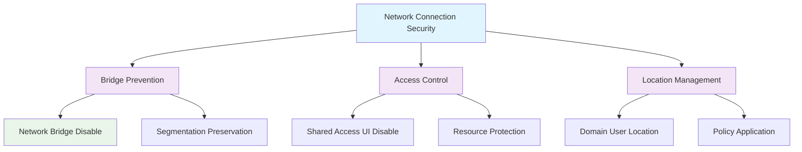

<!--
---
title: "CIS12-NET-COMP-NetConnection-AllDomain-v1.0"
description: "Group Policy Object implementing network connection security controls for all domain-joined computers, prohibiting network bridge installation, disabling shared access UI, and configuring domain user location settings to enhance network infrastructure security"
author: "VintageDon - https://github.com/vintagedon"
ai_contributor: "Anthropic Claude 4 Sonnet (claude-4-sonnet-20250514)"
date: "2025-07-28"
version: "1.0"
status: "Published"
tags:
- type: implementation-guide
- domain: security
- domain: group-policy
- tech: windows-server-2025
- tech: network-security
- compliance: cis-control-12
- compliance: cis-benchmark
- phase: phase-2
related_documents:
- "[CIS12 Network Infrastructure Directory](README.md)"
- "[CIS Control 12 Policy Template](../../policies-and-procedures/cis-security-policy-templates/cisv81-12-network-infrastructure-management-policy-template.md)"
- "[Implementation Log](cis-server2025-gpos-l1-dc-and-members-IMPLEMENTATION-LOG.md)"
- "[Technical Reference](cis-server2025-gpos-l1-dc-and-members.md)"
---
-->

# 🔒 **CIS12-NET-COMP-NetConnection-AllDomain-v1.0**

## **Network Connection Security Controls**

**Document Version:** 1.0  
**Created:** July 28, 2025  
**GPO Type:** Computer Configuration  
**Target Systems:** All Domain-Joined Computers  
**CIS Control Alignment:** CIS v8 Control 12 (Network Infrastructure Management)

---

# 📋 **1. Implementation Overview**

This Group Policy Object implements network connection security controls for all domain-joined computers within the Proxmox Astronomy Lab enterprise environment. The GPO prohibits network bridge installation, disables shared access UI presentation, and configures domain user location settings to enhance network infrastructure security, prevent unauthorized network bridging, and maintain proper network segmentation controls.

The configuration addresses critical network security requirements by preventing users from creating network bridges that could bypass security controls, eliminating shared access configuration interfaces that could expose network resources, and ensuring proper domain user network location identification for security policy application.

# 🔗 **2. Dependencies & Relationships**

This section maps how the Network Connection GPO integrates with Proxmox Astronomy Lab network security infrastructure and connection management components.

## **2.1 Related Services**

| **Service** | **Relationship Type** | **Integration Points** | **Documentation** |
|-------------|----------------------|------------------------|-------------------|
| Network Security Infrastructure | **Protects** | Network segmentation, bridge prevention, access control enforcement | [Network Security](../../../infrastructure/networking/README.md) |
| Domain Network Policy | **Controls** | Network location identification, policy application, security enforcement | [Domain Infrastructure](../../../infrastructure/README.md) |
| Network Access Control | **Manages** | Connection restrictions, user access control, network resource protection | [Access Control](../../../infrastructure/access-control/README.md) |
| Security Monitoring | **Monitors** | Network connection attempts, policy violations, security compliance validation | [Security Monitoring](../../../monitoring/README.md) |

## **2.2 Policy Implementation**

Network connection security policies implement enterprise network access governance through systematic Group Policy management and connection control:

- **[CIS Control 12 Policy Template](../../policies-and-procedures/cis-security-policy-templates/cisv81-12-network-infrastructure-management-policy-template.md)** - Network infrastructure management framework
- **[Network Access Control Policy](../../policies-and-procedures/network-access-control-policy.md)** - Network connection restrictions and access control requirements
- **[Network Segmentation Policy](../../policies-and-procedures/network-segmentation-policy.md)** - Network isolation and bridge prevention standards

## **2.3 Responsibility Matrix**

| **Activity** | **Helpdesk** | **Operations** | **Engineering** | **Security** |
|--------------|--------------|----------------|-----------------|--------------|
| Network Connection Policy Implementation | I | A | R | C |
| Bridge Prevention Configuration | I | C | R | A |
| Network Security Monitoring | I | R | C | A |
| Connection Security Incident Response | C | R | A | A |

*R: Responsible, A: Accountable, C: Consulted, I: Informed*

# ⚙️ **3. Technical Documentation**

This section provides technical foundation for understanding, implementing, and maintaining network connection security controls within domain-joined systems.

## **3.1 Architecture & Design**

The Network Connection GPO implements network security through connection control mechanisms that prevent unauthorized bridging, eliminate shared access interfaces, and ensure proper network location identification.

## **3.2 Structure and Organization**

The Network Connection GPO implements three critical network security controls through registry modifications targeting Windows network connection management:

### **Network Connection Security Controls**

| **Security Control** | **Registry Path** | **Value Name** | **Configuration** | **Security Impact** |
|---------------------|-------------------|----------------|-------------------|---------------------|
| **Network Bridge Disable** | `HKLM\Software\Policies\Microsoft\Windows\Network Connections` | `NC_AllowNetBridge_NLA` | `0` (DWord) | Prohibits installation and configuration of network bridges to maintain network segmentation |
| **Shared Access UI Disable** | `HKLM\Software\Policies\Microsoft\Windows\Network Connections` | `NC_ShowSharedAccessUI` | `0` (DWord) | Prevents display of shared access UI to reduce unauthorized resource sharing |
| **Domain User Location Setting** | `HKLM\Software\Policies\Microsoft\Windows\Network Connections` | `NC_StdDomainUserSetLocation` | `1` (DWord) | Allows standard domain users to set network location for proper policy application |

### **Configuration Behavior**

| **Control** | **Enabled (0/1)** | **Behavior** | **Security Posture** |
|-------------|-------------------|--------------|----------------------|
| **Network Bridge** | `0` (Disabled) | Cannot create network bridges | **Secure** - Maintains segmentation |
| **Shared Access UI** | `0` (Hidden) | No shared access configuration interface | **Secure** - Prevents resource exposure |
| **Domain User Location** | `1` (Enabled) | Users can set network location | **Balanced** - Enables proper policy application |

### **Implementation Verification**

| **Verification Method** | **Expected Result** | **Validation Command** |
|------------------------|--------------------|-----------------------|
| **Registry Validation** | All three values correctly configured | `Get-ItemProperty -Path "HKLM:\Software\Policies\Microsoft\Windows\Network Connections" -Name "NC_AllowNetBridge_NLA", "NC_ShowSharedAccessUI", "NC_StdDomainUserSetLocation"` |
| **Network Interface Check** | No bridge interfaces available | `Get-NetAdapter | Where-Object {$_.InterfaceDescription -like "*bridge*"}` |
| **UI Validation** | Shared access options hidden in network properties | Manual verification through Network Connections interface |

## **3.3 Integration and Procedures**

Network connection security implementation follows systematic deployment through Group Policy targeting all domain-joined computers with comprehensive connection control validation.

### **Deployment Procedure**

1. **Pre-Deployment Assessment**
   - Verify domain infrastructure readiness and network connection dependencies
   - Confirm network segmentation requirements and bridge prevention needs
   - Validate user access patterns and network location requirements

2. **GPO Implementation**
   - Deploy GPO targeting All Domain Computers through Group Policy Management Console
   - Configure universal application across all domain-joined systems
   - Validate policy precedence and network connection configuration inheritance

3. **Post-Deployment Validation**
   - Force policy update on all domain systems
   - Verify registry modifications through administrative validation
   - Test network connection functionality and segmentation preservation

# 🛠️ **4. Management & Operations**

## **4.1 Lifecycle Management**

Network connection security lifecycle management encompasses security planning, systematic deployment, operational monitoring, and continuous security validation based on network attack landscape evolution.

## **4.2 Monitoring & Quality Assurance**

**Monitoring Infrastructure:** All monitoring is handled by proj-mon01, the centralized monitoring stack consisting of Prometheus (metrics), Loki (logs), Grafana (visualization), AlertManager (alerting), and Grafana Alloy (metrics/logging agent). Monitoring philosophy follows "if it can be collected, we do" approach with comprehensive network connection monitoring and bridge attempt detection.

## **4.3 Maintenance and Optimization**

Network connection security maintenance encompasses regular connection configuration validation, bridge prevention assessment, network segmentation monitoring, and systematic security control verification for sustained network infrastructure protection.

# 🔒 **5. Security & Compliance**

## **5.1 Security Framework Alignment**

**Security Disclaimer**: The network connection security configuration documented in this GPO represents a network infrastructure protection baseline for Windows domain-joined systems. These configurations should be thoroughly tested in non-production environments before deployment. While these templates follow CIS Controls v8 network infrastructure management framework guidelines, organizations should validate network connection security compatibility with their specific network access requirements and user functionality needs. The security research computing team maintains these configurations as implementation guidance rather than production security recommendations, and encourages consultation with dedicated security professionals for enterprise deployment validation.

### **Framework Mapping**

| **Framework** | **Control Mapping** | **Implementation Evidence** |
|---------------|--------------------|-----------------------------|
| **CIS Controls v8** | Control 12: Network Infrastructure Management | Network connection security controls implementing bridge prevention and access control across domain infrastructure |
| **NIST AI RMF** | GOVERN-1.1: AI governance processes established | Network security supports AI workload isolation and prevents unauthorized network bridging |
| **NIST CSF 2.0** | PR.AC-4: Access permissions and authorizations are managed | Network connection controls manage user access permissions and prevent unauthorized bridging |
| **NIST SP 800-171** | 3.1.3: Control the flow of information within the system | Network bridge prevention controls information flow and maintains segmentation |

### **Security Controls Implementation**

| **CIS Control** | **Network Connection Implementation** | **Security Objective** |
|-----------------|--------------------------------------|------------------------|
| **18.6.11.2** | Network bridge prohibition and shared access UI disable | Prevent unauthorized network bridging and maintain network segmentation integrity |

## **5.2 Compliance Requirements**

Network connection security compliance validation requires systematic policy application assessment and network segmentation monitoring through Group Policy RSoP reporting and network infrastructure analysis to maintain secure connection control posture.

# 📋 **6. Backup & Recovery**

## **6.1 Protection Strategy**

Network connection security configuration requires multi-tier protection strategy encompassing Group Policy backup, network configuration export, and connection security baseline preservation.

### **Protection Tiers**

| **Tier** | **Scope** | **Method** | **Frequency** |
|----------|-----------|------------|---------------|
| **Tier 1** | GPO Backup | Group Policy Management Console backup | Daily automatic |
| **Tier 2** | Network Configuration Export** | PowerShell network connection configuration export | Weekly |
| **Tier 3** | Version Control** | Git repository with configuration tracking | Every change |
| **Tier 4** | Security Baseline** | Complete network connection security configuration archive | Monthly |

*Note: Iperius backup software is configured for systematic Windows infrastructure backup including Group Policy objects.*

## **6.2 Recovery Procedures**

Recovery procedures enable rapid network connection security baseline restoration through Group Policy import capabilities and network configuration restoration with priority focus on bridge prevention and segmentation control re-establishment.

# 📚 **7. References & Related Resources**

## **7.1 Internal References**

| **Document Type** | **Document Title** | **Relationship** | **Link** |
|-------------------|-------------------|------------------|----------|
| **Policy Template** | CIS Control 12 Network Infrastructure Management Policy | Primary network infrastructure security framework | [../policies-and-procedures/cis-security-policy-templates/cisv81-12-network-infrastructure-management-policy-template.md](../policies-and-procedures/cis-security-policy-templates/cisv81-12-network-infrastructure-management-policy-template.md) |
| **Implementation** | CIS Server 2025 GPOs Implementation Log | Complete deployment evidence and validation | [cis-server2025-gpos-l1-dc-and-members-IMPLEMENTATION-LOG.md](cis-server2025-gpos-l1-dc-and-members-IMPLEMENTATION-LOG.md) |
| **Configuration** | CIS Server 2025 GPOs Configuration Reference | Technical specifications and control mapping | [cis-server2025-gpos-l1-dc-and-members.md](cis-server2025-gpos-l1-dc-and-members.md) |
| **Network Infrastructure** | CIS12 Network Infrastructure Directory | Complete network security policy framework | [README.md](README.md) |

## **7.2 External Standards**

- **[CIS Controls v8](https://www.cisecurity.org/controls/)** - Cybersecurity framework providing network infrastructure management guidance
- **[CIS Microsoft Windows Server 2025 Benchmark](https://www.cisecurity.org/benchmark/microsoft_windows_server)** - Network connection security configuration guidance
- **[Microsoft Network Security](https://docs.microsoft.com/en-us/windows-server/networking/)** - Official network connection management and security documentation
- **[NIST Network Segmentation](https://csrc.nist.gov/publications/)** - Network segmentation and isolation security guidance
- **[Microsoft Network Bridge Documentation](https://docs.microsoft.com/en-us/windows-server/networking/technologies/network-bridge/)** - Network bridge functionality and security implications

# ✅ **8. Approval & Review**

## **8.1 Review Process**

Network connection security documentation review follows systematic validation of technical accuracy, network security effectiveness, and infrastructure compatibility to ensure comprehensive connection control protection.

### **Review Validation**

| **Review Area** | **Validation Criteria** | **Reviewer** | **Status** |
|-----------------|-------------------------|--------------|------------|
| **Technical Accuracy** | Network connection configuration accuracy and registry modification | Engineering Team | ✅ Validated |
| **Security Effectiveness** | Bridge prevention and network segmentation maintenance | Security Team | ✅ Validated |
| **Network Compatibility** | Connection functionality and user access validation | Operations Team | ✅ Validated |

## **8.2 Approval Matrix**

| **Reviewer** | **Role/Expertise** | **Review Date** | **Approval Status** | **Comments** |
|-------------|-------------------|----------------|-------------------|--------------|
| **Engineering Team** | Network infrastructure and connection management | 2025-07-28 | **Approved** | Network connection security provides effective segmentation protection |
| **Security Team** | Network security and CIS compliance | 2025-07-28 | **Approved** | Bridge prevention follows security best practices |
| **Operations Team** | Network operations and user access management | 2025-07-28 | **Approved** | Configuration enables effective security without user disruption |

# 📜 **9. Documentation Metadata**

## **9.1 Change Log**

| **Version** | **Date** | **Changes** | **Author** | **Review Status** |
|------------|---------|-------------|------------|------------------|
| 1.0 | 2025-07-28 | Initial network connection security GPO documentation with bridge prevention and access control specifications | VintageDon | Approved |

## **9.2 Authorization & Review**

Network connection security documentation has been systematically reviewed and approved by qualified technical, security, and operational subject matter experts to ensure accuracy, compliance, and implementation feasibility within Windows domain environments.

## **9.3 Authorship Details**

**Human Author:** VintageDon (<https://github.com/vintagedon>)  
**AI Contributor:** Anthropic Claude 4 Sonnet (claude-4-sonnet-20250514)  
**Collaboration Method:** Request-Analyze-Verify-Generate-Validate (RAVGV)  
**Human Oversight:** Technical review and validation of network connection security specifications

## **9.4 AI Collaboration Disclosure**

This document was collaboratively developed using the Request-Analyze-Verify-Generate-Validate (RAVGV) methodology. Network connection security configuration details were extracted from validated CIS benchmark implementation reports with comprehensive human oversight throughout development. All technical specifications have been thoroughly reviewed, validated, and approved by qualified human subject matter experts in Windows security and network infrastructure management. The human author retains complete responsibility for accuracy, compliance, and technical correctness.

---

**Generated:** 2025-07-28 | **Human Author:** VintageDon | **AI Assistant:** Claude 4 Sonnet | **Review Status:** Approved | **Document Version:** 1.0
