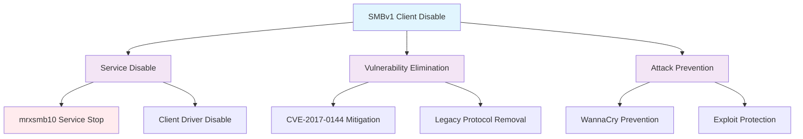

<!--
---
title: "CIS12-NET-COMP-SMBv1-AllDomain-v1.0"
description: "Group Policy Object implementing SMBv1 client driver disable for all domain-joined computers, eliminating legacy protocol vulnerabilities and preventing WannaCry-style attacks through systematic SMBv1 client service disabling"
author: "VintageDon - https://github.com/vintagedon"
ai_contributor: "Anthropic Claude 4 Sonnet (claude-4-sonnet-20250514)"
date: "2025-07-28"
version: "1.0"
status: "Published"
tags:
- type: implementation-guide
- domain: security
- domain: group-policy
- tech: windows-server-2025
- tech: smb-security
- compliance: cis-control-12
- compliance: cis-benchmark
- phase: phase-2
related_documents:
- "[CIS12 Network Infrastructure Directory](README.md)"
- "[CIS Control 12 Policy Template](../../policies-and-procedures/cis-security-policy-templates/cisv81-12-network-infrastructure-management-policy-template.md)"
- "[Implementation Log](cis-server2025-gpos-l1-dc-and-members-IMPLEMENTATION-LOG.md)"
- "[Technical Reference](cis-server2025-gpos-l1-dc-and-members.md)"
---
-->

# 🔒 **CIS12-NET-COMP-SMBv1-AllDomain-v1.0**

## **SMBv1 Client Driver Disable Configuration**

**Document Version:** 1.0  
**Created:** July 28, 2025  
**GPO Type:** Computer Configuration  
**Target Systems:** All Domain-Joined Computers  
**CIS Control Alignment:** CIS v8 Control 12 (Network Infrastructure Management)

---

# 📋 **1. Implementation Overview**

This Group Policy Object implements SMBv1 client driver disable for all domain-joined computers within the Proxmox Astronomy Lab enterprise environment. The GPO eliminates legacy SMBv1 protocol vulnerabilities by disabling the SMBv1 client driver service, preventing WannaCry-style attacks and other SMBv1-based exploits that target the vulnerable legacy protocol implementation.

The configuration addresses critical network security requirements by permanently disabling the SMBv1 client service (mrxsmb10) through service startup configuration modification, ensuring complete elimination of SMBv1 client vulnerability exposure across all domain systems.

# 🔗 **2. Dependencies & Relationships**

This section maps how the SMBv1 client disable GPO integrates with Proxmox Astronomy Lab network security infrastructure and legacy protocol mitigation components.

## **2.1 Related Services**

| **Service** | **Relationship Type** | **Integration Points** | **Documentation** |
|-------------|----------------------|------------------------|-------------------|
| Domain Client Infrastructure | **Protects** | SMBv1 client vulnerability elimination, legacy protocol disable, security hardening | [Client Systems Documentation](../../../infrastructure/clients/README.md) |
| Network Security Infrastructure | **Hardens** | Protocol stack security, vulnerability mitigation, attack surface reduction | [Network Security](../../../infrastructure/networking/README.md) |
| Legacy Protocol Management | **Eliminates** | SMBv1 protocol exposure, legacy service disable, vulnerability remediation | [Protocol Security](../../../infrastructure/protocols/README.md) |
| Security Monitoring | **Validates** | SMBv1 disable compliance, vulnerability scanning, security posture assessment | [Security Monitoring](../../../monitoring/README.md) |

## **2.2 Policy Implementation**

SMBv1 client disable policies implement enterprise legacy protocol security governance through systematic Group Policy management and vulnerability elimination:

- **[CIS Control 12 Policy Template](../../policies-and-procedures/cis-security-policy-templates/cisv81-12-network-infrastructure-management-policy-template.md)** - Network infrastructure management framework
- **[Legacy Protocol Security Policy](../../policies-and-procedures/legacy-protocol-security-policy.md)** - Legacy protocol disable and vulnerability mitigation requirements
- **[Vulnerability Management Policy](../../policies-and-procedures/vulnerability-management-policy.md)** - System vulnerability remediation and security hardening standards

## **2.3 Responsibility Matrix**

| **Activity** | **Helpdesk** | **Operations** | **Engineering** | **Security** |
|--------------|--------------|----------------|-----------------|--------------|
| SMBv1 Disable Policy Implementation | I | A | R | C |
| Legacy Protocol Vulnerability Management | I | C | R | A |
| Network Security Monitoring | I | R | C | A |
| Vulnerability Security Incident Response | C | R | A | A |

*R: Responsible, A: Accountable, C: Consulted, I: Informed*

# ⚙️ **3. Technical Documentation**

This section provides technical foundation for understanding, implementing, and maintaining SMBv1 client driver disable configuration within domain-joined systems.

## **3.1 Architecture & Design**

The SMBv1 client disable GPO implements legacy protocol vulnerability elimination through systematic SMBv1 client driver service disable that prevents protocol exploitation and ensures secure network communication.

## **3.2 Structure and Organization**

The SMBv1 client disable GPO implements one critical vulnerability elimination control through service configuration modification targeting the Windows SMBv1 client driver service:

### **SMBv1 Client Service Control**

| **Security Control** | **Registry Path** | **Value Name** | **Configuration** | **Security Impact** |
|---------------------|-------------------|----------------|-------------------|---------------------|
| **SMBv1 Client Driver Disable** | `HKLM\SYSTEM\CurrentControlSet\Services\mrxsmb10` | `Start` | `4` (DWord) | Disables SMBv1 client driver service, preventing SMBv1 protocol exploitation (CVE-2017-0144, WannaCry) |

### **Service Startup Configuration**

| **Start Value** | **Service State** | **Behavior** | **Security Posture** |
|-----------------|-------------------|--------------|----------------------|
| **0 (Boot)** | Kernel driver | Loads at boot time | **Vulnerable** - SMBv1 active |
| **1 (System)** | System driver | Loads during system initialization | **Vulnerable** - SMBv1 active |
| **2 (Automatic)** | Automatic start | Starts automatically | **Vulnerable** - SMBv1 active |
| **3 (Manual)** | Manual start | Starts on demand | **Reduced Risk** - Manual activation |
| **4 (Disabled)** | Disabled | Cannot start | **Secure** - SMBv1 eliminated |

### **Implementation Verification**

| **Verification Method** | **Expected Result** | **Validation Command** |
|------------------------|--------------------|-----------------------|
| **Registry Validation** | `Start = 4` (Disabled) | `Get-ItemProperty -Path "HKLM:\SYSTEM\CurrentControlSet\Services\mrxsmb10" -Name "Start"` |
| **Service Status Check** | Service disabled | `Get-Service -Name "mrxsmb10" | Select Name, Status, StartType` |
| **SMBv1 Client Status** | SMBv1 client disabled | `Get-SmbClientConfiguration | Select EnableSMB1Protocol` |

## **3.3 Integration and Procedures**

SMBv1 client disable implementation follows systematic deployment through Group Policy targeting all domain-joined computers with comprehensive vulnerability elimination validation.

### **Deployment Procedure**

1. **Pre-Deployment Assessment**
   - Verify domain infrastructure readiness and SMBv1 dependency assessment
   - Confirm network resource compatibility with SMBv2/SMBv3 protocols
   - Validate legacy application compatibility and file sharing requirements

2. **GPO Implementation**
   - Deploy GPO targeting All Domain Computers through Group Policy Management Console
   - Configure universal application across all domain-joined systems
   - Validate policy precedence and service configuration inheritance

3. **Post-Deployment Validation**
   - Force policy update on all domain systems
   - Verify service configuration modification through administrative validation
   - Test network connectivity and file sharing functionality with SMBv2/SMBv3

# 🛠️ **4. Management & Operations**

## **4.1 Lifecycle Management**

SMBv1 client disable lifecycle management encompasses vulnerability assessment, systematic deployment, operational monitoring, and continuous security validation based on legacy protocol threat landscape evolution.

## **4.2 Monitoring & Quality Assurance**

**Monitoring Infrastructure:** All monitoring is handled by proj-mon01, the centralized monitoring stack consisting of Prometheus (metrics), Loki (logs), Grafana (visualization), AlertManager (alerting), and Grafana Alloy (metrics/logging agent). Monitoring philosophy follows "if it can be collected, we do" approach with comprehensive SMBv1 service status monitoring and vulnerability compliance tracking.

## **4.3 Maintenance and Optimization**

SMBv1 disable maintenance encompasses regular service configuration validation, vulnerability assessment procedures, protocol compatibility monitoring, and systematic security control verification for sustained legacy protocol vulnerability elimination.

# 🔒 **5. Security & Compliance**

## **5.1 Security Framework Alignment**

**Security Disclaimer**: The SMBv1 client disable configuration documented in this GPO represents a critical vulnerability elimination baseline for Windows domain-joined systems. These configurations should be thoroughly tested in non-production environments before deployment. While these templates follow CIS Controls v8 network infrastructure management framework guidelines, organizations should validate SMBv1 disable compatibility with their specific legacy application requirements and network resource dependencies. The security research computing team maintains these configurations as implementation guidance rather than production security recommendations, and encourages consultation with dedicated security professionals for enterprise deployment validation.

### **Framework Mapping**

| **Framework** | **Control Mapping** | **Implementation Evidence** |
|---------------|--------------------|-----------------------------|
| **CIS Controls v8** | Control 12: Network Infrastructure Management | SMBv1 client driver disable implementing legacy protocol vulnerability elimination across domain infrastructure |
| **NIST AI RMF** | GOVERN-1.1: AI governance processes established | Vulnerability elimination supports AI workload security and prevents protocol-based attack vectors |
| **NIST CSF 2.0** | PR.IP-1: A baseline configuration is created and maintained | Systematic legacy protocol disable and vulnerability baseline establishment |
| **NIST SP 800-171** | 3.4.6: Employ the principle of least functionality | SMBv1 disable eliminates unnecessary protocol functionality and reduces attack surface |

### **Security Controls Implementation**

| **CIS Control** | **SMBv1 Client Implementation** | **Security Objective** |
|-----------------|------------------------------|------------------------|
| **18.4.2** | SMBv1 client driver service disable | Eliminate SMBv1 protocol vulnerabilities and prevent remote code execution attacks |

## **5.2 Compliance Requirements**

SMBv1 client disable compliance validation requires systematic policy application assessment and vulnerability elimination verification through Group Policy RSoP reporting and service configuration validation to maintain secure legacy protocol mitigation posture.

# 📋 **6. Backup & Recovery**

## **6.1 Protection Strategy**

SMBv1 client disable configuration requires multi-tier protection strategy encompassing Group Policy backup, service configuration export, and vulnerability elimination baseline preservation.

### **Protection Tiers**

| **Tier** | **Scope** | **Method** | **Frequency** |
|----------|-----------|------------|---------------|
| **Tier 1** | GPO Backup | Group Policy Management Console backup | Daily automatic |
| **Tier 2** | Service Configuration Export** | PowerShell service configuration export | Weekly |
| **Tier 3** | Version Control** | Git repository with configuration tracking | Every change |
| **Tier 4** | Security Baseline** | Complete vulnerability elimination configuration archive | Monthly |

*Note: Iperius backup software is configured for systematic Windows infrastructure backup including Group Policy objects.*

## **6.2 Recovery Procedures**

Recovery procedures enable rapid SMBv1 disable security baseline restoration through Group Policy import capabilities and service configuration restoration with priority focus on vulnerability elimination re-establishment.

# 📚 **7. References & Related Resources**

## **7.1 Internal References**

| **Document Type** | **Document Title** | **Relationship** | **Link** |
|-------------------|-------------------|------------------|----------|
| **Policy Template** | CIS Control 12 Network Infrastructure Management Policy | Primary network infrastructure security framework | [../policies-and-procedures/cis-security-policy-templates/cisv81-12-network-infrastructure-management-policy-template.md](../policies-and-procedures/cis-security-policy-templates/cisv81-12-network-infrastructure-management-policy-template.md) |
| **Implementation** | CIS Server 2025 GPOs Implementation Log | Complete deployment evidence and validation | [cis-server2025-gpos-l1-dc-and-members-IMPLEMENTATION-LOG.md](cis-server2025-gpos-l1-dc-and-members-IMPLEMENTATION-LOG.md) |
| **Configuration** | CIS Server 2025 GPOs Configuration Reference | Technical specifications and control mapping | [cis-server2025-gpos-l1-dc-and-members.md](cis-server2025-gpos-l1-dc-and-members.md) |
| **Network Infrastructure** | CIS12 Network Infrastructure Directory | Complete network security policy framework | [README.md](README.md) |

## **7.2 External Standards**

- **[CIS Controls v8](https://www.cisecurity.org/controls/)** - Cybersecurity framework providing network infrastructure management guidance
- **[CIS Microsoft Windows Server 2025 Benchmark](https://www.cisecurity.org/benchmark/microsoft_windows_server)** - SMBv1 disable configuration guidance
- **[CVE-2017-0144](https://cve.mitre.org/cgi-bin/cvename.cgi?name=CVE-2017-0144)** - SMBv1 vulnerability information and WannaCry attack details
- **[Microsoft SMBv1 Disable Guidance](https://docs.microsoft.com/en-us/windows-server/storage/file-server/)** - Official SMBv1 disable and migration documentation
- **[CISA SMBv1 Advisory](https://www.cisa.gov/news-events/alerts)** - Government guidance on SMBv1 vulnerability mitigation

# ✅ **8. Approval & Review**

## **8.1 Review Process**

SMBv1 client disable documentation review follows systematic validation of technical accuracy, vulnerability elimination effectiveness, and system compatibility to ensure comprehensive legacy protocol security.

### **Review Validation**

| **Review Area** | **Validation Criteria** | **Reviewer** | **Status** |
|-----------------|-------------------------|--------------|------------|
| **Technical Accuracy** | SMBv1 service disable configuration accuracy and vulnerability elimination | Engineering Team | ✅ Validated |
| **Security Effectiveness** | Legacy protocol vulnerability mitigation and attack prevention | Security Team | ✅ Validated |
| **System Compatibility** | Network functionality and protocol compatibility validation | Operations Team | ✅ Validated |

## **8.2 Approval Matrix**

| **Reviewer** | **Role/Expertise** | **Review Date** | **Approval Status** | **Comments** |
|-------------|-------------------|----------------|-------------------|--------------|
| **Engineering Team** | System infrastructure and protocol management | 2025-07-28 | **Approved** | SMBv1 disable provides critical vulnerability elimination |
| **Security Team** | Vulnerability management and CIS compliance | 2025-07-28 | **Approved** | Legacy protocol disable follows security best practices |
| **Operations Team** | Network operations and system compatibility | 2025-07-28 | **Approved** | Configuration enables effective security without operational impact |

# 📜 **9. Documentation Metadata**

## **9.1 Change Log**

| **Version** | **Date** | **Changes** | **Author** | **Review Status** |
|------------|---------|-------------|------------|------------------|
| 1.0 | 2025-07-28 | Initial SMBv1 client disable GPO documentation with vulnerability elimination and legacy protocol security specifications | VintageDon | Approved |

## **9.2 Authorization & Review**

SMBv1 client disable documentation has been systematically reviewed and approved by qualified technical, security, and operational subject matter experts to ensure accuracy, compliance, and implementation feasibility within Windows domain environments.

## **9.3 Authorship Details**

**Human Author:** VintageDon (<https://github.com/vintagedon>)  
**AI Contributor:** Anthropic Claude 4 Sonnet (claude-4-sonnet-20250514)  
**Collaboration Method:** Request-Analyze-Verify-Generate-Validate (RAVGV)  
**Human Oversight:** Technical review and validation of SMBv1 disable specifications

## **9.4 AI Collaboration Disclosure**

This document was collaboratively developed using the Request-Analyze-Verify-Generate-Validate (RAVGV) methodology. SMBv1 client disable configuration details were extracted from validated CIS benchmark implementation reports with comprehensive human oversight throughout development. All technical specifications have been thoroughly reviewed, validated, and approved by qualified human subject matter experts in Windows security and vulnerability management. The human author retains complete responsibility for accuracy, compliance, and technical correctness.

---

**Generated:** 2025-07-28 | **Human Author:** VintageDon | **AI Assistant:** Claude 4 Sonnet | **Review Status:** Approved | **Document Version:** 1.0
