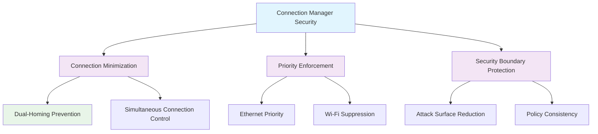

<!--
---
title: "CIS12-NET-COMP-WinConnectionMgr-AllDomain-v1.0"
description: "Group Policy Object implementing Windows Connection Manager security configuration for all domain-joined computers, minimizing simultaneous network connections to prevent Wi-Fi use when Ethernet is available and enhance network security posture"
author: "VintageDon - https://github.com/vintagedon"
ai_contributor: "Anthropic Claude 4 Sonnet (claude-4-sonnet-20250514)"
date: "2025-07-28"
version: "1.0"
status: "Published"
tags:
- type: implementation-guide
- domain: security
- domain: group-policy
- tech: windows-server-2025
- tech: connection-manager
- compliance: cis-control-12
- compliance: cis-benchmark
- phase: phase-2
related_documents:
- "[CIS12 Network Infrastructure Directory](README.md)"
- "[CIS Control 12 Policy Template](../../policies-and-procedures/cis-security-policy-templates/cisv81-12-network-infrastructure-management-policy-template.md)"
- "[Implementation Log](cis-server2025-gpos-l1-dc-and-members-IMPLEMENTATION-LOG.md)"
- "[Technical Reference](cis-server2025-gpos-l1-dc-and-members.md)"
---
-->

# 🔒 **CIS12-NET-COMP-WinConnectionMgr-AllDomain-v1.0**

## **Windows Connection Manager Security Configuration**

**Document Version:** 1.0  
**Created:** July 28, 2025  
**GPO Type:** Computer Configuration  
**Target Systems:** All Domain-Joined Computers  
**CIS Control Alignment:** CIS v8 Control 12 (Network Infrastructure Management)

---

# 📋 **1. Implementation Overview**

This Group Policy Object implements Windows Connection Manager security configuration for all domain-joined computers within the Proxmox Astronomy Lab enterprise environment. The GPO minimizes simultaneous network connections by preventing Wi-Fi connectivity when Ethernet is available, reducing attack surface, eliminating dual-homed security risks, and maintaining consistent network security policy enforcement through controlled connection prioritization.

The configuration addresses critical network security requirements by preventing users from establishing multiple concurrent network connections that could bypass security controls, create routing vulnerabilities, or enable unauthorized network bridging essential for maintaining network security boundaries and connection integrity across the domain infrastructure.

# 🔗 **2. Dependencies & Relationships**

This section maps how the Windows Connection Manager GPO integrates with Proxmox Astronomy Lab network security infrastructure and connection management components.

## **2.1 Related Services**

| **Service** | **Relationship Type** | **Integration Points** | **Documentation** |
|-------------|----------------------|------------------------|-------------------|
| Network Security Infrastructure | **Controls** | Connection prioritization, dual-homing prevention, security boundary maintenance | [Network Security](../../../infrastructure/networking/README.md) |
| Wireless Network Management | **Manages** | Wi-Fi connection control, Ethernet prioritization, connection policy enforcement | [Wireless Infrastructure](../../../infrastructure/wireless/README.md) |
| Network Access Control | **Enforces** | Connection restrictions, policy enforcement, security boundary preservation | [Access Control](../../../infrastructure/access-control/README.md) |
| Security Monitoring | **Monitors** | Connection behavior, policy compliance, security violation detection | [Security Monitoring](../../../monitoring/README.md) |

## **2.2 Policy Implementation**

Windows Connection Manager security policies implement enterprise network connection governance through systematic Group Policy management and connection control:

- **[CIS Control 12 Policy Template](../../policies-and-procedures/cis-security-policy-templates/cisv81-12-network-infrastructure-management-policy-template.md)** - Network infrastructure management framework
- **[Network Connection Policy](../../policies-and-procedures/network-connection-policy.md)** - Network connection prioritization and security requirements
- **[Wireless Security Policy](../../policies-and-procedures/wireless-security-policy.md)** - Wireless connection control and security standards

## **2.3 Responsibility Matrix**

| **Activity** | **Helpdesk** | **Operations** | **Engineering** | **Security** |
|--------------|--------------|----------------|-----------------|--------------|
| Connection Manager Policy Implementation | I | A | R | C |
| Connection Minimization Configuration | I | C | R | A |
| Network Connection Security Monitoring | I | R | C | A |
| Connection Security Incident Response | C | R | A | A |

*R: Responsible, A: Accountable, C: Consulted, I: Informed*

# ⚙️ **3. Technical Documentation**

This section provides technical foundation for understanding, implementing, and maintaining Windows Connection Manager security configuration within domain-joined systems.

## **3.1 Architecture & Design**

The Windows Connection Manager GPO implements network security through connection minimization that prevents dual-homing vulnerabilities and ensures consistent security policy enforcement.

## **3.2 Structure and Organization**

The Windows Connection Manager GPO implements one critical network security control through registry modification targeting Windows Connection Manager service configuration:

### **Connection Manager Security Control**

| **Security Control** | **Registry Path** | **Value Name** | **Configuration** | **Security Impact** |
|---------------------|-------------------|----------------|-------------------|---------------------|
| **Connection Minimization** | `HKLM\Software\Policies\Microsoft\Windows\WcmSvc\GroupPolicy` | `fMinimizeConnections` | `3` (DWord) | Minimizes simultaneous connections by preventing Wi-Fi when Ethernet is available, reducing dual-homing security risks |

### **Connection Minimization Levels**

| **Level** | **Value** | **Behavior** | **Security Posture** |
|-----------|-----------|--------------|----------------------|
| **Disabled** | `0` | Allow all simultaneous connections | **Insecure** - Dual-homing vulnerabilities |
| **Minimize to single** | `1` | Allow only one connection type | **Moderate** - Basic connection control |
| **Minimize with preference** | `2` | Prefer wired over wireless | **Good** - Connection prioritization |
| **Minimize connections** | `3` | Prevent Wi-Fi when Ethernet available | **Secure** - Comprehensive dual-homing prevention |

### **Implementation Verification**

| **Verification Method** | **Expected Result** | **Validation Command** |
|------------------------|--------------------|-----------------------|
| **Registry Validation** | `fMinimizeConnections = 3` | `Get-ItemProperty -Path "HKLM:\Software\Policies\Microsoft\Windows\WcmSvc\GroupPolicy" -Name "fMinimizeConnections"` |
| **Connection Behavior Test** | Wi-Fi disabled when Ethernet connected | Test network adapter behavior with both connection types available |
| **Network Adapter Status** | Only one active connection at a time | `Get-NetAdapter | Where-Object {$_.Status -eq "Up"}` |

## **3.3 Integration and Procedures**

Windows Connection Manager security implementation follows systematic deployment through Group Policy targeting all domain-joined computers with comprehensive connection control validation.

### **Deployment Procedure**

1. **Pre-Deployment Assessment**
   - Verify domain infrastructure readiness and network connection dependencies
   - Confirm Ethernet infrastructure availability and wireless network requirements
   - Validate user connectivity patterns and mobile device usage scenarios

2. **GPO Implementation**
   - Deploy GPO targeting All Domain Computers through Group Policy Management Console
   - Configure universal application across all domain-joined systems
   - Validate policy precedence and Connection Manager configuration inheritance

3. **Post-Deployment Validation**
   - Force policy update on all domain systems
   - Verify registry modification through administrative validation
   - Test connection behavior with both Ethernet and Wi-Fi available

# 🛠️ **4. Management & Operations**

## **4.1 Lifecycle Management**

Windows Connection Manager security lifecycle management encompasses connection assessment, systematic deployment, operational monitoring, and continuous security validation based on network connection threat landscape evolution.

## **4.2 Monitoring & Quality Assurance**

**Monitoring Infrastructure:** All monitoring is handled by proj-mon01, the centralized monitoring stack consisting of Prometheus (metrics), Loki (logs), Grafana (visualization), AlertManager (alerting), and Grafana Alloy (metrics/logging agent). Monitoring philosophy follows "if it can be collected, we do" approach with comprehensive network connection monitoring and dual-homing detection.

## **4.3 Maintenance and Optimization**

Windows Connection Manager security maintenance encompasses regular connection configuration validation, dual-homing assessment, network connectivity monitoring, and systematic security control verification for sustained connection security protection.

# 🔒 **5. Security & Compliance**

## **5.1 Security Framework Alignment**

**Security Disclaimer**: The Windows Connection Manager security configuration documented in this GPO represents a network connection security baseline for Windows domain-joined systems. These configurations should be thoroughly tested in non-production environments before deployment. While these templates follow CIS Controls v8 network infrastructure management framework guidelines, organizations should validate Connection Manager security compatibility with their specific mobile device requirements and wireless connectivity needs. The security research computing team maintains these configurations as implementation guidance rather than production security recommendations, and encourages consultation with dedicated security professionals for enterprise deployment validation.

### **Framework Mapping**

| **Framework** | **Control Mapping** | **Implementation Evidence** |
|---------------|--------------------|-----------------------------|
| **CIS Controls v8** | Control 12: Network Infrastructure Management | Windows Connection Manager security configuration implementing connection minimization across domain infrastructure |
| **NIST AI RMF** | GOVERN-1.1: AI governance processes established | Connection security supports AI workload network isolation and prevents dual-homing vulnerabilities |
| **NIST CSF 2.0** | PR.AC-4: Access permissions and authorizations are managed | Connection minimization manages network access permissions and prevents unauthorized dual connections |
| **NIST SP 800-171** | 3.1.3: Control the flow of information within the system | Connection control manages information flow and prevents dual-homing data leakage |

### **Security Controls Implementation**

| **CIS Control** | **Connection Manager Implementation** | **Security Objective** |
|-----------------|--------------------------------------|------------------------|
| **18.6.21.1** | Connection minimization to prevent Wi-Fi when Ethernet available | Eliminate dual-homing vulnerabilities and maintain consistent network security policy enforcement |

## **5.2 Compliance Requirements**

Windows Connection Manager security compliance validation requires systematic policy application assessment and connection behavior monitoring through Group Policy RSoP reporting and network connection analysis to maintain secure connection control posture.

# 📋 **6. Backup & Recovery**

## **6.1 Protection Strategy**

Windows Connection Manager security configuration requires multi-tier protection strategy encompassing Group Policy backup, connection configuration export, and network security baseline preservation.

### **Protection Tiers**

| **Tier** | **Scope** | **Method** | **Frequency** |
|----------|-----------|------------|---------------|
| **Tier 1** | GPO Backup | Group Policy Management Console backup | Daily automatic |
| **Tier 2** | Connection Manager Configuration Export** | PowerShell connection configuration export | Weekly |
| **Tier 3** | Version Control** | Git repository with configuration tracking | Every change |
| **Tier 4** | Security Baseline** | Complete connection manager security configuration archive | Monthly |

*Note: Iperius backup software is configured for systematic Windows infrastructure backup including Group Policy objects.*

## **6.2 Recovery Procedures**

Recovery procedures enable rapid Windows Connection Manager security baseline restoration through Group Policy import capabilities and connection configuration restoration with priority focus on connection minimization and dual-homing prevention re-establishment.

# 📚 **7. References & Related Resources**

## **7.1 Internal References**

| **Document Type** | **Document Title** | **Relationship** | **Link** |
|-------------------|-------------------|------------------|----------|
| **Policy Template** | CIS Control 12 Network Infrastructure Management Policy | Primary network infrastructure security framework | [../policies-and-procedures/cis-security-policy-templates/cisv81-12-network-infrastructure-management-policy-template.md](../policies-and-procedures/cis-security-policy-templates/cisv81-12-network-infrastructure-management-policy-template.md) |
| **Implementation** | CIS Server 2025 GPOs Implementation Log | Complete deployment evidence and validation | [cis-server2025-gpos-l1-dc-and-members-IMPLEMENTATION-LOG.md](cis-server2025-gpos-l1-dc-and-members-IMPLEMENTATION-LOG.md) |
| **Configuration** | CIS Server 2025 GPOs Configuration Reference | Technical specifications and control mapping | [cis-server2025-gpos-l1-dc-and-members.md](cis-server2025-gpos-l1-dc-and-members.md) |
| **Network Infrastructure** | CIS12 Network Infrastructure Directory | Complete network security policy framework | [README.md](README.md) |

## **7.2 External Standards**

- **[CIS Controls v8](https://www.cisecurity.org/controls/)** - Cybersecurity framework providing network infrastructure management guidance
- **[CIS Microsoft Windows Server 2025 Benchmark](https://www.cisecurity.org/benchmark/microsoft_windows_server)** - Windows Connection Manager security configuration guidance
- **[Microsoft Connection Manager Documentation](https://docs.microsoft.com/en-us/windows-server/networking/)** - Official Windows Connection Manager configuration and security documentation
- **[NIST Network Security](https://csrc.nist.gov/publications/)** - Network connection security guidance and dual-homing prevention
- **[Microsoft Wireless Security](https://docs.microsoft.com/en-us/windows-server/networking/wireless/)** - Wireless network security and connection management guidance

# ✅ **8. Approval & Review**

## **8.1 Review Process**

Windows Connection Manager security documentation review follows systematic validation of technical accuracy, connection security effectiveness, and network compatibility to ensure comprehensive connection control protection.

### **Review Validation**

| **Review Area** | **Validation Criteria** | **Reviewer** | **Status** |
|-----------------|-------------------------|--------------|------------|
| **Technical Accuracy** | Connection Manager configuration accuracy and registry modification | Engineering Team | ✅ Validated |
| **Security Effectiveness** | Dual-homing prevention and connection minimization | Security Team | ✅ Validated |
| **Network Compatibility** | Connection functionality and user mobility validation | Operations Team | ✅ Validated |

## **8.2 Approval Matrix**

| **Reviewer** | **Role/Expertise** | **Review Date** | **Approval Status** | **Comments** |
|-------------|-------------------|----------------|-------------------|--------------|
| **Engineering Team** | Network infrastructure and connection management | 2025-07-28 | **Approved** | Connection Manager security provides effective dual-homing prevention |
| **Security Team** | Network connection security and CIS compliance | 2025-07-28 | **Approved** | Connection minimization follows security best practices |
| **Operations Team** | Network operations and user connectivity management | 2025-07-28 | **Approved** | Configuration enables effective security without connectivity disruption |

# 📜 **9. Documentation Metadata**

## **9.1 Change Log**

| **Version** | **Date** | **Changes** | **Author** | **Review Status** |
|------------|---------|-------------|------------|------------------|
| 1.0 | 2025-07-28 | Initial Windows Connection Manager security GPO documentation with connection minimization and dual-homing prevention specifications | VintageDon | Approved |

## **9.2 Authorization & Review**

Windows Connection Manager security documentation has been systematically reviewed and approved by qualified technical, security, and operational subject matter experts to ensure accuracy, compliance, and implementation feasibility within Windows domain environments.

## **9.3 Authorship Details**

**Human Author:** VintageDon (<https://github.com/vintagedon>)  
**AI Contributor:** Anthropic Claude 4 Sonnet (claude-4-sonnet-20250514)  
**Collaboration Method:** Request-Analyze-Verify-Generate-Validate (RAVGV)  
**Human Oversight:** Technical review and validation of Windows Connection Manager security specifications

## **9.4 AI Collaboration Disclosure**

This document was collaboratively developed using the Request-Analyze-Verify-Generate-Validate (RAVGV) methodology. Windows Connection Manager security configuration details were extracted from validated CIS benchmark implementation reports with comprehensive human oversight throughout development. All technical specifications have been thoroughly reviewed, validated, and approved by qualified human subject matter experts in Windows security and network connection management. The human author retains complete responsibility for accuracy, compliance, and technical correctness.

---

**Generated:** 2025-07-28 | **Human Author:** VintageDon | **AI Assistant:** Claude 4 Sonnet | **Review Status:** Approved | **Document Version:** 1.0
