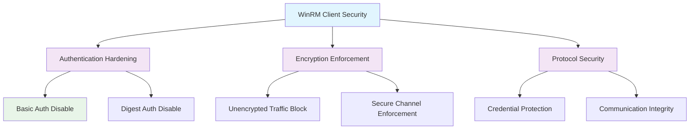

<!--
---
title: "CIS12-NET-COMP-WinRM-Client-AllDomain-v1.0"
description: "Group Policy Object implementing WinRM client security configuration for all domain-joined computers, disabling basic authentication, digest authentication, and unencrypted traffic to enhance Windows Remote Management security"
author: "VintageDon - https://github.com/vintagedon"
ai_contributor: "Anthropic Claude 4 Sonnet (claude-4-sonnet-20250514)"
date: "2025-07-28"
version: "1.0"
status: "Published"
tags:
- type: implementation-guide
- domain: security
- domain: group-policy
- tech: windows-server-2025
- tech: winrm-security
- compliance: cis-control-12
- compliance: cis-benchmark
- phase: phase-2
related_documents:
- "[CIS12 Network Infrastructure Directory](README.md)"
- "[CIS Control 12 Policy Template](../../policies-and-procedures/cis-security-policy-templates/cisv81-12-network-infrastructure-management-policy-template.md)"
- "[Implementation Log](cis-server2025-gpos-l1-dc-and-members-IMPLEMENTATION-LOG.md)"
- "[Technical Reference](cis-server2025-gpos-l1-dc-and-members.md)"
---
-->

# 🔒 **CIS12-NET-COMP-WinRM-Client-AllDomain-v1.0**

## **WinRM Client Security Configuration**

**Document Version:** 1.0  
**Created:** July 28, 2025  
**GPO Type:** Computer Configuration  
**Target Systems:** All Domain-Joined Computers  
**CIS Control Alignment:** CIS v8 Control 12 (Network Infrastructure Management)

---

# 📋 **1. Implementation Overview**

This Group Policy Object implements WinRM client security configuration for all domain-joined computers within the Proxmox Astronomy Lab enterprise environment. The GPO disables basic authentication, digest authentication, and unencrypted traffic for Windows Remote Management client connections to prevent credential exposure, enforce secure communication protocols, and maintain authentication integrity for remote management operations.

The configuration addresses critical remote management security requirements by eliminating insecure authentication methods, preventing cleartext credential transmission, and enforcing encrypted communication channels essential for secure administrative access and remote system management across the domain infrastructure.

# 🔗 **2. Dependencies & Relationships**

This section maps how the WinRM Client GPO integrates with Proxmox Astronomy Lab remote management infrastructure and secure communication components.

## **2.1 Related Services**

| **Service** | **Relationship Type** | **Integration Points** | **Documentation** |
|-------------|----------------------|------------------------|-------------------|
| Remote Management Infrastructure | **Secures** | WinRM client authentication, secure communication, credential protection | [Remote Management](../../../infrastructure/remote-management/README.md) |
| Administrative Access Systems | **Protects** | Remote administration, secure connectivity, authentication validation | [Administrative Access](../../../infrastructure/administrative-access/README.md) |
| Network Security Infrastructure | **Hardens** | Encrypted communication, authentication security, protocol hardening | [Network Security](../../../infrastructure/networking/README.md) |
| Security Monitoring | **Monitors** | WinRM connection attempts, authentication events, security compliance validation | [Security Monitoring](../../../monitoring/README.md) |

## **2.2 Policy Implementation**

WinRM client security policies implement enterprise remote management governance through systematic Group Policy management and secure communication enforcement:

- **[CIS Control 12 Policy Template](../../policies-and-procedures/cis-security-policy-templates/cisv81-12-network-infrastructure-management-policy-template.md)** - Network infrastructure management framework
- **[Remote Management Security Policy](../../policies-and-procedures/remote-management-security-policy.md)** - Secure remote access and authentication requirements
- **[Administrative Access Policy](../../policies-and-procedures/administrative-access-policy.md)** - Administrative communication security and credential protection standards

## **2.3 Responsibility Matrix**

| **Activity** | **Helpdesk** | **Operations** | **Engineering** | **Security** |
|--------------|--------------|----------------|-----------------|--------------|
| WinRM Client Policy Implementation | I | A | R | C |
| Authentication Security Configuration | I | C | R | A |
| Remote Management Security Monitoring | I | R | C | A |
| WinRM Security Incident Response | C | R | A | A |

*R: Responsible, A: Accountable, C: Consulted, I: Informed*

# ⚙️ **3. Technical Documentation**

This section provides technical foundation for understanding, implementing, and maintaining WinRM client security configuration within domain-joined systems.

## **3.1 Architecture & Design**

The WinRM Client GPO implements remote management security through authentication hardening and encryption enforcement that prevents credential exposure and ensures secure communication channels.

## **3.2 Structure and Organization**

The WinRM Client GPO implements three critical remote management security controls through registry modifications targeting Windows Remote Management client configuration:

### **WinRM Client Security Controls**

| **Security Control** | **Registry Path** | **Value Name** | **Configuration** | **Security Impact** |
|---------------------|-------------------|----------------|-------------------|---------------------|
| **Basic Authentication Disable** | `HKLM\Software\Policies\Microsoft\Windows\WinRM\Client` | `AllowBasic` | `0` (DWord) | Prevents WinRM client from using basic authentication, eliminating cleartext credential transmission |
| **Digest Authentication Disable** | `HKLM\Software\Policies\Microsoft\Windows\WinRM\Client` | `AllowDigest` | `0` (DWord) | Disables digest authentication for WinRM client, preventing weak authentication method usage |
| **Unencrypted Traffic Block** | `HKLM\Software\Policies\Microsoft\Windows\WinRM\Client` | `AllowUnencryptedTraffic` | `0` (DWord) | Prohibits unencrypted WinRM client communication, enforcing encrypted channel usage |

### **Authentication Security Levels**

| **Authentication Method** | **Security Level** | **Credential Exposure** | **Recommendation** |
|---------------------------|-------------------|------------------------|-------------------|
| **Basic Authentication** | **Very Low** | Cleartext transmission | **Disable** - High risk |
| **Digest Authentication** | **Low** | Hash-based but weak | **Disable** - Moderate risk |
| **Kerberos Authentication** | **High** | Encrypted and secure | **Preferred** - Secure |
| **Certificate Authentication** | **High** | Certificate-based secure | **Acceptable** - Secure |

### **Implementation Verification**

| **Verification Method** | **Expected Result** | **Validation Command** |
|------------------------|--------------------|-----------------------|
| **Registry Validation** | All three values set to `0` | `Get-ItemProperty -Path "HKLM:\Software\Policies\Microsoft\Windows\WinRM\Client" -Name "AllowBasic", "AllowDigest", "AllowUnencryptedTraffic"` |
| **WinRM Client Configuration** | Insecure methods disabled | `winrm get winrm/config/client` |
| **Connection Testing** | Only secure authentication methods work | Test WinRM connections with various authentication types |

## **3.3 Integration and Procedures**

WinRM client security implementation follows systematic deployment through Group Policy targeting all domain-joined computers with comprehensive secure communication validation.

### **Deployment Procedure**

1. **Pre-Deployment Assessment**
   - Verify domain infrastructure readiness and WinRM client dependencies
   - Confirm secure authentication infrastructure (Kerberos, certificates)
   - Validate remote management workflows and administrative access patterns

2. **GPO Implementation**
   - Deploy GPO targeting All Domain Computers through Group Policy Management Console
   - Configure universal application across all domain-joined systems
   - Validate policy precedence and WinRM client configuration inheritance

3. **Post-Deployment Validation**
   - Force policy update on all domain systems
   - Verify registry modifications through administrative validation
   - Test secure WinRM connectivity and administrative functionality

# 🛠️ **4. Management & Operations**

## **4.1 Lifecycle Management**

WinRM client security lifecycle management encompasses remote management assessment, systematic deployment, operational monitoring, and continuous security validation based on remote access threat landscape evolution.

## **4.2 Monitoring & Quality Assurance**

**Monitoring Infrastructure:** All monitoring is handled by proj-mon01, the centralized monitoring stack consisting of Prometheus (metrics), Loki (logs), Grafana (visualization), AlertManager (alerting), and Grafana Alloy (metrics/logging agent). Monitoring philosophy follows "if it can be collected, we do" approach with comprehensive WinRM client authentication monitoring and secure connection validation.

## **4.3 Maintenance and Optimization**

WinRM client security maintenance encompasses regular authentication configuration validation, secure communication assessment, remote management monitoring, and systematic security control verification for sustained remote access protection.

# 🔒 **5. Security & Compliance**

## **5.1 Security Framework Alignment**

**Security Disclaimer**: The WinRM client security configuration documented in this GPO represents a remote management security baseline for Windows domain-joined systems. These configurations should be thoroughly tested in non-production environments before deployment. While these templates follow CIS Controls v8 network infrastructure management framework guidelines, organizations should validate WinRM client security compatibility with their specific remote management requirements and administrative access workflows. The security research computing team maintains these configurations as implementation guidance rather than production security recommendations, and encourages consultation with dedicated security professionals for enterprise deployment validation.

### **Framework Mapping**

| **Framework** | **Control Mapping** | **Implementation Evidence** |
|---------------|--------------------|-----------------------------|
| **CIS Controls v8** | Control 12: Network Infrastructure Management | WinRM client security configuration implementing authentication hardening across domain infrastructure |
| **NIST AI RMF** | GOVERN-1.1: AI governance processes established | Secure remote management supports AI workload administration and prevents credential compromise |
| **NIST CSF 2.0** | PR.AC-1: Identities and credentials are issued, managed, verified | WinRM authentication controls ensure proper credential validation and secure access |
| **NIST SP 800-171** | 3.5.2: Authenticate network communications | Systematic WinRM authentication validation and secure communication enforcement |

### **Security Controls Implementation**

| **CIS Control** | **WinRM Client Implementation** | **Security Objective** |
|-----------------|--------------------------------|------------------------|
| **18.10.89.1.1** | Basic and digest authentication disable with encryption enforcement | Prevent credential exposure and ensure secure remote management communication |

## **5.2 Compliance Requirements**

WinRM client security compliance validation requires systematic policy application assessment and secure communication monitoring through Group Policy RSoP reporting and remote management authentication validation to maintain secure WinRM client configuration posture.

# 📋 **6. Backup & Recovery**

## **6.1 Protection Strategy**

WinRM client security configuration requires multi-tier protection strategy encompassing Group Policy backup, remote management configuration export, and secure communication baseline preservation.

### **Protection Tiers**

| **Tier** | **Scope** | **Method** | **Frequency** |
|----------|-----------|------------|---------------|
| **Tier 1** | GPO Backup | Group Policy Management Console backup | Daily automatic |
| **Tier 2** | WinRM Configuration Export** | PowerShell WinRM client configuration export | Weekly |
| **Tier 3** | Version Control** | Git repository with configuration tracking | Every change |
| **Tier 4** | Security Baseline** | Complete WinRM client security configuration archive | Monthly |

*Note: Iperius backup software is configured for systematic Windows infrastructure backup including Group Policy objects.*

## **6.2 Recovery Procedures**

Recovery procedures enable rapid WinRM client security baseline restoration through Group Policy import capabilities and remote management configuration restoration with priority focus on authentication hardening and encryption enforcement re-establishment.

# 📚 **7. References & Related Resources**

## **7.1 Internal References**

| **Document Type** | **Document Title** | **Relationship** | **Link** |
|-------------------|-------------------|------------------|----------|
| **Policy Template** | CIS Control 12 Network Infrastructure Management Policy | Primary network infrastructure security framework | [../policies-and-procedures/cis-security-policy-templates/cisv81-12-network-infrastructure-management-policy-template.md](../policies-and-procedures/cis-security-policy-templates/cisv81-12-network-infrastructure-management-policy-template.md) |
| **Implementation** | CIS Server 2025 GPOs Implementation Log | Complete deployment evidence and validation | [cis-server2025-gpos-l1-dc-and-members-IMPLEMENTATION-LOG.md](cis-server2025-gpos-l1-dc-and-members-IMPLEMENTATION-LOG.md) |
| **Configuration** | CIS Server 2025 GPOs Configuration Reference | Technical specifications and control mapping | [cis-server2025-gpos-l1-dc-and-members.md](cis-server2025-gpos-l1-dc-and-members.md) |
| **Network Infrastructure** | CIS12 Network Infrastructure Directory | Complete network security policy framework | [README.md](README.md) |

## **7.2 External Standards**

- **[CIS Controls v8](https://www.cisecurity.org/controls/)** - Cybersecurity framework providing network infrastructure management guidance
- **[CIS Microsoft Windows Server 2025 Benchmark](https://www.cisecurity.org/benchmark/microsoft_windows_server)** - WinRM client security configuration guidance
- **[Microsoft WinRM Security](https://docs.microsoft.com/en-us/windows/win32/winrm/)** - Official Windows Remote Management security documentation
- **[NIST Remote Access Security](https://csrc.nist.gov/publications/)** - Remote access security guidance and best practices
- **[Microsoft PowerShell Remoting Security](https://docs.microsoft.com/en-us/powershell/scripting/security/)** - PowerShell remoting and WinRM security guidance

# ✅ **8. Approval & Review**

## **8.1 Review Process**

WinRM client security documentation review follows systematic validation of technical accuracy, remote management security effectiveness, and administrative access compatibility to ensure comprehensive WinRM client protection.

### **Review Validation**

| **Review Area** | **Validation Criteria** | **Reviewer** | **Status** |
|-----------------|-------------------------|--------------|------------|
| **Technical Accuracy** | WinRM client configuration accuracy and registry modification | Engineering Team | ✅ Validated |
| **Security Effectiveness** | Authentication hardening and encryption enforcement | Security Team | ✅ Validated |
| **Administrative Compatibility** | Remote management functionality and secure access validation | Operations Team | ✅ Validated |

## **8.2 Approval Matrix**

| **Reviewer** | **Role/Expertise** | **Review Date** | **Approval Status** | **Comments** |
|-------------|-------------------|----------------|-------------------|--------------|
| **Engineering Team** | Remote management infrastructure and WinRM systems | 2025-07-28 | **Approved** | WinRM client security provides effective authentication hardening |
| **Security Team** | Remote access security and CIS compliance | 2025-07-28 | **Approved** | Authentication disable follows security best practices |
| **Operations Team** | Administrative access and remote management operations | 2025-07-28 | **Approved** | Configuration enables effective security without administrative disruption |

# 📜 **9. Documentation Metadata**

## **9.1 Change Log**

| **Version** | **Date** | **Changes** | **Author** | **Review Status** |
|------------|---------|-------------|------------|------------------|
| 1.0 | 2025-07-28 | Initial WinRM client security GPO documentation with authentication hardening and encryption enforcement specifications | VintageDon | Approved |

## **9.2 Authorization & Review**

WinRM client security documentation has been systematically reviewed and approved by qualified technical, security, and operational subject matter experts to ensure accuracy, compliance, and implementation feasibility within Windows domain environments.

## **9.3 Authorship Details**

**Human Author:** VintageDon (<https://github.com/vintagedon>)  
**AI Contributor:** Anthropic Claude 4 Sonnet (claude-4-sonnet-20250514)  
**Collaboration Method:** Request-Analyze-Verify-Generate-Validate (RAVGV)  
**Human Oversight:** Technical review and validation of WinRM client security specifications

## **9.4 AI Collaboration Disclosure**

This document was collaboratively developed using the Request-Analyze-Verify-Generate-Validate (RAVGV) methodology. WinRM client security configuration details were extracted from validated CIS benchmark implementation reports with comprehensive human oversight throughout development. All technical specifications have been thoroughly reviewed, validated, and approved by qualified human subject matter experts in Windows security and remote management. The human author retains complete responsibility for accuracy, compliance, and technical correctness.

---

**Generated:** 2025-07-28 | **Human Author:** VintageDon | **AI Assistant:** Claude 4 Sonnet | **Review Status:** Approved | **Document Version:** 1.0
