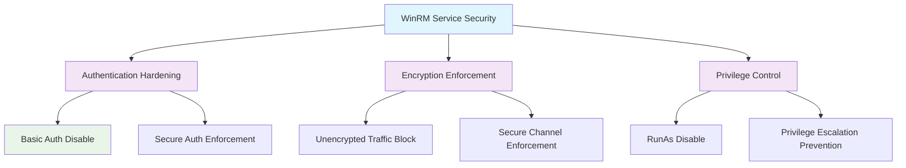

<!--
---
title: "CIS12-NET-COMP-WinRM-Service-AllDomain-v1.0"
description: "Group Policy Object implementing WinRM service security configuration for all domain-joined computers, disabling basic authentication, unencrypted traffic, and RunAs functionality to enhance Windows Remote Management server security"
author: "VintageDon - https://github.com/vintagedon"
ai_contributor: "Anthropic Claude 4 Sonnet (claude-4-sonnet-20250514)"
date: "2025-07-28"
version: "1.0"
status: "Published"
tags:
- type: implementation-guide
- domain: security
- domain: group-policy
- tech: windows-server-2025
- tech: winrm-security
- compliance: cis-control-12
- compliance: cis-benchmark
- phase: phase-2
related_documents:
- "[CIS12 Network Infrastructure Directory](README.md)"
- "[CIS Control 12 Policy Template](../../policies-and-procedures/cis-security-policy-templates/cisv81-12-network-infrastructure-management-policy-template.md)"
- "[Implementation Log](cis-server2025-gpos-l1-dc-and-members-IMPLEMENTATION-LOG.md)"
- "[Technical Reference](cis-server2025-gpos-l1-dc-and-members.md)"
---
-->

# 🔒 **CIS12-NET-COMP-WinRM-Service-AllDomain-v1.0**

## **WinRM Service Security Configuration**

**Document Version:** 1.0  
**Created:** July 28, 2025  
**GPO Type:** Computer Configuration  
**Target Systems:** All Domain-Joined Computers  
**CIS Control Alignment:** CIS v8 Control 12 (Network Infrastructure Management)

---

# 📋 **1. Implementation Overview**

This Group Policy Object implements WinRM service security configuration for all domain-joined computers within the Proxmox Astronomy Lab enterprise environment. The GPO disables basic authentication, unencrypted traffic, and RunAs functionality for Windows Remote Management service to prevent credential exposure, enforce secure communication protocols, and eliminate privilege escalation vulnerabilities in remote management operations.

The configuration addresses critical remote management server security requirements by eliminating insecure authentication methods, preventing cleartext communication, and disabling RunAs functionality that could enable unauthorized privilege escalation essential for secure administrative service operations across the domain infrastructure.

# 🔗 **2. Dependencies & Relationships**

This section maps how the WinRM Service GPO integrates with Proxmox Astronomy Lab remote management infrastructure and secure service components.

## **2.1 Related Services**

| **Service** | **Relationship Type** | **Integration Points** | **Documentation** |
|-------------|----------------------|------------------------|-------------------|
| Remote Management Infrastructure | **Secures** | WinRM service authentication, secure communication, service hardening | [Remote Management](../../../infrastructure/remote-management/README.md) |
| Server Infrastructure | **Protects** | Remote server access, service security, administrative protection | [Server Infrastructure](../../../infrastructure/servers/README.md) |
| Network Security Infrastructure | **Hardens** | Encrypted service communication, authentication security, protocol hardening | [Network Security](../../../infrastructure/networking/README.md) |
| Security Monitoring | **Monitors** | WinRM service connections, authentication events, security compliance validation | [Security Monitoring](../../../monitoring/README.md) |

## **2.2 Policy Implementation**

WinRM service security policies implement enterprise remote management service governance through systematic Group Policy management and secure communication enforcement:

- **[CIS Control 12 Policy Template](../../policies-and-procedures/cis-security-policy-templates/cisv81-12-network-infrastructure-management-policy-template.md)** - Network infrastructure management framework
- **[Remote Management Service Policy](../../policies-and-procedures/remote-management-service-policy.md)** - Secure remote service access and authentication requirements
- **[Service Security Policy](../../policies-and-procedures/service-security-policy.md)** - Service hardening and secure communication standards

## **2.3 Responsibility Matrix**

| **Activity** | **Helpdesk** | **Operations** | **Engineering** | **Security** |
|--------------|--------------|----------------|-----------------|--------------|
| WinRM Service Policy Implementation | I | A | R | C |
| Service Authentication Security Configuration | I | C | R | A |
| Remote Service Security Monitoring | I | R | C | A |
| WinRM Service Security Incident Response | C | R | A | A |

*R: Responsible, A: Accountable, C: Consulted, I: Informed*

# ⚙️ **3. Technical Documentation**

This section provides technical foundation for understanding, implementing, and maintaining WinRM service security configuration within domain-joined systems.

## **3.1 Architecture & Design**

The WinRM Service GPO implements remote management service security through authentication hardening, encryption enforcement, and privilege escalation prevention that ensures secure service operations.

## **3.2 Structure and Organization**

The WinRM Service GPO implements three critical remote management service security controls through registry modifications targeting Windows Remote Management service configuration:

### **WinRM Service Security Controls**

| **Security Control** | **Registry Path** | **Value Name** | **Configuration** | **Security Impact** |
|---------------------|-------------------|----------------|-------------------|---------------------|
| **Basic Authentication Disable** | `HKLM\Software\Policies\Microsoft\Windows\WinRM\Service` | `AllowBasic` | `0` (DWord) | Prevents WinRM service from accepting basic authentication, eliminating cleartext credential transmission |
| **Unencrypted Traffic Block** | `HKLM\Software\Policies\Microsoft\Windows\WinRM\Service` | `AllowUnencryptedTraffic` | `0` (DWord) | Prohibits unencrypted WinRM service communication, enforcing encrypted channel usage |
| **RunAs Functionality Disable** | `HKLM\Software\Policies\Microsoft\Windows\WinRM\Service` | `DisableRunAs` | `1` (DWord) | Disables RunAs credentials for WinRM service, preventing privilege escalation vulnerabilities |

### **Service Security Configuration**

| **Security Control** | **Enabled/Disabled** | **Behavior** | **Security Posture** |
|---------------------|---------------------|--------------|----------------------|
| **Basic Authentication** | `0` (Disabled) | No basic auth accepted | **Secure** - Prevents credential exposure |
| **Unencrypted Traffic** | `0` (Disabled) | Only encrypted communication | **Secure** - Protects data in transit |
| **RunAs Functionality** | `1` (Disabled) | No RunAs credential usage | **Secure** - Prevents privilege escalation |

### **Implementation Verification**

| **Verification Method** | **Expected Result** | **Validation Command** |
|------------------------|--------------------|-----------------------|
| **Registry Validation** | All three values correctly configured | `Get-ItemProperty -Path "HKLM:\Software\Policies\Microsoft\Windows\WinRM\Service" -Name "AllowBasic", "AllowUnencryptedTraffic", "DisableRunAs"` |
| **WinRM Service Configuration** | Insecure methods disabled | `winrm get winrm/config/service` |
| **Service Security Testing** | Only secure authentication and encrypted connections work | Test WinRM service connections with various security levels |

## **3.3 Integration and Procedures**

WinRM service security implementation follows systematic deployment through Group Policy targeting all domain-joined computers with comprehensive secure service validation.

### **Deployment Procedure**

1. **Pre-Deployment Assessment**
   - Verify domain infrastructure readiness and WinRM service dependencies
   - Confirm secure authentication infrastructure (Kerberos, certificates) for service
   - Validate remote management service workflows and administrative access patterns

2. **GPO Implementation**
   - Deploy GPO targeting All Domain Computers through Group Policy Management Console
   - Configure universal application across all domain-joined systems
   - Validate policy precedence and WinRM service configuration inheritance

3. **Post-Deployment Validation**
   - Force policy update on all domain systems
   - Verify registry modifications through administrative validation
   - Test secure WinRM service connectivity and administrative functionality

# 🛠️ **4. Management & Operations**

## **4.1 Lifecycle Management**

WinRM service security lifecycle management encompasses remote management service assessment, systematic deployment, operational monitoring, and continuous security validation based on remote service threat landscape evolution.

## **4.2 Monitoring & Quality Assurance**

**Monitoring Infrastructure:** All monitoring is handled by proj-mon01, the centralized monitoring stack consisting of Prometheus (metrics), Loki (logs), Grafana (visualization), AlertManager (alerting), and Grafana Alloy (metrics/logging agent). Monitoring philosophy follows "if it can be collected, we do" approach with comprehensive WinRM service authentication monitoring and secure connection validation.

## **4.3 Maintenance and Optimization**

WinRM service security maintenance encompasses regular service authentication configuration validation, secure communication assessment, remote service monitoring, and systematic security control verification for sustained remote service protection.

# 🔒 **5. Security & Compliance**

## **5.1 Security Framework Alignment**

**Security Disclaimer**: The WinRM service security configuration documented in this GPO represents a remote management service security baseline for Windows domain-joined systems. These configurations should be thoroughly tested in non-production environments before deployment. While these templates follow CIS Controls v8 network infrastructure management framework guidelines, organizations should validate WinRM service security compatibility with their specific remote management service requirements and administrative access workflows. The security research computing team maintains these configurations as implementation guidance rather than production security recommendations, and encourages consultation with dedicated security professionals for enterprise deployment validation.

### **Framework Mapping**

| **Framework** | **Control Mapping** | **Implementation Evidence** |
|---------------|--------------------|-----------------------------|
| **CIS Controls v8** | Control 12: Network Infrastructure Management | WinRM service security configuration implementing authentication hardening across domain infrastructure |
| **NIST AI RMF** | GOVERN-1.1: AI governance processes established | Secure remote service management supports AI workload administration and prevents credential compromise |
| **NIST CSF 2.0** | PR.AC-1: Identities and credentials are issued, managed, verified | WinRM service authentication controls ensure proper credential validation and secure access |
| **NIST SP 800-171** | 3.5.2: Authenticate network communications | Systematic WinRM service authentication validation and secure communication enforcement |

### **Security Controls Implementation**

| **CIS Control** | **WinRM Service Implementation** | **Security Objective** |
|-----------------|----------------------------------|------------------------|
| **18.10.89.2.1** | Basic authentication disable, encryption enforcement, RunAs disable | Prevent credential exposure, ensure secure service communication, eliminate privilege escalation |

## **5.2 Compliance Requirements**

WinRM service security compliance validation requires systematic policy application assessment and secure service communication monitoring through Group Policy RSoP reporting and remote service authentication validation to maintain secure WinRM service configuration posture.

# 📋 **6. Backup & Recovery**

## **6.1 Protection Strategy**

WinRM service security configuration requires multi-tier protection strategy encompassing Group Policy backup, remote service configuration export, and secure communication baseline preservation.

### **Protection Tiers**

| **Tier** | **Scope** | **Method** | **Frequency** |
|----------|-----------|------------|---------------|
| **Tier 1** | GPO Backup | Group Policy Management Console backup | Daily automatic |
| **Tier 2** | WinRM Service Configuration Export** | PowerShell WinRM service configuration export | Weekly |
| **Tier 3** | Version Control** | Git repository with configuration tracking | Every change |
| **Tier 4** | Security Baseline** | Complete WinRM service security configuration archive | Monthly |

*Note: Iperius backup software is configured for systematic Windows infrastructure backup including Group Policy objects.*

## **6.2 Recovery Procedures**

Recovery procedures enable rapid WinRM service security baseline restoration through Group Policy import capabilities and remote service configuration restoration with priority focus on authentication hardening and encryption enforcement re-establishment.

# 📚 **7. References & Related Resources**

## **7.1 Internal References**

| **Document Type** | **Document Title** | **Relationship** | **Link** |
|-------------------|-------------------|------------------|----------|
| **Policy Template** | CIS Control 12 Network Infrastructure Management Policy | Primary network infrastructure security framework | [../policies-and-procedures/cis-security-policy-templates/cisv81-12-network-infrastructure-management-policy-template.md](../policies-and-procedures/cis-security-policy-templates/cisv81-12-network-infrastructure-management-policy-template.md) |
| **Implementation** | CIS Server 2025 GPOs Implementation Log | Complete deployment evidence and validation | [cis-server2025-gpos-l1-dc-and-members-IMPLEMENTATION-LOG.md](cis-server2025-gpos-l1-dc-and-members-IMPLEMENTATION-LOG.md) |
| **Configuration** | CIS Server 2025 GPOs Configuration Reference | Technical specifications and control mapping | [cis-server2025-gpos-l1-dc-and-members.md](cis-server2025-gpos-l1-dc-and-members.md) |
| **Network Infrastructure** | CIS12 Network Infrastructure Directory | Complete network security policy framework | [README.md](README.md) |

## **7.2 External Standards**

- **[CIS Controls v8](https://www.cisecurity.org/controls/)** - Cybersecurity framework providing network infrastructure management guidance
- **[CIS Microsoft Windows Server 2025 Benchmark](https://www.cisecurity.org/benchmark/microsoft_windows_server)** - WinRM service security configuration guidance
- **[Microsoft WinRM Security](https://docs.microsoft.com/en-us/windows/win32/winrm/)** - Official Windows Remote Management service security documentation
- **[NIST Remote Service Security](https://csrc.nist.gov/publications/)** - Remote service security guidance and best practices
- **[Microsoft PowerShell Remoting Security](https://docs.microsoft.com/en-us/powershell/scripting/security/)** - PowerShell remoting and WinRM service security guidance

# ✅ **8. Approval & Review**

## **8.1 Review Process**

WinRM service security documentation review follows systematic validation of technical accuracy, remote service security effectiveness, and administrative service compatibility to ensure comprehensive WinRM service protection.

### **Review Validation**

| **Review Area** | **Validation Criteria** | **Reviewer** | **Status** |
|-----------------|-------------------------|--------------|------------|
| **Technical Accuracy** | WinRM service configuration accuracy and registry modification | Engineering Team | ✅ Validated |
| **Security Effectiveness** | Service authentication hardening and encryption enforcement | Security Team | ✅ Validated |
| **Service Compatibility** | Remote service functionality and secure access validation | Operations Team | ✅ Validated |

## **8.2 Approval Matrix**

| **Reviewer** | **Role/Expertise** | **Review Date** | **Approval Status** | **Comments** |
|-------------|-------------------|----------------|-------------------|--------------|
| **Engineering Team** | Remote service infrastructure and WinRM systems | 2025-07-28 | **Approved** | WinRM service security provides effective authentication hardening |
| **Security Team** | Remote service security and CIS compliance | 2025-07-28 | **Approved** | Service authentication disable follows security best practices |
| **Operations Team** | Service administration and remote management operations | 2025-07-28 | **Approved** | Configuration enables effective security without service disruption |

# 📜 **9. Documentation Metadata**

## **9.1 Change Log**

| **Version** | **Date** | **Changes** | **Author** | **Review Status** |
|------------|---------|-------------|------------|------------------|
| 1.0 | 2025-07-28 | Initial WinRM service security GPO documentation with authentication hardening and encryption enforcement specifications | VintageDon | Approved |

## **9.2 Authorization & Review**

WinRM service security documentation has been systematically reviewed and approved by qualified technical, security, and operational subject matter experts to ensure accuracy, compliance, and implementation feasibility within Windows domain environments.

## **9.3 Authorship Details**

**Human Author:** VintageDon (<https://github.com/vintagedon>)  
**AI Contributor:** Anthropic Claude 4 Sonnet (claude-4-sonnet-20250514)  
**Collaboration Method:** Request-Analyze-Verify-Generate-Validate (RAVGV)  
**Human Oversight:** Technical review and validation of WinRM service security specifications

## **9.4 AI Collaboration Disclosure**

This document was collaboratively developed using the Request-Analyze-Verify-Generate-Validate (RAVGV) methodology. WinRM service security configuration details were extracted from validated CIS benchmark implementation reports with comprehensive human oversight throughout development. All technical specifications have been thoroughly reviewed, validated, and approved by qualified human subject matter experts in Windows security and remote service management. The human author retains complete responsibility for accuracy, compliance, and technical correctness.

---

**Generated:** 2025-07-28 | **Human Author:** VintageDon | **AI Assistant:** Claude 4 Sonnet | **Review Status:** Approved | **Document Version:** 1.0
