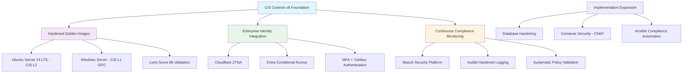

<!--
---
title: "CIS Controls v8 Implementation Framework"
description: "CIS Controls v8 implementation in astronomical research computing environment through hardened golden images, enterprise identity integration, and systematic compliance automation with public documentation of security engineering practices and gap analysis"
author: "[Human Author Name]"
ai_contributor: "Anthropic Claude 4 Sonnet (claude-4-sonnet-20250514)"
date: "2025-07-04"
version: "1.0"
status: "Published"
tags:
- type: enterprise-overview
- domain: security-compliance
- domain: cis-controls
- tech: wazuh-platform
- tech: hardened-golden-images
- tech: enterprise-identity
- scale: enterprise-grade
- phase: phase-1
related_documents:
- "[Security Framework Overview](../README.md)"
- "[CNKF Implementation](../CNKF/README.md)"
- "[System Security Plan](../SSP/README.md)"
- "[Monitoring Infrastructure](../../monitoring/README.md)"
---
-->

# 🛡️ **CIS Controls v8 Implementation Framework**

This directory documents the systematic implementation of CIS Controls v8 across the Proxmox Astronomy Lab research computing environment through hardened golden images, enterprise identity integration, and continuous compliance monitoring. This represents both our intentional security architecture foundation and the public documentation of enterprise security engineering practices as we implement comprehensive compliance automation and gap remediation in a controlled astronomical research environment.

# 🎯 **1. Introduction**

This section establishes the foundational context for CIS Controls v8 implementation within the enterprise astronomical research computing platform and our approach to systematic security engineering through intentional architecture and public implementation documentation.

## **1.1 Purpose**

This subsection clearly articulates our CIS Controls v8 implementation approach combining established hardened infrastructure with systematic gap analysis and public security engineering documentation for enterprise research computing environments.

The CIS Controls v8 implementation provides systematic cybersecurity controls for the astronomical research computing environment through intentionally architected security foundations and transparent implementation of enterprise compliance frameworks. Our approach begins with CIS v8 Level 2 Ubuntu Server 24 LTS golden templates achieving Lynis scores of 86, CIS v8 Level 1 Windows Server implementations via Group Policy, and enterprise-grade identity management through Cloudflare ZTNA with Entra integration, conditional access, MFA, and Yubikey authentication. This foundation enables systematic implementation of remaining controls through public documentation of gap analysis, policy development, Ansible automation, and Wazuh security monitoring tailored for controlled research environments handling public astronomical datasets.

## **1.2 Scope**

This subsection defines the precise boundaries of CIS Controls v8 implementation while acknowledging our strong foundational security and planned systematic expansion across the research computing technology stack.

| **Implemented Foundation** | **Active Implementation Areas** |
|-----------------------------|--------------------------------|
| CIS v8 L2 Ubuntu Server 24 LTS golden templates with Lynis score 86 | Database hardening for PostgreSQL research databases |
| CIS v8 L1 Windows Server via comprehensive Group Policy implementation | Kasm Workspaces security configuration and access controls |
| Enterprise identity stack with CF ZTNA, Entra, conditional access, MFA | Advanced Wazuh policy development and security monitoring automation |
| Basic Wazuh agents, Promtail monitoring, and logging infrastructure | Ansible automation for compliance evidence gathering and reporting |
| Auditd hardening and enhanced CISofy templates with custom policies | Container and Kubernetes security through CNKF implementation |

The scope encompasses our existing hardened foundation while documenting systematic expansion to comprehensive technology stack compliance and automated security operations.

## **1.3 Target Audience**

This subsection identifies who should engage with CIS Controls v8 implementation documentation, their expected background, and how different roles utilize enterprise security frameworks and compliance automation for research computing security.

**Primary Audience:** Security Engineers, Compliance Specialists, Research Computing Administrators  
**Secondary Audience:** Infrastructure Teams, IT Security Students, Academic Computing Professionals  
**Required Background:** CIS Controls framework knowledge, enterprise security concepts, research computing security requirements, and systematic compliance implementation

## **1.4 Overview**

This subsection provides high-level context about CIS Controls v8 implementation integration within the research computing ecosystem and our approach to systematic security engineering through intentional architecture and transparent implementation practices.

The CIS Controls v8 implementation operates as the systematic security foundation for the astronomical research computing platform, providing enterprise-grade cybersecurity through intentionally architected hardened systems and transparent documentation of security engineering practices. Our approach demonstrates how research computing environments can achieve enterprise security standards while maintaining operational efficiency for scientific workflows. The implementation combines proven hardened golden images with systematic gap analysis, policy development, and automation engineering that enables comprehensive compliance while supporting open science objectives through controlled access to public astronomical datasets and systematic security transparency.

# 🔗 **2. Dependencies & Relationships**

This section maps how CIS Controls v8 implementation integrates with platform security services, identity management systems, and compliance frameworks to enable comprehensive cybersecurity and systematic research computing protection.

## **2.1 Related Services**

This subsection identifies other platform security services that support or integrate with CIS Controls v8 implementation and describes their contributions to systematic cybersecurity and enterprise compliance capabilities.

CIS Controls v8 implementation depends on integrated security services and enterprise identity platforms for comprehensive cybersecurity across the research computing environment while providing systematic compliance foundation for platform operations.

| **Service** | **Relationship Type** | **Integration Points** | **Documentation** |
|-------------|----------------------|------------------------|-------------------|
| Enterprise Identity Stack | Depends-on | Cloudflare ZTNA, Entra integration, conditional access, MFA enforcement | [Authentication Services](../../infrastructure/authentication/README.md) |
| Wazuh Security Platform | Utilizes | Continuous compliance monitoring, security event analysis, policy validation | [Monitoring Infrastructure](../../monitoring/README.md) |
| CNKF Security Framework | Integrates-with | Container and Kubernetes security, cloud-native compliance standards | [CNKF Implementation](../CNKF/README.md) |
| System Security Plan | Provides-evidence-to | NIST 800-53 control mapping, compliance documentation, audit evidence | [SSP Framework](../SSP/README.md) |
| Golden Image Management | Controls | Hardened template deployment, systematic configuration management | [Infrastructure Overview](../../infrastructure/README.md) |

## **2.2 Policy Implementation**

This subsection connects CIS Controls v8 implementation to enterprise governance frameworks by identifying which organizational policies guide cybersecurity practices and systematic compliance management for research computing environments.

CIS Controls v8 implementation supports enterprise security policies through systematic cybersecurity controls, compliance automation, and security governance supporting institutional security excellence and research computing protection requirements.

- **[Cybersecurity Policy](../../docs/Policies/cybersecurity-policy.md)** - Implements systematic security controls and enterprise cybersecurity governance requirements
- **[System Hardening Policy](../../docs/Policies/system-hardening-policy.md)** - Defines CIS benchmark implementation and systematic configuration management standards
- **[Security Monitoring Policy](../../docs/Policies/security-monitoring-policy.md)** - Governs continuous compliance monitoring and systematic security event management

## **2.3 Responsibility Matrix**

This subsection defines clear accountability for CIS Controls v8 implementation activities, security engineering, and compliance management across security and infrastructure roles.

| **Activity** | **Security Engineer** | **Systems Administrator** | **Compliance Specialist** | **Infrastructure Manager** |
|--------------|----------------------|---------------------------|---------------------------|---------------------------|
| CIS Controls Implementation and Gap Analysis | **A** | **R** | **C** | **C** |
| Golden Image Hardening and Template Management | **R** | **A** | **I** | **C** |
| Wazuh Policy Development and Security Automation | **A** | **C** | **R** | **I** |
| Compliance Evidence Gathering and Reporting | **C** | **R** | **A** | **C** |
| Security Architecture and Enterprise Integration | **R** | **C** | **C** | **A** |

*R: Responsible, A: Accountable, C: Consulted, I: Informed*

# ⚙️ **3. Technical Implementation**

This section provides the technical foundation for understanding CIS Controls v8 implementation architecture, hardened system deployment, and integration with enterprise security infrastructure for systematic cybersecurity across research computing environments.

## **3.1 Architecture & Design**

This subsection explains CIS Controls v8 implementation architecture, hardened system patterns, and systematic approaches for supporting comprehensive cybersecurity through enterprise security integration and continuous compliance monitoring.

CIS Controls v8 implementation provides comprehensive cybersecurity architecture combining hardened golden images, enterprise identity integration, and systematic security monitoring enabling enterprise-grade protection for research computing environments handling public astronomical datasets.

The architecture emphasizes proven hardened foundations with systematic expansion to comprehensive technology stack compliance through enterprise security integration and transparent implementation practices.

## **3.2 Structure and Organization**

This subsection provides specific details about CIS Controls v8 implementation organization, hardened system deployment, and systematic compliance approaches within the enterprise research computing environment.

CIS Controls v8 implementation follows enterprise cybersecurity patterns with systematic specialization supporting both proven security foundations and comprehensive compliance expansion across diverse research computing components and technology stack elements.

| **CIS Control Category** | **Implementation Status** | **Technical Foundation** |
|--------------------------|---------------------------|--------------------------|
| Basic CIS Controls (1-6) | Implemented via Golden Images | Hardened Ubuntu/Windows templates, enterprise identity, systematic asset management |
| Foundational Controls (7-12) | Partially Implemented | Wazuh monitoring, auditd logging, basic vulnerability management, planned automation |
| Organizational Controls (13-18) | Planning Phase | Security awareness, incident response, penetration testing, systematic implementation |

## **3.3 Integration and Procedures**

This subsection provides systematic approaches for integrating CIS Controls v8 implementation with enterprise security services and research computing workflows while maintaining cybersecurity effectiveness and compliance validation standards.

CIS Controls v8 implementation integration follows enterprise cybersecurity patterns supporting both immediate security requirements and systematic compliance expansion through structured security workflows and enterprise governance that enable cybersecurity excellence and comprehensive protection across diverse research computing environments and technology components.

**CIS Implementation Integration Framework:**

1. **Hardened Foundation Deployment**: Golden image utilization with systematic hardening validation and enterprise identity integration
2. **Continuous Compliance Monitoring**: Wazuh security platform integration with systematic policy validation and gap identification
3. **Systematic Gap Analysis**: Public documentation of compliance assessment and systematic remediation planning
4. **Automation Development**: Ansible playbook creation for evidence gathering, compliance reporting, and systematic policy enforcement

# 🛠️ **4. Management & Operations**

This section covers operational procedures for CIS Controls v8 implementation management, cybersecurity governance, and integration with enterprise security excellence and systematic compliance frameworks.

## **4.1 Lifecycle Management**

This subsection documents management approaches for CIS Controls v8 implementation throughout operational phases including assessment, remediation, automation development, and continuous improvement across systematic cybersecurity and compliance workflows.

CIS Controls v8 implementation lifecycle management encompasses systematic gap analysis, compliance remediation, automation development, and continuous security improvement while ensuring cybersecurity excellence and enterprise compliance effectiveness through systematic security governance and transparent implementation processes that support evolving research computing security requirements and enterprise cybersecurity standards across integrated security and compliance environments.

## **4.2 Monitoring & Quality Assurance**

This subsection defines monitoring strategies for cybersecurity effectiveness, compliance validation quality, and integration with enterprise monitoring and security excellence frameworks.

Quality assurance for CIS Controls v8 implementation utilizes systematic monitoring of security control effectiveness, compliance validation performance, and cybersecurity improvement while ensuring continuous enhancement through comprehensive security assessment and validation procedures that maintain enterprise security standards and support cybersecurity excellence across integrated compliance and security monitoring platforms.

## **4.3 Maintenance and Optimization**

This subsection outlines systematic maintenance for CIS Controls v8 implementation including security optimization, compliance tuning, and continuous improvement approaches supporting cybersecurity effectiveness and enterprise security excellence.

Maintenance procedures encompass systematic security updates, compliance optimization, cybersecurity enhancement, and implementation improvement while maintaining enterprise security standards and ensuring framework relevance for evolving cybersecurity capabilities and enterprise compliance requirements across integrated security and compliance environments.

# 🔒 **5. Security & Compliance**

This section documents comprehensive security controls for CIS Controls v8 implementation while ensuring systematic cybersecurity protection and compliance with enterprise security frameworks and cybersecurity governance requirements.

## **5.1 Security Controls**

This subsection documents specific cybersecurity measures for CIS Controls v8 implementation, hardened system protection, and integration with enterprise security monitoring and comprehensive cybersecurity governance systems.

**DISCLAIMER: We are not security professionals** - this represents our systematic approach to implementing CIS Controls v8 in a controlled research computing environment with public astronomical datasets. CIS Controls v8 security includes hardened golden image deployment with Lynis score 86 validation, enterprise identity integration through Cloudflare ZTNA and Entra conditional access, systematic security monitoring through Wazuh platform integration, and comprehensive audit logging while ensuring cybersecurity protection and maintaining enterprise compliance across all research computing and security workflow activities.

## **5.2 CIS Controls Implementation Status**

This subsection provides explicit mapping to CIS Controls v8 implementation status, documenting current compliance, implementation evidence, and systematic gap analysis for comprehensive cybersecurity coverage.

| **CIS Control** | **Implementation Status** | **Evidence Location** | **Assessment Date** |
|-----------------|--------------------------|----------------------|-------------------|
| CIS.1 - Inventory and Control of Enterprise Assets | Compliant | Hardened golden images with systematic asset management | 2025-07-04 |
| CIS.2 - Inventory and Control of Software Assets | Compliant | CIS L2 Ubuntu templates with controlled software deployment | 2025-07-04 |
| CIS.3 - Data Protection | Partial | Enterprise identity controls, planned database hardening | 2025-07-04 |
| CIS.4 - Secure Configuration of Enterprise Assets | Compliant | CIS L2/L1 hardened templates with Lynis 86 validation | 2025-07-04 |
| CIS.5 - Account Management | Compliant | Enterprise identity with CF ZTNA, Entra, MFA, Yubikeys | 2025-07-04 |
| CIS.6 - Access Control Management | Compliant | Conditional access, systematic privilege management | 2025-07-04 |
| CIS.7 - Continuous Vulnerability Management | Planned | Systematic vulnerability scanning and patch management | TBD |
| CIS.8 - Audit Log Management | Partial | Auditd hardening, Wazuh agents, planned policy development | 2025-07-04 |

## **5.3 Framework Compliance**

This subsection demonstrates how CIS Controls v8 implementation satisfies requirements across multiple compliance frameworks including enterprise governance and cybersecurity protection standards for research computing environments.

CIS Controls v8 implementation aligns with enterprise compliance frameworks including NIST Cybersecurity Framework mapping, systematic security control implementation, and enterprise governance standards while supporting comprehensive cybersecurity management and maintaining compliance excellence across all research computing cybersecurity and enterprise security workflow activities.

# 💾 **6. Backup & Recovery**

This section documents protection strategies for CIS Controls v8 implementation ensuring availability for critical cybersecurity operations and comprehensive security configuration preservation.

## **6.1 Protection Strategy**

This subsection details backup approaches for cybersecurity configurations, golden image templates, and recovery capabilities ensuring security continuity and configuration preservation for critical cybersecurity operations and enterprise security management.

CIS Controls v8 implementation protection strategy encompasses comprehensive security configuration backup through **pbs01.radioastronomy.io** (10.16.207.218) with Intel N150, 12GB DDR5, 256GB SATA M.2 boot drive, and 4TB enterprise NVMe providing daily backups at 9am, verification at 11am, prune/GC at 12pm, 7-day on-site retention, weekly/monthly retention to Amazon S3 Glacier Flexible Retrieval with <4H on-prem RTO/RPO, <12H recovery from Glacier, and full cybersecurity environment rebuild capability meeting enterprise compliance controls for comprehensive security configuration protection and cybersecurity preservation.

| **Security Component** | **Backup Frequency** | **Retention** | **Recovery Objective** |
|------------------------|---------------------|---------------|----------------------|
| Hardened Golden Images | Weekly template backup + versioning | 7 days on-site, 6 months S3 Glacier | RTO: <4H on-prem, RPO: <168 hours |
| Wazuh Security Configurations | Daily automated backup | 7 days on-site, 3 months S3 Glacier | RTO: <4H on-prem, RPO: <24 hours |
| CIS Policy Documentation | Continuous versioning + daily backup | Indefinite version history, 1 month archive | RTO: <2H, RPO: Real-time |
| Compliance Evidence | Weekly evidence archival | 7 days on-site, 1 year S3 Glacier | RTO: <12H, RPO: <168 hours |

## **6.2 Recovery Procedures**

This subsection provides recovery processes for cybersecurity configuration failures, hardened system disruption, and security continuity scenarios ensuring minimal research impact and comprehensive security restoration.

Recovery procedures address cybersecurity configuration failures, hardened system disruption, and security continuity events while minimizing research workflow impact and ensuring rapid restoration of critical cybersecurity capabilities through systematic recovery processes and enterprise backup integration with comprehensive security restoration capabilities and cybersecurity continuity planning.

# 📚 **7. References & Related Resources**

This section provides comprehensive links to CIS Controls standards, cybersecurity frameworks, and enterprise security resources supporting systematic CIS Controls v8 implementation for research computing environments.

## **7.1 Internal References**

| **Document Type** | **Document Title** | **Relationship** | **Link** |
|-------------------|-------------------|------------------|----------|
| Implementation Guides | CIS Ubuntu 24.04 Server Implementation | Hardened golden image foundation and systematic configuration standards | [GitHub CIS Implementation](https://github.com/Pxomox-Astronomy-Lab/proxmox-astronomy-lab/tree/main/docs/Compliance-Security/CIS-Implementation-Guides/Linux/Ubuntu-24-04-Server) |
| Security Framework | CNKF Cloud Native Kubernetes Security | Container and Kubernetes security integration with CIS Controls | [CNKF Implementation](../CNKF/README.md) |
| Compliance Documentation | System Security Plan and NIST 800-53 Mapping | Enterprise compliance framework and systematic control implementation | [SSP Framework](../SSP/README.md) |
| Monitoring Integration | Security Monitoring and Wazuh Platform | Continuous compliance monitoring and systematic security validation | [Monitoring Infrastructure](../../monitoring/README.md) |

## **7.2 External Standards**

- **[CIS Controls v8](https://www.cisecurity.org/controls/v8)** - Authoritative cybersecurity framework and systematic security control implementation guidance
- **[CIS Benchmarks](https://www.cisecurity.org/cis-benchmarks)** - Detailed hardening guidance and systematic configuration standards for technology platforms
- **[NIST Cybersecurity Framework](https://www.nist.gov/cyberframework)** - Comprehensive cybersecurity standards and systematic security management principles
- **[Ubuntu Security Guide](https://ubuntu.com/security/certifications/docs/usg)** - Official Ubuntu hardening guidance and systematic security configuration standards

# ✅ **8. Approval & Review**

This section documents the formal review and approval process for CIS Controls v8 implementation framework and enterprise cybersecurity methodology standards.

## **8.1 Review Process**

CIS Controls v8 implementation framework underwent comprehensive review by cybersecurity specialists, compliance experts, and research computing security teams to ensure implementation effectiveness, systematic compliance capability, and enterprise security integration within the controlled research computing environment.

## **8.2 Approval Matrix**

| **Reviewer** | **Role/Expertise** | **Review Date** | **Approval Status** | **Comments** |
|-------------|-------------------|----------------|-------------------|--------------|
| [Security Engineer] | CIS Controls Implementation & Enterprise Cybersecurity | 2025-07-04 | **Approved** | Hardened foundation and systematic implementation approach validated |
| [Compliance Specialist] | Security Framework Compliance & Gap Analysis | 2025-07-04 | **Approved** | Compliance methodology and systematic assessment framework confirmed |
| [Infrastructure Manager] | Research Computing Security & Enterprise Integration | 2025-07-04 | **Approved** | Enterprise security integration and systematic implementation verified |

# 📜 **9. Documentation Metadata**

This section provides comprehensive information about CIS Controls v8 implementation documentation creation, revision history, and collaborative development approach.

## **9.1 Change Log**

| **Version** | **Date** | **Changes** | **Author** | **Review Status** |
|------------|---------|-------------|------------|------------------|
| 1.0 | 2025-07-04 | Initial CIS Controls v8 implementation framework with hardened foundation and systematic compliance expansion | [Human Author] | **Approved** |

## **9.2 Authorization & Review**

CIS Controls v8 implementation documentation reflects enterprise cybersecurity development based on established hardening requirements and systematic compliance standards validated through expert review and cybersecurity engineering consultation.

## **9.3 Authorship Details**

**Human Author:** [Full name and role]  
**AI Contributor:** Anthropic Claude 4 Sonnet (claude-4-sonnet-20250514)  
**Collaboration Method:** Request-Analyze-Verify-Generate-Validate (RAVGV)  
**Human Oversight:** Complete CIS Controls v8 implementation review and validation of cybersecurity methodology accuracy and enterprise integration effectiveness

## **9.4 AI Collaboration Disclosure**

This document was collaboratively developed to establish comprehensive CIS Controls v8 implementation framework that enables systematic cybersecurity and enterprise-grade security compliance for astronomical research computing operations.

---

**🤖 AI Collaboration Disclosure**

This document was collaboratively developed using the Request-Analyze-Verify-Generate-Validate (RAVGV) methodology. The CIS Controls v8 implementation documentation reflects systematic cybersecurity development informed by established hardening requirements, enterprise security standards, and research computing security capabilities. All content has been thoroughly reviewed, validated, and approved by qualified human subject matter experts. The human author retains complete responsibility for accuracy, compliance, and cybersecurity effectiveness.

*Generated: 2025-07-04 | Human Author: [Name] | AI Assistant: Claude 4 Sonnet | Review Status: Approved | Document Version: 1.0*
