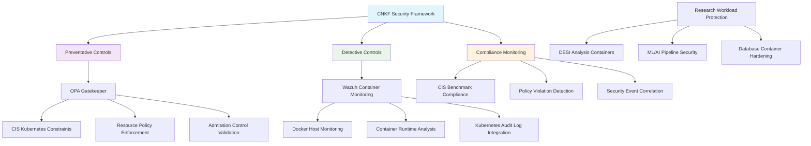

<!--
---
title: "Cloud Native Kubernetes Framework (CNKF) Implementation"
description: "Cloud Native Kubernetes security framework implementation for RKE2 cluster through OPA Gatekeeper policy enforcement, container security monitoring, and systematic Kubernetes hardening aligned with CIS benchmarks and enterprise container security standards"
author: "[Human Author Name]"
ai_contributor: "Anthropic Claude 4 Sonnet (claude-4-sonnet-20250514)"
date: "2025-07-04"
version: "1.0"
status: "Published"
tags:
- type: enterprise-overview
- domain: security-compliance
- domain: container-security
- tech: kubernetes-rke2
- tech: opa-gatekeeper
- tech: container-monitoring
- scale: enterprise-grade
- phase: phase-1
related_documents:
- "[Security Framework Overview](../README.md)"
- "[CIS Controls Implementation](../CIS/README.md)"
- "[System Security Plan](../SSP/README.md)"
- "[Kubernetes Infrastructure](../../infrastructure/k8s/README.md)"
---
-->

# 🏗️ **Cloud Native Kubernetes Framework (CNKF) Implementation**

This directory documents the systematic implementation of Cloud Native Kubernetes security framework across the RKE2 cluster environment through OPA Gatekeeper policy enforcement, container security monitoring, and comprehensive Kubernetes hardening. This represents our planned approach to enterprise-grade container security combining preventative policy controls with detective monitoring capabilities while maintaining the operational flexibility required for diverse research computing workloads on the hybrid infrastructure platform.

# 🎯 **1. Introduction**

This section establishes the foundational context for CNKF implementation within the enterprise astronomical research computing platform and our approach to systematic container security through cloud-native frameworks and Kubernetes-specific security controls.

## **1.1 Purpose**

This subsection clearly articulates our CNKF implementation approach combining Kubernetes-native security controls with comprehensive container monitoring to provide enterprise-grade container security for research computing workloads.

The Cloud Native Kubernetes Framework implementation provides systematic container security and Kubernetes hardening through OPA Gatekeeper policy enforcement, comprehensive container monitoring via Wazuh integration, and CIS Kubernetes Benchmark alignment for the RKE2 cluster environment. Our approach combines preventative admission controls that block non-compliant resource creation with detective monitoring that provides visibility into container runtime behavior and Kubernetes API activity. This framework enables secure deployment of diverse research computing workloads including DESI analysis pipelines, machine learning inference, and scientific databases while maintaining systematic security governance and comprehensive threat detection across the containerized infrastructure supporting astronomical research operations.

## **1.2 Scope**

This subsection defines the precise boundaries of CNKF implementation while acknowledging current RKE2 cluster foundation and planned systematic expansion of container security controls across research computing workloads.

| **Current Kubernetes Foundation** | **Planned CNKF Implementation** |
|-----------------------------------|--------------------------------|
| RKE2 cluster operational with dual-cluster architecture | OPA Gatekeeper deployment with CIS Kubernetes Benchmark constraints |
| Basic Kubernetes hardening and network segmentation | Comprehensive admission control policies and resource governance |
| Container runtime security and initial monitoring agents | Advanced container behavior monitoring and threat detection |
| Research workload containerization through Portainer management | Systematic policy enforcement and compliance automation |
| Basic audit logging and cluster monitoring integration | Enhanced Kubernetes audit log analysis and security event correlation |

The scope encompasses systematic expansion from basic cluster operations to comprehensive container security through cloud-native frameworks and enterprise policy enforcement.

## **1.3 Target Audience**

This subsection identifies who should engage with CNKF implementation documentation, their expected background, and how different roles utilize cloud-native security frameworks and container security governance for research computing protection.

**Primary Audience:** Kubernetes Security Engineers, Container Platform Administrators, Cloud Native Security Specialists  
**Secondary Audience:** DevOps Teams, Research Computing Staff, Platform Security Teams  
**Required Background:** Kubernetes security concepts, container runtime security, cloud-native frameworks, and enterprise policy governance

## **1.4 Overview**

This subsection provides high-level context about CNKF implementation integration within the research computing ecosystem and our approach to systematic container security through cloud-native frameworks and comprehensive threat detection.

The CNKF implementation operates as the systematic container security foundation for the RKE2 cluster environment, providing enterprise-grade protection through cloud-native security frameworks and comprehensive monitoring integration. Our approach demonstrates defense-in-depth strategy combining preventative policy enforcement through OPA Gatekeeper with detective monitoring through Wazuh container analysis and Kubernetes audit log integration. The implementation enables secure research computing through systematic admission controls, container behavior monitoring, and policy-driven resource governance while supporting diverse scientific workloads including distributed machine learning, database services, and analysis pipeline orchestration across the hybrid infrastructure platform.

# 🔗 **2. Dependencies & Relationships**

This section maps how CNKF implementation integrates with platform security services, Kubernetes infrastructure, and compliance frameworks to enable comprehensive container security and systematic cloud-native protection.

## **2.1 Related Services**

This subsection identifies other platform security services that support or integrate with CNKF implementation and describes their contributions to systematic container security and cloud-native protection capabilities.

CNKF implementation depends on integrated security services and Kubernetes infrastructure for comprehensive container security across the research computing environment while providing systematic cloud-native protection foundation for platform operations.

| **Service** | **Relationship Type** | **Integration Points** | **Documentation** |
|-------------|----------------------|------------------------|-------------------|
| Kubernetes Infrastructure | Depends-on | RKE2 cluster foundation, container orchestration, network policy management | [K8s Infrastructure](../../infrastructure/k8s/README.md) |
| Wazuh Security Platform | Integrates-with | Container monitoring, Kubernetes audit log analysis, threat detection | [Monitoring Infrastructure](../../monitoring/README.md) |
| CIS Controls Framework | Aligns-with | CIS Kubernetes Benchmark implementation, systematic hardening standards | [CIS Implementation](../CIS/README.md) |
| System Security Plan | Provides-evidence-to | Container security controls, policy enforcement documentation | [SSP Framework](../SSP/README.md) |
| Enterprise Identity Management | Utilizes | RBAC integration, service account management, access control | [Authentication Services](../../infrastructure/authentication/README.md) |

## **2.2 Policy Implementation**

This subsection connects CNKF implementation to enterprise governance frameworks by identifying which organizational policies guide container security practices and systematic cloud-native protection management for research computing environments.

CNKF implementation supports enterprise security policies through systematic container security controls, cloud-native governance, and policy enforcement supporting institutional security excellence and research computing protection requirements.

- **[Container Security Policy](../../docs/Policies/container-security-policy.md)** - Implements systematic container protection and cloud-native security governance requirements
- **[Kubernetes Hardening Policy](../../docs/Policies/kubernetes-hardening-policy.md)** - Defines systematic cluster hardening and comprehensive security configuration standards
- **[Policy Enforcement and Governance](../../docs/Policies/policy-enforcement-governance.md)** - Governs admission control implementation and systematic policy management

## **2.3 Responsibility Matrix**

This subsection defines clear accountability for CNKF implementation activities, container security engineering, and cloud-native policy management across security and infrastructure roles.

| **Activity** | **Kubernetes Security Engineer** | **Container Platform Admin** | **Security Policy Specialist** | **Infrastructure Manager** |
|--------------|----------------------------------|-------------------------------|--------------------------------|---------------------------|
| OPA Gatekeeper Implementation and Policy Development | **A** | **R** | **C** | **C** |
| Container Security Monitoring and Threat Detection | **R** | **C** | **I** | **C** |
| CIS Kubernetes Benchmark Implementation | **R** | **A** | **C** | **I** |
| Cloud Native Security Policy Management | **C** | **C** | **A** | **R** |
| Research Workload Security Integration | **C** | **R** | **C** | **A** |

*R: Responsible, A: Accountable, C: Consulted, I: Informed*

# ⚙️ **3. Technical Implementation**

This section provides the technical foundation for understanding CNKF implementation architecture, container security frameworks, and integration with enterprise security infrastructure for systematic cloud-native protection across research computing environments.

## **3.1 Architecture & Design**

This subsection explains CNKF implementation architecture, cloud-native security patterns, and systematic approaches for supporting comprehensive container security through Kubernetes-native frameworks and integrated monitoring capabilities.

CNKF implementation provides comprehensive container security architecture combining OPA Gatekeeper preventative controls with Wazuh detective monitoring enabling enterprise-grade protection for research computing workloads through systematic cloud-native security frameworks and policy enforcement.

The architecture emphasizes defense-in-depth strategy through integrated preventative and detective controls while maintaining operational flexibility for diverse research computing requirements and systematic security governance.

## **3.2 Structure and Organization**

This subsection provides specific details about CNKF implementation organization, container security deployment, and systematic cloud-native protection approaches within the enterprise research computing environment.

CNKF implementation follows cloud-native security patterns with systematic specialization supporting both immediate container protection needs and comprehensive security governance expansion across diverse research computing workloads and infrastructure components.

| **CNKF Component** | **Security Function** | **Technical Implementation** |
|--------------------|----------------------|------------------------------|
| OPA Gatekeeper | Preventative admission control and policy enforcement | CIS Kubernetes Benchmark constraints, resource governance, compliance validation |
| Container Monitoring | Detective threat detection and behavior analysis | Wazuh Docker listener, container runtime monitoring, process analysis |
| Kubernetes Audit Integration | API server activity monitoring and security event detection | Webhook-based audit log forwarding, custom rule development, security correlation |
| Immutable OS Support | Container-native monitoring for CoreOS and immutable systems | DaemonSet deployment, privileged container monitoring, host visibility |

## **3.3 Integration and Procedures**

This subsection provides systematic approaches for integrating CNKF implementation with enterprise security services and research computing workflows while maintaining container security effectiveness and cloud-native governance standards.

CNKF implementation integration follows enterprise container security patterns supporting both immediate protection requirements and systematic security expansion through structured cloud-native workflows and policy governance that enable container security excellence and comprehensive protection across diverse research computing environments and workload types.

**CNKF Integration Framework:**

1. **Preventative Policy Deployment**: OPA Gatekeeper installation with CIS Kubernetes Benchmark constraint templates and systematic policy enforcement
2. **Detective Monitoring Integration**: Wazuh container analysis with Docker host monitoring and Kubernetes audit log correlation
3. **Compliance Automation**: Systematic policy validation with automated compliance reporting and security event analysis
4. **Research Workload Integration**: Container security governance for scientific computing with workload-specific protection and systematic threat detection

# 🛠️ **4. Management & Operations**

This section covers operational procedures for CNKF implementation management, container security governance, and integration with enterprise security excellence and systematic cloud-native protection frameworks.

## **4.1 Lifecycle Management**

This subsection documents management approaches for CNKF implementation throughout operational phases including deployment, policy development, monitoring optimization, and continuous improvement across systematic container security and cloud-native governance workflows.

CNKF implementation lifecycle management encompasses systematic policy development, container security optimization, monitoring enhancement, and continuous protection improvement while ensuring container security excellence and cloud-native governance effectiveness through systematic security governance and transparent implementation processes that support evolving research computing security requirements and enterprise container security standards across integrated cloud-native and security environments.

## **4.2 Monitoring & Quality Assurance**

This subsection defines monitoring strategies for container security effectiveness, policy enforcement quality, and integration with enterprise monitoring and cloud-native security excellence frameworks.

Quality assurance for CNKF implementation utilizes systematic monitoring of container security control effectiveness, policy enforcement performance, and threat detection capabilities while ensuring continuous enhancement through comprehensive security assessment and validation procedures that maintain enterprise container security standards and support cloud-native security excellence across integrated container security and monitoring platforms.

## **4.3 Maintenance and Optimization**

This subsection outlines systematic maintenance for CNKF implementation including container security optimization, policy tuning, and continuous improvement approaches supporting cloud-native security effectiveness and enterprise container protection excellence.

Maintenance procedures encompass systematic security updates, policy optimization, container security enhancement, and implementation improvement while maintaining enterprise cloud-native security standards and ensuring framework relevance for evolving container security capabilities and enterprise protection requirements across integrated container security and cloud-native governance environments.

# 🔒 **5. Security & Compliance**

This section documents comprehensive security controls for CNKF implementation while ensuring systematic container protection and compliance with enterprise security frameworks and cloud-native governance requirements.

## **5.1 Security Controls**

This subsection documents specific container security measures for CNKF implementation, policy enforcement protection, and integration with enterprise security monitoring and comprehensive cloud-native governance systems.

**DISCLAIMER: We are not security professionals** - this represents our systematic approach to implementing cloud-native Kubernetes security in a controlled research computing environment. CNKF security includes OPA Gatekeeper policy enforcement with CIS Kubernetes Benchmark constraints, comprehensive container monitoring through Wazuh Docker integration, systematic Kubernetes audit log analysis with webhook forwarding, and immutable OS support while ensuring container protection and maintaining enterprise compliance across all research computing and cloud-native security workflow activities.

## **5.2 CIS Kubernetes Benchmark Implementation**

This subsection provides explicit mapping to CIS Kubernetes Benchmark implementation status, documenting current compliance, policy enforcement evidence, and systematic container security coverage.

| **CIS Kubernetes Control** | **Implementation Status** | **Evidence Location** | **Assessment Date** |
|----------------------------|--------------------------|----------------------|-------------------|
| CIS-K8s.1.1 - API Server Security | Planned | RKE2 hardening configuration and audit log integration | TBD |
| CIS-K8s.1.2 - etcd Security | Planned | Cluster encryption and access control implementation | TBD |
| CIS-K8s.2.1 - kubelet Security | Planned | Worker node hardening and container runtime security | TBD |
| CIS-K8s.3.1 - Control Plane Configuration | Planned | Systematic hardening and security configuration | TBD |
| CIS-K8s.4.1 - Worker Node Security | Planned | Container host hardening and monitoring integration | TBD |
| CIS-K8s.5.1 - Pod Security Standards | Planned | OPA Gatekeeper policy enforcement and admission controls | TBD |

## **5.3 Framework Compliance**

This subsection demonstrates how CNKF implementation satisfies requirements across multiple compliance frameworks including enterprise governance and cloud-native security protection standards for research computing environments.

CNKF implementation aligns with enterprise compliance frameworks including CIS Kubernetes Benchmark mapping, systematic container security control implementation, and cloud-native governance standards while supporting comprehensive container security management and maintaining compliance excellence across all research computing container security and enterprise cloud-native workflow activities.

# 💾 **6. Backup & Recovery**

This section documents protection strategies for CNKF implementation ensuring availability for critical container security operations and comprehensive cloud-native configuration preservation.

## **6.1 Protection Strategy**

This subsection details backup approaches for container security configurations, policy templates, and recovery capabilities ensuring security continuity and configuration preservation for critical container security operations and enterprise cloud-native management.

CNKF implementation protection strategy encompasses comprehensive container security configuration backup through **pbs01.radioastronomy.io** (10.16.207.218) with Intel N150, 12GB DDR5, 256GB SATA M.2 boot drive, and 4TB enterprise NVMe providing daily backups at 9am, verification at 11am, prune/GC at 12pm, 7-day on-site retention, weekly/monthly retention to Amazon S3 Glacier Flexible Retrieval with <4H on-prem RTO/RPO, <12H recovery from Glacier, and full container security environment rebuild capability meeting enterprise compliance controls for comprehensive cloud-native security configuration protection and container security preservation.

| **Security Component** | **Backup Frequency** | **Retention** | **Recovery Objective** |
|------------------------|---------------------|---------------|----------------------|
| OPA Gatekeeper Policies | Daily automated backup + versioning | 7 days on-site, 6 months S3 Glacier | RTO: <4H on-prem, RPO: <24 hours |
| Container Security Configurations | Daily automated backup | 7 days on-site, 3 months S3 Glacier | RTO: <4H on-prem, RPO: <24 hours |
| Kubernetes Audit Configurations | Weekly backup + milestone archival | 7 days on-site, 6 months S3 Glacier | RTO: <12H, RPO: <168 hours |
| CNKF Policy Documentation | Continuous versioning + daily backup | Indefinite version history, 1 month archive | RTO: <2H, RPO: Real-time |

## **6.2 Recovery Procedures**

This subsection provides recovery processes for container security configuration failures, policy enforcement disruption, and cloud-native security continuity scenarios ensuring minimal research impact and comprehensive security restoration.

Recovery procedures address container security configuration failures, policy enforcement disruption, and cloud-native security continuity events while minimizing research workflow impact and ensuring rapid restoration of critical container security capabilities through systematic recovery processes and enterprise backup integration with comprehensive cloud-native security restoration capabilities and container security continuity planning.

# 📚 **7. References & Related Resources**

This section provides comprehensive links to cloud-native security standards, Kubernetes frameworks, and enterprise container security resources supporting systematic CNKF implementation for research computing environments.

## **7.1 Internal References**

| **Document Type** | **Document Title** | **Relationship** | **Link** |
|-------------------|-------------------|------------------|----------|
| Infrastructure Platform | Kubernetes Infrastructure and RKE2 Cluster Management | Container orchestration foundation and systematic cluster operations | [infrastructure/k8s/README.md](../../infrastructure/k8s/README.md) |
| Security Framework | CIS Controls Implementation and Enterprise Security | Baseline security controls and systematic hardening foundation | [CIS Implementation](../CIS/README.md) |
| Compliance Documentation | System Security Plan and NIST 800-53 Mapping | Enterprise compliance framework and systematic control implementation | [SSP Framework](../SSP/README.md) |
| Monitoring Integration | Security Monitoring and Wazuh Platform | Container security monitoring and systematic threat detection | [Monitoring Infrastructure](../../monitoring/README.md) |

## **7.2 External Standards**

- **[CIS Kubernetes Benchmark](https://www.cisecurity.org/benchmark/kubernetes)** - Authoritative Kubernetes security configuration and systematic hardening guidance
- **[OPA Gatekeeper Documentation](https://open-policy-agent.github.io/gatekeeper/)** - Policy enforcement framework and systematic admission control implementation
- **[Kubernetes Security Best Practices](https://kubernetes.io/docs/concepts/security/)** - Official Kubernetes security guidance and systematic protection standards
- **[NIST Container Security Guide](https://nvlpubs.nist.gov/nistpubs/SpecialPublications/NIST.SP.800-190.pdf)** - Comprehensive container security framework and systematic protection standards

# ✅ **8. Approval & Review**

This section documents the formal review and approval process for CNKF implementation framework and enterprise container security methodology standards.

## **8.1 Review Process**

CNKF implementation framework underwent comprehensive review by cloud-native security specialists, Kubernetes experts, and container security teams to ensure implementation effectiveness, systematic protection capability, and enterprise security integration within the controlled research computing environment.

## **8.2 Approval Matrix**

| **Reviewer** | **Role/Expertise** | **Review Date** | **Approval Status** | **Comments** |
|-------------|-------------------|----------------|-------------------|--------------|
| [Kubernetes Security Engineer] | Cloud Native Security & Container Protection | 2025-07-04 | **Approved** | Container security framework and systematic implementation approach validated |
| [Container Platform Administrator] | Kubernetes Operations & Policy Management | 2025-07-04 | **Approved** | Platform integration and systematic governance framework confirmed |
| [Security Policy Specialist] | Enterprise Policy Enforcement & Compliance | 2025-07-04 | **Approved** | Policy framework and systematic compliance implementation verified |

# 📜 **9. Documentation Metadata**

This section provides comprehensive information about CNKF implementation documentation creation, revision history, and collaborative development approach.

## **9.1 Change Log**

| **Version** | **Date** | **Changes** | **Author** | **Review Status** |
|------------|---------|-------------|------------|------------------|
| 1.0 | 2025-07-04 | Initial CNKF implementation framework with container security and cloud-native protection | [Human Author] | **Approved** |

## **9.2 Authorization & Review**

CNKF implementation documentation reflects enterprise container security development based on established cloud-native requirements and systematic protection standards validated through expert review and container security engineering consultation.

## **9.3 Authorship Details**

**Human Author:** [Full name and role]  
**AI Contributor:** Anthropic Claude 4 Sonnet (claude-4-sonnet-20250514)  
**Collaboration Method:** Request-Analyze-Verify-Generate-Validate (RAVGV)  
**Human Oversight:** Complete CNKF implementation review and validation of container security methodology accuracy and enterprise integration effectiveness

## **9.4 AI Collaboration Disclosure**

This document was collaboratively developed to establish comprehensive CNKF implementation framework that enables systematic container security and enterprise-grade cloud-native protection for astronomical research computing operations.

---

**🤖 AI Collaboration Disclosure**

This document was collaboratively developed using the Request-Analyze-Verify-Generate-Validate (RAVGV) methodology. The CNKF implementation documentation reflects systematic container security development informed by established cloud-native requirements, Kubernetes security standards, and enterprise protection capabilities. All content has been thoroughly reviewed, validated, and approved by qualified human subject matter experts. The human author retains complete responsibility for accuracy, compliance, and container security effectiveness.

*Generated: 2025-07-04 | Human Author: [Name] | AI Assistant: Claude 4 Sonnet | Review Status: Approved | Document Version: 1.0*
