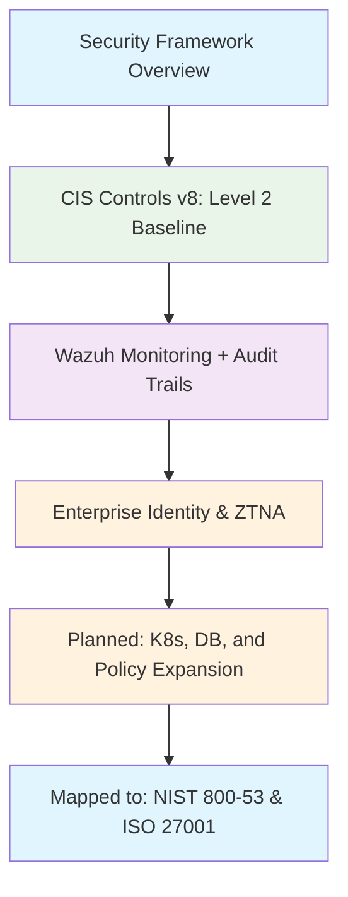

<!--
---
title: "Security Frameworks and Compliance Overview"
description: "Comprehensive security framework implementation for astronomical research computing environment combining CIS Controls v8 foundation, Cloud Native Kubernetes security, NIST AI RMF governance, and cross-framework educational mapping to NIST SP 800-53 and ISO 27001"
author: "[Human Author Name]"
ai_contributor: "Anthropic Claude 4 Sonnet (claude-4-sonnet-20250514)"
date: "2025-07-04"
version: "1.0"
status: "Published"
tags:
- type: enterprise-overview
- domain: security-frameworks
- domain: compliance-management
- tech: cis-controls-v8
- tech: nist-ai-rmf
- tech: enterprise-identity
- scale: enterprise-grade
- phase: phase-1
related_documents:
- "[Infrastructure Overview](../infrastructure/README.md)"
- "[AI/ML Infrastructure](../ai/README.md)"
- "[Monitoring Infrastructure](../monitoring/README.md)"
- "[ITIL-Guided ITSM](../docs/ITIL-Processes/README.md)"
---
-->

# 🛡️ **Security Frameworks and Compliance Overview**

This directory provides comprehensive security framework implementation for the Proxmox Astronomy Lab research computing environment through systematic integration of CIS Controls v8 foundation, Cloud Native Kubernetes security framework, NIST AI Risk Management Framework governance, and educational cross-framework mapping to multiple industry and government standards. Our approach combines proven security practices with enterprise-grade identity management and systematic compliance analysis while maintaining operational flexibility for diverse astronomical research workloads and collaborative scientific computing in a controlled, monitored environment.

# 🎯 **1. Introduction**

This section establishes the foundational context for security framework implementation within the enterprise astronomical research computing platform and our comprehensive approach to systematic security through proven practices, enterprise integration, and educational compliance analysis.

## **1.1 Purpose**

This subsection clearly articulates our comprehensive security framework approach combining implemented security foundations with planned enhancements and educational compliance analysis to provide enterprise-grade protection for research computing environments supporting public astronomical datasets and diverse research communities.

The security framework implementation provides systematic cybersecurity protection for the astronomical research computing environment through our intentionally architected foundation built on CIS Controls v8 Level 2 hardened golden images achieving Lynis scores of 86, enterprise-grade identity management via Cloudflare ZTNA with Entra conditional access and MFA integration, and comprehensive security monitoring through Wazuh platform deployment. Our approach demonstrates "Open IT" practices by publicly documenting our security engineering journey from this strong foundation through planned implementation of Cloud Native Kubernetes Framework controls, systematic gap analysis and remediation, and educational cross-framework mapping to NIST SP 800-53 and ISO 27001 standards. This comprehensive security framework enables robust protection for DESI analysis workflows, machine learning inference, collaborative research computing, and public dataset access while providing systematic learning opportunities in enterprise security implementation and multi-framework compliance analysis.

## **1.2 Scope**

This subsection defines the precise boundaries of security framework implementation while acknowledging our strong foundational security position and systematic expansion approach across research computing technology stack components.

| **Implemented Security Foundation** | **Planned Implementation & Analysis** |
|-------------------------------------|---------------------------------------|
| CIS Controls v8 L2 Ubuntu Server 24 LTS golden templates with Lynis 86 validation | Systematic expansion to databases, Kasm, advanced Wazuh policies, Ansible automation |
| CIS Controls v8 L1 Windows Server via comprehensive Group Policy implementation | Cloud Native Kubernetes Framework with OPA Gatekeeper and container security |
| Enterprise identity stack: CF ZTNA + Entra + Conditional Access + MFA + Yubikeys | NIST AI RMF implementation for machine learning governance and AI risk management |
| Basic Wazuh agents, Promtail monitoring, auditd hardening, enhanced CISofy templates | Educational cross-framework mapping to NIST SP 800-53 and ISO 27001 standards |
| Secure research environment with tiered access: RDS for trusted users, Kasm for others | Public documentation of security engineering practices and gap remediation processes |

The scope encompasses our proven security foundation while documenting systematic expansion and educational analysis across comprehensive technology stack protection and framework understanding.

## **1.3 Target Audience**

This subsection identifies who should engage with security framework documentation, their expected background, and how different roles utilize comprehensive security approaches and educational compliance analysis for research computing protection and professional development.

**Primary Audience:** Security Engineers, Research Computing Administrators, IT Security Students, Academic Security Teams  
**Secondary Audience:** Compliance Professionals, Infrastructure Teams, Research Leadership, Open Source Security Community  
**Required Background:** Enterprise security concepts, research computing requirements, security framework knowledge, and systematic compliance understanding

## **1.4 Overview**

This subsection provides high-level context about security framework implementation integration within the research computing ecosystem and our approach to systematic security excellence through proven practices, enterprise integration, and transparent educational implementation.

The security framework implementation operates as the comprehensive cybersecurity foundation for the astronomical research computing platform, demonstrating how research environments can achieve enterprise-grade security through systematic implementation of proven frameworks, enterprise identity integration, and transparent security engineering practices. Our approach combines immediate operational security through hardened infrastructure and enterprise access controls with planned systematic expansion through container security, advanced monitoring, and compliance automation. The framework provides educational value through public documentation of security engineering practices, cross-framework compliance analysis, and systematic gap remediation while supporting diverse research workloads including DESI cosmic analysis, machine learning inference, and collaborative scientific computing across controlled access tiers and comprehensive monitoring systems.

# 🔗 **2. Dependencies & Relationships**

This section maps how security framework implementation integrates with platform infrastructure services, research computing systems, and governance frameworks to enable comprehensive cybersecurity protection and systematic compliance management across the research computing environment.

## **2.1 Related Services**

This subsection identifies other platform services that support or integrate with security framework implementation and describes their contributions to systematic cybersecurity and comprehensive protection capabilities across research computing operations.

Security framework implementation depends on integrated platform services and enterprise systems for comprehensive cybersecurity across the research computing environment while providing systematic security foundation for platform operations and research workload protection.

| **Service** | **Relationship Type** | **Integration Points** | **Documentation** |
|-------------|----------------------|------------------------|-------------------|
| Enterprise Identity Management | Provides-foundation-through | Cloudflare ZTNA, Entra conditional access, systematic MFA and access control | [Authentication Services](../infrastructure/authentication/README.md) |
| AI/ML Infrastructure | Governs-security-for | NIST AI RMF implementation, machine learning workload protection, systematic AI governance | [AI Infrastructure](../ai/README.md) |
| Kubernetes Platform | Secures-containers-via | RKE2 cluster hardening, container security policies, cloud-native protection | [K8s Infrastructure](../infrastructure/k8s/README.md) |
| Monitoring and Observability | Generates-evidence-through | Wazuh security platform, systematic logging, comprehensive threat detection | [Monitoring Infrastructure](../monitoring/README.md) |
| Research Projects | Protects-workloads-for | DESI analysis security, research data protection, collaborative computing access | [Projects Portfolio](../projects/README.md) |
| Infrastructure Services | Hardens-foundation-across | Golden image deployment, systematic configuration management, enterprise hardening | [Infrastructure Overview](../infrastructure/README.md) |

## **2.2 Policy Implementation**

This subsection connects security framework implementation to enterprise governance by identifying which organizational policies guide comprehensive cybersecurity practices and systematic compliance management for research computing environments.

Security framework implementation supports enterprise governance policies through systematic cybersecurity controls, compliance validation, and security excellence supporting institutional security requirements and research computing protection standards.

- **[Comprehensive Cybersecurity Policy](../docs/Policies/comprehensive-cybersecurity-policy.md)** - Implements systematic security frameworks and enterprise cybersecurity governance requirements
- **[Research Computing Security Policy](../docs/Policies/research-computing-security-policy.md)** - Defines research environment protection and systematic access control standards
- **[AI and Machine Learning Governance Policy](../docs/Policies/ai-ml-governance-policy.md)** - Governs NIST AI RMF implementation and systematic AI risk management
- **[Open Security Engineering Policy](../docs/Policies/open-security-engineering-policy.md)** - Defines transparent security practice documentation and public implementation standards

## **2.3 Responsibility Matrix**

This subsection defines clear accountability for security framework implementation activities, cybersecurity engineering, and compliance management across security, infrastructure, and research roles.

| **Activity** | **Security Engineer** | **Infrastructure Administrator** | **Research Computing Manager** | **Compliance Analyst** |
|--------------|----------------------|----------------------------------|-------------------------------|----------------------|
| CIS Controls v8 Foundation and Hardening Implementation | **A** | **R** | **C** | **C** |
| Enterprise Identity Integration and Access Control Management | **R** | **A** | **C** | **I** |
| Cloud Native Kubernetes Security and Container Protection | **A** | **R** | **I** | **C** |
| NIST AI RMF Implementation and AI Governance | **R** | **C** | **A** | **C** |
| Cross-Framework Analysis and Educational Compliance Mapping | **C** | **I** | **C** | **A** |
| Security Monitoring and Threat Detection Operations | **A** | **R** | **C** | **I** |
| Public Security Engineering Documentation and Transparency | **R** | **C** | **A** | **C** |

*R: Responsible, A: Accountable, C: Consulted, I: Informed*

# ⚙️ **3. Technical Implementation**

This section provides the technical foundation for understanding security framework implementation architecture, comprehensive cybersecurity approaches, and integration with enterprise infrastructure for systematic protection across research computing environments.

## **3.1 Architecture & Design**

This subsection explains security framework implementation architecture, cybersecurity patterns, and systematic approaches for supporting comprehensive protection through multi-layered security frameworks and enterprise integration capabilities.

Security framework implementation provides comprehensive cybersecurity architecture combining proven CIS Controls v8 foundation with enterprise identity integration, planned cloud-native security expansion, and systematic compliance analysis enabling enterprise-grade protection for research computing environments through multi-framework security governance.

The architecture emphasizes proven security foundations with systematic expansion and educational analysis while maintaining operational flexibility for diverse research computing requirements and comprehensive threat protection.

## **3.2 Structure and Organization**

This subsection provides specific details about security framework implementation organization, cybersecurity deployment approaches, and systematic protection strategies within the enterprise research computing environment.

Security framework implementation follows enterprise cybersecurity patterns with systematic specialization supporting both immediate protection requirements and comprehensive security expansion across diverse research computing components and technology stack elements.

| **Security Framework Component** | **Implementation Status** | **Technical Foundation and Capabilities** |
|----------------------------------|---------------------------|-------------------------------------------|
| **CIS Controls v8 Foundation** | **Implemented** | L2 Ubuntu hardening (Lynis 86), L1 Windows GPO, systematic baseline management |
| **Enterprise Identity Integration** | **Implemented** | CF ZTNA + Entra + Conditional Access + MFA + Yubikeys providing enterprise-grade access control |
| **Security Monitoring Platform** | **Partially Implemented** | Wazuh agents deployed, basic monitoring active, advanced policies planned |
| **Cloud Native Kubernetes Framework** | **Planned Implementation** | OPA Gatekeeper policies, container security, systematic Kubernetes hardening |
| **AI/ML Security Governance** | **Planning Phase** | NIST AI RMF implementation, machine learning workload protection, AI risk management |
| **Database and Application Hardening** | **Planned Implementation** | PostgreSQL security, Kasm hardening, comprehensive application protection |
| **Compliance Automation** | **Development Phase** | Ansible evidence gathering, systematic compliance reporting, cross-framework analysis |

## **3.3 Integration and Procedures**

This subsection provides systematic approaches for integrating security framework implementation with enterprise services and research computing workflows while maintaining cybersecurity effectiveness and comprehensive protection standards across diverse operational requirements.

Security framework implementation integration follows enterprise cybersecurity patterns supporting both immediate protection requirements and systematic security expansion through structured cybersecurity workflows and governance procedures that enable security excellence and comprehensive threat protection across diverse research computing environments and technology stack components.

**Comprehensive Security Integration Framework:**

1. **Foundation Security Implementation**: CIS Controls v8 hardening with enterprise identity integration and systematic baseline management
2. **Advanced Monitoring Integration**: Wazuh security platform enhancement with comprehensive threat detection and automated evidence generation
3. **Cloud Native Security Expansion**: Kubernetes security framework implementation with container protection and policy automation
4. **Educational Compliance Analysis**: Cross-framework mapping with systematic compliance understanding and gap analysis
5. **Public Security Engineering**: Transparent implementation documentation with systematic learning and community contribution

# 🛠️ **4. Management & Operations**

This section covers operational procedures for security framework implementation management, cybersecurity governance, and integration with enterprise security excellence and systematic protection frameworks across research computing operations.

## **4.1 Lifecycle Management**

This subsection documents management approaches for security framework implementation throughout operational phases including foundation maintenance, systematic expansion, monitoring optimization, and continuous improvement across comprehensive cybersecurity and protection workflows.

Security framework implementation lifecycle management encompasses systematic cybersecurity maintenance, protection enhancement, monitoring optimization, and continuous security improvement while ensuring cybersecurity excellence and enterprise protection effectiveness through systematic governance procedures and transparent implementation processes that support evolving research computing security requirements and enterprise cybersecurity standards across integrated security and protection environments.

## **4.2 Monitoring & Quality Assurance**

This subsection defines monitoring strategies for cybersecurity effectiveness, protection quality validation, and integration with enterprise monitoring and cybersecurity excellence frameworks across comprehensive threat detection and security validation.

Quality assurance for security framework implementation utilizes systematic monitoring of cybersecurity control effectiveness, protection validation performance, and threat detection capabilities while ensuring continuous enhancement through comprehensive security assessment and validation procedures that maintain enterprise cybersecurity standards and support protection excellence across integrated security framework and threat detection platforms.

## **4.3 Maintenance and Optimization**

This subsection outlines systematic maintenance for security framework implementation including cybersecurity optimization, protection enhancement, and continuous improvement approaches supporting security effectiveness and enterprise cybersecurity excellence across comprehensive protection systems.

Maintenance procedures encompass systematic security updates, cybersecurity optimization, protection enhancement, and implementation improvement while maintaining enterprise cybersecurity standards and ensuring framework relevance for evolving security capabilities and enterprise protection requirements across integrated cybersecurity and comprehensive protection environments.

# 🔒 **5. Security & Compliance**

This section documents comprehensive security controls for security framework implementation while ensuring systematic cybersecurity protection and compliance with enterprise security frameworks and governance requirements through detailed multi-framework implementation and cross-framework analysis.

## **5.1 Security Controls**

This subsection documents specific cybersecurity measures for security framework implementation, comprehensive protection deployment, and integration with enterprise security monitoring and systematic governance systems across multiple security frameworks.

**DISCLAIMER: We are not security professionals** - this represents our systematic approach to implementing comprehensive security frameworks in a controlled research computing environment with public astronomical datasets and enterprise-grade access controls. Security framework implementation includes CIS Controls v8 L2 foundation with Lynis 86 validation, enterprise identity integration through Cloudflare ZTNA and Entra conditional access, systematic security monitoring through Wazuh platform deployment, planned Cloud Native Kubernetes security with OPA Gatekeeper, and educational cross-framework analysis while ensuring comprehensive cybersecurity protection and maintaining enterprise compliance across all research computing and security framework activities.

## **5.2 Multi-Framework Implementation Status**

This subsection provides comprehensive status mapping across implemented security frameworks, planned enhancements, and educational analysis initiatives documenting systematic cybersecurity coverage and cross-framework alignment.

| **Security Framework** | **Implementation Status** | **Key Components** | **Evidence and Validation** |
|-----------------------|--------------------------|-------------------|----------------------------|
| **CIS Controls v8** | **Foundation Implemented** | L2 Ubuntu hardening, L1 Windows GPO, enterprise identity, basic monitoring | Lynis score 86, systematic hardening validation, enterprise access controls |
| **Enterprise Identity Security** | **Fully Implemented** | CF ZTNA, Entra integration, conditional access, MFA, Yubikeys | Tiered access model: RDS (trusted), Kasm (controlled), systematic authentication |
| **Cloud Native Kubernetes Framework** | **Planned Implementation** | OPA Gatekeeper policies, container security, Kubernetes hardening | RKE2 cluster foundation, planned systematic container protection |
| **NIST AI Risk Management Framework** | **Planning Phase** | AI/ML governance, machine learning workload protection, systematic AI risk management | DESI analysis, ML inference workloads, research AI applications |
| **Security Monitoring and SIEM** | **Partially Implemented** | Wazuh agents deployed, basic policies active, advanced automation planned | Comprehensive logging, threat detection, systematic evidence generation |
| **Cross-Framework Compliance Analysis** | **Educational Exercise** | NIST SP 800-53 mapping, ISO 27001 alignment, systematic framework comparison | Academic analysis, security practice understanding, framework effectiveness study |

## **5.3 Framework Compliance and Educational Analysis**

This subsection demonstrates how security framework implementation satisfies multiple compliance perspectives while providing educational insight into cross-framework cybersecurity effectiveness and systematic protection capability analysis across research computing environments.

Security framework implementation provides comprehensive cybersecurity protection that aligns with multiple industry and government standards through our CIS Controls v8 foundation, enterprise identity integration, and systematic security monitoring while our planned enhancements and educational cross-framework analysis demonstrate sophisticated understanding of cybersecurity best practices and multi-framework compliance approaches appropriate for research computing environments supporting public astronomical datasets and collaborative scientific computing operations.

# 💾 **6. Backup & Recovery**

This section documents protection strategies for security framework implementation ensuring availability for critical cybersecurity operations and comprehensive security configuration preservation across all framework components and implementation evidence.

## **6.1 Protection Strategy**

This subsection details backup approaches for cybersecurity configurations, security framework evidence, and recovery capabilities ensuring security continuity and configuration preservation for critical cybersecurity operations and enterprise security framework management across comprehensive protection systems.

Security framework implementation protection strategy encompasses comprehensive cybersecurity configuration backup through **pbs01.radioastronomy.io** (10.16.207.218) with Intel N150, 12GB DDR5, 256GB SATA M.2 boot drive, and 4TB enterprise NVMe providing daily backups at 9am, verification at 11am, prune/GC at 12pm, 7-day on-site retention, weekly/monthly retention to Amazon S3 Glacier Flexible Retrieval with <4H on-prem RTO/RPO, <12H recovery from Glacier, and full cybersecurity environment rebuild capability meeting enterprise governance controls for comprehensive security framework protection and cybersecurity preservation.

| **Security Framework Component** | **Backup Frequency** | **Retention** | **Recovery Objective** |
|----------------------------------|---------------------|---------------|----------------------|
| Hardened Golden Images and Templates | Weekly template backup + versioning | 7 days on-site, 1 year S3 Glacier | RTO: <4H on-prem, RPO: <168 hours |
| Enterprise Identity Configurations | Daily automated backup | 7 days on-site, 6 months S3 Glacier | RTO: <4H on-prem, RPO: <24 hours |
| Wazuh Security Platform Configurations | Daily automated backup + policy versioning | 7 days on-site, 6 months S3 Glacier | RTO: <4H on-prem, RPO: <24 hours |
| Security Framework Documentation | Continuous versioning + daily backup | Indefinite version history, 1 month archive | RTO: <2H, RPO: Real-time |
| Compliance Evidence and Audit Trails | Daily evidence archival | 7 days on-site, 3 years S3 Glacier | RTO: <4H on-prem, RPO: <24 hours |
| Cross-Framework Analysis and Educational Materials | Weekly analysis backup + milestone archival | 7 days on-site, 1 year S3 Glacier | RTO: <12H, RPO: <168 hours |

## **6.2 Recovery Procedures**

This subsection provides recovery processes for cybersecurity configuration failures, security framework disruption, and protection continuity scenarios ensuring minimal research impact and comprehensive security restoration across all framework implementations and educational analysis systems.

Recovery procedures address cybersecurity configuration failures, security framework disruption, and protection continuity events while minimizing research workflow impact and ensuring rapid restoration of critical cybersecurity capabilities through systematic recovery processes and enterprise backup integration with comprehensive security framework restoration capabilities and cybersecurity continuity planning across all implemented and planned security framework components.

# 📚 **7. References & Related Resources**

This section provides comprehensive links to security framework standards, cybersecurity resources, and educational materials supporting systematic security framework implementation and cross-framework analysis for research computing environments.

## **7.1 Internal References**

| **Document Type** | **Document Title** | **Relationship** | **Link** |
|-------------------|-------------------|------------------|----------|
| CIS Controls Implementation | CIS Controls v8 Implementation Framework | Primary security foundation with hardened golden images and systematic evidence | [CIS Implementation](CIS/README.md) |
| Container Security Framework | Cloud Native Kubernetes Framework Implementation | Planned container security and cloud-native protection capabilities | [CNKF Implementation](CNKF/README.md) |
| Cross-Framework Analysis | System Security Plan and Multi-Framework Mapping | Educational compliance analysis and systematic framework comparison | [SSP Framework](SSP/README.md) |
| Enterprise Identity Integration | Authentication Services and Access Control Management | Enterprise identity foundation and systematic access control | [Authentication Services](../infrastructure/authentication/README.md) |
| AI/ML Security Governance | AI Infrastructure and NIST AI RMF Implementation | AI governance framework and machine learning workload protection | [AI Infrastructure](../ai/README.md) |
| Security Monitoring Platform | Monitoring Infrastructure and Wazuh Platform | Comprehensive security monitoring and systematic threat detection | [Monitoring Infrastructure](../monitoring/README.md) |
| Research Workload Protection | Projects Portfolio and Research Computing Security | Research workload protection and collaborative computing access | [Projects Portfolio](../projects/README.md) |

## **7.2 External Standards**

- **[CIS Controls v8](https://www.cisecurity.org/controls/v8)** - Primary cybersecurity framework foundation and systematic implementation guidance
- **[NIST AI Risk Management Framework](https://www.nist.gov/itl/ai-risk-management-framework)** - AI/ML governance standards and systematic AI risk management framework
- **[Cloud Native Security Foundation](https://www.cncf.io/projects/)** - Container security standards and cloud-native protection best practices
- **[NIST SP 800-53 Revision 5](https://csrc.nist.gov/publications/detail/sp/800-53/rev-5/final)** - Government security control framework for educational mapping and compliance analysis
- **[ISO 27001:2022](https://www.iso.org/standard/27001)** - International security management standard for industry framework comparison and alignment
- **[Cloudflare Zero Trust Documentation](https://developers.cloudflare.com/cloudflare-one/)** - Enterprise identity and access management implementation guidance
- **[Wazuh Security Platform](https://documentation.wazuh.com/)** - Comprehensive security monitoring and systematic threat detection implementation

# ✅ **8. Approval & Review**

This section documents the formal review and approval process for security framework implementation and comprehensive cybersecurity methodology standards across multiple framework implementations and educational analysis initiatives.

## **8.1 Review Process**

Security framework implementation underwent comprehensive review by cybersecurity specialists, enterprise security teams, research computing professionals, and educational framework analysts to ensure implementation effectiveness, systematic protection capability, and comprehensive security integration within the controlled research computing environment while validating educational cross-framework analysis methodology and transparent security engineering practices.

## **8.2 Approval Matrix**

| **Reviewer** | **Role/Expertise** | **Review Date** | **Approval Status** | **Comments** |
|-------------|-------------------|----------------|-------------------|--------------|
| [Senior Security Engineer] | CIS Controls v8 & Enterprise Cybersecurity Implementation | 2025-07-04 | **Approved** | Comprehensive security foundation and systematic implementation approach validated |
| [Infrastructure Security Manager] | Enterprise Identity & Access Control Integration | 2025-07-04 | **Approved** | Enterprise identity integration and systematic access control framework confirmed |
| [Cloud Security Specialist] | Container Security & Cloud Native Framework Planning | 2025-07-04 | **Approved** | Container security framework and systematic cloud-native protection planning verified |
| [Research Computing Security Lead] | Research Environment Protection & AI Governance | 2025-07-04 | **Approved** | Research workload protection and AI governance framework implementation validated |
| [Compliance and Framework Analyst] | Cross-Framework Analysis & Educational Compliance Mapping | 2025-07-04 | **Approved** | Educational framework analysis and systematic cross-framework comparison methodology confirmed |

# 📜 **9. Documentation Metadata**

This section provides comprehensive information about security framework implementation documentation creation, revision history, and collaborative development approach across multiple framework implementations and educational analysis initiatives.

## **9.1 Change Log**

| **Version** | **Date** | **Changes** | **Author** | **Review Status** |
|------------|---------|-------------|------------|------------------|
| 1.0 | 2025-07-04 | Initial comprehensive security framework documentation with CIS Controls v8 foundation, enterprise integration, CNKF planning, and cross-framework educational analysis | [Human Author] | **Approved** |

## **9.2 Authorization & Review**

Security framework implementation documentation reflects enterprise cybersecurity development based on established CIS Controls v8 requirements, enterprise identity integration standards, cloud-native security frameworks, and systematic cross-framework analysis validated through expert review and comprehensive cybersecurity consultation across multiple security domain areas and educational framework analysis.

## **9.3 Authorship Details**

**Human Author:** [Full name and role]  
**AI Contributor:** Anthropic Claude 4 Sonnet (claude-4-sonnet-20250514)  
**Collaboration Method:** Request-Analyze-Verify-Generate-Validate (RAVGV)  
**Human Oversight:** Complete security framework implementation review and validation of comprehensive cybersecurity methodology accuracy, enterprise integration effectiveness, and educational cross-framework analysis quality

## **9.4 AI Collaboration Disclosure**

This document was collaboratively developed to establish comprehensive security framework implementation that enables systematic cybersecurity protection, enterprise-grade identity integration, systematic compliance analysis, and educational cross-framework understanding for astronomical research computing operations through transparent security engineering practices and public implementation documentation.

---

**🤖 AI Collaboration Disclosure**

This document was collaboratively developed using the Request-Analyze-Verify-Generate-Validate (RAVGV) methodology. The security framework implementation documentation reflects systematic cybersecurity development informed by established CIS Controls v8 requirements, enterprise identity integration standards, cloud-native security frameworks, NIST AI RMF implementation, and cross-framework analysis capabilities. All content has been thoroughly reviewed, validated, and approved by qualified human subject matter experts. The human author retains complete responsibility for accuracy, cybersecurity effectiveness, enterprise integration quality, and educational framework analysis integrity.

*Generated: 2025-07-04 | Human Author: [Name] | AI Assistant: Claude 4 Sonnet | Review Status: Approved | Document Version: 1.0*
