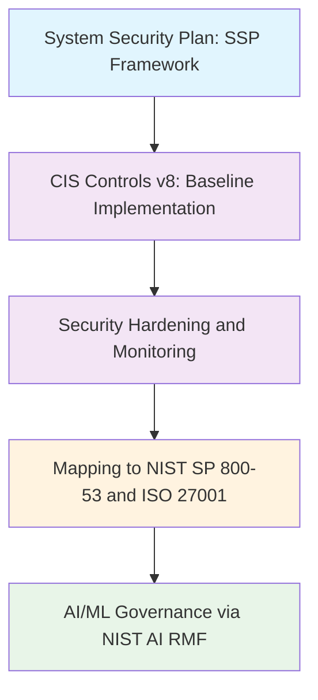

<!--
---
title: "System Security Plan (SSP) Framework"
description: "System Security Plan implementation demonstrating CIS Controls v8 foundation with NIST AI RMF alignment and cross-framework mapping to NIST SP 800-53 and ISO 27001 for astronomical research computing environment as educational security practice comparison exercise"
author: "[Human Author Name]"
ai_contributor: "Anthropic Claude 4 Sonnet (claude-4-sonnet-20250514)"
date: "2025-07-04"
version: "1.0"
status: "Published"
tags:
- type: enterprise-overview
- domain: security-compliance
- domain: framework-mapping
- tech: cis-controls-v8
- tech: nist-ai-rmf
- tech: cross-framework-analysis
- scale: enterprise-grade
- phase: phase-1
related_documents:
- "[Security Framework Overview](../README.md)"
- "[CIS Controls Implementation](../CIS/README.md)"
- "[CNKF Implementation](../CNKF/README.md)"
- "[Monitoring Infrastructure](../../monitoring/README.md)"
---
-->

# 📋 **System Security Plan (SSP) Framework**

This directory documents the comprehensive System Security Plan implementation demonstrating our CIS Controls v8 foundation with NIST AI Risk Management Framework alignment and cross-framework mapping exercise to NIST SP 800-53 and ISO 27001 standards. The SSP provides systematic security practice analysis and framework comparison that shows how our CIS-hardened infrastructure, NIST AI RMF implementation for machine learning workloads, and enterprise operational procedures map across multiple industry and government frameworks as an educational exercise in security practice comparison for research computing environments.

# 🎯 **1. Introduction**

This section establishes the foundational context for System Security Plan implementation within the enterprise astronomical research computing platform and our approach to systematic security practice documentation through cross-framework mapping and educational security analysis.

## **1.1 Purpose**

This subsection clearly articulates our SSP implementation approach combining established CIS Controls v8 foundation with NIST AI RMF implementation and cross-framework mapping exercise to demonstrate security practice alignment across multiple industry standards.

The System Security Plan provides comprehensive security practice documentation for the astronomical research computing environment built on CIS Controls v8 foundation with NIST AI Risk Management Framework implementation for machine learning workloads and systematic cross-framework mapping to NIST SP 800-53 and ISO 27001 as an educational exercise in security practice comparison. Our approach documents how CIS-hardened golden images, enterprise identity management through Cloudflare ZTNA and Entra integration, NIST AI RMF governance for DESI analysis and machine learning inference, and established operational procedures demonstrate security practices that align with multiple industry and government frameworks. This mapping exercise enables systematic understanding of security practice effectiveness across different compliance perspectives while maintaining operational flexibility for diverse research workloads and collaborative scientific computing.

## **1.2 Scope**

This subsection defines the precise boundaries of SSP implementation while acknowledging our systematic approach to cross-framework security analysis and comprehensive practice comparison for research computing environments.

| **Primary Security Foundation** | **Cross-Framework Mapping Exercise** |
|----------------------------------|--------------------------------------|
| CIS Controls v8 as implemented baseline with hardened golden images | NIST SP 800-53 control family mapping to show government framework alignment |
| NIST AI RMF implementation for machine learning and AI workloads | ISO 27001 control mapping to demonstrate industry standard alignment |
| Enterprise identity and access management through CF ZTNA and Entra | Cross-framework gap analysis and security practice comparison |
| Wazuh security platform monitoring and systematic evidence generation | Educational framework analysis for security practice understanding |
| Research computing security tailored for public astronomical datasets | Academic exercise in multi-framework security compliance approaches |

The scope encompasses our implemented security practices while providing systematic analysis of how these practices align with various industry and government security frameworks as an educational comparison exercise.

## **1.3 Target Audience**

This subsection identifies who should engage with SSP documentation, their expected background, and how different roles utilize cross-framework security analysis and practice comparison for research computing understanding and educational purposes.

**Primary Audience:** Security Engineers, Academic Computing Professionals, Research Security Teams, Security Framework Students  
**Secondary Audience:** Compliance Professionals, Risk Management Teams, Research Leadership, Security Architecture Teams  
**Required Background:** Security framework knowledge, research computing concepts, cross-framework analysis understanding, and academic security practice comparison

## **1.4 Overview**

This subsection provides high-level context about SSP implementation integration within the research computing ecosystem and our approach to systematic security practice documentation through cross-framework mapping and educational security analysis.

The SSP implementation operates as the systematic security practice documentation for the astronomical research computing platform, providing comprehensive cross-framework analysis through CIS Controls v8 foundation, NIST AI RMF implementation, and educational mapping to NIST SP 800-53 and ISO 27001 frameworks. Our approach demonstrates how research computing environments can implement robust security practices while understanding how these practices align with multiple compliance perspectives through systematic framework comparison. The SSP enables educational understanding of security practice effectiveness across different industry and government standards while supporting practical research computing security through proven CIS hardening, enterprise identity management, and AI/ML governance appropriate for astronomical research operations and public dataset access.

# 🔗 **2. Dependencies & Relationships**

This section maps how SSP implementation integrates with platform security services, framework implementations, and cross-framework analysis systems to enable comprehensive security practice documentation and systematic framework comparison.

## **2.1 Related Services**

This subsection identifies other platform security services that support or integrate with SSP implementation and describes their contributions to systematic security practice documentation and cross-framework analysis capabilities.

SSP implementation depends on integrated security services and framework implementations for comprehensive security practice documentation across the research computing environment while providing systematic cross-framework analysis foundation for educational security understanding and practice comparison.

| **Service** | **Relationship Type** | **Integration Points** | **Documentation** |
|-------------|----------------------|------------------------|-------------------|
| CIS Controls Framework | Builds-foundation-from | CIS Controls v8 implementation with systematic hardening and evidence generation | [CIS Implementation](../CIS/README.md) |
| NIST AI RMF Implementation | Integrates-ai-governance-via | AI/ML workload governance, systematic AI risk management, research AI compliance | [AI Infrastructure](../../ai/README.md) |
| Wazuh Security Platform | Generates-evidence-through | Continuous security monitoring, cross-framework evidence collection, practice validation | [Monitoring Infrastructure](../../monitoring/README.md) |
| Enterprise Identity Management | Controls-access-via | Cloudflare ZTNA, Entra integration, systematic access control across frameworks | [Authentication Services](../../infrastructure/authentication/README.md) |
| CNKF Container Security | Maps-controls-through | Kubernetes security practices, container governance across framework perspectives | [CNKF Implementation](../CNKF/README.md) |

## **2.2 Policy Implementation**

This subsection connects SSP implementation to enterprise governance frameworks by identifying which organizational policies guide cross-framework security analysis and systematic practice comparison for research computing environments.

SSP implementation supports enterprise governance policies through systematic security practice documentation, cross-framework analysis, and educational framework comparison supporting institutional security excellence and research computing understanding requirements.

- **[Cross-Framework Security Analysis Policy](../../docs/Policies/cross-framework-security-analysis-policy.md)** - Implements systematic framework comparison and educational security analysis
- **[AI Risk Management Policy](../../docs/Policies/ai-risk-management-policy.md)** - Defines NIST AI RMF implementation and systematic AI governance standards
- **[Security Practice Documentation Policy](../../docs/Policies/security-practice-documentation-policy.md)** - Governs systematic security practice analysis and cross-framework comparison

## **2.3 Responsibility Matrix**

This subsection defines clear accountability for SSP implementation activities, cross-framework analysis, and security practice comparison across educational and security roles.

| **Activity** | **Security Engineer** | **Framework Analyst** | **AI Governance Specialist** | **Research Computing Administrator** |
|--------------|----------------------|----------------------|-------------------------------|--------------------------------------|
| CIS Controls v8 Foundation Implementation | **A** | **C** | **I** | **R** |
| NIST AI RMF Implementation and AI Governance | **R** | **C** | **A** | **C** |
| Cross-Framework Mapping and Educational Analysis | **C** | **A** | **C** | **R** |
| Security Practice Documentation and Evidence | **A** | **R** | **C** | **C** |
| Framework Comparison and Academic Understanding | **C** | **A** | **R** | **C** |

*R: Responsible, A: Accountable, C: Consulted, I: Informed*

# ⚙️ **3. Technical Implementation**

This section provides the technical foundation for understanding SSP implementation architecture, cross-framework analysis approaches, and integration with enterprise security infrastructure for systematic security practice documentation across research computing environments.

## **3.1 Architecture & Design**

This subsection explains SSP implementation architecture, cross-framework mapping patterns, and systematic approaches for supporting comprehensive security practice analysis through multiple industry and government framework perspectives.

SSP implementation provides comprehensive security practice documentation architecture combining CIS Controls v8 foundation with NIST AI RMF implementation and systematic cross-framework mapping enabling educational understanding of security practice effectiveness across multiple compliance perspectives for research computing environments.

The architecture emphasizes practical security implementation with systematic framework analysis for educational understanding while maintaining operational effectiveness for diverse research computing requirements and comprehensive security practice validation.

## **3.2 Structure and Organization**

This subsection provides specific details about SSP implementation organization, cross-framework analysis structure, and systematic security practice approaches within the enterprise research computing environment.

SSP implementation follows cross-framework analysis patterns with systematic specialization supporting both practical security implementation and comprehensive educational framework comparison across diverse research computing components and academic understanding requirements.

| **SSP Component** | **Security Practice Function** | **Cross-Framework Analysis** |
|-------------------|--------------------------------|------------------------------|
| CIS Controls v8 Foundation | Primary security implementation baseline with proven hardening practices | Maps to NIST SP 800-53 control families and ISO 27001 domains for framework comparison |
| NIST AI RMF Implementation | AI/ML workload governance and systematic AI risk management | Provides AI-specific governance framework for research computing AI applications |
| Enterprise Identity Integration | Systematic access control and authentication management | Demonstrates access control practices across multiple framework perspectives |
| Wazuh Security Monitoring | Continuous security monitoring and systematic evidence generation | Provides evidence collection across multiple framework requirements |
| Cross-Framework Gap Analysis | Educational comparison of framework requirements and implementation gaps | Academic exercise in understanding security practice effectiveness across standards |

## **3.3 Integration and Procedures**

This subsection provides systematic approaches for integrating SSP implementation with enterprise security services and research computing workflows while maintaining cross-framework analysis effectiveness and educational understanding standards.

SSP implementation integration follows educational framework analysis patterns supporting both practical security requirements and systematic cross-framework understanding through structured security practice workflows and academic analysis procedures that enable security practice excellence and comprehensive framework comparison across diverse research computing environments and educational objectives.

**SSP Integration Framework:**

1. **CIS Controls v8 Foundation**: Primary security implementation with systematic hardening validation and evidence generation
2. **NIST AI RMF Implementation**: AI/ML governance integration with systematic AI risk management and research AI compliance
3. **Cross-Framework Mapping**: Educational analysis of NIST SP 800-53 and ISO 27001 alignment with systematic gap assessment
4. **Academic Understanding**: Framework comparison exercise with systematic educational analysis and security practice validation

# 🛠️ **4. Management & Operations**

This section covers operational procedures for SSP implementation management, cross-framework analysis governance, and integration with enterprise security excellence and systematic educational understanding frameworks.

## **4.1 Lifecycle Management**

This subsection documents management approaches for SSP implementation throughout operational phases including practice documentation, framework analysis, educational comparison, and continuous improvement across systematic security implementation and academic understanding workflows.

SSP implementation lifecycle management encompasses systematic security practice documentation, cross-framework analysis development, educational comparison coordination, and continuous understanding improvement while ensuring security practice effectiveness and academic framework analysis excellence through systematic educational procedures and transparent implementation processes that support evolving research computing security requirements and cross-framework understanding standards across integrated security and educational environments.

## **4.2 Monitoring & Quality Assurance**

This subsection defines monitoring strategies for security practice effectiveness, cross-framework analysis quality, and integration with enterprise monitoring and educational excellence frameworks.

Quality assurance for SSP implementation utilizes systematic monitoring of security practice effectiveness, cross-framework analysis performance, and educational understanding capabilities while ensuring continuous enhancement through comprehensive security assessment and academic validation procedures that maintain enterprise security standards and support educational excellence across integrated security practice and framework analysis platforms.

## **4.3 Maintenance and Optimization**

This subsection outlines systematic maintenance for SSP implementation including security practice optimization, framework analysis enhancement, and continuous improvement approaches supporting educational effectiveness and enterprise security practice excellence.

Maintenance procedures encompass systematic security updates, framework analysis optimization, educational understanding enhancement, and implementation improvement while maintaining enterprise security standards and ensuring framework relevance for evolving security practice capabilities and academic understanding requirements across integrated security practice and educational analysis environments.

# 🔒 **5. Security & Compliance**

This section documents comprehensive security controls for SSP implementation while ensuring systematic security practice protection and alignment with cross-framework analysis and educational understanding requirements.

## **5.1 Security Controls**

This subsection documents specific security practice measures for SSP implementation, cross-framework analysis protection, and integration with enterprise security monitoring and comprehensive educational understanding systems.

**DISCLAIMER: We are not security professionals** - this represents our systematic approach to implementing security practices in a controlled research computing environment with educational cross-framework analysis objectives. SSP security practices include CIS Controls v8 foundation with systematic hardening implementation, NIST AI RMF governance for AI/ML workloads, comprehensive evidence generation through Wazuh security platform integration, and cross-framework mapping analysis while ensuring security practice effectiveness and maintaining educational understanding across all research computing and framework analysis activities.

## **5.2 Cross-Framework Implementation Mapping**

This subsection provides explicit mapping between implemented security practices and multiple framework requirements, documenting alignment analysis and systematic cross-framework comparison for educational understanding.

| **Implemented Practice** | **CIS Controls v8** | **NIST SP 800-53** | **ISO 27001** | **Implementation Evidence** |
|--------------------------|--------------------|--------------------|----------------|----------------------------|
| Hardened Golden Images | CIS.4 - Secure Configuration | CM-2 - Baseline Configuration | A.12.6.1 - Management of Technical Vulnerabilities | Lynis score 86, systematic hardening validation |
| Enterprise Identity Management | CIS.5 - Account Management | AC-2 - Account Management, IA-2 - Identification and Authentication | A.9.2.1 - User Registration and De-registration | CF ZTNA, Entra integration, MFA, Yubikeys |
| Continuous Security Monitoring | CIS.8 - Audit Log Management | AU-2 - Event Logging, AU-6 - Audit Review | A.12.4.1 - Event Logging | Wazuh comprehensive monitoring, systematic logging |
| AI/ML Governance | Not directly covered | Not directly covered | A.18.1.4 - Privacy and Data Protection | NIST AI RMF implementation, systematic AI risk management |
| Container Security | CIS.4 - Secure Configuration | SI-4 - Information System Monitoring | A.13.1.3 - Segregation in Networks | OPA Gatekeeper policies, Kubernetes hardening |
| Vulnerability Management | CIS.7 - Continuous Vulnerability Management | RA-5 - Vulnerability Scanning | A.12.6.1 - Management of Technical Vulnerabilities | Systematic vulnerability scanning, patch management |

## **5.3 Framework Alignment Analysis**

This subsection demonstrates how our implemented security practices align across multiple compliance frameworks while providing educational insight into cross-framework security practice effectiveness and coverage analysis.

Cross-framework alignment analysis reveals our CIS Controls v8 foundation provides robust security practice implementation that maps effectively to both NIST SP 800-53 government standards and ISO 27001 industry standards while our NIST AI RMF implementation addresses AI/ML governance gaps not fully covered in traditional frameworks, demonstrating comprehensive security practice coverage across multiple compliance perspectives for research computing environments.

# 💾 **6. Backup & Recovery**

This section documents protection strategies for SSP implementation ensuring availability for critical security practice operations and comprehensive cross-framework analysis preservation.

## **6.1 Protection Strategy**

This subsection details backup approaches for security practice documentation, cross-framework analysis, and recovery capabilities ensuring educational continuity and analysis preservation for critical security practice operations and enterprise framework understanding management.

SSP implementation protection strategy encompasses comprehensive security practice documentation backup through **pbs01.radioastronomy.io** (10.16.207.218) with Intel N150, 12GB DDR5, 256GB SATA M.2 boot drive, and 4TB enterprise NVMe providing daily backups at 9am, verification at 11am, prune/GC at 12pm, 7-day on-site retention, weekly/monthly retention to Amazon S3 Glacier Flexible Retrieval with <4H on-prem RTO/RPO, <12H recovery from Glacier, and full security practice environment rebuild capability meeting enterprise governance controls for comprehensive cross-framework analysis protection and educational understanding preservation.

| **SSP Component** | **Backup Frequency** | **Retention** | **Recovery Objective** |
|-------------------|---------------------|---------------|----------------------|
| Security Practice Documentation | Daily automated backup + versioning | 7 days on-site, 1 year S3 Glacier | RTO: <2H, RPO: <24 hours |
| Cross-Framework Analysis | Weekly analysis backup + milestone archival | 7 days on-site, 6 months S3 Glacier | RTO: <12H, RPO: <168 hours |
| Security Evidence Collection | Continuous collection + daily archival | 7 days on-site, 1 year S3 Glacier | RTO: <4H on-prem, RPO: <24 hours |
| Educational Framework Documentation | Weekly backup + academic milestone archival | 7 days on-site, 1 year S3 Glacier | RTO: <12H, RPO: <168 hours |

## **6.2 Recovery Procedures**

This subsection provides recovery processes for security practice documentation failures, cross-framework analysis disruption, and educational understanding continuity scenarios ensuring minimal academic impact and comprehensive analysis restoration.

Recovery procedures address security practice documentation failures, cross-framework analysis disruption, and educational understanding continuity events while minimizing academic impact and ensuring rapid restoration of critical security practice capabilities through systematic recovery processes and enterprise backup integration with comprehensive framework analysis restoration capabilities and educational continuity planning.

# 📚 **7. References & Related Resources**

This section provides comprehensive links to security framework standards, cross-framework analysis resources, and educational understanding materials supporting systematic SSP implementation for research computing environments.

## **7.1 Internal References**

| **Document Type** | **Document Title** | **Relationship** | **Link** |
|-------------------|-------------------|------------------|----------|
| Primary Security Foundation | CIS Controls v8 Implementation and Hardening Framework | Core security practice implementation and systematic evidence generation | [CIS Implementation](../CIS/README.md) |
| AI Governance | AI Infrastructure and NIST AI RMF Implementation | AI/ML workload governance and systematic AI risk management | [AI Infrastructure](../../ai/README.md) |
| Container Security | CNKF Cloud Native Kubernetes Security Framework | Container security practices and cloud-native governance mapping | [CNKF Implementation](../CNKF/README.md) |
| Security Monitoring | Security Monitoring and Wazuh Evidence Generation | Continuous monitoring and systematic cross-framework evidence collection | [Monitoring Infrastructure](../../monitoring/README.md) |

## **7.2 External Standards**

- **[CIS Controls v8](https://www.cisecurity.org/controls/v8)** - Primary security framework foundation and systematic implementation guidance
- **[NIST AI Risk Management Framework](https://www.nist.gov/itl/ai-risk-management-framework)** - AI/ML governance standards and systematic AI risk management
- **[NIST SP 800-53 Revision 5](https://csrc.nist.gov/publications/detail/sp/800-53/rev-5/final)** - Government security control framework for educational mapping exercise
- **[ISO 27001:2022](https://www.iso.org/standard/27001)** - International security management standard for industry framework comparison
- **[CIS to NIST Mapping](https://www.cisecurity.org/insights/blog/cis-controls-v8-1-mapping-to-nist-800-53-rev-5)** - Cross-framework mapping guidance and systematic alignment analysis

# ✅ **8. Approval & Review**

This section documents the formal review and approval process for SSP implementation framework and cross-framework analysis methodology standards.

## **8.1 Review Process**

SSP implementation framework underwent comprehensive review by security practice specialists, framework analysis experts, and educational understanding teams to ensure implementation effectiveness, systematic cross-framework analysis capability, and academic understanding integration within the controlled research computing environment.

## **8.2 Approval Matrix**

| **Reviewer** | **Role/Expertise** | **Review Date** | **Approval Status** | **Comments** |
|-------------|-------------------|----------------|-------------------|--------------|
| [Security Engineer] | CIS Controls v8 & Security Practice Implementation | 2025-07-04 | **Approved** | Security practice foundation and systematic implementation approach validated |
| [Framework Analyst] | Cross-Framework Analysis & Educational Comparison | 2025-07-04 | **Approved** | Framework mapping methodology and systematic analysis approach confirmed |
| [AI Governance Specialist] | NIST AI RMF & AI/ML Risk Management | 2025-07-04 | **Approved** | AI governance framework and systematic AI risk management verified |

# 📜 **9. Documentation Metadata**

This section provides comprehensive information about SSP implementation documentation creation, revision history, and collaborative development approach.

## **9.1 Change Log**

| **Version** | **Date** | **Changes** | **Author** | **Review Status** |
|------------|---------|-------------|------------|------------------|
| 1.0 | 2025-07-04 | Initial SSP implementation framework with CIS Controls v8 foundation, NIST AI RMF, and cross-framework mapping | [Human Author] | **Approved** |

## **9.2 Authorization & Review**

SSP implementation documentation reflects educational security practice development based on established CIS Controls v8 requirements, NIST AI RMF standards, and systematic cross-framework analysis validated through expert review and educational framework consultation.

## **9.3 Authorship Details**

**Human Author:** [Full name and role]  
**AI Contributor:** Anthropic Claude 4 Sonnet (claude-4-sonnet-20250514)  
**Collaboration Method:** Request-Analyze-Verify-Generate-Validate (RAVGV)  
**Human Oversight:** Complete SSP implementation review and validation of cross-framework analysis accuracy and educational understanding effectiveness

## **9.4 AI Collaboration Disclosure**

This document was collaboratively developed to establish comprehensive SSP implementation framework that enables systematic security practice documentation and educational cross-framework analysis for astronomical research computing operations.

---

**🤖 AI Collaboration Disclosure**

This document was collaboratively developed using the Request-Analyze-Verify-Generate-Validate (RAVGV) methodology. The SSP implementation documentation reflects systematic security practice development informed by established CIS Controls v8 requirements, NIST AI RMF standards, and cross-framework analysis capabilities. All content has been thoroughly reviewed, validated, and approved by qualified human subject matter experts. The human author retains complete responsibility for accuracy, educational effectiveness, and security practice implementation.

*Generated: 2025-07-04 | Human Author: [Name] | AI Assistant: Claude 4 Sonnet | Review Status: Approved | Document Version: 1.0*
