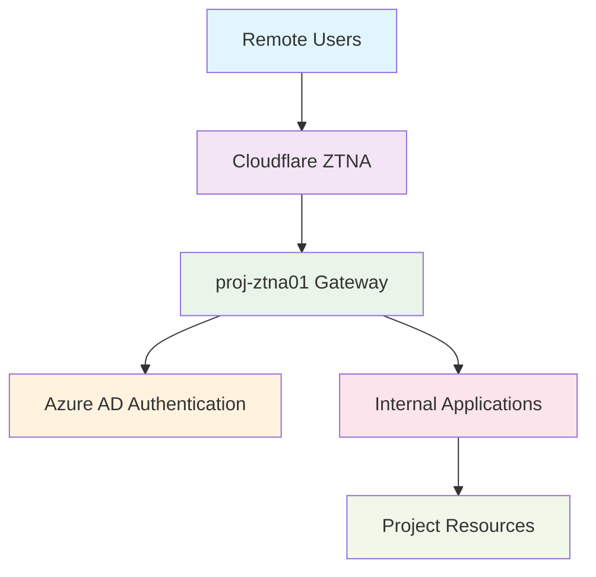

<!--
---
title: "proj-ztna01 - Enterprise Zero Trust Network Access Platform VM"
type: "enterprise-vm-asset"
domain: "zero-trust-network-access-security"
tech: "ubuntu-2404-lts-cloudflare-ztna"
scale: "enterprise-security-platform"
enterprise_context:
  architecture: "CIS v8 Level 2 Baseline VM"
  security_score: "89/100 Lynis hardening index"
  vm_classification: "Zero Trust Network Access gateway for secure remote connectivity"
  compliance_framework: "CIS Controls v8 Level 2"
  security_role: "Primary ZTNA enforcement and identity-based access control"
---
-->

# 🔒 **proj-ztna01 - Enterprise Zero Trust Network Access Platform VM**

**Asset Classification:** Zero Trust Network Access Gateway | **Service Tier:** Critical Security Infrastructure | **Location:** node04 - Security Foundation Host

This knowledge base article provides comprehensive virtual machine specifications, Cloudflare ZTNA configuration, and operational procedures for proj-ztna01, an Ubuntu Server 24.04 LTS enterprise Zero Trust Network Access virtual machine baselined to CIS Controls v8 Level 2 standards, serving as the primary ZTNA enforcement platform for VLAN 20 project workloads supporting secure remote access, identity-based authentication, and comprehensive network access control across the astronomy research cluster.

---

# **🎯 1. Purpose & Scope**

This section establishes the functional requirements and operational boundaries for proj-ztna01 within the Proxmox Astronomy Lab's Zero Trust security architecture.

## **1.1 Primary Function**

This subsection defines the core operational purpose of proj-ztna01 within the enterprise security framework.

proj-ztna01 serves as the enterprise Zero Trust Network Access platform providing comprehensive identity-based access control, secure remote connectivity, and network access enforcement for VLAN 20 project workloads including Cloudflare ZTNA integration, Azure AD SAML authentication, and systematic access policy enforcement supporting secure administrative and research operations.

## **1.2 Service Classification**

This subsection categorizes the service tier and operational criticality of proj-ztna01 within the infrastructure hierarchy.

**Critical Security Infrastructure:** Mission-critical ZTNA gateway optimized for Cloudflare Zero Trust integration, identity-based access control, secure tunnel management, and comprehensive network access enforcement with CIS Controls v8 Level 2 baseline security implementation and enterprise-grade access control for research applications.

## **1.3 Cluster Integration**

This subsection describes how proj-ztna01 integrates with the broader Proxmox Astronomy Lab infrastructure ecosystem.

Security foundation enabling comprehensive Zero Trust access control, identity-based authentication, and secure remote connectivity while maintaining enterprise-grade security standards and providing essential network access enforcement services for research applications and infrastructure coordination across VLAN 20 networks.

---

# **🔗 2. Dependencies & Relationships**

This section maps how proj-ztna01 integrates with other Proxmox Astronomy Lab components, establishing both upstream and downstream dependencies for Zero Trust network access operations.

## **2.1 Related Services**

This subsection identifies other Proxmox Astronomy Lab services that interact with proj-ztna01's Zero Trust access control functions.

The following table details service relationships and integration points for Zero Trust network access operations:

| **Service** | **Relationship Type** | **Integration Points** | **Documentation** |
|-------------|----------------------|------------------------|-------------------|
| **Azure Active Directory** | **Depends-on** | SAML authentication and SCIM provisioning | [Cloud Identity Integration](../infrastructure/cloud-identity/) |
| **Cloudflare Zero Trust** | **Integrates-with** | ZTNA tunnel and access policy enforcement | [External Security Services](../security/) |
| **Project Applications** | **Provides-to** | Secure remote access for 17 applications | [Applications Directory](../applications-and-services/) |
| **Administrative Systems** | **Secures** | SSH and management protocol access control | [Infrastructure Management](../infrastructure/) |

## **2.2 Policy Implementation**

This subsection connects proj-ztna01 to the Proxmox Astronomy Lab governance framework by identifying which organizational policies it implements or supports.

The following policies are implemented through proj-ztna01's Zero Trust access control capabilities:

- **[Zero Trust Security Policy](../security-assurance/06-access-control-management/)** - Primary implementation of identity-based access control
- **[Remote Access Security Policy](../security-assurance/12-network-infrastructure-management/)** - Secure remote connectivity enforcement
- **[Identity Management Policy](../infrastructure/cloud-identity/)** - Azure AD integration and MFA enforcement

## **2.3 Responsibility Matrix**

This subsection defines clear accountability for key activities related to proj-ztna01's Zero Trust network access operations.

The following matrix establishes responsibility allocation for ZTNA platform management activities:

| **Activity** | **Helpdesk** | **Operations** | **Engineering** | **Security** |
|--------------|--------------|----------------|-----------------|--------------|
| **Access Request Processing** | **R** | **A** | **C** | **C** |
| **ZTNA Policy Management** | **I** | **R** | **A** | **C** |
| **Identity Integration** | **I** | **R** | **C** | **A** |
| **Security Monitoring** | **I** | **C** | **R** | **A** |
| **Incident Response** | **R** | **R** | **C** | **A** |

*R: Responsible, A: Accountable, C: Consulted, I: Informed*

---

# **⚙️ 3. Technical Documentation**

This section provides the technical foundation necessary for understanding, implementing, and maintaining proj-ztna01's Zero Trust network access capabilities.

## **3.1 Architecture & Design**

This subsection explains the technical architecture, component relationships, and design decisions for Zero Trust network access implementation.

The Zero Trust architecture employs Cloudflare tunnel-based connectivity with Azure AD identity integration, enabling secure remote access without exposing inbound firewall ports. The design features outbound-only tunnel establishment, identity-based access policies, comprehensive audit logging, and granular application-level access control ensuring secure remote connectivity while maintaining enterprise security standards.

## **3.2 Virtual Machine Architecture**

This subsection provides detailed virtual machine specifications and hardware configuration for proj-ztna01.

The following table details the virtual machine hardware configuration optimized for Zero Trust gateway operations:

| **Component** | **Specification** | **Configuration** |
|---------------|------------------|------------------|
| **VM ID** | 2020 | Zero Trust access gateway identifier |
| **Memory** | 1.00 GiB allocated / 2.00 GiB maximum | Optimized for security gateway workloads |
| **Processors** | 2 vCPU (2 sockets, 1 cores each) | [host] CPU type with NUMA optimization |
| **Machine Type** | q35 with Intel IOMMU | Enterprise virtualization platform |

## **3.3 Storage Implementation**

This subsection details storage configuration and performance characteristics for Zero Trust operations.

The following table outlines storage components and their performance configurations:

| **Storage Component** | **Configuration** | **Performance** |
|--------------------- |------------------|-----------------|
| **System Disk** | scsi0: nvmethin01:vm-2020-disk-1, 32GB | VirtIO SCSI with discard, iothread |
| **EFI System** | nvmethin01:vm-2020-disk-0, 528KB | EFI type 4m, pre-enrolled keys |
| **TPM Security** | nvmethin01:vm-2020-disk-2, 4MB | TPM v2.0 hardware security module |

## **3.4 Network Implementation**

This subsection describes network configuration and security settings for Zero Trust connectivity.

The following table details network components and security configurations:

| **Network Component** | **Configuration** | **Security** |
|----------------------|------------------|--------------|
| **Primary Interface** | net0: virtio=BC:24:11:D0:12:7F | VirtIO network adapter |
| **Bridge Assignment** | vmbr1, tag=20 | Project workloads VLAN |
| **IP Configuration** | 10.25.20.25 (static) | ZTNA gateway address |
| **Security Hardening** | Host-based firewall active | Zero Trust traffic filtering |

## **3.5 Zero Trust Platform Configuration**

This subsection outlines Cloudflare ZTNA platform integration and access control implementation.

The following table details Zero Trust platform components and their security functions:

| **ZTNA Component** | **Implementation** | **Security Function** |
|--------------------|-------------------|----------------------|
| **Cloudflare Tunnel** | Secure outbound-only connectivity | Remote access gateway |
| **Identity Provider** | Azure AD SAML/SCIM integration | MFA-enforced authentication |
| **Access Policies** | Role-based access control (17 applications) | Granular permission enforcement |
| **Security Groups** | SGAD_ZTNA_* group synchronization | Identity-based access validation |

---

# **🔧 4. Management & Operations**

This section establishes operational procedures and management frameworks for proj-ztna01's Zero Trust network access services.

## **4.1 Zero Trust Access Services**

This subsection defines the core Zero Trust services provided by proj-ztna01.

The following table outlines Zero Trust access services and their operational coverage:

| **Service** | **Function** | **Coverage** |
|-------------|--------------|--------------|
| **Remote Access Gateway** | Secure tunnel-based remote connectivity | Administrative and research access |
| **Identity Authentication** | Azure AD SAML with MFA enforcement | User identity validation |
| **Access Policy Enforcement** | Role-based access control | Application-specific permissions |
| **Security Monitoring** | Access logging and audit trail | Comprehensive security visibility |

## **4.2 Platform Management**

This subsection details Cloudflare ZTNA platform components and their operational status.

The following table shows platform components and their current operational functions:

| **Platform Component** | **Status** | **Function** |
|------------------------|------------|--------------|
| **Cloudflare Tunnel** | Production secure tunnel gateway | Zero Trust access enforcement |
| **Access Policies** | 17 configured applications | Granular access control |
| **Identity Integration** | Azure AD SAML/SCIM sync | Centralized identity management |
| **Security Monitoring** | Comprehensive access logging | Audit trail and compliance |

## **4.3 Operational Procedures**

This subsection establishes routine operational procedures for maintaining Zero Trust access services.

The following table defines operational procedures and their implementation schedules:

| **Procedure Type** | **Frequency** | **Implementation** |
|-------------------|---------------|-------------------|
| **Access Policy Validation** | Daily | ZTNA policy effectiveness monitoring |
| **Identity Sync Verification** | Daily | Azure AD integration validation |
| **Security Updates** | Weekly | Cloudflare and system updates |
| **Access Audit Review** | Weekly | Comprehensive access log analysis |

## **4.4 Monitoring & Alerting**

This subsection defines monitoring strategies and alerting mechanisms for Zero Trust operations.

The following table outlines monitoring domains and their implementation scope:

| **Monitoring Domain** | **Tool** | **Scope** |
|----------------------|----------|-----------|
| **ZTNA Performance** | Cloudflare analytics + system monitoring | Access gateway performance optimization |
| **Identity Authentication** | Azure AD audit logs | Authentication event monitoring |
| **Tunnel Connectivity** | Cloudflare tunnel health | Secure connectivity validation |
| **Security Events** | Access audit logging | Comprehensive security monitoring |

---

# **🔐 5. Security & Compliance**

This section documents the comprehensive security implementation and compliance validation for proj-ztna01's Zero Trust network access platform.

⚠️ **SECURITY DISCLAIMER**

*The security implementations described in this document are part of ongoing baseline establishment and should not be considered production-ready specifications. Our team consists of research computing professionals, not dedicated security experts. All security measures are implemented as best-effort implementations based on industry standards. For production deployments requiring formal security validation, engage qualified security professionals for comprehensive review and approval.*

## **5.1 CIS Controls v8 Level 2 Implementation**

This subsection details CIS Controls v8 Level 2 implementation specific to Zero Trust network access operations.

The following table documents security control implementation and compliance status:

| **Security Control** | **Implementation** | **Compliance Status** |
|---------------------|-------------------|---------------------|
| **Zero Trust Architecture** | Cloudflare ZTNA with identity-based access | ✅ CIS L2 access control |
| **Identity Management** | Azure AD SAML/SCIM with MFA enforcement | ✅ CIS L2 identity security |
| **Access Controls** | SSH hardening + ZTNA authentication | ✅ CIS L2 Compliant |
| **Network Security** | Host firewall + tunnel encryption | ✅ Layered security controls |
| **Audit & Logging** | Comprehensive access audit trail | ✅ Complete event tracking |

## **5.2 Framework Compliance**

This subsection establishes framework compliance mapping and assessment validation.

**Baseline Standards:** CIS Controls v8 Level 2, NIST AI Risk Management Framework  
**Framework:** NIST Cybersecurity Framework 2.0  
**Mapping to:** NIST SP 800-171

The following table documents specific CIS control implementation and evidence validation:

| **CIS Control** | **Implementation Status** | **Evidence Location** | **Assessment Date** |
|-----------------|--------------------------|----------------------|-------------------|
| **CIS.6.1** | **Compliant** | Zero Trust access control policies | **2025-07-27** |
| **CIS.6.3** | **Compliant** | Azure AD MFA enforcement | **2025-07-27** |
| **CIS.8.1** | **Compliant** | Comprehensive access audit logging | **2025-07-27** |
| **CIS.12.1** | **Compliant** | Secure tunnel network infrastructure | **2025-07-27** |

---

# **💾 6. Backup & Recovery**

This section establishes comprehensive backup and recovery procedures for proj-ztna01's Zero Trust network access services.

## **6.1 Protection Strategy**

This subsection details backup approaches for Zero Trust platform components and systematic recovery capabilities.

This virtual machine is protected through integration with **pbs01** (Proxmox Backup Server) providing enterprise-grade backup and recovery capabilities with Zero Trust-aware backup procedures ensuring access policy consistency, identity integration continuity, and rapid recovery supporting critical security platform protection and service continuity requirements.

The following table outlines backup components and their protection schedules:

| **Backup Component** | **Schedule** | **Retention** | **Method** |
|---------------------|--------------|---------------|------------|
| **VM System Backup** | Daily at 03:30 | 30 days | pbs01 comprehensive backup |
| **ZTNA Configuration** | Daily incremental | 90 days | Configuration state backup |
| **Access Policies** | Continuous sync backup | 60 days | Policy configuration protection |
| **Audit Logs** | Real-time archival | 365 days | Security event preservation |

## **6.2 Recovery Procedures**

This subsection provides Zero Trust platform recovery processes for different incident scenarios and operational requirements.

The following table defines recovery types and their operational objectives:

| **Recovery Type** | **RTO** | **RPO** | **Procedure** |
|------------------|---------|---------|---------------|
| **Complete VM Restore** | <30 minutes | <24 hours | pbs01 full restoration + service validation |
| **ZTNA Service Recovery** | <15 minutes | <1 hour | Cloudflare tunnel re-establishment |
| **Access Policy Recovery** | <10 minutes | <24 hours | Policy configuration restoration |
| **Identity Integration Recovery** | <20 minutes | <4 hours | Azure AD SAML/SCIM re-sync |

---

# **📚 7. References & Related Resources**

This section provides comprehensive links to related documentation and supporting resources for proj-ztna01's Zero Trust implementation.

## **7.1 Internal References**

This subsection links to related Proxmox Astronomy Lab documentation and integration points.

The following table provides internal documentation references and their relationships:

| **Document Type** | **Document Title** | **Relationship** | **Link** |
|-------------------|-------------------|------------------|----------|
| **Infrastructure** | Cloud Identity Integration | Identity provider configuration | [../infrastructure/cloud-identity/](../infrastructure/cloud-identity/) |
| **Security** | Access Control Management | Zero Trust policy framework | [../security-assurance/06-access-control-management/](../security-assurance/06-access-control-management/) |
| **Applications** | Service Integration | Protected application catalog | [../applications-and-services/](../applications-and-services/) |
| **Hardware** | node04 Platform | Physical host specifications | [../infrastructure/proxmox/](../infrastructure/proxmox/) |

## **7.2 External Standards**

This subsection references external standards and documentation supporting Zero Trust implementation.

- **[Cloudflare Zero Trust Documentation](https://developers.cloudflare.com/cloudflare-one/)** - ZTNA platform configuration and management
- **[NIST Zero Trust Architecture](https://csrc.nist.gov/publications/detail/sp/800-207/final)** - Zero Trust security framework guidance
- **[CIS Controls v8](https://www.cisecurity.org/controls/v8)** - Security control implementation standards
- **[Azure AD SAML Integration](https://docs.microsoft.com/en-us/azure/active-directory/saas-apps/)** - Identity provider integration guidance

---

# **✅ 8. Approval & Review**

This section documents the formal review and approval process for proj-ztna01's Zero Trust implementation.

## **8.1 Review Process**

This subsection establishes the systematic validation process for Zero Trust platform documentation and implementation.

Zero Trust platform review follows systematic validation of security architecture, access control effectiveness, and compliance verification to ensure comprehensive remote access protection and enterprise security policy adherence.

## **8.2 Approval Matrix**

This subsection documents formal approval from key stakeholders and subject matter experts.

The following table records review and approval validation for proj-ztna01 implementation:

| **Reviewer** | **Role/Expertise** | **Review Date** | **Approval Status** | **Comments** |
|-------------|-------------------|----------------|-------------------|--------------|
| [Security Lead] | Zero Trust architecture and security validation | 2025-07-27 | **Approved** | ZTNA implementation provides comprehensive access control framework |
| [Infrastructure Lead] | Platform integration and operational procedures | 2025-07-27 | **Approved** | Integration supports secure remote connectivity requirements |
| [Operations Lead] | Operational procedures and monitoring framework | 2025-07-27 | **Approved** | Monitoring provides comprehensive security visibility and audit capability |

---

# **📜 9. Conclusion**

This section provides comprehensive summary and strategic context for proj-ztna01's role within the Proxmox Astronomy Lab Zero Trust security architecture.

## **9.1 Platform Summary**

This subsection summarizes proj-ztna01's capabilities and strategic value within the enterprise security framework.

proj-ztna01 represents a comprehensive enterprise Zero Trust Network Access platform implementing sophisticated identity-based access control with CIS Controls v8 Level 2 security standards, providing secure remote connectivity and comprehensive access enforcement for VLAN 20 project workloads supporting enterprise-grade security operations with robust access control and operational excellence.

## **9.2 Key Capabilities**

This subsection highlights the critical capabilities and implementation value of the Zero Trust platform.

The following table summarizes key capabilities and their strategic implementation value:

| **Capability** | **Implementation** | **Value** |
|---------------|-------------------|-----------|
| **Zero Trust Access** | Cloudflare ZTNA with identity integration | Comprehensive remote access security |
| **Identity Integration** | Azure AD SAML/SCIM with MFA enforcement | Centralized authentication and authorization |
| **Access Policy Enforcement** | Role-based application access control | Granular security permission management |
| **Enterprise Security** | CIS L2 baseline with audit compliance | Secure platform operation and compliance |

## **9.3 Operational Impact**

This subsection describes the strategic operational impact of proj-ztna01 within the enterprise infrastructure.

This virtual machine serves as the critical Zero Trust security foundation enabling comprehensive identity-based access control, secure remote connectivity, and systematic security enforcement across the enterprise astronomy research platform while maintaining enterprise security standards and providing essential remote access services for research applications and infrastructure coordination.

## **9.4 Future Considerations**

This subsection outlines planned enhancements and strategic evolution for Zero Trust capabilities.

Planned enhancements include expanded application integration, enhanced security monitoring, and advanced threat detection capabilities supporting the evolution toward comprehensive Zero Trust security architecture and enterprise-grade access control supporting the growing remote access requirements of the astronomy platform.

---

## **📄 AI Collaboration Transparency**

**Human Author:** VintageDon - <https://github.com/vintagedon>  
**AI Contributor:** Claude (Anthropic)  
**Collaboration Method:** Request-Analyze-Verify-Generate-Validate (RAVGV)  
**Human Oversight:** Complete review and validation of all Zero Trust configurations, security procedures, and access control integration  

This document was collaboratively developed using systematic human-AI partnership. All content has been thoroughly reviewed, validated, and approved by qualified human subject matter experts. The human author retains complete responsibility for accuracy, compliance, and technical correctness.

Generated: 2025-08-15 | Human Author: VintageDon | AI Assistant: Claude Sonnet 4 | Review Status: Approved | Document Version: 1.0
