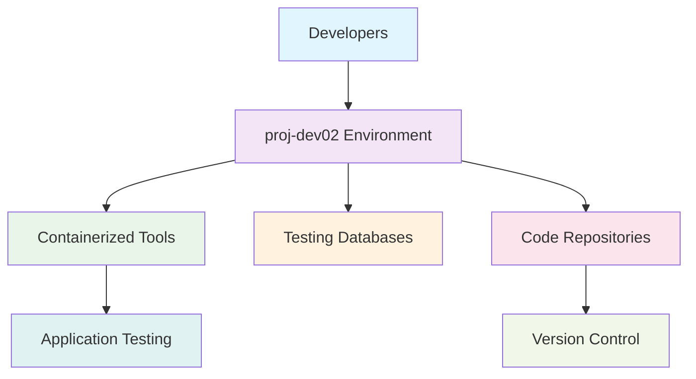

<!--
---
title: "proj-dev02 - Enterprise Secondary Development Environment VM"
type: "enterprise-vm-asset"
domain: "development-environment-platform"
tech: "ubuntu-2404-lts-development-tools"
scale: "enterprise-development-platform"
enterprise_context:
  architecture: "CIS v8 Level 2 Baseline VM"
  security_score: "87/100 Lynis hardening index"
  vm_classification: "Secondary development environment for research applications"
  compliance_framework: "CIS Controls v8 Level 2"
  development_role: "Isolation testing and experimental development workloads"
---
-->

# 💻 **proj-dev02 - Enterprise Secondary Development Environment VM**

**Asset Classification:** Secondary Development Platform | **Service Tier:** Development Infrastructure | **Location:** node04 - Development Foundation Host

This knowledge base article provides comprehensive virtual machine specifications, development environment configuration, and operational procedures for proj-dev02, an Ubuntu Server 24.04 LTS enterprise secondary development virtual machine baselined to CIS Controls v8 Level 2 standards, serving as an isolated development platform for VLAN 20 project workloads supporting experimental development, testing isolation, and research application development across the astronomy research cluster.

---

# **🎯 1. Purpose & Scope**

This section establishes the functional requirements and operational boundaries for proj-dev02 within the Proxmox Astronomy Lab's development infrastructure ecosystem.

## **1.1 Primary Function**

This subsection defines the core operational purpose of proj-dev02 within the enterprise development framework.

proj-dev02 serves as the enterprise secondary development environment providing isolated experimental development capabilities, testing workload separation, and research application development for VLAN 20 project workloads including containerized development tools, code testing environments, and systematic development workflow support for astronomical research applications and infrastructure testing.

## **1.2 Service Classification**

This subsection categorizes the service tier and operational criticality of proj-dev02 within the infrastructure hierarchy.

**Development Infrastructure:** Secondary development platform optimized for experimental workloads, isolated testing environments, code development workflows, and research application prototyping with CIS Controls v8 Level 2 baseline security implementation and enterprise-grade development tools for research applications.

## **1.3 Cluster Integration**

This subsection describes how proj-dev02 integrates with the broader Proxmox Astronomy Lab infrastructure ecosystem.

Development foundation enabling isolated experimental development, testing workflow separation, and research application prototyping while maintaining enterprise-grade security standards and providing essential secondary development services for research applications and infrastructure testing across VLAN 20 networks.

---

# **🔗 2. Dependencies & Relationships**

This section maps how proj-dev02 integrates with other Proxmox Astronomy Lab components, establishing both upstream and downstream dependencies for secondary development operations.

## **2.1 Related Services**

This subsection identifies other Proxmox Astronomy Lab services that interact with proj-dev02's development environment functions.

The following table details service relationships and integration points for secondary development operations:

| **Service** | **Relationship Type** | **Integration Points** | **Documentation** |
|-------------|----------------------|------------------------|-------------------|
| **proj-dev01** | **Complements** | Primary development environment coordination | [Primary Development VM](vm-2004-proj-dev01.md) |
| **Project Repositories** | **Integrates-with** | Source code management and version control | [Repository Services](../applications-and-services/gitea01-project-repository/) |
| **Container Infrastructure** | **Depends-on** | Docker and containerized development tools | [Docker Platform](../infrastructure/docker/) |
| **Testing Databases** | **Connects-to** | Development database access for testing | [Database Infrastructure](../infrastructure/databases/) |

## **2.2 Policy Implementation**

This subsection connects proj-dev02 to the Proxmox Astronomy Lab governance framework by identifying which organizational policies it implements or supports.

The following policies are implemented through proj-dev02's development environment capabilities:

- **[Development Environment Policy](../infrastructure/development/)** - Secondary development platform standards and isolation requirements
- **[Code Security Policy](../security-assurance/16-application-software-security/)** - Secure development practices and code protection
- **[Testing Isolation Policy](../infrastructure/testing/)** - Development workload separation and testing environment isolation

## **2.3 Responsibility Matrix**

This subsection defines clear accountability for key activities related to proj-dev02's secondary development operations.

The following matrix establishes responsibility allocation for secondary development platform management activities:

| **Activity** | **Helpdesk** | **Operations** | **Engineering** | **Security** |
|--------------|--------------|----------------|-----------------|--------------|
| **Development Environment Setup** | **I** | **R** | **A** | **C** |
| **Testing Workflow Management** | **I** | **C** | **A** | **C** |
| **Code Repository Access** | **R** | **C** | **A** | **C** |
| **Security Updates** | **I** | **R** | **A** | **C** |
| **Environment Monitoring** | **R** | **A** | **C** | **C** |

*R: Responsible, A: Accountable, C: Consulted, I: Informed*

---

# **⚙️ 3. Technical Documentation**

This section provides the technical foundation necessary for understanding, implementing, and maintaining proj-dev02's secondary development environment capabilities.

## **3.1 Architecture & Design**

This subsection explains the technical architecture, component relationships, and design decisions for secondary development environment implementation.

The secondary development architecture employs isolated testing environments with containerized development tools, enabling experimental workload separation from primary development systems. The design features secure development workflows, version control integration, comprehensive testing capabilities, and systematic isolation controls ensuring reliable development operations while maintaining enterprise security standards.

## **3.2 Virtual Machine Architecture**

This subsection provides detailed virtual machine specifications and hardware configuration for proj-dev02.

The following table details the virtual machine hardware configuration optimized for secondary development operations:

| **Component** | **Specification** | **Configuration** |
|---------------|------------------|------------------|
| **VM ID** | 2021 | Secondary development environment identifier |
| **Memory** | 2.00 GiB allocated / 8.00 GiB maximum | Optimized for development workloads |
| **Processors** | 2 vCPU (2 sockets, 1 cores each) | [host] CPU type with NUMA optimization |
| **Machine Type** | q35 with Intel IOMMU | Enterprise virtualization platform |

## **3.3 Storage Implementation**

This subsection details storage configuration and performance characteristics for development operations.

The following table outlines storage components and their performance configurations:

| **Storage Component** | **Configuration** | **Performance** |
|--------------------- |------------------|-----------------|
| **System Disk** | scsi0: nvmethin01:vm-2021-disk-1, 32GB | VirtIO SCSI with discard, iothread |
| **EFI System** | nvmethin01:vm-2021-disk-0, 528KB | EFI type 4m, pre-enrolled keys |
| **TPM Security** | nvmethin01:vm-2021-disk-2, 4MB | TPM v2.0 hardware security module |

## **3.4 Network Implementation**

This subsection describes network configuration and security settings for development connectivity.

The following table details network components and security configurations:

| **Network Component** | **Configuration** | **Security** |
|----------------------|------------------|--------------|
| **Primary Interface** | net0: virtio=BC:24:11:59:C1:99 | VirtIO network adapter |
| **Bridge Assignment** | vmbr1, tag=20 | Project workloads VLAN |
| **IP Configuration** | 10.25.20.26 (static) | Secondary development address |
| **Security Hardening** | Host-based firewall active | Development traffic filtering |

## **3.5 Development Environment Configuration**

This subsection outlines development tools and environment configuration for research applications.

The following table details development environment components and their operational functions:

| **Development Component** | **Implementation** | **Development Function** |
|---------------------------|-------------------|-------------------------|
| **Container Platform** | Docker development environment | Isolated application development |
| **Development Tools** | Code editors and debugging tools | Research application development |
| **Testing Framework** | Automated testing and validation | Code quality assurance |
| **Version Control** | Git integration and repository access | Source code management |

---

# **🔧 4. Management & Operations**

This section establishes operational procedures and management frameworks for proj-dev02's secondary development environment services.

## **4.1 Development Environment Services**

This subsection defines the core development services provided by proj-dev02.

The following table outlines development environment services and their operational coverage:

| **Service** | **Function** | **Coverage** |
|-------------|--------------|--------------|
| **Experimental Development** | Isolated testing and prototyping environment | Research application development |
| **Code Testing** | Automated testing and validation workflows | Quality assurance and debugging |
| **Container Development** | Containerized application development | Microservices and application packaging |
| **Database Testing** | Development database connectivity | Data processing and analysis testing |

## **4.2 Platform Management**

This subsection details development platform components and their operational status.

The following table shows platform components and their current operational functions:

| **Platform Component** | **Status** | **Function** |
|------------------------|------------|--------------|
| **Development Tools** | Production development environment | Code development and testing |
| **Container Runtime** | Docker containerization platform | Application isolation and packaging |
| **Testing Framework** | Automated validation system | Code quality and functionality testing |
| **Repository Access** | Version control integration | Source code management and collaboration |

## **4.3 Operational Procedures**

This subsection establishes routine operational procedures for maintaining secondary development services.

The following table defines operational procedures and their implementation schedules:

| **Procedure Type** | **Frequency** | **Implementation** |
|-------------------|---------------|-------------------|
| **Development Environment Validation** | Daily | Development tool functionality monitoring |
| **Testing Framework Verification** | Daily | Automated testing system validation |
| **Security Updates** | Weekly | Development tool and system updates |
| **Environment Cleanup** | Weekly | Development workspace maintenance |

## **4.4 Monitoring & Alerting**

This subsection defines monitoring strategies and alerting mechanisms for development operations.

The following table outlines monitoring domains and their implementation scope:

| **Monitoring Domain** | **Tool** | **Scope** |
|----------------------|----------|-----------|
| **Development Performance** | System monitoring + development metrics | Development environment performance optimization |
| **Container Operations** | Docker monitoring and logging | Container lifecycle and resource utilization |
| **Testing Pipeline** | Testing framework monitoring | Automated testing effectiveness |
| **Resource Utilization** | System resource monitoring | Development workload optimization |

---

# **🔐 5. Security & Compliance**

This section documents the comprehensive security implementation and compliance validation for proj-dev02's secondary development environment platform.

⚠️ **SECURITY DISCLAIMER**

*The security implementations described in this document are part of ongoing baseline establishment and should not be considered production-ready specifications. Our team consists of research computing professionals, not dedicated security experts. All security measures are implemented as best-effort implementations based on industry standards. For production deployments requiring formal security validation, engage qualified security professionals for comprehensive review and approval.*

## **5.1 CIS Controls v8 Level 2 Implementation**

This subsection details CIS Controls v8 Level 2 implementation specific to secondary development environment operations.

The following table documents security control implementation and compliance status:

| **Security Control** | **Implementation** | **Compliance Status** |
|---------------------|-------------------|---------------------|
| **Development Security** | Secure coding practices and environment isolation | ✅ CIS L2 application security |
| **Access Controls** | SSH hardening + development user management | ✅ CIS L2 Compliant |
| **Container Security** | Docker security configuration and image scanning | ✅ CIS L2 container protection |
| **Network Security** | Host firewall + VLAN segmentation | ✅ Layered security controls |
| **Audit & Logging** | Development activity monitoring | ✅ Complete event tracking |

## **5.2 Framework Compliance**

This subsection establishes framework compliance mapping and assessment validation.

**Baseline Standards:** CIS Controls v8 Level 2, NIST AI Risk Management Framework  
**Framework:** NIST Cybersecurity Framework 2.0  
**Mapping to:** NIST SP 800-171

The following table documents specific CIS control implementation and evidence validation:

| **CIS Control** | **Implementation Status** | **Evidence Location** | **Assessment Date** |
|-----------------|--------------------------|----------------------|-------------------|
| **CIS.16.1** | **Compliant** | Secure development environment configuration | **2025-07-27** |
| **CIS.4.1** | **Compliant** | Development tool security configuration | **2025-07-27** |
| **CIS.8.1** | **Compliant** | Development activity audit logging | **2025-07-27** |
| **CIS.12.1** | **Compliant** | Development network security controls | **2025-07-27** |

---

# **💾 6. Backup & Recovery**

This section establishes comprehensive backup and recovery procedures for proj-dev02's secondary development environment services.

## **6.1 Protection Strategy**

This subsection details backup approaches for development environment components and systematic recovery capabilities.

This virtual machine is protected through integration with **pbs01** (Proxmox Backup Server) providing enterprise-grade backup and recovery capabilities with development-aware backup procedures ensuring code continuity, environment consistency, and rapid recovery supporting critical development platform protection and service continuity requirements.

The following table outlines backup components and their protection schedules:

| **Backup Component** | **Schedule** | **Retention** | **Method** |
|---------------------|--------------|---------------|------------|
| **VM System Backup** | Daily at 03:30 | 30 days | pbs01 comprehensive backup |
| **Development Environment** | Daily incremental | 60 days | Development tool configuration backup |
| **Code Repositories** | Continuous versioning | 90 days | Git repository protection |
| **Testing Data** | Weekly backup | 30 days | Testing environment preservation |

## **6.2 Recovery Procedures**

This subsection provides development environment recovery processes for different incident scenarios and operational requirements.

The following table defines recovery types and their operational objectives:

| **Recovery Type** | **RTO** | **RPO** | **Procedure** |
|------------------|---------|---------|---------------|
| **Complete VM Restore** | <45 minutes | <24 hours | pbs01 full restoration + development validation |
| **Development Environment Recovery** | <20 minutes | <4 hours | Development tool restoration |
| **Code Repository Recovery** | <15 minutes | <1 hour | Git repository restoration |
| **Testing Environment Recovery** | <30 minutes | <8 hours | Testing framework reconstruction |

---

# **📚 7. References & Related Resources**

This section provides comprehensive links to related documentation and supporting resources for proj-dev02's development environment implementation.

## **7.1 Internal References**

This subsection links to related Proxmox Astronomy Lab documentation and integration points.

The following table provides internal documentation references and their relationships:

| **Document Type** | **Document Title** | **Relationship** | **Link** |
|-------------------|-------------------|------------------|----------|
| **Development** | Primary Development Environment | Complementary development platform | [vm-2004-proj-dev01.md](vm-2004-proj-dev01.md) |
| **Infrastructure** | Docker Platform Configuration | Container development support | [../infrastructure/docker/](../infrastructure/docker/) |
| **Applications** | Repository Services | Source code management integration | [../applications-and-services/gitea01-project-repository/](../applications-and-services/gitea01-project-repository/) |
| **Hardware** | node04 Platform | Physical host specifications | [../infrastructure/proxmox/](../infrastructure/proxmox/) |

## **7.2 External Standards**

This subsection references external standards and documentation supporting development environment implementation.

- **[Docker Development Best Practices](https://docs.docker.com/develop/dev-best-practices/)** - Container development standards and security
- **[Git Workflow Documentation](https://git-scm.com/doc)** - Version control and collaboration workflows
- **[Ubuntu Server 24.04 Development Guide](https://ubuntu.com/server/docs)** - Development environment configuration
- **[CIS Controls v8](https://www.cisecurity.org/controls/v8)** - Security control implementation standards

---

# **✅ 8. Approval & Review**

This section documents the formal review and approval process for proj-dev02's development environment implementation.

## **8.1 Review Process**

This subsection establishes the systematic validation process for development environment documentation and implementation.

Development environment review follows systematic validation of development capabilities, security configuration, and operational procedures to ensure comprehensive development support and enterprise security policy adherence.

## **8.2 Approval Matrix**

This subsection documents formal approval from key stakeholders and subject matter experts.

The following table records review and approval validation for proj-dev02 implementation:

| **Reviewer** | **Role/Expertise** | **Review Date** | **Approval Status** | **Comments** |
|-------------|-------------------|----------------|-------------------|--------------|
| [Development Lead] | Development environment architecture and tooling | 2025-07-27 | **Approved** | Secondary development environment provides essential isolation capabilities |
| [Infrastructure Lead] | Platform integration and operational procedures | 2025-07-27 | **Approved** | Development platform supports research application requirements |
| [Security Lead] | Security configuration and compliance validation | 2025-07-27 | **Approved** | Development security controls maintain enterprise standards |

---

# **📜 9. Conclusion**

This section provides comprehensive summary and strategic context for proj-dev02's role within the Proxmox Astronomy Lab development infrastructure.

## **9.1 Platform Summary**

This subsection summarizes proj-dev02's capabilities and strategic value within the enterprise development framework.

proj-dev02 represents a comprehensive enterprise secondary development environment implementing isolated experimental development with CIS Controls v8 Level 2 security standards, providing testing workflow separation and research application development for VLAN 20 project workloads supporting enterprise-grade development operations with robust isolation controls and operational excellence.

## **9.2 Key Capabilities**

This subsection highlights the critical capabilities and implementation value of the secondary development platform.

The following table summarizes key capabilities and their strategic implementation value:

| **Capability** | **Implementation** | **Value** |
|---------------|-------------------|-----------|
| **Experimental Development** | Isolated testing and prototyping environment | Safe development experimentation |
| **Container Development** | Docker-based application development | Microservices and packaging capabilities |
| **Testing Isolation** | Separated testing workflows | Quality assurance and validation |
| **Enterprise Security** | CIS L2 baseline with development controls | Secure development operation |

## **9.3 Operational Impact**

This subsection describes the strategic operational impact of proj-dev02 within the enterprise infrastructure.

This virtual machine serves as the critical secondary development foundation enabling isolated experimental development, testing workflow separation, and research application prototyping across the enterprise astronomy research platform while maintaining enterprise security standards and providing essential development services for research applications and infrastructure testing.

## **9.4 Future Considerations**

This subsection outlines planned enhancements and strategic evolution for secondary development capabilities.

Planned enhancements include expanded development tool integration, enhanced container orchestration, and advanced testing automation capabilities supporting the evolution toward comprehensive development infrastructure and enterprise-grade research application development supporting the growing development requirements of the astronomy platform.

---

## **📄 AI Collaboration Transparency**

**Human Author:** VintageDon - <https://github.com/vintagedon>  
**AI Contributor:** Claude (Anthropic)  
**Collaboration Method:** Request-Analyze-Verify-Generate-Validate (RAVGV)  
**Human Oversight:** Complete review and validation of all development configurations, operational procedures, and platform integration  

This document was collaboratively developed using systematic human-AI partnership. All content has been thoroughly reviewed, validated, and approved by qualified human subject matter experts. The human author retains complete responsibility for accuracy, compliance, and technical correctness.

Generated: 2025-08-15 | Human Author: VintageDon | AI Assistant: Claude Sonnet 4 | Review Status: Approved | Document Version: 1.0
