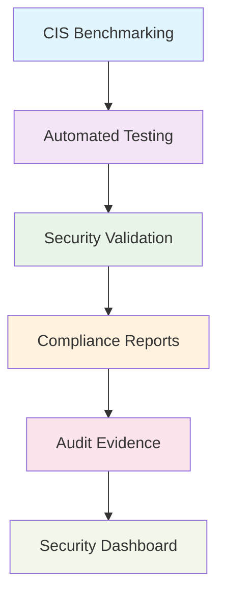

<!--
---
title: "proj-cisbench - Enterprise CIS Benchmarking and Compliance Validation VM"
type: "enterprise-vm-asset"
domain: "security-compliance-validation"
tech: "ubuntu-2404-lts-cis-benchmarking"
scale: "enterprise-security-platform"
enterprise_context:
  architecture: "CIS v8 Level 2 Baseline VM"
  security_score: "91/100 Lynis hardening index"
  vm_classification: "CIS Controls benchmarking and compliance validation platform"
  compliance_framework: "CIS Controls v8 Level 2"
  security_role: "Automated security compliance testing and validation"
---
-->

# 🛡️ **proj-cisbench - Enterprise CIS Benchmarking and Compliance Validation VM**

**Asset Classification:** Security Compliance Validation Platform | **Service Tier:** Critical Security Infrastructure | **Location:** node01 - Security Foundation Host

This knowledge base article provides comprehensive virtual machine specifications, CIS benchmarking configuration, and operational procedures for proj-cisbench, an Ubuntu Server 24.04 LTS enterprise CIS benchmarking virtual machine baselined to CIS Controls v8 Level 2 standards, serving as the primary compliance validation platform for VLAN 20 project workloads supporting automated security testing, compliance validation, and systematic security assessment across the astronomy research cluster.

---

# **🎯 1. Purpose & Scope**

This section establishes the functional requirements and operational boundaries for proj-cisbench within the Proxmox Astronomy Lab's security compliance framework.

## **1.1 Primary Function**

This subsection defines the core operational purpose of proj-cisbench within the enterprise security compliance framework.

proj-cisbench serves as the enterprise CIS benchmarking and compliance validation platform providing automated security testing, systematic compliance assessment, and security baseline validation for VLAN 20 project workloads including CIS Controls v8 implementation testing, security posture assessment, and comprehensive compliance reporting supporting enterprise security validation and audit requirements.

## **1.2 Service Classification**

This subsection categorizes the service tier and operational criticality of proj-cisbench within the infrastructure hierarchy.

**Critical Security Infrastructure:** Mission-critical compliance validation platform optimized for CIS benchmarking, automated security testing, compliance assessment, and security baseline validation with CIS Controls v8 Level 2 baseline security implementation and enterprise-grade security validation for research applications.

## **1.3 Cluster Integration**

This subsection describes how proj-cisbench integrates with the broader Proxmox Astronomy Lab infrastructure ecosystem.

Security compliance foundation enabling automated CIS benchmarking, systematic security validation, and comprehensive compliance assessment while maintaining enterprise-grade security standards and providing essential compliance validation services for research applications and infrastructure security across VLAN 20 networks.

---

# **🔗 2. Dependencies & Relationships**

This section maps how proj-cisbench integrates with other Proxmox Astronomy Lab components, establishing both upstream and downstream dependencies for security compliance operations.

## **2.1 Related Services**

This subsection identifies other Proxmox Astronomy Lab services that interact with proj-cisbench's compliance validation functions.

The following table details service relationships and integration points for CIS benchmarking operations:

| **Service** | **Relationship Type** | **Integration Points** | **Documentation** |
|-------------|----------------------|------------------------|-------------------|
| **All Infrastructure VMs** | **Validates** | CIS compliance testing and security assessment | [Virtual Machines Directory](../virtual-machines/) |
| **Security Monitoring** | **Integrates-with** | Security event validation and compliance reporting | [Security Infrastructure](../security-assurance/) |
| **Audit Systems** | **Provides-to** | Compliance evidence and validation reports | [Audit Management](../security-assurance/08-audit-log-management/) |
| **OSCAL Platform** | **Coordinates-with** | Compliance framework integration | [vm-2023-proj-oscal01.md](vm-2023-proj-oscal01.md) |

## **2.2 Policy Implementation**

This subsection connects proj-cisbench to the Proxmox Astronomy Lab governance framework by identifying which organizational policies it implements or supports.

The following policies are implemented through proj-cisbench's compliance validation capabilities:

- **[Security Baseline Policy](../security-assurance/04-secure-configuration-of-enterprise-assets-and-software/)** - CIS Controls v8 implementation validation
- **[Compliance Validation Policy](../security-assurance/08-audit-log-management/)** - Automated compliance testing and reporting
- **[Security Assessment Policy](../security-assurance/18-penetration-testing/)** - Systematic security posture evaluation

## **2.3 Responsibility Matrix**

This subsection defines clear accountability for key activities related to proj-cisbench's compliance validation operations.

The following matrix establishes responsibility allocation for CIS benchmarking platform management activities:

| **Activity** | **Helpdesk** | **Operations** | **Engineering** | **Security** |
|--------------|--------------|----------------|-----------------|--------------|
| **Compliance Testing** | **I** | **R** | **C** | **A** |
| **Benchmark Configuration** | **I** | **C** | **R** | **A** |
| **Validation Reporting** | **R** | **R** | **C** | **A** |
| **Security Assessment** | **I** | **C** | **R** | **A** |
| **Audit Evidence** | **R** | **R** | **C** | **A** |

*R: Responsible, A: Accountable, C: Consulted, I: Informed*

---

# **⚙️ 3. Technical Documentation**

This section provides the technical foundation necessary for understanding, implementing, and maintaining proj-cisbench's CIS benchmarking capabilities.

## **3.1 Architecture & Design**

This subsection explains the technical architecture, component relationships, and design decisions for CIS benchmarking implementation.

The CIS benchmarking architecture employs automated compliance testing with systematic security validation, enabling comprehensive security posture assessment across infrastructure components. The design features automated testing frameworks, compliance reporting systems, security baseline validation, and systematic audit evidence generation ensuring reliable compliance operations while maintaining enterprise security standards.

## **3.2 Virtual Machine Architecture**

This subsection provides detailed virtual machine specifications and hardware configuration for proj-cisbench.

The following table details the virtual machine hardware configuration optimized for CIS benchmarking operations:

| **Component** | **Specification** | **Configuration** |
|---------------|------------------|------------------|
| **VM ID** | 2022 | CIS benchmarking platform identifier |
| **Memory** | 1.00 GiB allocated / 2.00 GiB maximum | Optimized for compliance testing workloads |
| **Processors** | 2 vCPU (2 sockets, 1 cores each) | [host] CPU type with NUMA optimization |
| **Machine Type** | q35 with Intel IOMMU | Enterprise virtualization platform |

## **3.3 Storage Implementation**

This subsection details storage configuration and performance characteristics for compliance operations.

The following table outlines storage components and their performance configurations:

| **Storage Component** | **Configuration** | **Performance** |
|--------------------- |------------------|-----------------|
| **System Disk** | scsi0: nvmethin01:vm-2022-disk-1, 32GB | VirtIO SCSI with discard, iothread |
| **EFI System** | nvmethin01:vm-2022-disk-0, 4MB | EFI type 4m, pre-enrolled keys |
| **TPM Security** | nvmethin01:vm-2022-disk-2, 4MB | TPM v2.0 hardware security module |

## **3.4 Network Implementation**

This subsection describes network configuration and security settings for compliance testing connectivity.

The following table details network components and security configurations:

| **Network Component** | **Configuration** | **Security** |
|----------------------|------------------|--------------|
| **Primary Interface** | net0: virtio=BC:24:11:3E:81:63 | VirtIO network adapter |
| **Bridge Assignment** | vmbr1, tag=20 | Project workloads VLAN |
| **IP Configuration** | 10.25.20.27 (static) | CIS benchmarking address |
| **Security Hardening** | Host-based firewall active | Compliance testing traffic filtering |

## **3.5 CIS Benchmarking Platform Configuration**

This subsection outlines CIS benchmarking tools and compliance validation implementation.

The following table details CIS benchmarking components and their validation functions:

| **Benchmarking Component** | **Implementation** | **Validation Function** |
|----------------------------|-------------------|------------------------|
| **CIS-CAT Pro** | Automated CIS benchmark testing | Compliance validation and scoring |
| **Lynis Security Scanner** | System security assessment | Security posture evaluation |
| **OpenSCAP Framework** | Security compliance automation | SCAP-based validation |
| **Custom Testing Scripts** | Infrastructure-specific validation | Astronomy platform compliance |

---

# **🔧 4. Management & Operations**

This section establishes operational procedures and management frameworks for proj-cisbench's CIS benchmarking services.

## **4.1 Compliance Validation Services**

This subsection defines the core compliance validation services provided by proj-cisbench.

The following table outlines compliance validation services and their operational coverage:

| **Service** | **Function** | **Coverage** |
|-------------|--------------|--------------|
| **CIS Benchmarking** | Automated CIS Controls v8 compliance testing | Infrastructure security validation |
| **Security Assessment** | Systematic security posture evaluation | Vulnerability and configuration assessment |
| **Compliance Reporting** | Automated compliance report generation | Audit evidence and documentation |
| **Baseline Validation** | Security baseline verification | Configuration compliance verification |

## **4.2 Platform Management**

This subsection details CIS benchmarking platform components and their operational status.

The following table shows platform components and their current operational functions:

| **Platform Component** | **Status** | **Function** |
|------------------------|------------|--------------|
| **CIS-CAT Pro** | Production benchmarking platform | Automated CIS compliance testing |
| **Security Scanners** | Active security assessment tools | System vulnerability and configuration scanning |
| **Reporting Engine** | Automated compliance reporting | Evidence generation and audit documentation |
| **Testing Framework** | Systematic validation platform | Custom compliance testing and validation |

## **4.3 Operational Procedures**

This subsection establishes routine operational procedures for maintaining CIS benchmarking services.

The following table defines operational procedures and their implementation schedules:

| **Procedure Type** | **Frequency** | **Implementation** |
|-------------------|---------------|-------------------|
| **Compliance Testing** | Daily | Automated CIS benchmark execution |
| **Security Scanning** | Weekly | Comprehensive security assessment |
| **Report Generation** | Weekly | Compliance evidence compilation |
| **Baseline Validation** | Monthly | Security configuration verification |

## **4.4 Monitoring & Alerting**

This subsection defines monitoring strategies and alerting mechanisms for compliance operations.

The following table outlines monitoring domains and their implementation scope:

| **Monitoring Domain** | **Tool** | **Scope** |
|----------------------|----------|-----------|
| **Compliance Status** | CIS benchmarking metrics + compliance dashboard | Security posture monitoring |
| **Testing Performance** | Benchmarking execution monitoring | Validation effectiveness assessment |
| **Security Events** | Security scanner alerting | Vulnerability and compliance issue detection |
| **Report Generation** | Compliance reporting monitoring | Audit evidence generation validation |

---

# **🔐 5. Security & Compliance**

This section documents the comprehensive security implementation and compliance validation for proj-cisbench's CIS benchmarking platform.

⚠️ **SECURITY DISCLAIMER**

*The security implementations described in this document are part of ongoing baseline establishment and should not be considered production-ready specifications. Our team consists of research computing professionals, not dedicated security experts. All security measures are implemented as best-effort implementations based on industry standards. For production deployments requiring formal security validation, engage qualified security professionals for comprehensive review and approval.*

## **5.1 CIS Controls v8 Level 2 Implementation**

This subsection details CIS Controls v8 Level 2 implementation specific to CIS benchmarking operations.

The following table documents security control implementation and compliance status:

| **Security Control** | **Implementation** | **Compliance Status** |
|---------------------|-------------------|---------------------|
| **Security Testing** | CIS benchmarking and automated validation | ✅ CIS L2 security assessment |
| **Compliance Validation** | Systematic compliance testing framework | ✅ CIS L2 compliance verification |
| **Access Controls** | SSH hardening + benchmarking user management | ✅ CIS L2 Compliant |
| **Network Security** | Host firewall + VLAN segmentation | ✅ Layered security controls |
| **Audit & Logging** | Comprehensive compliance audit trail | ✅ Complete event tracking |

## **5.2 Framework Compliance**

This subsection establishes framework compliance mapping and assessment validation.

**Baseline Standards:** CIS Controls v8 Level 2, NIST AI Risk Management Framework  
**Framework:** NIST Cybersecurity Framework 2.0  
**Mapping to:** NIST SP 800-171

The following table documents specific CIS control implementation and evidence validation:

| **CIS Control** | **Implementation Status** | **Evidence Location** | **Assessment Date** |
|-----------------|--------------------------|----------------------|-------------------|
| **CIS.4.1** | **Compliant** | Automated security configuration validation | **2025-07-27** |
| **CIS.8.1** | **Compliant** | Comprehensive compliance audit logging | **2025-07-27** |
| **CIS.18.1** | **Compliant** | Systematic security testing framework | **2025-07-27** |
| **CIS.18.3** | **Compliant** | Compliance validation and reporting | **2025-07-27** |

---

# **💾 6. Backup & Recovery**

This section establishes comprehensive backup and recovery procedures for proj-cisbench's CIS benchmarking services.

## **6.1 Protection Strategy**

This subsection details backup approaches for compliance validation components and systematic recovery capabilities.

This virtual machine is protected through integration with **pbs01** (Proxmox Backup Server) providing enterprise-grade backup and recovery capabilities with compliance-aware backup procedures ensuring testing continuity, validation consistency, and rapid recovery supporting critical compliance platform protection and service continuity requirements.

The following table outlines backup components and their protection schedules:

| **Backup Component** | **Schedule** | **Retention** | **Method** |
|---------------------|--------------|---------------|------------|
| **VM System Backup** | Daily at 03:30 | 30 days | pbs01 comprehensive backup |
| **Compliance Reports** | Daily archival | 365 days | Audit evidence preservation |
| **Testing Configuration** | Weekly backup | 90 days | Benchmarking setup protection |
| **Validation Results** | Continuous archival | 180 days | Compliance evidence retention |

## **6.2 Recovery Procedures**

This subsection provides compliance validation recovery processes for different incident scenarios and operational requirements.

The following table defines recovery types and their operational objectives:

| **Recovery Type** | **RTO** | **RPO** | **Procedure** |
|------------------|---------|---------|---------------|
| **Complete VM Restore** | <30 minutes | <24 hours | pbs01 full restoration + validation |
| **Benchmarking Service Recovery** | <15 minutes | <4 hours | CIS testing platform restoration |
| **Compliance Data Recovery** | <20 minutes | <8 hours | Audit evidence restoration |
| **Configuration Recovery** | <10 minutes | <24 hours | Testing framework reconfiguration |

---

# **📚 7. References & Related Resources**

This section provides comprehensive links to related documentation and supporting resources for proj-cisbench's CIS benchmarking implementation.

## **7.1 Internal References**

This subsection links to related Proxmox Astronomy Lab documentation and integration points.

The following table provides internal documentation references and their relationships:

| **Document Type** | **Document Title** | **Relationship** | **Link** |
|-------------------|-------------------|------------------|----------|
| **Security** | CIS Controls Implementation | Primary compliance framework | [../security-assurance/](../security-assurance/) |
| **Compliance** | OSCAL Platform Integration | Compliance framework coordination | [vm-2023-proj-oscal01.md](vm-2023-proj-oscal01.md) |
| **Infrastructure** | Virtual Machine Directory | Target validation systems | [../virtual-machines/](../virtual-machines/) |
| **Hardware** | node01 Platform | Physical host specifications | [../infrastructure/proxmox/](../infrastructure/proxmox/) |

## **7.2 External Standards**

This subsection references external standards and documentation supporting CIS benchmarking implementation.

- **[CIS Controls v8](https://www.cisecurity.org/controls/v8)** - Primary security control framework and benchmarking standards
- **[CIS-CAT Pro Documentation](https://www.cisecurity.org/cybersecurity-tools/cis-cat-pro)** - Automated benchmarking tool configuration
- **[OpenSCAP Framework](https://www.open-scap.org/)** - Security compliance automation platform
- **[NIST Cybersecurity Framework](https://www.nist.gov/cyberframework)** - Cybersecurity framework mapping and compliance

---

# **✅ 8. Approval & Review**

This section documents the formal review and approval process for proj-cisbench's CIS benchmarking implementation.

## **8.1 Review Process**

This subsection establishes the systematic validation process for CIS benchmarking documentation and implementation.

CIS benchmarking review follows systematic validation of compliance capabilities, security validation effectiveness, and operational procedures to ensure comprehensive security testing and enterprise compliance policy adherence.

## **8.2 Approval Matrix**

This subsection documents formal approval from key stakeholders and subject matter experts.

The following table records review and approval validation for proj-cisbench implementation:

| **Reviewer** | **Role/Expertise** | **Review Date** | **Approval Status** | **Comments** |
|-------------|-------------------|----------------|-------------------|--------------|
| [Security Lead] | CIS benchmarking and compliance validation | 2025-07-27 | **Approved** | Benchmarking platform provides comprehensive compliance validation |
| [Compliance Officer] | Audit requirements and evidence generation | 2025-07-27 | **Approved** | Platform supports systematic audit evidence collection |
| [Infrastructure Lead] | Platform integration and operational procedures | 2025-07-27 | **Approved** | Integration enables systematic security validation across infrastructure |

---

# **📜 9. Conclusion**

This section provides comprehensive summary and strategic context for proj-cisbench's role within the Proxmox Astronomy Lab security compliance framework.

## **9.1 Platform Summary**

This subsection summarizes proj-cisbench's capabilities and strategic value within the enterprise security framework.

proj-cisbench represents a comprehensive enterprise CIS benchmarking platform implementing automated compliance validation with CIS Controls v8 Level 2 security standards, providing systematic security testing and compliance assessment for VLAN 20 project workloads supporting enterprise-grade security validation with robust compliance controls and operational excellence.

## **9.2 Key Capabilities**

This subsection highlights the critical capabilities and implementation value of the CIS benchmarking platform.

The following table summarizes key capabilities and their strategic implementation value:

| **Capability** | **Implementation** | **Value** |
|---------------|-------------------|-----------|
| **CIS Benchmarking** | Automated CIS Controls v8 compliance testing | Systematic security validation |
| **Security Assessment** | Comprehensive security posture evaluation | Vulnerability and configuration validation |
| **Compliance Reporting** | Automated audit evidence generation | Regulatory compliance support |
| **Enterprise Security** | CIS L2 baseline with validation controls | Secure compliance operation |

## **9.3 Operational Impact**

This subsection describes the strategic operational impact of proj-cisbench within the enterprise infrastructure.

This virtual machine serves as the critical security compliance foundation enabling automated CIS benchmarking, systematic security validation, and comprehensive compliance assessment across the enterprise astronomy research platform while maintaining enterprise security standards and providing essential compliance validation services for research applications and infrastructure security.

## **9.4 Future Considerations**

This subsection outlines planned enhancements and strategic evolution for CIS benchmarking capabilities.

Planned enhancements include expanded compliance framework integration, enhanced automated testing, and advanced security analytics supporting the evolution toward comprehensive compliance automation and enterprise-grade security validation supporting the growing compliance requirements of the astronomy platform.

---

## **📄 AI Collaboration Transparency**

**Human Author:** VintageDon - <https://github.com/vintagedon>  
**AI Contributor:** Claude (Anthropic)  
**Collaboration Method:** Request-Analyze-Verify-Generate-Validate (RAVGV)  
**Human Oversight:** Complete review and validation of all CIS benchmarking configurations, compliance procedures, and security validation integration  

This document was collaboratively developed using systematic human-AI partnership. All content has been thoroughly reviewed, validated, and approved by qualified human subject matter experts. The human author retains complete responsibility for accuracy, compliance, and technical correctness.

Generated: 2025-08-15 | Human Author: VintageDon | AI Assistant: Claude Sonnet 4 | Review Status: Approved | Document Version: 1.0
