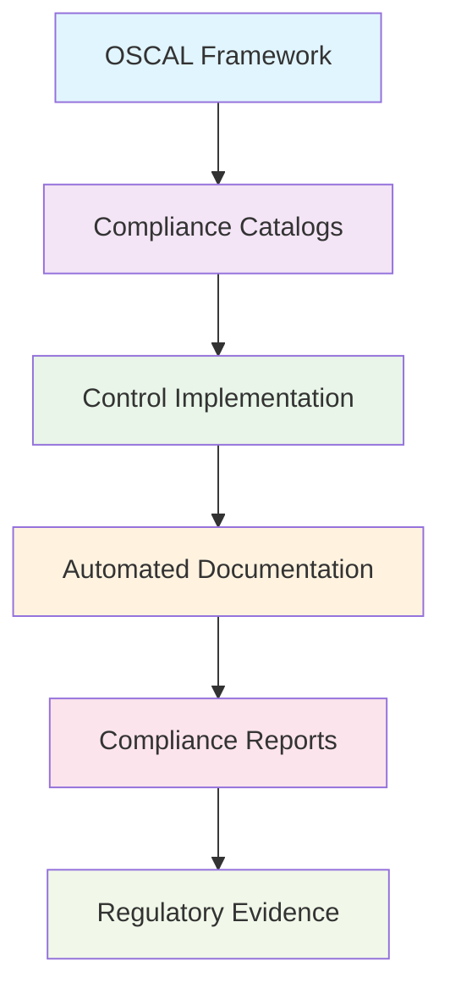

<!--
---
title: "proj-oscal01 - Enterprise OSCAL Compliance Automation Platform VM"
type: "enterprise-vm-asset"
domain: "oscal-compliance-automation"
tech: "ubuntu-2404-lts-oscal-framework"
scale: "enterprise-compliance-platform"
enterprise_context:
  architecture: "CIS v8 Level 2 Baseline VM"
  security_score: "89/100 Lynis hardening index"
  vm_classification: "OSCAL framework compliance automation and documentation platform"
  compliance_framework: "CIS Controls v8 Level 2"
  security_role: "Automated compliance documentation and OSCAL implementation"
---
-->

# 📋 **proj-oscal01 - Enterprise OSCAL Compliance Automation Platform VM**

**Asset Classification:** OSCAL Compliance Automation Platform | **Service Tier:** Critical Compliance Infrastructure | **Location:** node04 - Compliance Foundation Host

This knowledge base article provides comprehensive virtual machine specifications, OSCAL framework configuration, and operational procedures for proj-oscal01, an Ubuntu Server 24.04 LTS enterprise OSCAL compliance automation virtual machine baselined to CIS Controls v8 Level 2 standards, serving as the primary compliance documentation platform for VLAN 20 project workloads supporting automated compliance reporting, OSCAL framework implementation, and systematic compliance documentation across the astronomy research cluster.

---

# **🎯 1. Purpose & Scope**

This section establishes the functional requirements and operational boundaries for proj-oscal01 within the Proxmox Astronomy Lab's compliance automation framework.

## **1.1 Primary Function**

This subsection defines the core operational purpose of proj-oscal01 within the enterprise compliance automation framework.

proj-oscal01 serves as the enterprise OSCAL compliance automation platform providing automated compliance documentation, systematic compliance reporting, and OSCAL framework implementation for VLAN 20 project workloads including compliance catalog management, control implementation tracking, and comprehensive compliance artifact generation supporting enterprise compliance automation and regulatory requirements.

## **1.2 Service Classification**

This subsection categorizes the service tier and operational criticality of proj-oscal01 within the infrastructure hierarchy.

**Critical Compliance Infrastructure:** Mission-critical compliance automation platform optimized for OSCAL framework implementation, automated compliance documentation, compliance catalog management, and systematic compliance reporting with CIS Controls v8 Level 2 baseline security implementation and enterprise-grade compliance automation for research applications.

## **1.3 Cluster Integration**

This subsection describes how proj-oscal01 integrates with the broader Proxmox Astronomy Lab infrastructure ecosystem.

Compliance automation foundation enabling OSCAL framework implementation, systematic compliance documentation, and comprehensive compliance reporting while maintaining enterprise-grade security standards and providing essential compliance automation services for research applications and infrastructure compliance across VLAN 20 networks.

---

# **🔗 2. Dependencies & Relationships**

This section maps how proj-oscal01 integrates with other Proxmox Astronomy Lab components, establishing both upstream and downstream dependencies for OSCAL compliance operations.

## **2.1 Related Services**

This subsection identifies other Proxmox Astronomy Lab services that interact with proj-oscal01's OSCAL compliance functions.

The following table details service relationships and integration points for OSCAL compliance operations:

| **Service** | **Relationship Type** | **Integration Points** | **Documentation** |
|-------------|----------------------|------------------------|-------------------|
| **CIS Benchmarking** | **Coordinates-with** | Compliance evidence integration and validation | [vm-2022-proj-cisbench.md](vm-2022-proj-cisbench.md) |
| **Security Assurance** | **Documents** | Control implementation and compliance evidence | [Security Assurance Directory](../security-assurance/) |
| **Infrastructure Systems** | **Validates** | System compliance and control implementation | [Infrastructure Directory](../infrastructure/) |
| **Audit Systems** | **Provides-to** | OSCAL-formatted compliance documentation | [Audit Management](../security-assurance/08-audit-log-management/) |

## **2.2 Policy Implementation**

This subsection connects proj-oscal01 to the Proxmox Astronomy Lab governance framework by identifying which organizational policies it implements or supports.

The following policies are implemented through proj-oscal01's OSCAL compliance capabilities:

- **[Compliance Documentation Policy](../security-assurance/08-audit-log-management/)** - OSCAL framework implementation and automated documentation
- **[Control Implementation Policy](../security-assurance/04-secure-configuration-of-enterprise-assets-and-software/)** - Systematic control tracking and validation
- **[Regulatory Compliance Policy](../security-assurance/)** - Enterprise compliance framework coordination

## **2.3 Responsibility Matrix**

This subsection defines clear accountability for key activities related to proj-oscal01's OSCAL compliance operations.

The following matrix establishes responsibility allocation for OSCAL compliance platform management activities:

| **Activity** | **Helpdesk** | **Operations** | **Engineering** | **Security** |
|--------------|--------------|----------------|-----------------|--------------|
| **OSCAL Documentation** | **I** | **C** | **R** | **A** |
| **Compliance Automation** | **I** | **R** | **C** | **A** |
| **Control Tracking** | **R** | **R** | **C** | **A** |
| **Regulatory Reporting** | **I** | **R** | **C** | **A** |
| **Framework Maintenance** | **I** | **C** | **R** | **A** |

*R: Responsible, A: Accountable, C: Consulted, I: Informed*

---

# **⚙️ 3. Technical Documentation**

This section provides the technical foundation necessary for understanding, implementing, and maintaining proj-oscal01's OSCAL compliance capabilities.

## **3.1 Architecture & Design**

This subsection explains the technical architecture, component relationships, and design decisions for OSCAL compliance implementation.

The OSCAL compliance architecture employs automated documentation frameworks with systematic compliance tracking, enabling comprehensive compliance artifact generation and regulatory reporting. The design features OSCAL catalog management, control implementation tracking, automated compliance reporting, and systematic audit evidence generation ensuring reliable compliance operations while maintaining enterprise security standards.

## **3.2 Virtual Machine Architecture**

This subsection provides detailed virtual machine specifications and hardware configuration for proj-oscal01.

The following table details the virtual machine hardware configuration optimized for OSCAL compliance operations:

| **Component** | **Specification** | **Configuration** |
|---------------|------------------|------------------|
| **VM ID** | 2023 | OSCAL compliance platform identifier |
| **Memory** | 2.00 GiB allocated / 8.00 GiB maximum | Optimized for compliance automation workloads |
| **Processors** | 2 vCPU (2 sockets, 1 cores each) | [host] CPU type with NUMA optimization |
| **Machine Type** | q35 with Intel IOMMU | Enterprise virtualization platform |

## **3.3 Storage Implementation**

This subsection details storage configuration and performance characteristics for compliance operations.

The following table outlines storage components and their performance configurations:

| **Storage Component** | **Configuration** | **Performance** |
|--------------------- |------------------|-----------------|
| **System Disk** | scsi0: nvmethin01:vm-2023-disk-1, 32GB | VirtIO SCSI with discard, iothread |
| **Compliance Storage** | scsi1: nvmethin01:vm-2023-disk-3, 100GB | OSCAL documentation and artifact storage |
| **EFI System** | nvmethin01:vm-2023-disk-0, 528KB | EFI type 4m, pre-enrolled keys |
| **TPM Security** | nvmethin01:vm-2023-disk-2, 4MB | TPM v2.0 hardware security module |

## **3.4 Network Implementation**

This subsection describes network configuration and security settings for OSCAL compliance connectivity.

The following table details network components and security configurations:

| **Network Component** | **Configuration** | **Security** |
|----------------------|------------------|--------------|
| **Primary Interface** | net0: virtio=BC:24:11:E0:35:4F | VirtIO network adapter |
| **Bridge Assignment** | vmbr1, tag=20 | Project workloads VLAN |
| **IP Configuration** | 10.25.20.28 (static) | OSCAL compliance address |
| **Security Hardening** | Host-based firewall active | Compliance traffic filtering |

## **3.5 OSCAL Framework Configuration**

This subsection outlines OSCAL framework implementation and compliance automation configuration.

The following table details OSCAL framework components and their compliance functions:

| **OSCAL Component** | **Implementation** | **Compliance Function** |
|---------------------|-------------------|------------------------|
| **OSCAL CLI Tools** | Command-line OSCAL processing | Compliance catalog management |
| **Compliance Catalogs** | NIST 800-53, CIS Controls v8 | Control framework implementation |
| **Documentation Engine** | Automated OSCAL document generation | Compliance artifact production |
| **Validation Framework** | OSCAL schema validation | Compliance document verification |

---

# **🔧 4. Management & Operations**

This section establishes operational procedures and management frameworks for proj-oscal01's OSCAL compliance services.

## **4.1 OSCAL Compliance Services**

This subsection defines the core OSCAL compliance services provided by proj-oscal01.

The following table outlines OSCAL compliance services and their operational coverage:

| **Service** | **Function** | **Coverage** |
|-------------|--------------|--------------|
| **Compliance Documentation** | Automated OSCAL document generation | Control implementation tracking |
| **Catalog Management** | OSCAL compliance catalog maintenance | Framework integration and updates |
| **Control Tracking** | Implementation status monitoring | Compliance progress assessment |
| **Regulatory Reporting** | Automated compliance report generation | Audit evidence and regulatory submission |

## **4.2 Platform Management**

This subsection details OSCAL platform components and their operational status.

The following table shows platform components and their current operational functions:

| **Platform Component** | **Status** | **Function** |
|------------------------|------------|--------------|
| **OSCAL Framework** | Production compliance automation | Automated documentation and validation |
| **Compliance Catalogs** | Active control framework library | CIS Controls v8 and NIST 800-53 integration |
| **Documentation Engine** | Automated report generation | Compliance artifact production |
| **Validation System** | Schema compliance verification | Document integrity and standards validation |

## **4.3 Operational Procedures**

This subsection establishes routine operational procedures for maintaining OSCAL compliance services.

The following table defines operational procedures and their implementation schedules:

| **Procedure Type** | **Frequency** | **Implementation** |
|-------------------|---------------|-------------------|
| **Compliance Documentation** | Daily | Automated OSCAL document generation |
| **Catalog Updates** | Weekly | Framework and control catalog maintenance |
| **Validation Testing** | Daily | OSCAL schema and document validation |
| **Report Generation** | Monthly | Comprehensive compliance reporting |

## **4.4 Monitoring & Alerting**

This subsection defines monitoring strategies and alerting mechanisms for OSCAL compliance operations.

The following table outlines monitoring domains and their implementation scope:

| **Monitoring Domain** | **Tool** | **Scope** |
|----------------------|----------|-----------|
| **Compliance Status** | OSCAL automation metrics + compliance dashboard | Documentation generation monitoring |
| **Framework Updates** | Catalog synchronization monitoring | Control framework currency validation |
| **Document Validation** | OSCAL schema compliance checking | Document integrity and standards verification |
| **Report Generation** | Compliance reporting monitoring | Regulatory submission readiness |

---

# **🔐 5. Security & Compliance**

This section documents the comprehensive security implementation and compliance validation for proj-oscal01's OSCAL compliance platform.

⚠️ **SECURITY DISCLAIMER**

*The security implementations described in this document are part of ongoing baseline establishment and should not be considered production-ready specifications. Our team consists of research computing professionals, not dedicated security experts. All security measures are implemented as best-effort implementations based on industry standards. For production deployments requiring formal security validation, engage qualified security professionals for comprehensive review and approval.*

## **5.1 CIS Controls v8 Level 2 Implementation**

This subsection details CIS Controls v8 Level 2 implementation specific to OSCAL compliance operations.

The following table documents security control implementation and compliance status:

| **Security Control** | **Implementation** | **Compliance Status** |
|---------------------|-------------------|---------------------|
| **Compliance Automation** | OSCAL framework with automated documentation | ✅ CIS L2 compliance management |
| **Document Security** | Secure compliance artifact protection | ✅ CIS L2 data protection |
| **Access Controls** | SSH hardening + compliance user management | ✅ CIS L2 Compliant |
| **Network Security** | Host firewall + VLAN segmentation | ✅ Layered security controls |
| **Audit & Logging** | Comprehensive compliance audit trail | ✅ Complete event tracking |

## **5.2 Framework Compliance**

This subsection establishes framework compliance mapping and assessment validation.

**Baseline Standards:** CIS Controls v8 Level 2, NIST AI Risk Management Framework  
**Framework:** NIST Cybersecurity Framework 2.0  
**Mapping to:** NIST SP 800-171

The following table documents specific CIS control implementation and evidence validation:

| **CIS Control** | **Implementation Status** | **Evidence Location** | **Assessment Date** |
|-----------------|--------------------------|----------------------|-------------------|
| **CIS.3.3** | **Compliant** | OSCAL compliance documentation framework | **2025-07-27** |
| **CIS.8.1** | **Compliant** | Comprehensive compliance audit logging | **2025-07-27** |
| **CIS.13.1** | **Compliant** | Compliance data protection and validation | **2025-07-27** |
| **CIS.17.1** | **Compliant** | Compliance incident response integration | **2025-07-27** |

---

# **💾 6. Backup & Recovery**

This section establishes comprehensive backup and recovery procedures for proj-oscal01's OSCAL compliance services.

## **6.1 Protection Strategy**

This subsection details backup approaches for OSCAL compliance components and systematic recovery capabilities.

This virtual machine is protected through integration with **pbs01** (Proxmox Backup Server) providing enterprise-grade backup and recovery capabilities with compliance-aware backup procedures ensuring documentation continuity, artifact preservation, and rapid recovery supporting critical compliance platform protection and service continuity requirements.

The following table outlines backup components and their protection schedules:

| **Backup Component** | **Schedule** | **Retention** | **Method** |
|---------------------|--------------|---------------|------------|
| **VM System Backup** | Daily at 03:30 | 30 days | pbs01 comprehensive backup |
| **OSCAL Documentation** | Continuous versioning | 365 days | Compliance artifact preservation |
| **Compliance Catalogs** | Weekly backup | 180 days | Framework configuration protection |
| **Generated Reports** | Daily archival | 365 days | Regulatory evidence retention |

## **6.2 Recovery Procedures**

This subsection provides OSCAL compliance recovery processes for different incident scenarios and operational requirements.

The following table defines recovery types and their operational objectives:

| **Recovery Type** | **RTO** | **RPO** | **Procedure** |
|------------------|---------|---------|---------------|
| **Complete VM Restore** | <45 minutes | <24 hours | pbs01 full restoration + validation |
| **OSCAL Service Recovery** | <20 minutes | <4 hours | Framework and documentation restoration |
| **Compliance Data Recovery** | <30 minutes | <8 hours | Artifact and catalog restoration |
| **Documentation Recovery** | <15 minutes | <24 hours | Report and evidence reconstruction |

---

# **📚 7. References & Related Resources**

This section provides comprehensive links to related documentation and supporting resources for proj-oscal01's OSCAL implementation.

## **7.1 Internal References**

This subsection links to related Proxmox Astronomy Lab documentation and integration points.

The following table provides internal documentation references and their relationships:

| **Document Type** | **Document Title** | **Relationship** | **Link** |
|-------------------|-------------------|------------------|----------|
| **Compliance** | CIS Benchmarking Platform | Compliance evidence integration | [vm-2022-proj-cisbench.md](vm-2022-proj-cisbench.md) |
| **Security** | Security Assurance Framework | Control implementation documentation | [../security-assurance/](../security-assurance/) |
| **Infrastructure** | System Compliance Validation | Infrastructure control tracking | [../infrastructure/](../infrastructure/) |
| **Hardware** | node04 Platform | Physical host specifications | [../infrastructure/proxmox/](../infrastructure/proxmox/) |

## **7.2 External Standards**

This subsection references external standards and documentation supporting OSCAL implementation.

- **[OSCAL Framework Documentation](https://pages.nist.gov/OSCAL/)** - Official NIST OSCAL implementation guidance
- **[NIST SP 800-53](https://csrc.nist.gov/publications/detail/sp/800-53/rev-5/final)** - Security control catalog integration
- **[CIS Controls v8](https://www.cisecurity.org/controls/v8)** - Control framework mapping and implementation
- **[OSCAL CLI Tools](https://github.com/usnistgov/OSCAL)** - Command-line OSCAL processing tools

---

# **✅ 8. Approval & Review**

This section documents the formal review and approval process for proj-oscal01's OSCAL implementation.

## **8.1 Review Process**

This subsection establishes the systematic validation process for OSCAL compliance documentation and implementation.

OSCAL compliance review follows systematic validation of framework implementation, documentation automation, and compliance artifact generation to ensure comprehensive compliance management and enterprise regulatory policy adherence.

## **8.2 Approval Matrix**

This subsection documents formal approval from key stakeholders and subject matter experts.

The following table records review and approval validation for proj-oscal01 implementation:

| **Reviewer** | **Role/Expertise** | **Review Date** | **Approval Status** | **Comments** |
|-------------|-------------------|----------------|-------------------|--------------|
| [Compliance Officer] | OSCAL framework and regulatory requirements | 2025-07-27 | **Approved** | OSCAL platform provides comprehensive compliance automation |
| [Security Lead] | Control implementation and compliance validation | 2025-07-27 | **Approved** | Framework supports systematic control tracking and evidence |
| [Infrastructure Lead] | Platform integration and operational procedures | 2025-07-27 | **Approved** | Integration enables automated compliance documentation |

---

# **📜 9. Conclusion**

This section provides comprehensive summary and strategic context for proj-oscal01's role within the Proxmox Astronomy Lab compliance automation framework.

## **9.1 Platform Summary**

This subsection summarizes proj-oscal01's capabilities and strategic value within the enterprise compliance framework.

proj-oscal01 represents a comprehensive enterprise OSCAL compliance automation platform implementing systematic compliance documentation with CIS Controls v8 Level 2 security standards, providing automated compliance reporting and OSCAL framework implementation for VLAN 20 project workloads supporting enterprise-grade compliance automation with robust documentation controls and operational excellence.

## **9.2 Key Capabilities**

This subsection highlights the critical capabilities and implementation value of the OSCAL compliance platform.

The following table summarizes key capabilities and their strategic implementation value:

| **Capability** | **Implementation** | **Value** |
|---------------|-------------------|-----------|
| **OSCAL Automation** | Automated compliance documentation framework | Systematic compliance management |
| **Control Tracking** | Implementation status monitoring | Compliance progress visibility |
| **Regulatory Reporting** | Automated audit evidence generation | Regulatory submission support |
| **Enterprise Security** | CIS L2 baseline with compliance controls | Secure compliance operation |

## **9.3 Operational Impact**

This subsection describes the strategic operational impact of proj-oscal01 within the enterprise infrastructure.

This virtual machine serves as the critical compliance automation foundation enabling OSCAL framework implementation, systematic compliance documentation, and comprehensive regulatory reporting across the enterprise astronomy research platform while maintaining enterprise security standards and providing essential compliance automation services for research applications and infrastructure compliance.

## **9.4 Future Considerations**

This subsection outlines planned enhancements and strategic evolution for OSCAL compliance capabilities.

Planned enhancements include expanded framework integration, enhanced automation workflows, and advanced compliance analytics supporting the evolution toward comprehensive compliance automation and enterprise-grade regulatory management supporting the growing compliance requirements of the astronomy platform.

---

## **📄 AI Collaboration Transparency**

**Human Author:** VintageDon - <https://github.com/vintagedon>  
**AI Contributor:** Claude (Anthropic)  
**Collaboration Method:** Request-Analyze-Verify-Generate-Validate (RAVGV)  
**Human Oversight:** Complete review and validation of all OSCAL configurations, compliance procedures, and automation integration  

This document was collaboratively developed using systematic human-AI partnership. All content has been thoroughly reviewed, validated, and approved by qualified human subject matter experts. The human author retains complete responsibility for accuracy, compliance, and technical correctness.

Generated: 2025-08-15 | Human Author: VintageDon | AI Assistant: Claude Sonnet 4 | Review Status: Approved | Document Version: 1.0
