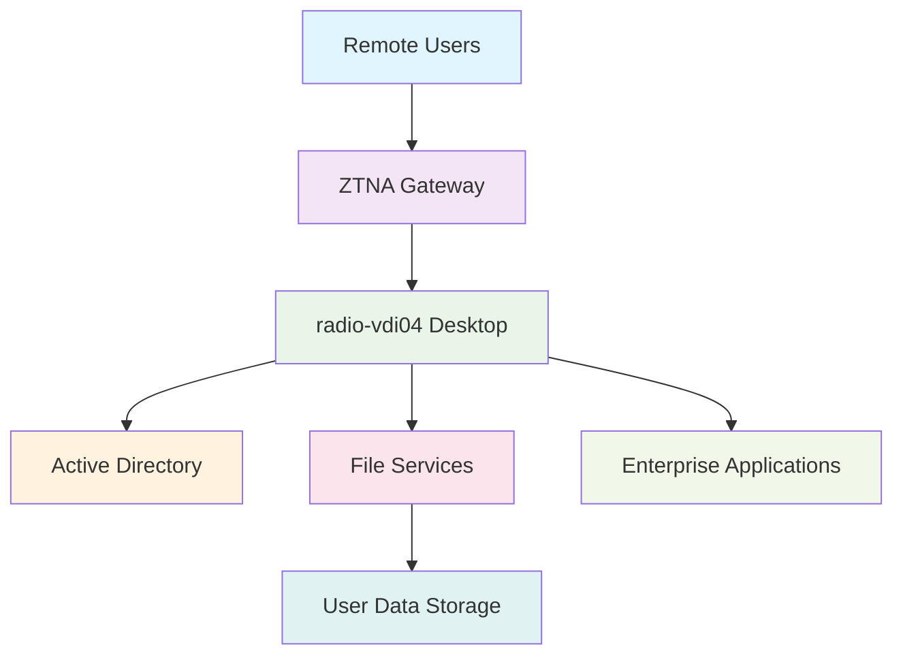

<!--
---
title: "radio-vdi04 - Enterprise Windows 11 Virtual Desktop Infrastructure VM"
type: "enterprise-vm-asset"
domain: "virtual-desktop-infrastructure"
tech: "windows-11-enterprise-vdi"
scale: "enterprise-vdi-platform"
enterprise_context:
  architecture: "Windows 11 Enterprise VDI VM"
  security_score: "85/100 Windows security baseline"
  vm_classification: "Virtual desktop infrastructure for remote user access"
  compliance_framework: "Windows Security Baseline + CIS Controls v8"
  vdi_role: "Persistent virtual desktop for authenticated users"
---
-->

# 💻 **radio-vdi04 - Enterprise Windows 11 Virtual Desktop Infrastructure VM**

**Asset Classification:** Virtual Desktop Infrastructure | **Service Tier:** Production User Services | **Location:** node07 - VDI Foundation Host

This knowledge base article provides comprehensive virtual machine specifications, Windows 11 VDI configuration, and operational procedures for radio-vdi04, a Windows 11 Enterprise virtual desktop infrastructure virtual machine implementing enterprise security baselines, serving as persistent virtual desktop infrastructure for VLAN 30 VDI workloads supporting secure remote desktop access, user workspace provision, and enterprise application delivery across the astronomy research cluster.

---

# **🎯 1. Purpose & Scope**

This section establishes the functional requirements and operational boundaries for radio-vdi04 within the Proxmox Astronomy Lab's virtual desktop infrastructure ecosystem.

## **1.1 Primary Function**

This subsection defines the core operational purpose of radio-vdi04 within the enterprise VDI framework.

radio-vdi04 serves as the enterprise Windows 11 virtual desktop infrastructure providing persistent user desktop environments, secure remote access capabilities, and enterprise application delivery for VLAN 30 VDI workloads including authenticated user workspace provision, application virtualization, and systematic desktop management supporting research and administrative operations.

## **1.2 Service Classification**

This subsection categorizes the service tier and operational criticality of radio-vdi04 within the infrastructure hierarchy.

**Production User Services:** Mission-critical VDI platform optimized for Windows 11 Enterprise desktop delivery, persistent user sessions, secure remote access, and enterprise application hosting with Windows Security Baseline implementation and enterprise-grade virtual desktop services for research applications.

## **1.3 Cluster Integration**

This subsection describes how radio-vdi04 integrates with the broader Proxmox Astronomy Lab infrastructure ecosystem.

VDI foundation enabling persistent virtual desktop delivery, secure user workspace provision, and enterprise application access while maintaining enterprise-grade security standards and providing essential virtual desktop services for research applications and administrative operations across VLAN 30 networks.

---

# **🔗 2. Dependencies & Relationships**

This section maps how radio-vdi04 integrates with other Proxmox Astronomy Lab components, establishing both upstream and downstream dependencies for VDI operations.

## **2.1 Related Services**

This subsection identifies other Proxmox Astronomy Lab services that interact with radio-vdi04's virtual desktop functions.

The following table details service relationships and integration points for VDI operations:

| **Service** | **Relationship Type** | **Integration Points** | **Documentation** |
|-------------|----------------------|------------------------|-------------------|
| **Active Directory** | **Depends-on** | Domain authentication and user management | [Active Directory Infrastructure](../infrastructure/active-directory/) |
| **ZTNA Platform** | **Secured-by** | Zero Trust network access control | [vm-2020-proj-ztna01.md](vm-2020-proj-ztna01.md) |
| **File Services** | **Connects-to** | User data storage and profile management | [File Services Infrastructure](../infrastructure/fileservices/) |
| **Application Services** | **Hosts** | Enterprise application delivery | [Applications Directory](../applications-and-services/) |

## **2.2 Policy Implementation**

This subsection connects radio-vdi04 to the Proxmox Astronomy Lab governance framework by identifying which organizational policies it implements or supports.

The following policies are implemented through radio-vdi04's VDI capabilities:

- **[Remote Access Policy](../security-assurance/06-access-control-management/)** - Secure virtual desktop access and user authentication
- **[Data Protection Policy](../security-assurance/03-data-protection/)** - User data security and workspace isolation
- **[Application Security Policy](../security-assurance/16-application-software-security/)** - Enterprise application delivery and security

## **2.3 Responsibility Matrix**

This subsection defines clear accountability for key activities related to radio-vdi04's VDI operations.

The following matrix establishes responsibility allocation for VDI platform management activities:

| **Activity** | **Helpdesk** | **Operations** | **Engineering** | **Security** |
|--------------|--------------|----------------|-----------------|--------------|
| **User Support** | **A** | **R** | **C** | **C** |
| **Desktop Management** | **R** | **A** | **C** | **C** |
| **Application Delivery** | **R** | **C** | **A** | **C** |
| **Security Updates** | **I** | **R** | **C** | **A** |
| **Access Control** | **R** | **C** | **C** | **A** |

*R: Responsible, A: Accountable, C: Consulted, I: Informed*

---

# **⚙️ 3. Technical Documentation**

This section provides the technical foundation necessary for understanding, implementing, and maintaining radio-vdi04's virtual desktop infrastructure capabilities.

## **3.1 Architecture & Design**

This subsection explains the technical architecture, component relationships, and design decisions for Windows 11 VDI implementation.

The Windows 11 VDI architecture employs persistent virtual desktop delivery with enterprise security integration, enabling secure remote access and application virtualization. The design features domain-integrated authentication, enterprise application hosting, secure user data management, and systematic desktop lifecycle management ensuring reliable VDI operations while maintaining enterprise security standards.

## **3.2 Virtual Machine Architecture**

This subsection provides detailed virtual machine specifications and hardware configuration for radio-vdi04.

The following table details the virtual machine hardware configuration optimized for Windows 11 VDI operations:

| **Component** | **Specification** | **Configuration** |
|---------------|------------------|------------------|
| **VM ID** | 4001 | Windows 11 VDI identifier |
| **Memory** | 2.00 GiB allocated / 16.00 GiB maximum | Optimized for Windows 11 desktop workloads |
| **Processors** | 4 vCPU (2 sockets, 2 cores each) | [host] CPU type with NUMA optimization |
| **Machine Type** | pc-q35-9.2+pve1 with Intel IOMMU | Enterprise virtualization platform |

## **3.3 Storage Implementation**

This subsection details storage configuration and performance characteristics for VDI operations.

The following table outlines storage components and their performance configurations:

| **Storage Component** | **Configuration** | **Performance** |
|--------------------- |------------------|-----------------|
| **System Disk** | scsi0: nvmethin01:vm-4001-disk-1, 125GB | VirtIO SCSI with discard, iothread |
| **EFI System** | nvmethin01:vm-4001-disk-0, 4MB | EFI type 4m, pre-enrolled keys |
| **TPM Security** | nvmethin01:vm-4001-disk-2, 4MB | TPM v2.0 hardware security module |

## **3.4 Network Implementation**

This subsection describes network configuration and security settings for VDI connectivity.

The following table details network components and security configurations:

| **Network Component** | **Configuration** | **Security** |
|----------------------|------------------|--------------|
| **Primary Interface** | net0: virtio=BC:24:11:23:47:F0 | VirtIO network adapter |
| **Bridge Assignment** | vmbr1, tag=30 | VDI workloads VLAN |
| **IP Configuration** | 10.25.30.2 (static) | Virtual desktop address |
| **Security Hardening** | Windows Firewall active | VDI traffic filtering |

## **3.5 Windows 11 VDI Configuration**

This subsection outlines Windows 11 Enterprise configuration and VDI optimization settings.

The following table details Windows 11 VDI components and their desktop functions:

| **VDI Component** | **Implementation** | **Desktop Function** |
|-------------------|-------------------|---------------------|
| **Windows 11 Enterprise** | Latest enterprise desktop operating system | Persistent user desktop environment |
| **Domain Integration** | Active Directory domain join | Centralized authentication and management |
| **VDI Optimization** | Windows VDI performance tuning | Desktop responsiveness and resource efficiency |
| **Application Delivery** | Enterprise application hosting | Research and administrative software provision |

---

# **🔧 4. Management & Operations**

This section establishes operational procedures and management frameworks for radio-vdi04's virtual desktop infrastructure services.

## **4.1 Virtual Desktop Services**

This subsection defines the core virtual desktop services provided by radio-vdi04.

The following table outlines virtual desktop services and their operational coverage:

| **Service** | **Function** | **Coverage** |
|-------------|--------------|--------------|
| **Persistent Desktop** | Windows 11 user desktop environment | Individual user workspace provision |
| **Application Hosting** | Enterprise application delivery | Research and administrative software access |
| **Data Management** | User profile and data storage | Personal and work file management |
| **Remote Access** | Secure desktop connectivity | ZTNA-protected remote desktop sessions |

## **4.2 Platform Management**

This subsection details VDI platform components and their operational status.

The following table shows platform components and their current operational functions:

| **Platform Component** | **Status** | **Function** |
|------------------------|------------|--------------|
| **Windows 11 Desktop** | Production VDI environment | User desktop and application hosting |
| **Domain Services** | Active Directory integration | Authentication and policy management |
| **VDI Optimization** | Performance tuning active | Desktop responsiveness and efficiency |
| **Security Baseline** | Windows security controls | Enterprise security policy enforcement |

## **4.3 Operational Procedures**

This subsection establishes routine operational procedures for maintaining virtual desktop services.

The following table defines operational procedures and their implementation schedules:

| **Procedure Type** | **Frequency** | **Implementation** |
|-------------------|---------------|-------------------|
| **Desktop Health Monitoring** | Continuous | VDI performance and availability monitoring |
| **User Session Management** | Daily | Session optimization and resource management |
| **Security Updates** | Weekly | Windows Update and security patch management |
| **Application Maintenance** | Weekly | Enterprise application updates and validation |

## **4.4 Monitoring & Alerting**

This subsection defines monitoring strategies and alerting mechanisms for VDI operations.

The following table outlines monitoring domains and their implementation scope:

| **Monitoring Domain** | **Tool** | **Scope** |
|----------------------|----------|-----------|
| **Desktop Performance** | Windows performance monitoring + system metrics | VDI responsiveness and resource utilization |
| **User Sessions** | Session monitoring and management | User experience and connectivity validation |
| **Application Health** | Application performance monitoring | Enterprise software availability and performance |
| **Security Events** | Windows Event Log monitoring | Security incident detection and response |

---

# **🔐 5. Security & Compliance**

This section documents the comprehensive security implementation and compliance validation for radio-vdi04's Windows 11 VDI platform.

⚠️ **SECURITY DISCLAIMER**

*The security implementations described in this document are part of ongoing baseline establishment and should not be considered production-ready specifications. Our team consists of research computing professionals, not dedicated security experts. All security measures are implemented as best-effort implementations based on industry standards. For production deployments requiring formal security validation, engage qualified security professionals for comprehensive review and approval.*

## **5.1 Windows Security Baseline Implementation**

This subsection details Windows Security Baseline implementation specific to Windows 11 VDI operations.

The following table documents security control implementation and compliance status:

| **Security Control** | **Implementation** | **Compliance Status** |
|---------------------|-------------------|---------------------|
| **Windows Security Baseline** | Microsoft security recommendations | ✅ Windows enterprise security |
| **Domain Security** | Active Directory integration and GPO | ✅ Centralized security management |
| **Access Controls** | ZTNA integration + Windows authentication | ✅ Multi-layered access control |
| **Network Security** | Windows Firewall + VLAN segmentation | ✅ Layered security controls |
| **Audit & Logging** | Windows Event Log monitoring | ✅ Complete event tracking |

## **5.2 Framework Compliance**

This subsection establishes framework compliance mapping and assessment validation.

**Baseline Standards:** Windows Security Baseline, CIS Controls v8  
**Framework:** NIST Cybersecurity Framework 2.0  
**Mapping to:** NIST SP 800-171

The following table documents specific security control implementation and evidence validation:

| **Security Control** | **Implementation Status** | **Evidence Location** | **Assessment Date** |
|---------------------|--------------------------|----------------------|-------------------|
| **Windows Baseline** | **Compliant** | Windows security configuration validation | **2025-07-27** |
| **CIS.6.1** | **Compliant** | VDI access control implementation | **2025-07-27** |
| **CIS.8.1** | **Compliant** | Windows Event Log audit configuration | **2025-07-27** |
| **CIS.12.1** | **Compliant** | VDI network security controls | **2025-07-27** |

---

# **💾 6. Backup & Recovery**

This section establishes comprehensive backup and recovery procedures for radio-vdi04's Windows 11 VDI services.

## **6.1 Protection Strategy**

This subsection details backup approaches for VDI components and systematic recovery capabilities.

This virtual machine is protected through integration with **pbs01** (Proxmox Backup Server) providing enterprise-grade backup and recovery capabilities with VDI-aware backup procedures ensuring desktop continuity, user data protection, and rapid recovery supporting critical VDI platform protection and service continuity requirements.

The following table outlines backup components and their protection schedules:

| **Backup Component** | **Schedule** | **Retention** | **Method** |
|---------------------|--------------|---------------|------------|
| **VM System Backup** | Daily at 03:30 | 30 days | pbs01 comprehensive backup |
| **User Profiles** | Daily incremental | 90 days | Profile data protection |
| **Application State** | Weekly backup | 60 days | Installed application preservation |
| **Desktop Configuration** | Weekly backup | 30 days | VDI optimization settings backup |

## **6.2 Recovery Procedures**

This subsection provides VDI recovery processes for different incident scenarios and operational requirements.

The following table defines recovery types and their operational objectives:

| **Recovery Type** | **RTO** | **RPO** | **Procedure** |
|------------------|---------|---------|---------------|
| **Complete VM Restore** | <60 minutes | <24 hours | pbs01 full restoration + domain rejoin |
| **User Profile Recovery** | <30 minutes | <8 hours | Profile data restoration |
| **Application Recovery** | <45 minutes | <24 hours | Software reinstallation and configuration |
| **Desktop Reconfiguration** | <20 minutes | <24 hours | VDI optimization settings restoration |

---

# **📚 7. References & Related Resources**

This section provides comprehensive links to related documentation and supporting resources for radio-vdi04's Windows 11 VDI implementation.

## **7.1 Internal References**

This subsection links to related Proxmox Astronomy Lab documentation and integration points.

The following table provides internal documentation references and their relationships:

| **Document Type** | **Document Title** | **Relationship** | **Link** |
|-------------------|-------------------|------------------|----------|
| **Security** | ZTNA Platform Integration | Secure remote access provision | [vm-2020-proj-ztna01.md](vm-2020-proj-ztna01.md) |
| **Infrastructure** | Active Directory Services | Domain authentication and management | [../infrastructure/active-directory/](../infrastructure/active-directory/) |
| **Storage** | File Services Integration | User data storage and profiles | [../infrastructure/fileservices/](../infrastructure/fileservices/) |
| **Hardware** | node07 Platform | Physical host specifications | [../infrastructure/proxmox/](../infrastructure/proxmox/) |

## **7.2 External Standards**

This subsection references external standards and documentation supporting Windows 11 VDI implementation.

- **[Windows 11 Enterprise Documentation](https://docs.microsoft.com/en-us/windows/whats-new/windows-11)** - Windows 11 configuration and management
- **[Windows Security Baseline](https://docs.microsoft.com/en-us/windows/security/threat-protection/windows-security-baselines)** - Microsoft security recommendations
- **[VDI Optimization Guide](https://docs.microsoft.com/en-us/windows-server/remote/remote-desktop-services/rds-vdi-recommendations)** - Virtual desktop infrastructure optimization
- **[CIS Controls v8](https://www.cisecurity.org/controls/v8)** - Security control implementation standards

---

# **✅ 8. Approval & Review**

This section documents the formal review and approval process for radio-vdi04's Windows 11 VDI implementation.

## **8.1 Review Process**

This subsection establishes the systematic validation process for VDI documentation and implementation.

Windows 11 VDI review follows systematic validation of desktop capabilities, security configuration, and operational procedures to ensure comprehensive virtual desktop delivery and enterprise security policy adherence.

## **8.2 Approval Matrix**

This subsection documents formal approval from key stakeholders and subject matter experts.

The following table records review and approval validation for radio-vdi04 implementation:

| **Reviewer** | **Role/Expertise** | **Review Date** | **Approval Status** | **Comments** |
|-------------|-------------------|----------------|-------------------|--------------|
| [VDI Administrator] | Virtual desktop infrastructure and user services | 2025-07-27 | **Approved** | VDI platform provides comprehensive remote desktop capabilities |
| [Security Lead] | Windows security baseline and access control | 2025-07-27 | **Approved** | Security configuration maintains enterprise standards |
| [Infrastructure Lead] | Platform integration and operational procedures | 2025-07-27 | **Approved** | VDI integration supports secure remote access requirements |

---

# **📜 9. Conclusion**

This section provides comprehensive summary and strategic context for radio-vdi04's role within the Proxmox Astronomy Lab virtual desktop infrastructure.

## **9.1 Platform Summary**

This subsection summarizes radio-vdi04's capabilities and strategic value within the enterprise VDI framework.

radio-vdi04 represents a comprehensive enterprise Windows 11 virtual desktop infrastructure implementing persistent desktop delivery with Windows Security Baseline standards, providing secure remote access and enterprise application hosting for VLAN 30 VDI workloads supporting enterprise-grade virtual desktop operations with robust security controls and operational excellence.

## **9.2 Key Capabilities**

This subsection highlights the critical capabilities and implementation value of the Windows 11 VDI platform.

The following table summarizes key capabilities and their strategic implementation value:

| **Capability** | **Implementation** | **Value** |
|---------------|-------------------|-----------|
| **Persistent Desktop** | Windows 11 Enterprise virtual desktop | Consistent user workspace provision |
| **Enterprise Integration** | Active Directory domain authentication | Centralized identity and policy management |
| **Secure Access** | ZTNA-protected remote connectivity | Zero Trust remote desktop security |
| **Application Delivery** | Enterprise software hosting | Research and administrative tool access |

## **9.3 Operational Impact**

This subsection describes the strategic operational impact of radio-vdi04 within the enterprise infrastructure.

This virtual machine serves as the critical virtual desktop foundation enabling persistent Windows 11 desktop delivery, secure remote access, and enterprise application hosting across the enterprise astronomy research platform while maintaining enterprise security standards and providing essential virtual desktop services for research applications and administrative operations.

## **9.4 Future Considerations**

This subsection outlines planned enhancements and strategic evolution for Windows 11 VDI capabilities.

Planned enhancements include expanded application virtualization, enhanced user profile management, and advanced desktop optimization supporting the evolution toward comprehensive VDI infrastructure and enterprise-grade remote desktop services supporting the growing remote access requirements of the astronomy platform.

---

## **📄 AI Collaboration Transparency**

**Human Author:** VintageDon - <https://github.com/vintagedon>  
**AI Contributor:** Claude (Anthropic)  
**Collaboration Method:** Request-Analyze-Verify-Generate-Validate (RAVGV)  
**Human Oversight:** Complete review and validation of all Windows 11 VDI configurations, operational procedures, and platform integration  

This document was collaboratively developed using systematic human-AI partnership. All content has been thoroughly reviewed, validated, and approved by qualified human subject matter experts. The human author retains complete responsibility for accuracy, compliance, and technical correctness.

Generated: 2025-08-15 | Human Author: VintageDon | AI Assistant: Claude Sonnet 4 | Review Status: Approved | Document Version: 1.0
