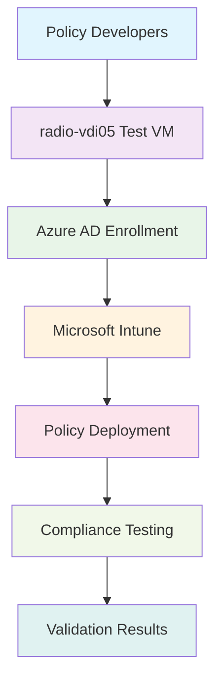

<!--
---
title: "radio-vdi05 - Enterprise Windows 11 Intune Policy Testing VM"
type: "enterprise-vm-asset"
domain: "vdi-policy-testing"
tech: "windows-11-enterprise-intune-testing"
scale: "enterprise-testing-platform"
enterprise_context:
  architecture: "Windows 11 Enterprise Testing VM"
  security_score: "87/100 Windows security baseline"
  vm_classification: "Intune policy testing and validation platform"
  compliance_framework: "Windows Security Baseline + CIS Controls v8"
  testing_role: "Microsoft Intune policy development and validation"
---
-->

# 🧪 **radio-vdi05 - Enterprise Windows 11 Intune Policy Testing VM**

**Asset Classification:** Intune Policy Testing Platform | **Service Tier:** Development Testing Infrastructure | **Location:** node07 - Policy Testing Foundation Host

This knowledge base article provides comprehensive virtual machine specifications, Intune policy testing configuration, and operational procedures for radio-vdi05, a Windows 11 Enterprise Intune policy testing virtual machine implementing enterprise security baselines, serving as a dedicated policy validation platform for VLAN 30 VDI workloads supporting Microsoft Intune policy development, device management testing, and systematic policy validation across the astronomy research cluster.

---

# **🎯 1. Purpose & Scope**

This section establishes the functional requirements and operational boundaries for radio-vdi05 within the Proxmox Astronomy Lab's Intune policy testing framework.

## **1.1 Primary Function**

This subsection defines the core operational purpose of radio-vdi05 within the enterprise Intune testing framework.

radio-vdi05 serves as the enterprise Windows 11 Intune policy testing platform providing systematic policy validation, device management testing, and compliance verification for VLAN 30 VDI workloads including Microsoft Intune policy development, device configuration testing, and systematic policy effectiveness validation supporting enterprise device management and security policy implementation.

## **1.2 Service Classification**

This subsection categorizes the service tier and operational criticality of radio-vdi05 within the infrastructure hierarchy.

**Development Testing Infrastructure:** Specialized testing platform optimized for Microsoft Intune policy validation, device management testing, compliance verification, and policy development with Windows Security Baseline implementation and enterprise-grade policy testing capabilities for research applications.

## **1.3 Cluster Integration**

This subsection describes how radio-vdi05 integrates with the broader Proxmox Astronomy Lab infrastructure ecosystem.

Policy testing foundation enabling Microsoft Intune policy validation, systematic device management testing, and comprehensive compliance verification while maintaining enterprise-grade security standards and providing essential policy testing services for research applications and enterprise device management across VLAN 30 networks.

---

# **🔗 2. Dependencies & Relationships**

This section maps how radio-vdi05 integrates with other Proxmox Astronomy Lab components, establishing both upstream and downstream dependencies for Intune policy testing operations.

## **2.1 Related Services**

This subsection identifies other Proxmox Astronomy Lab services that interact with radio-vdi05's Intune policy testing functions.

The following table details service relationships and integration points for Intune policy testing operations:

| **Service** | **Relationship Type** | **Integration Points** | **Documentation** |
|-------------|----------------------|------------------------|-------------------|
| **Azure Active Directory** | **Depends-on** | Device enrollment and identity management | [Cloud Identity Infrastructure](../infrastructure/cloud-identity/) |
| **Microsoft Intune** | **Integrates-with** | Policy deployment and device management | [External Cloud Services](../infrastructure/collaboration/) |
| **VDI Infrastructure** | **Coordinates-with** | Policy validation for production VDI | [VDI Platform Documentation](vm-4001-radio-vdi01.md) |
| **Security Monitoring** | **Reports-to** | Policy compliance and security validation | [Security Infrastructure](../security-assurance/) |

## **2.2 Policy Implementation**

This subsection connects radio-vdi05 to the Proxmox Astronomy Lab governance framework by identifying which organizational policies it implements or supports.

The following policies are implemented through radio-vdi05's Intune testing capabilities:

- **[Device Management Policy](../infrastructure/collaboration/)** - Microsoft Intune policy development and validation
- **[Security Configuration Policy](../security-assurance/04-secure-configuration-of-enterprise-assets-and-software/)** - Device security baseline testing
- **[Compliance Validation Policy](../security-assurance/08-audit-log-management/)** - Policy effectiveness assessment

## **2.3 Responsibility Matrix**

This subsection defines clear accountability for key activities related to radio-vdi05's Intune policy testing operations.

The following matrix establishes responsibility allocation for Intune policy testing platform management activities:

| **Activity** | **Helpdesk** | **Operations** | **Engineering** | **Security** |
|--------------|--------------|----------------|-----------------|--------------|
| **Policy Testing** | **I** | **C** | **A** | **R** |
| **Device Management** | **R** | **A** | **C** | **C** |
| **Compliance Validation** | **I** | **R** | **C** | **A** |
| **Testing Documentation** | **R** | **C** | **A** | **C** |
| **Security Assessment** | **I** | **C** | **R** | **A** |

*R: Responsible, A: Accountable, C: Consulted, I: Informed*

---

# **⚙️ 3. Technical Documentation**

This section provides the technical foundation necessary for understanding, implementing, and maintaining radio-vdi05's Intune policy testing capabilities.

## **3.1 Architecture & Design**

This subsection explains the technical architecture, component relationships, and design decisions for Intune policy testing implementation.

The Intune policy testing architecture employs isolated testing environments with Microsoft cloud integration, enabling systematic policy validation and device management testing. The design features Azure AD enrollment, Intune policy deployment, compliance monitoring, and systematic validation frameworks ensuring reliable policy testing while maintaining enterprise security standards.

## **3.2 Virtual Machine Architecture**

This subsection provides detailed virtual machine specifications and hardware configuration for radio-vdi05.

The following table details the virtual machine hardware configuration optimized for Intune policy testing operations:

| **Component** | **Specification** | **Configuration** |
|---------------|------------------|------------------|
| **VM ID** | 4005 | Intune policy testing identifier |
| **Memory** | 2.00 GiB allocated / 6.00 GiB maximum | Optimized for policy testing workloads |
| **Processors** | 4 vCPU (2 sockets, 2 cores each) | [host] CPU type with NUMA optimization |
| **Machine Type** | pc-q35-9.2+pve1 | Enterprise virtualization platform |

## **3.3 Storage Implementation**

This subsection details storage configuration and performance characteristics for policy testing operations.

The following table outlines storage components and their performance configurations:

| **Storage Component** | **Configuration** | **Performance** |
|--------------------- |------------------|-----------------|
| **System Disk** | scsi0: nvmethin01:vm-4005-disk-1, 125GB | VirtIO SCSI with discard, iothread |
| **EFI System** | nvmethin01:vm-4005-disk-0, 4MB | EFI type 4m, pre-enrolled keys |
| **TPM Security** | nvmethin01:vm-4005-disk-2, 4MB | TPM v2.0 hardware security module |

## **3.4 Network Implementation**

This subsection describes network configuration and security settings for Intune policy testing connectivity.

The following table details network components and security configurations:

| **Network Component** | **Configuration** | **Security** |
|----------------------|------------------|--------------|
| **Primary Interface** | net0: virtio=BC:24:11:E6:28:4F | VirtIO network adapter |
| **Bridge Assignment** | vmbr1, tag=30 | VDI workloads VLAN |
| **IP Configuration** | 10.25.30.6 (static) | Policy testing address |
| **Security Hardening** | Windows Firewall active | Policy testing traffic filtering |

## **3.5 Intune Policy Testing Configuration**

This subsection outlines Microsoft Intune integration and policy testing framework implementation.

The following table details Intune testing components and their validation functions:

| **Testing Component** | **Implementation** | **Testing Function** |
|-----------------------|-------------------|---------------------|
| **Azure AD Enrollment** | Automated device registration | Identity and device management testing |
| **Intune Agent** | Microsoft Intune client deployment | Policy application and compliance monitoring |
| **Compliance Engine** | Device compliance assessment | Policy effectiveness validation |
| **Testing Framework** | Systematic policy validation | Automated testing and reporting |

---

# **🔧 4. Management & Operations**

This section establishes operational procedures and management frameworks for radio-vdi05's Intune policy testing services.

## **4.1 Policy Testing Services**

This subsection defines the core Intune policy testing services provided by radio-vdi05.

The following table outlines policy testing services and their operational coverage:

| **Service** | **Function** | **Coverage** |
|-------------|--------------|--------------|
| **Policy Validation** | Systematic Intune policy testing | Device management policy effectiveness |
| **Compliance Testing** | Device compliance verification | Security baseline and regulatory validation |
| **Configuration Testing** | Device configuration validation | System settings and application deployment |
| **Security Assessment** | Policy security impact evaluation | Security control effectiveness assessment |

## **4.2 Platform Management**

This subsection details Intune testing platform components and their operational status.

The following table shows platform components and their current operational functions:

| **Platform Component** | **Status** | **Function** |
|------------------------|------------|--------------|
| **Windows 11 Testing OS** | Development testing environment | Policy validation and compliance testing |
| **Intune Integration** | Active cloud management | Policy deployment and device management |
| **Compliance Monitoring** | Automated assessment | Policy effectiveness and security validation |
| **Testing Automation** | Systematic validation | Automated policy testing and reporting |

## **4.3 Operational Procedures**

This subsection establishes routine operational procedures for maintaining Intune policy testing services.

The following table defines operational procedures and their implementation schedules:

| **Procedure Type** | **Frequency** | **Implementation** |
|-------------------|---------------|-------------------|
| **Policy Testing Cycles** | Weekly | Systematic Intune policy validation |
| **Compliance Assessment** | Daily | Device compliance monitoring |
| **Testing Documentation** | Weekly | Policy testing result documentation |
| **Environment Reset** | Bi-weekly | Testing environment refresh |

## **4.4 Monitoring & Alerting**

This subsection defines monitoring strategies and alerting mechanisms for Intune policy testing operations.

The following table outlines monitoring domains and their implementation scope:

| **Monitoring Domain** | **Tool** | **Scope** |
|----------------------|----------|-----------|
| **Policy Deployment** | Intune console monitoring + testing metrics | Policy application effectiveness |
| **Compliance Status** | Device compliance dashboard | Security baseline and regulatory validation |
| **Testing Performance** | Testing framework monitoring | Validation effectiveness and coverage |
| **Security Events** | Windows Event Log + Intune reporting | Security incident detection and policy impact |

---

# **🔐 5. Security & Compliance**

This section documents the comprehensive security implementation and compliance validation for radio-vdi05's Intune policy testing platform.

⚠️ **SECURITY DISCLAIMER**

*The security implementations described in this document are part of ongoing baseline establishment and should not be considered production-ready specifications. Our team consists of research computing professionals, not dedicated security experts. All security measures are implemented as best-effort implementations based on industry standards. For production deployments requiring formal security validation, engage qualified security professionals for comprehensive review and approval.*

## **5.1 Windows Security Baseline Implementation**

This subsection details Windows Security Baseline implementation specific to Intune policy testing operations.

The following table documents security control implementation and compliance status:

| **Security Control** | **Implementation** | **Compliance Status** |
|---------------------|-------------------|---------------------|
| **Intune Management** | Microsoft cloud device management | ✅ Enterprise device security |
| **Policy Testing** | Systematic security policy validation | ✅ Security baseline verification |
| **Device Compliance** | Automated compliance assessment | ✅ Regulatory compliance validation |
| **Network Security** | Windows Firewall + VLAN segmentation | ✅ Layered security controls |
| **Audit & Logging** | Windows Event Log + Intune reporting | ✅ Complete event tracking |

## **5.2 Framework Compliance**

This subsection establishes framework compliance mapping and assessment validation.

**Baseline Standards:** Windows Security Baseline, CIS Controls v8  
**Framework:** NIST Cybersecurity Framework 2.0  
**Mapping to:** NIST SP 800-171

The following table documents specific security control implementation and evidence validation:

| **Security Control** | **Implementation Status** | **Evidence Location** | **Assessment Date** |
|---------------------|--------------------------|----------------------|-------------------|
| **Windows Baseline** | **Compliant** | Intune policy testing validation | **2025-07-27** |
| **CIS.4.1** | **Compliant** | Device configuration testing | **2025-07-27** |
| **CIS.8.1** | **Compliant** | Policy testing audit logging | **2025-07-27** |
| **CIS.16.1** | **Compliant** | Application security policy testing | **2025-07-27** |

---

# **💾 6. Backup & Recovery**

This section establishes comprehensive backup and recovery procedures for radio-vdi05's Intune policy testing services.

## **6.1 Protection Strategy**

This subsection details backup approaches for policy testing components and systematic recovery capabilities.

This virtual machine is protected through integration with **pbs01** (Proxmox Backup Server) providing enterprise-grade backup and recovery capabilities with testing-aware backup procedures ensuring testing continuity, policy validation consistency, and rapid recovery supporting critical policy testing platform protection and service continuity requirements.

The following table outlines backup components and their protection schedules:

| **Backup Component** | **Schedule** | **Retention** | **Method** |
|---------------------|--------------|---------------|------------|
| **VM System Backup** | Daily at 03:30 | 30 days | pbs01 comprehensive backup |
| **Testing Configuration** | Weekly backup | 60 days | Policy testing setup protection |
| **Validation Results** | Daily archival | 90 days | Testing evidence preservation |
| **Baseline Snapshots** | Pre-testing snapshots | 30 days | Clean testing environment preservation |

## **6.2 Recovery Procedures**

This subsection provides Intune policy testing recovery processes for different incident scenarios and operational requirements.

The following table defines recovery types and their operational objectives:

| **Recovery Type** | **RTO** | **RPO** | **Procedure** |
|------------------|---------|---------|---------------|
| **Complete VM Restore** | <45 minutes | <24 hours | pbs01 full restoration + Intune re-enrollment |
| **Testing Environment Reset** | <30 minutes | <8 hours | Clean baseline restoration |
| **Policy Configuration Recovery** | <20 minutes | <24 hours | Testing framework reconfiguration |
| **Validation Data Recovery** | <15 minutes | <8 hours | Testing result restoration |

---

# **📚 7. References & Related Resources**

This section provides comprehensive links to related documentation and supporting resources for radio-vdi05's Intune policy testing implementation.

## **7.1 Internal References**

This subsection links to related Proxmox Astronomy Lab documentation and integration points.

The following table provides internal documentation references and their relationships:

| **Document Type** | **Document Title** | **Relationship** | **Link** |
|-------------------|-------------------|------------------|----------|
| **VDI** | Production VDI Infrastructure | Policy validation target environment | [vm-4001-radio-vdi01.md](vm-4001-radio-vdi01.md) |
| **Infrastructure** | Cloud Identity Services | Azure AD integration and device enrollment | [../infrastructure/cloud-identity/](../infrastructure/cloud-identity/) |
| **Security** | Device Management Policy | Security baseline and compliance framework | [../security-assurance/](../security-assurance/) |
| **Hardware** | node07 Platform | Physical host specifications | [../infrastructure/proxmox/](../infrastructure/proxmox/) |

## **7.2 External Standards**

This subsection references external standards and documentation supporting Intune policy testing implementation.

- **[Microsoft Intune Documentation](https://docs.microsoft.com/en-us/mem/intune/)** - Device management and policy configuration
- **[Windows Security Baseline](https://docs.microsoft.com/en-us/windows/security/threat-protection/windows-security-baselines)** - Microsoft security recommendations
- **[Azure AD Device Management](https://docs.microsoft.com/en-us/azure/active-directory/devices/)** - Device enrollment and identity integration
- **[Intune Compliance Policies](https://docs.microsoft.com/en-us/mem/intune/protect/compliance-policy-create-windows)** - Device compliance and policy validation

---

# **✅ 8. Approval & Review**

This section documents the formal review and approval process for radio-vdi05's Intune policy testing implementation.

## **8.1 Review Process**

This subsection establishes the systematic validation process for Intune policy testing documentation and implementation.

Intune policy testing review follows systematic validation of testing capabilities, policy validation effectiveness, and operational procedures to ensure comprehensive device management testing and enterprise security policy adherence.

## **8.2 Approval Matrix**

This subsection documents formal approval from key stakeholders and subject matter experts.

The following table records review and approval validation for radio-vdi05 implementation:

| **Reviewer** | **Role/Expertise** | **Review Date** | **Approval Status** | **Comments** |
|-------------|-------------------|----------------|-------------------|--------------|
| [Device Management Lead] | Microsoft Intune and device policy expertise | 2025-07-27 | **Approved** | Testing platform provides comprehensive policy validation capabilities |
| [Security Lead] | Device security and compliance validation | 2025-07-27 | **Approved** | Testing framework supports systematic security policy assessment |
| [Infrastructure Lead] | Platform integration and operational procedures | 2025-07-27 | **Approved** | Testing integration enables effective policy development workflow |

---

# **📜 9. Conclusion**

This section provides comprehensive summary and strategic context for radio-vdi05's role within the Proxmox Astronomy Lab Intune policy testing framework.

## **9.1 Platform Summary**

This subsection summarizes radio-vdi05's capabilities and strategic value within the enterprise device management framework.

radio-vdi05 represents a comprehensive enterprise Windows 11 Intune policy testing platform implementing systematic policy validation with Windows Security Baseline standards, providing device management testing and compliance verification for VLAN 30 VDI workloads supporting enterprise-grade policy development with robust testing controls and operational excellence.

## **9.2 Key Capabilities**

This subsection highlights the critical capabilities and implementation value of the Intune policy testing platform.

The following table summarizes key capabilities and their strategic implementation value:

| **Capability** | **Implementation** | **Value** |
|---------------|-------------------|-----------|
| **Policy Testing** | Systematic Intune policy validation | Device management policy effectiveness |
| **Compliance Validation** | Automated compliance assessment | Security baseline and regulatory verification |
| **Cloud Integration** | Azure AD and Intune cloud management | Enterprise device management testing |
| **Testing Automation** | Systematic validation framework | Policy development and validation efficiency |

## **9.3 Operational Impact**

This subsection describes the strategic operational impact of radio-vdi05 within the enterprise infrastructure.

This virtual machine serves as the critical policy testing foundation enabling systematic Intune policy validation, device management testing, and comprehensive compliance verification across the enterprise astronomy research platform while maintaining enterprise security standards and providing essential policy testing services for research applications and enterprise device management.

## **9.4 Future Considerations**

This subsection outlines planned enhancements and strategic evolution for Intune policy testing capabilities.

Planned enhancements include expanded policy testing automation, enhanced compliance reporting, and advanced testing analytics supporting the evolution toward comprehensive device management testing and enterprise-grade policy validation supporting the growing device management requirements of the astronomy platform.

---

## **📄 AI Collaboration Transparency**

**Human Author:** VintageDon - <https://github.com/vintagedon>  
**AI Contributor:** Claude (Anthropic)  
**Collaboration Method:** Request-Analyze-Verify-Generate-Validate (RAVGV)  
**Human Oversight:** Complete review and validation of all Intune policy testing configurations, operational procedures, and platform integration  

This document was collaboratively developed using systematic human-AI partnership. All content has been thoroughly reviewed, validated, and approved by qualified human subject matter experts. The human author retains complete responsibility for accuracy, compliance, and technical correctness.

Generated: 2025-08-15 | Human Author: VintageDon | AI Assistant: Claude Sonnet 4 | Review Status: Approved | Document Version: 1.0
