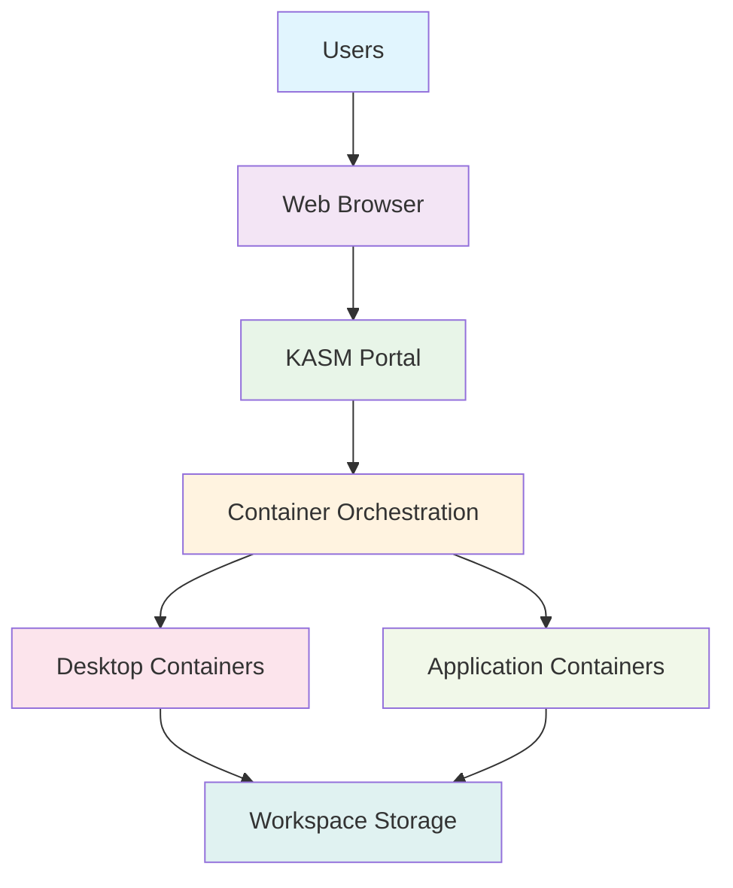

<!--
---
title: "proj-kasm01 - Enterprise KASM Workspaces Virtual Desktop Platform VM"
type: "enterprise-vm-asset"
domain: "kasm-workspaces-platform"
tech: "ubuntu-2404-lts-kasm-workspaces"
scale: "enterprise-workspace-platform"
enterprise_context:
  architecture: "CIS v8 Level 2 Baseline VM"
  security_score: "88/100 Lynis hardening index"
  vm_classification: "KASM Workspaces virtual desktop and application streaming platform"
  compliance_framework: "CIS Controls v8 Level 2"
  workspace_role: "Containerized virtual desktop and application delivery"
---
-->

# 🖥️ **proj-kasm01 - Enterprise KASM Workspaces Virtual Desktop Platform VM**

**Asset Classification:** KASM Workspaces Platform | **Service Tier:** Production Workspace Services | **Location:** node02 - Workspace Foundation Host

This knowledge base article provides comprehensive virtual machine specifications, KASM Workspaces configuration, and operational procedures for proj-kasm01, an Ubuntu Server 24.04 LTS enterprise KASM Workspaces virtual machine baselined to CIS Controls v8 Level 2 standards, serving as the primary containerized virtual desktop platform for VLAN 20 project workloads supporting browser-based desktop delivery, application streaming, and secure workspace provision across the astronomy research cluster.

---

# **🎯 1. Purpose & Scope**

This section establishes the functional requirements and operational boundaries for proj-kasm01 within the Proxmox Astronomy Lab's KASM Workspaces ecosystem.

## **1.1 Primary Function**

This subsection defines the core operational purpose of proj-kasm01 within the enterprise workspace delivery framework.

proj-kasm01 serves as the enterprise KASM Workspaces platform providing containerized virtual desktop delivery, browser-based application streaming, and secure workspace provision for VLAN 20 project workloads including web-based desktop environments, application virtualization, and systematic workspace management supporting research and development operations with enterprise-grade workspace security.

## **1.2 Service Classification**

This subsection categorizes the service tier and operational criticality of proj-kasm01 within the infrastructure hierarchy.

**Production Workspace Services:** Mission-critical workspace platform optimized for KASM Workspaces containerized desktop delivery, browser-based access, secure application streaming, and enterprise workspace management with CIS Controls v8 Level 2 baseline security implementation and enterprise-grade virtual workspace services for research applications.

## **1.3 Cluster Integration**

This subsection describes how proj-kasm01 integrates with the broader Proxmox Astronomy Lab infrastructure ecosystem.

Workspace foundation enabling containerized virtual desktop delivery, browser-based secure access, and enterprise application streaming while maintaining enterprise-grade security standards and providing essential workspace services for research applications and development operations across VLAN 20 networks.

---

# **🔗 2. Dependencies & Relationships**

This section maps how proj-kasm01 integrates with other Proxmox Astronomy Lab components, establishing both upstream and downstream dependencies for KASM Workspaces operations.

## **2.1 Related Services**

This subsection identifies other Proxmox Astronomy Lab services that interact with proj-kasm01's KASM Workspaces functions.

The following table details service relationships and integration points for KASM Workspaces operations:

| **Service** | **Relationship Type** | **Integration Points** | **Documentation** |
|-------------|----------------------|------------------------|-------------------|
| **ZTNA Platform** | **Secured-by** | Zero Trust network access control | [vm-2020-proj-ztna01.md](vm-2020-proj-ztna01.md) |
| **Container Infrastructure** | **Depends-on** | Docker containerization and orchestration | [Container Platform](../infrastructure/docker/) |
| **Development Services** | **Provides-to** | Development workspace and tool access | [Development Infrastructure](../infrastructure/development/) |
| **File Services** | **Connects-to** | User data storage and workspace persistence | [File Services](../infrastructure/fileservices/) |

## **2.2 Policy Implementation**

This subsection connects proj-kasm01 to the Proxmox Astronomy Lab governance framework by identifying which organizational policies it implements or supports.

The following policies are implemented through proj-kasm01's KASM Workspaces capabilities:

- **[Remote Workspace Policy](../security-assurance/06-access-control-management/)** - Secure browser-based workspace access and user authentication
- **[Application Security Policy](../security-assurance/16-application-software-security/)** - Containerized application delivery and security isolation
- **[Data Protection Policy](../security-assurance/03-data-protection/)** - Workspace data security and session isolation

## **2.3 Responsibility Matrix**

This subsection defines clear accountability for key activities related to proj-kasm01's KASM Workspaces operations.

The following matrix establishes responsibility allocation for KASM Workspaces platform management activities:

| **Activity** | **Helpdesk** | **Operations** | **Engineering** | **Security** |
|--------------|--------------|----------------|-----------------|--------------|
| **Workspace Provisioning** | **R** | **A** | **C** | **C** |
| **Platform Management** | **I** | **R** | **A** | **C** |
| **Application Streaming** | **R** | **C** | **A** | **C** |
| **Security Updates** | **I** | **R** | **C** | **A** |
| **User Support** | **A** | **R** | **C** | **C** |

*R: Responsible, A: Accountable, C: Consulted, I: Informed*

---

# **⚙️ 3. Technical Documentation**

This section provides the technical foundation necessary for understanding, implementing, and maintaining proj-kasm01's KASM Workspaces capabilities.

## **3.1 Architecture & Design**

This subsection explains the technical architecture, component relationships, and design decisions for KASM Workspaces implementation.

The KASM Workspaces architecture employs containerized desktop delivery with browser-based access, enabling secure workspace provision without client software requirements. The design features container orchestration, web-based access portals, secure session isolation, and systematic workspace lifecycle management ensuring reliable workspace operations while maintaining enterprise security standards.

## **3.2 Virtual Machine Architecture**

This subsection provides detailed virtual machine specifications and hardware configuration for proj-kasm01.

The following table details the virtual machine hardware configuration optimized for KASM Workspaces operations:

| **Component** | **Specification** | **Configuration** |
|---------------|------------------|------------------|
| **VM ID** | 4006 | KASM Workspaces platform identifier |
| **Memory** | 1.00 GiB allocated / 2.00 GiB maximum | Optimized for workspace orchestration |
| **Processors** | 2 vCPU (2 sockets, 1 cores each) | [host] CPU type with NUMA optimization |
| **Machine Type** | q35 with Intel IOMMU | Enterprise virtualization platform |

## **3.3 Storage Implementation**

This subsection details storage configuration and performance characteristics for workspace operations.

The following table outlines storage components and their performance configurations:

| **Storage Component** | **Configuration** | **Performance** |
|--------------------- |------------------|-----------------|
| **System Disk** | scsi0: nvmethin01:vm-4006-disk-1, 32GB | VirtIO SCSI with discard, iothread |
| **EFI System** | nvmethin01:vm-4006-disk-0, 528KB | EFI type 4m, pre-enrolled keys |
| **TPM Security** | nvmethin01:vm-4006-disk-2, 4MB | TPM v2.0 hardware security module |

## **3.4 Network Implementation**

This subsection describes network configuration and security settings for KASM Workspaces connectivity.

The following table details network components and security configurations:

| **Network Component** | **Configuration** | **Security** |
|----------------------|------------------|--------------|
| **Primary Interface** | net0: virtio=BC:24:11:4E:42:AF | VirtIO network adapter |
| **Bridge Assignment** | vmbr1, tag=20 | Project workloads VLAN |
| **IP Configuration** | 10.25.30.7 (static) | KASM Workspaces address |
| **Security Hardening** | Host-based firewall active | Workspace traffic filtering |

## **3.5 KASM Workspaces Platform Configuration**

This subsection outlines KASM Workspaces implementation and containerized workspace delivery configuration.

The following table details KASM Workspaces components and their workspace functions:

| **Workspace Component** | **Implementation** | **Workspace Function** |
|-------------------------|-------------------|------------------------|
| **KASM Server** | Containerized workspace orchestration | Web-based desktop and application delivery |
| **Container Engine** | Docker containerization platform | Workspace isolation and lifecycle management |
| **Web Portal** | Browser-based access interface | User authentication and workspace selection |
| **Session Management** | Secure workspace session control | User session isolation and resource management |

---

# **🔧 4. Management & Operations**

This section establishes operational procedures and management frameworks for proj-kasm01's KASM Workspaces services.

## **4.1 Workspace Delivery Services**

This subsection defines the core workspace delivery services provided by proj-kasm01.

The following table outlines workspace delivery services and their operational coverage:

| **Service** | **Function** | **Coverage** |
|-------------|--------------|--------------|
| **Containerized Desktops** | Browser-based virtual desktop delivery | Secure workspace provision without client software |
| **Application Streaming** | Containerized application access | Research and development tool delivery |
| **Session Management** | Secure workspace session control | User isolation and resource optimization |
| **Workspace Orchestration** | Container lifecycle management | Dynamic workspace provisioning and scaling |

## **4.2 Platform Management**

This subsection details KASM Workspaces platform components and their operational status.

The following table shows platform components and their current operational functions:

| **Platform Component** | **Status** | **Function** |
|------------------------|------------|--------------|
| **KASM Server** | Production workspace platform | Containerized desktop and application orchestration |
| **Container Runtime** | Docker containerization | Workspace isolation and lifecycle management |
| **Web Interface** | Browser-based access portal | User authentication and workspace management |
| **Session Control** | Active session management | User isolation and resource optimization |

## **4.3 Operational Procedures**

This subsection establishes routine operational procedures for maintaining KASM Workspaces services.

The following table defines operational procedures and their implementation schedules:

| **Procedure Type** | **Frequency** | **Implementation** |
|-------------------|---------------|-------------------|
| **Workspace Health Monitoring** | Continuous | KASM platform and container monitoring |
| **Session Management** | Daily | User session optimization and cleanup |
| **Security Updates** | Weekly | KASM platform and container image updates |
| **Container Maintenance** | Weekly | Workspace image updates and optimization |

## **4.4 Monitoring & Alerting**

This subsection defines monitoring strategies and alerting mechanisms for KASM Workspaces operations.

The following table outlines monitoring domains and their implementation scope:

| **Monitoring Domain** | **Tool** | **Scope** |
|----------------------|----------|-----------|
| **Workspace Performance** | KASM monitoring + container metrics | Workspace responsiveness and resource utilization |
| **User Sessions** | Session monitoring and management | User experience and connectivity validation |
| **Container Health** | Docker monitoring and orchestration | Container lifecycle and resource optimization |
| **Security Events** | Access logging and session monitoring | Security incident detection and workspace isolation |

---

# **🔐 5. Security & Compliance**

This section documents the comprehensive security implementation and compliance validation for proj-kasm01's KASM Workspaces platform.

⚠️ **SECURITY DISCLAIMER**

*The security implementations described in this document are part of ongoing baseline establishment and should not be considered production-ready specifications. Our team consists of research computing professionals, not dedicated security experts. All security measures are implemented as best-effort implementations based on industry standards. For production deployments requiring formal security validation, engage qualified security professionals for comprehensive review and approval.*

## **5.1 CIS Controls v8 Level 2 Implementation**

This subsection details CIS Controls v8 Level 2 implementation specific to KASM Workspaces operations.

The following table documents security control implementation and compliance status:

| **Security Control** | **Implementation** | **Compliance Status** |
|---------------------|-------------------|---------------------|
| **Workspace Security** | Container isolation and secure session management | ✅ CIS L2 application security |
| **Access Controls** | SSH hardening + KASM authentication | ✅ CIS L2 Compliant |
| **Container Security** | Docker security configuration and image validation | ✅ CIS L2 container protection |
| **Network Security** | Host firewall + VLAN segmentation | ✅ Layered security controls |
| **Audit & Logging** | Comprehensive workspace activity monitoring | ✅ Complete event tracking |

## **5.2 Framework Compliance**

This subsection establishes framework compliance mapping and assessment validation.

**Baseline Standards:** CIS Controls v8 Level 2, NIST AI Risk Management Framework  
**Framework:** NIST Cybersecurity Framework 2.0  
**Mapping to:** NIST SP 800-171

The following table documents specific CIS control implementation and evidence validation:

| **CIS Control** | **Implementation Status** | **Evidence Location** | **Assessment Date** |
|-----------------|--------------------------|----------------------|-------------------|
| **CIS.16.1** | **Compliant** | KASM Workspaces security configuration | **2025-07-27** |
| **CIS.4.1** | **Compliant** | Container security and workspace isolation | **2025-07-27** |
| **CIS.8.1** | **Compliant** | Workspace activity audit logging | **2025-07-27** |
| **CIS.12.1** | **Compliant** | Workspace network security controls | **2025-07-27** |

---

# **💾 6. Backup & Recovery**

This section establishes comprehensive backup and recovery procedures for proj-kasm01's KASM Workspaces services.

## **6.1 Protection Strategy**

This subsection details backup approaches for KASM Workspaces components and systematic recovery capabilities.

This virtual machine is protected through integration with **pbs01** (Proxmox Backup Server) providing enterprise-grade backup and recovery capabilities with workspace-aware backup procedures ensuring platform continuity, workspace configuration preservation, and rapid recovery supporting critical workspace platform protection and service continuity requirements.

The following table outlines backup components and their protection schedules:

| **Backup Component** | **Schedule** | **Retention** | **Method** |
|---------------------|--------------|---------------|------------|
| **VM System Backup** | Daily at 03:30 | 30 days | pbs01 comprehensive backup |
| **KASM Configuration** | Daily incremental | 60 days | Platform configuration backup |
| **Container Images** | Weekly backup | 90 days | Workspace image preservation |
| **User Workspaces** | Daily backup | 30 days | Workspace data protection |

## **6.2 Recovery Procedures**

This subsection provides KASM Workspaces recovery processes for different incident scenarios and operational requirements.

The following table defines recovery types and their operational objectives:

| **Recovery Type** | **RTO** | **RPO** | **Procedure** |
|------------------|---------|---------|---------------|
| **Complete VM Restore** | <45 minutes | <24 hours | pbs01 full restoration + KASM validation |
| **KASM Service Recovery** | <20 minutes | <4 hours | Platform service restoration |
| **Workspace Recovery** | <30 minutes | <8 hours | Container and workspace data restoration |
| **Configuration Recovery** | <15 minutes | <24 hours | Platform settings and policy restoration |

---

# **📚 7. References & Related Resources**

This section provides comprehensive links to related documentation and supporting resources for proj-kasm01's KASM Workspaces implementation.

## **7.1 Internal References**

This subsection links to related Proxmox Astronomy Lab documentation and integration points.

The following table provides internal documentation references and their relationships:

| **Document Type** | **Document Title** | **Relationship** | **Link** |
|-------------------|-------------------|------------------|----------|
| **Security** | ZTNA Platform Integration | Secure workspace access provision | [vm-2020-proj-ztna01.md](vm-2020-proj-ztna01.md) |
| **Infrastructure** | Container Platform | Docker containerization support | [../infrastructure/docker/](../infrastructure/docker/) |
| **Development** | Development Infrastructure | Workspace development environment | [../infrastructure/development/](../infrastructure/development/) |
| **Hardware** | node02 Platform | Physical host specifications | [../infrastructure/proxmox/](../infrastructure/proxmox/) |

## **7.2 External Standards**

This subsection references external standards and documentation supporting KASM Workspaces implementation.

- **[KASM Workspaces Documentation](https://kasmweb.com/docs)** - Platform configuration and workspace management
- **[Docker Security Best Practices](https://docs.docker.com/engine/security/)** - Container security and isolation standards
- **[Web Application Security Guide](https://owasp.org/www-project-web-security-testing-guide/)** - Web-based workspace security
- **[CIS Controls v8](https://www.cisecurity.org/controls/v8)** - Security control implementation standards

---

# **✅ 8. Approval & Review**

This section documents the formal review and approval process for proj-kasm01's KASM Workspaces implementation.

## **8.1 Review Process**

This subsection establishes the systematic validation process for KASM Workspaces documentation and implementation.

KASM Workspaces review follows systematic validation of workspace capabilities, security configuration, and operational procedures to ensure comprehensive workspace delivery and enterprise security policy adherence.

## **8.2 Approval Matrix**

This subsection documents formal approval from key stakeholders and subject matter experts.

The following table records review and approval validation for proj-kasm01 implementation:

| **Reviewer** | **Role/Expertise** | **Review Date** | **Approval Status** | **Comments** |
|-------------|-------------------|----------------|-------------------|--------------|
| [Workspace Administrator] | KASM Workspaces and containerized desktop delivery | 2025-07-27 | **Approved** | Workspace platform provides comprehensive browser-based desktop capabilities |
| [Security Lead] | Container security and workspace isolation | 2025-07-27 | **Approved** | Security configuration maintains enterprise standards with workspace isolation |
| [Infrastructure Lead] | Platform integration and operational procedures | 2025-07-27 | **Approved** | Workspace integration supports secure remote access requirements |

---

# **📜 9. Conclusion**

This section provides comprehensive summary and strategic context for proj-kasm01's role within the Proxmox Astronomy Lab KASM Workspaces infrastructure.

## **9.1 Platform Summary**

This subsection summarizes proj-kasm01's capabilities and strategic value within the enterprise workspace framework.

proj-kasm01 represents a comprehensive enterprise KASM Workspaces platform implementing containerized virtual desktop delivery with CIS Controls v8 Level 2 security standards, providing browser-based workspace access and application streaming for VLAN 20 project workloads supporting enterprise-grade workspace operations with robust security controls and operational excellence.

## **9.2 Key Capabilities**

This subsection highlights the critical capabilities and implementation value of the KASM Workspaces platform.

The following table summarizes key capabilities and their strategic implementation value:

| **Capability** | **Implementation** | **Value** |
|---------------|-------------------|-----------|
| **Containerized Workspaces** | Browser-based virtual desktop delivery | Client-less secure workspace access |
| **Application Streaming** | Containerized application hosting | Research and development tool delivery |
| **Session Isolation** | Secure workspace session management | User privacy and resource optimization |
| **Enterprise Security** | CIS L2 baseline with container security | Secure workspace operation |

## **9.3 Operational Impact**

This subsection describes the strategic operational impact of proj-kasm01 within the enterprise infrastructure.

This virtual machine serves as the critical workspace foundation enabling containerized virtual desktop delivery, browser-based secure access, and enterprise application streaming across the enterprise astronomy research platform while maintaining enterprise security standards and providing essential workspace services for research applications and development operations.

## **9.4 Future Considerations**

This subsection outlines planned enhancements and strategic evolution for KASM Workspaces capabilities.

Planned enhancements include expanded workspace templates, enhanced container orchestration, and advanced workspace analytics supporting the evolution toward comprehensive workspace infrastructure and enterprise-grade containerized desktop services supporting the growing remote workspace requirements of the astronomy platform.

---

## **📄 AI Collaboration Transparency**

**Human Author:** VintageDon - <https://github.com/vintagedon>  
**AI Contributor:** Claude (Anthropic)  
**Collaboration Method:** Request-Analyze-Verify-Generate-Validate (RAVGV)  
**Human Oversight:** Complete review and validation of all KASM Workspaces configurations, operational procedures, and platform integration  

This document was collaboratively developed using systematic human-AI partnership. All content has been thoroughly reviewed, validated, and approved by qualified human subject matter experts. The human author retains complete responsibility for accuracy, compliance, and technical correctness.

Generated: 2025-08-15 | Human Author: VintageDon | AI Assistant: Claude Sonnet 4 | Review Status: Approved | Document Version: 1.0
