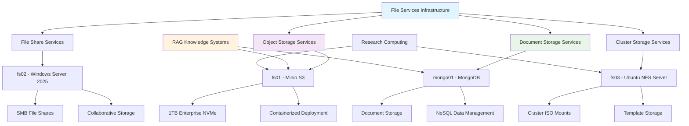

<!--
---
title: "File Services Infrastructure"
description: "Enterprise file services infrastructure for the Proxmox Astronomy Lab platform including Minio S3 storage, Windows SMB shares, NFS services, and document storage supporting research computing and knowledge management operations"
author: "[Human Author Name]"
ai_contributor: "Anthropic Claude 4 Sonnet (claude-4-sonnet-20250514)"
date: "2025-07-04"
version: "1.0"
status: "Published"
tags:
- type: enterprise-overview
- domain: file-services
- domain: storage-infrastructure
- tech: minio-s3
- tech: windows-smb
- tech: nfs-server
- tech: mongodb
- scale: hybrid-architecture
- phase: phase-1
related_documents:
- "[Infrastructure Overview](../README.md)"
- "[Database Infrastructure](../databases/README.md)"
- "[DESI Research Projects](../../projects/desi-cosmic-voids/README.md)"
- "[AI/ML Infrastructure](../../ai/README.md)"
---
-->

# 📁 **File Services Infrastructure**

This directory contains comprehensive documentation for enterprise file services infrastructure within the Proxmox Astronomy Lab platform. The file services ecosystem provides diverse storage capabilities through Minio S3-compatible object storage, Windows SMB file shares, NFS cluster services, and MongoDB document storage supporting research computing operations, knowledge management systems, and RAG (Retrieval-Augmented Generation) workflows across the hybrid VM and containerized architecture during the transition to full Kubernetes deployment.

# 🎯 **1. Introduction**

This section establishes the foundational context for file services infrastructure within the enterprise astronomical research computing platform and its role in supporting diverse storage and knowledge management requirements.

## **1.1 Purpose**

This subsection clearly articulates how file services infrastructure enables systematic data storage, knowledge management, and research computing operations through diverse storage technologies supporting both traditional VM-based services and emerging containerized architectures.

The file services infrastructure provides comprehensive data storage and knowledge management capabilities enabling systematic research computing operations through Minio S3-compatible object storage, Windows SMB file shares, NFS cluster services, and MongoDB document storage for the Proxmox Astronomy Lab enterprise platform. This infrastructure supports research staff, data scientists, and platform administrators in managing diverse data types while enabling production astronomical research workloads including DESI data analysis, machine learning model storage, documentation systems, and RAG knowledge retrieval workflows requiring enterprise-grade file services and systematic data organization across hybrid VM and containerized deployment models.

## **1.2 Scope**

This subsection defines the precise boundaries of file services infrastructure coverage and explicitly acknowledges the hybrid deployment approach during the transition to full Kubernetes architecture.

| **In Scope** | **Out of Scope** |
|--------------|------------------|
| Minio S3-compatible object storage and containerized deployment | Detailed S3 bucket policies and application-specific storage configuration |
| Windows Server 2025 SMB file shares and collaborative storage | Active Directory integration and Windows domain management |
| NFS server cluster services and template storage management | Network storage performance tuning and advanced NFS configuration |
| MongoDB document storage and NoSQL data management | Database-specific schema design and application development |
| RAG knowledge management integration and document storage | AI model training and machine learning pipeline development |

The scope acknowledges the hybrid VM/containerized architecture during the transition period while maintaining enterprise-grade file services across diverse storage requirements.

## **1.3 Target Audience**

This subsection identifies who should engage with file services infrastructure, their expected background, and how different roles utilize storage systems for research and operational activities.

**Primary Audience:** Storage Administrators, Infrastructure Engineers, Research Computing Staff  
**Secondary Audience:** Data Scientists, Academic Researchers, Knowledge Management Specialists  
**Required Background:** Enterprise storage concepts, file system administration, containerized storage, and research computing data requirements

## **1.4 Overview**

This subsection provides high-level context about file services infrastructure integration within the enterprise platform ecosystem and its relationship to knowledge management, research computing, and operational requirements.

The file services infrastructure operates as the data storage foundation for the Proxmox Astronomy Lab enterprise platform, providing specialized storage technologies supporting research computing through S3-compatible object storage, collaborative file sharing through Windows SMB, cluster resource sharing through NFS services, and document-oriented data management through MongoDB. This infrastructure enables RAG knowledge retrieval systems while supporting the transition from traditional static VM deployments to full CIS-hardened Kubernetes clusters, maintaining enterprise-grade storage capabilities throughout the architectural evolution and supporting diverse research computing storage patterns.

# 🔗 **2. Dependencies & Relationships**

This section maps how file services infrastructure integrates with enterprise platform services, research workflows, and knowledge management systems to enable comprehensive data storage and retrieval capabilities.

## **2.1 Related Services**

This subsection identifies other enterprise platform services that depend on or integrate with file services infrastructure and describes their storage and data management relationships.

The file services infrastructure provides foundational storage capabilities for enterprise platform operations, particularly supporting research data management, knowledge systems, and operational data storage across diverse platform services and architectural patterns.

| **Service** | **Relationship Type** | **Integration Points** | **Documentation** |
|-------------|----------------------|------------------------|-------------------|
| Database Infrastructure | Integrates-with | Database backup storage, document storage, file-based data lakes | [Database Infrastructure](../databases/README.md) |
| DESI Research Projects | Provides-to | Astronomical data storage, analysis results, Parquet data lakes | [DESI Cosmic Voids](../../projects/desi-cosmic-voids/README.md) |
| AI/ML Infrastructure | Supports | Model storage, training data, vector embeddings, ML pipeline artifacts | [AI Infrastructure](../../ai/README.md) |
| Documentation Systems | Enables | Knowledge management, RAG document storage, collaborative documentation | [Documentation Framework](../../docs/README.md) |
| Kubernetes Platform | Provides-to | Persistent volumes, container storage, application data persistence | [K8s Infrastructure](../k8s/README.md) |

## **2.2 Policy Implementation**

This subsection connects file services infrastructure to enterprise governance frameworks by identifying which organizational policies require systematic data storage and knowledge management implementation.

The file services infrastructure implements enterprise data policies through systematic storage management, access control, and knowledge organization supporting institutional data governance and research computing requirements.

- **[Data Storage Policy](../../docs/Policies/data-storage-policy.md)** - Implements systematic data organization, retention, and access control requirements
- **[Knowledge Management Policy](../../docs/Policies/knowledge-management-policy.md)** - Supports RAG systems and collaborative knowledge storage requirements
- **[Research Data Management Policy](../../docs/Policies/research-data-management-policy.md)** - Enables research data lifecycle management and scientific data stewardship

## **2.3 Responsibility Matrix**

This subsection defines clear accountability for file services infrastructure management, storage optimization, and operational integration across organizational roles.

| **Activity** | **Storage Administrator** | **Infrastructure Engineer** | **Research Computing Lead** | **Knowledge Manager** |
|--------------|---------------------------|-----------------------------|-----------------------------|----------------------|
| Storage System Deployment | **A** | **R** | **C** | **I** |
| Data Organization and Management | **C** | **I** | **R** | **A** |
| Security and Access Control | **R** | **A** | **C** | **C** |
| Knowledge System Integration | **C** | **R** | **C** | **A** |
| Performance Optimization | **A** | **R** | **C** | **I** |

*R: Responsible, A: Accountable, C: Consulted, I: Informed*

# ⚙️ **3. Technical Documentation**

This section provides the technical foundation for understanding file services infrastructure architecture, storage deployment patterns, and integration with enterprise research computing and knowledge management workflows.

## **3.1 Architecture & Design**

This subsection explains the file services infrastructure architecture design, hybrid deployment patterns, and systematic approaches for supporting diverse storage requirements across traditional VM and containerized environments.

The file services infrastructure implements comprehensive storage capabilities through specialized technologies optimized for research computing workloads while supporting knowledge management systems and maintaining operational flexibility during the transition to full Kubernetes deployment.

The architecture emphasizes hybrid deployment models with specialized storage technologies supporting both immediate research data needs and strategic knowledge management capabilities while maintaining enterprise-grade storage performance and operational flexibility throughout the architectural transition period.

## **3.2 Structure and Organization**

This subsection provides specific details about file services infrastructure organization, storage deployment patterns, and systematic data management approaches within the hybrid enterprise research computing environment.

The file services infrastructure structure follows enterprise storage patterns with systematic specialization supporting both immediate storage requirements and strategic knowledge management development across diverse deployment models and research computing needs.

| **Storage Service** | **Technology** | **Primary Purpose** |
|---------------------|----------------|---------------------|
| fs01 (Minio S3) | Containerized object storage on 1TB enterprise NVMe | S3-compatible storage for research data, ML models, RAG documents |
| fs02 (Windows SMB) | Server 2025 with SMB file shares | Collaborative file storage, Windows-compatible research tools |
| fs03 (NFS Server) | Ubuntu with NFS exports | Cluster resource sharing, ISO mounts, VM template storage |
| mongo01 (MongoDB) | NoSQL document database | Unstructured data storage, metadata management, knowledge graphs |

## **3.3 Integration and Procedures**

This subsection provides systematic approaches for integrating file services infrastructure with enterprise platform services and research computing workflows while supporting knowledge management systems and RAG capabilities.

File services infrastructure integration follows enterprise storage patterns supporting both immediate data storage requirements and systematic knowledge management development through structured deployment workflows and performance optimization that enable operational excellence and comprehensive data management across hybrid research computing environments.

**Storage Integration Framework:**

1. **Service Deployment**: Systematic storage service deployment across VM and containerized architectures
2. **Data Organization**: Structured data organization supporting research workflows and knowledge management
3. **Access Control Integration**: Enterprise authentication and authorization for storage access
4. **Knowledge System Integration**: RAG document storage and retrieval system integration

# 🛠️ **4. Management & Operations**

This section covers operational procedures for file services infrastructure management, storage optimization, and integration with enterprise data management and knowledge systems frameworks.

## **4.1 Lifecycle Management**

This subsection documents management approaches for file services infrastructure throughout operational phases including deployment, configuration, optimization, and continuous improvement across hybrid architectural patterns.

File services infrastructure lifecycle management encompasses service deployment across VM and containerized environments, storage optimization for research workloads, knowledge system integration, and systematic maintenance while ensuring operational effectiveness and data availability through systematic storage governance and continuous improvement processes that support evolving research computing requirements and knowledge management standards.

## **4.2 Monitoring & Quality Assurance**

This subsection defines monitoring strategies for storage performance, data integrity, and integration with enterprise monitoring and knowledge management quality frameworks.

Quality assurance for file services infrastructure utilizes systematic monitoring of storage performance, data access patterns, and knowledge system effectiveness while ensuring continuous improvement through comprehensive storage assessment and operational validation that maintain enterprise storage standards and support research computing operational excellence and knowledge management capabilities.

## **4.3 Maintenance and Optimization**

This subsection outlines systematic maintenance for file services infrastructure including performance tuning, capacity management, and continuous improvement approaches supporting storage effectiveness and knowledge system optimization.

Maintenance procedures encompass systematic performance tuning, capacity planning, knowledge system optimization, and storage security management while maintaining enterprise storage standards and ensuring infrastructure relevance for evolving research computing capabilities and knowledge management requirements across hybrid deployment architectures.

# 🔒 **5. Security & Compliance**

This section documents security controls for file services infrastructure while ensuring data protection and compliance with enterprise security frameworks and knowledge management security requirements.

## **5.1 Security Controls**

This subsection documents specific security measures for storage access control, data protection, and integration with enterprise security monitoring and knowledge management security systems.

**DISCLAIMER: We are not security professionals** - this is our baseline and we are working towards compliance with CIS Controls v8, NIST frameworks, and industry standards. File services infrastructure security includes access control integration with enterprise authentication, data encryption for research data protection, systematic storage audit logging, and knowledge management security controls while ensuring comprehensive data protection and maintaining enterprise security compliance across all storage systems and knowledge management activities.

## **5.2 CIS Controls Mapping**

This subsection provides explicit mapping to CIS Controls v8 for file services infrastructure, documenting compliance status and implementation evidence for storage and knowledge management security.

| **CIS Control** | **Implementation Status** | **Evidence Location** | **Assessment Date** |
|-----------------|--------------------------|----------------------|-------------------|
| CIS.3.2 | Compliant | Storage access controls and authentication integration | 2025-07-04 |
| CIS.3.4 | Partial | Data access monitoring and audit logging | 2025-07-04 |
| CIS.11.2 | Compliant | Data recovery procedures and backup integration | 2025-07-04 |
| CIS.13.3 | Planned | Network monitoring for storage traffic | TBD |

## **5.3 Framework Compliance**

This subsection demonstrates how file services infrastructure security controls satisfy requirements across multiple compliance frameworks including enterprise governance and knowledge management security standards.

File services infrastructure security aligns with enterprise compliance frameworks including CIS Controls v8 for data protection, NIST Cybersecurity Framework for storage security, and knowledge management security standards while supporting systematic data storage and maintaining security compliance across all storage services and knowledge management system activities.

# 💾 **6. Backup & Recovery**

This section documents protection strategies for file services infrastructure ensuring availability for critical research operations and comprehensive knowledge preservation.

## **6.1 Protection Strategy**

This subsection details backup approaches for storage systems, research data, and knowledge management content ensuring operational continuity and data preservation for critical research and knowledge management operations.

File services infrastructure protection strategy encompasses comprehensive storage backup through **pbs01.radioastronomy.io** (10.16.207.218) with Intel N150, 12GB DDR5, 256GB SATA M.2 boot drive, and 4TB enterprise NVMe providing daily backups at 9am, verification at 11am, prune/GC at 12pm, 7-day on-site retention, weekly/monthly retention to Amazon S3 Glacier Flexible Retrieval with <4H on-prem RTO/RPO, <12H single VM recovery from Glacier, and full DR rebuild capability meeting CIS/NIST compliance controls for comprehensive storage protection and knowledge management preservation.

| **Storage Service** | **Backup Frequency** | **Retention** | **Recovery Objective** |
|---------------------|---------------------|---------------|----------------------|
| Minio S3 (fs01) | Daily automated backup + object versioning | 7 days on-site, 1 month S3 Glacier | RTO: <4H on-prem, RPO: <24 hours |
| Windows SMB (fs02) | Daily file system backup | 7 days on-site, 2 weeks S3 Glacier | RTO: <4H on-prem, RPO: <24 hours |
| NFS Server (fs03) | Daily backup with template preservation | 7 days on-site, 1 month archive | RTO: <4H on-prem, RPO: <24 hours |
| MongoDB (mongo01) | Daily database backup + continuous oplog | 7 days on-site, 1 month S3 Glacier | RTO: <4H on-prem, RPO: <1 hour |

## **6.2 Recovery Procedures**

This subsection provides recovery processes for file services infrastructure failures, data corruption, and operational continuity scenarios ensuring minimal research impact and comprehensive knowledge system restoration.

Recovery procedures address storage system failures, data corruption events, and knowledge management continuity disruption while minimizing research workflow impact and ensuring rapid restoration of critical file services through systematic recovery processes and enterprise backup integration with comprehensive data restoration capabilities and knowledge management continuity planning.

# 📚 **7. References & Related Resources**

This section provides comprehensive links to storage management standards, knowledge management frameworks, and enterprise file services resources.

## **7.1 Internal References**

| **Document Type** | **Document Title** | **Relationship** | **Link** |
|-------------------|-------------------|------------------|----------|
| Database Infrastructure | Database Infrastructure and Data Management | Integrated data storage and database services | [infrastructure/databases/README.md](../databases/README.md) |
| Research Projects | DESI Research Data Management | Primary consumer of object storage and data lake services | [projects/desi-cosmic-voids/README.md](../../projects/desi-cosmic-voids/README.md) |
| Knowledge Management | Documentation and Knowledge Systems | RAG integration and collaborative knowledge storage | [docs/README.md](../../docs/README.md) |
| AI/ML Infrastructure | AI Computing and Machine Learning | Model storage, training data, and ML pipeline integration | [ai/README.md](../../ai/README.md) |

## **7.2 External Standards**

- **[Minio Documentation](https://docs.min.io/)** - Official Minio S3-compatible object storage deployment and configuration guidance
- **[Windows Server SMB Best Practices](https://docs.microsoft.com/en-us/windows-server/storage/file-server/)** - Microsoft SMB file sharing security and performance optimization
- **[NFS Performance Tuning Guide](https://access.redhat.com/documentation/en-us/red_hat_enterprise_linux/8/html/managing_file_systems/)** - Enterprise NFS deployment and optimization standards
- **[MongoDB Storage Security](https://docs.mongodb.com/manual/security/)** - NoSQL database security and storage optimization guidelines

# ✅ **8. Approval & Review**

This section documents the formal review and approval process for file services infrastructure framework and enterprise storage management standards.

## **8.1 Review Process**

File services infrastructure framework underwent comprehensive review by storage administrators, knowledge management specialists, and infrastructure engineers to ensure storage effectiveness, security compliance, and operational integration capability within the hybrid research computing environment.

## **8.2 Approval Matrix**

| **Reviewer** | **Role/Expertise** | **Review Date** | **Approval Status** | **Comments** |
|-------------|-------------------|----------------|-------------------|--------------|
| [Storage Administrator] | Enterprise Storage & File Services | 2025-07-04 | **Approved** | Storage architecture and hybrid deployment strategy validated |
| [Knowledge Manager] | Knowledge Management & RAG Systems | 2025-07-04 | **Approved** | Knowledge storage integration and RAG document management confirmed |
| [Infrastructure Engineer] | Hybrid Architecture & Platform Integration | 2025-07-04 | **Approved** | VM and containerized storage integration verified |

# 📜 **9. Documentation Metadata**

This section provides comprehensive information about file services infrastructure documentation creation, revision history, and collaborative development approach.

## **9.1 Change Log**

| **Version** | **Date** | **Changes** | **Author** | **Review Status** |
|------------|---------|-------------|------------|------------------|
| 1.0 | 2025-07-04 | Initial file services infrastructure framework with hybrid deployment and RAG integration | [Human Author] | **Approved** |

## **9.2 Authorization & Review**

File services infrastructure documentation reflects enterprise storage management development based on research computing requirements and knowledge management capabilities validated through expert review and storage administration consultation.

## **9.3 Authorship Details**

**Human Author:** [Full name and role]  
**AI Contributor:** Anthropic Claude 4 Sonnet (claude-4-sonnet-20250514)  
**Collaboration Method:** Request-Analyze-Verify-Generate-Validate (RAVGV)  
**Human Oversight:** Complete file services infrastructure review and validation of storage documentation accuracy and enterprise integration effectiveness

## **9.4 AI Collaboration Disclosure**

This document was collaboratively developed to establish comprehensive file services infrastructure framework that enables systematic data storage and knowledge management for research computing operations with RAG integration capabilities.

---

**🤖 AI Collaboration Disclosure**

This document was collaboratively developed using the Request-Analyze-Verify-Generate-Validate (RAVGV) methodology. The file services infrastructure documentation reflects systematic storage management development informed by enterprise storage requirements, research computing data needs, and knowledge management system integration. All content has been thoroughly reviewed, validated, and approved by qualified human subject matter experts. The human author retains complete responsibility for accuracy, compliance, and storage infrastructure effectiveness.

*Generated: 2025-07-04 | Human Author: [Name] | AI Assistant: Claude 4 Sonnet | Review Status: Approved | Document Version: 1.0*